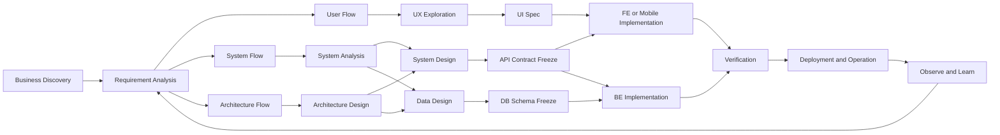
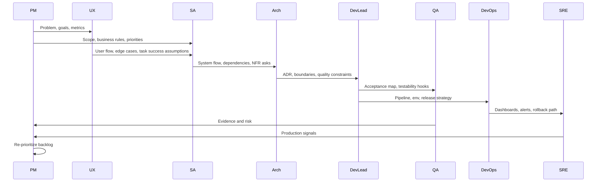
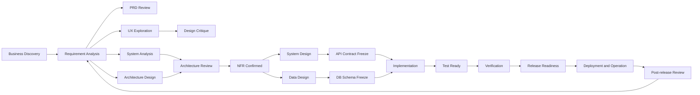

# 軟體產品團隊完整分工與開發流程架構報告

## Executive Summary

真正能跑得快、又不容易失控的產品團隊，靠的不是把文件堆得很厚，而是把三件事做清楚：**角色邊界、三條並行主線、分層 freeze 機制**。從官方 Scrum 角度看，團隊其實只定義了 Product Owner、Scrum Master、Developers 三種 accountabilities，而且整個 Scrum Team 對 stakeholder collaboration、verification、maintenance、operation 都有責任；但在真實企業裡，為了處理需求複雜度、跨系統整合、資料治理、可靠性與交付節奏，通常會再切出 PM、BA、SA、UX、UI、Architect、SD、DBA、QA、DevOps、SRE 等專門職能。換句話說，**Scrum 給你最小結構，企業分工是為了管理複雜度**。citeturn19view0turn22view0turn26view0turn26view1turn24view16

這份報告的核心結論很直接：**User Flow、System Flow、Architecture Flow 不應該串行地一個等一個，而應該從需求分析起就並行產出，並在幾個決策節點對齊**。User Flow 由 PM/UX 主導，回答「使用者怎麼完成目標」；System Flow 由 BA/SA 主導，回答「業務規則、資料、流程怎麼落地」；Architecture Flow 由 Architect/Dev Lead 主導，回答「系統邊界、品質屬性、技術風險怎麼被控制」。Simon Brown 的 C4 model 本身就是分層抽象的架構視角；Google Cloud 與 Thoughtworks 也都把 ADR 當作架構決策的最小單位；而 NN/g 明確指出 user journey 與 user flow 是設計 ideation 或 evaluation 早期就該出現的 UX mapping 工具。citeturn29view0turn24view2turn25view9turn25view4

實務上，**UI/UX 不需要等架構完全確認才開始**。更準確地說，低保真流程、資訊架構、wireframe 應在 requirement analysis 就進場；高保真 UI、前後端並行開發、跨團隊整合，則要在 API contract、NFR、資料模型等關鍵約束清楚後再 freeze。Atlassian 的 PRD 模板本來就把 goals、assumptions、user stories、design 都放進同一份產品協作文檔；GitLab 的 architecture workflow 也強調設計文件不必第一次就完整，可以邊評論、邊研究、邊實作，但必須留下設計文件與狀態追蹤。citeturn25view6turn25view2turn25view5

最後，freeze 不該是一把大鎖，而該是**分層的決策基線**。PRD freeze 鎖的是問題定義與範圍；API contract freeze 鎖的是跨團隊協作介面；DB schema freeze 鎖的是 migration 與整合測試穩定性；release freeze 鎖的是 evidence-based 上線條件，而不是「感覺差不多了」。OpenAPI 之所以被廣泛使用，就是因為它給了 API 契約一個正式、可自動化的描述標準；NIST SSDF 又進一步要求組織在 SDLC 中定義安全需求、角色責任、工具鏈與持續回應漏洞的機制。這兩件事放在一起看，很像一句老話：**先把界面講清楚，再讓團隊高速前進**。citeturn24view14turn21view1turn23view0

## 研究基礎與適用邊界

本報告採用的立場是：**無特定技術棧**，但假設團隊需要長期維運產品，而不是只做一次性交付專案。角色名稱如 SA、SD、Architect、DBA、Dev Lead、SRE 等，並不是 Scrum 官方內建職責；它們是企業在面對需求、資料、架構、交付與營運複雜度時，常見的職能切分。這一點很重要，因為你會發現不同公司職稱一樣，責任卻不一定一樣。Scrum 明確只定義三種 accountabilities，IIBA 也強調 business analysis 既是一種角色，也是一種跨職稱的 discipline。citeturn19view0turn22view0turn26view0

下表是本報告的組織規模建議。它不是某個標準逐字規定，而是綜合 Scrum 對小團隊的建議、GitHub 公開分享的大型工程規模經驗、SRE/DevOps 對可靠性交付的要求，以及 GitLab/Thoughtworks 對架構治理的實務整理後得到的操作性版本。小團隊優先合併角色，中大型團隊則優先清楚責任邊界與決策節點。citeturn22view0turn25view0turn33view0turn37view0turn25view5

| 團隊規模 | 建議分工 | 典型角色合併 | 流程特徵 |
|---|---|---|---|
| 小型團隊 | 以單一 cross-functional squad 為主 | PM 常兼 PO；BA/SA 常同人；Architect/Dev Lead/SD 常由資深工程師兼任；QA、DevOps、DBA 多半嵌入 Developers | 文件偏輕量，但要很重視同頁協作、每日同步、API/DB/驗收條件早講清楚 |
| 中型團隊 | 功能團隊加上共享支援角色 | PM 與 PO 可分離；BA/SA 視業務複雜度分工；Architect、UX、QA、DevOps 逐步專職化；DBA 可能是共享資源 | 需要明確 review 節點、RACI、跨團隊 contract、測試與上線 readiness |
| 大型團隊 | 多產品線、多 squad、平台/架構/資料共用能力 | PM、PO、BA/SA、Architect、QA、DevOps/SRE、DBA 多為專職；會有 platform team、architecture forum 或 advisory process | 要避免重型 ARB 變成瓶頸，改採 ADR、advice process、分層治理與可觀測性驅動的經驗回饋 |

本報告優先參考的來源，盡量以原始與官方網站為主，必要時才補充大型企業公開工程文章。這些來源大致可以分成四組：**生命週期與需求工程**（Scrum Guide、ISO/IEC/IEEE 29148、SEBoK、NIST SSDF）、**產品與 UX**（IIBA、Atlassian PRD、NN/g、Google HEART）、**架構與設計治理**（C4 model、Domain-Driven Design、Martin Fowler、Thoughtworks、Google ADR）、以及 **交付與營運**（Google SRE、DORA、AWS Builders’ Library、GitLab Handbook、GitHub Engineering、Netflix canary）。citeturn24view15turn24view16turn21view1turn26view0turn25view6turn25view3turn30view1turn29view0turn24view17turn40view1turn24view2turn25view9turn33view0turn24view13turn24view20turn25view0turn14search2

## 角色與責任模型

先講一個很關鍵、很容易被忽略的事：**職稱不是邊界，交付物才是邊界**。你在會議上看到大家都會講需求、都會講技術、都會講風險，這很正常；真正分出 BA/SA/Architect/Dev Lead/DBA 的，不是「誰最懂」，而是**誰對哪一份輸出物負責、誰有最後決策權、誰要承擔變更成本**。這也是為什麼角色 overlap 幾乎無法避免，但責任不可以模糊。citeturn26view0turn26view1turn40view1turn37view1

### 產品與需求相關角色

| 角色 | 核心職責 | 主要輸入 | 主要輸出 | 決策權限 | 典型範本檔名與欄位 | 依據 |
|---|---|---|---|---|---|---|
| PM | 定義問題、價值、目標、優先順序、成功指標；主導 discovery 與對齊 business outcome | 市場訊號、使用者研究、商業策略、營運數據 | PRD、roadmap、success metrics、release objective | 問題定義、scope trade-off、優先級、指標 | `prd/<feature>.md`：背景、問題、目標、KPI、persona、scenario、in/out scope、risks、dependencies、release checks | citeturn25view6turn30view0 |
| Product Owner | 最大化產品價值，負責 backlog ordering、product goal 與 backlog transparency；是單一 accountable person，不是委員會 | PM 策略、stakeholder 需求、team feedback | Product Goal、ordered backlog、ready backlog items | backlog 排序、是否納入 sprint、價值取捨 | `backlog/product-backlog.md`：goal、item、priority、acceptance、dependencies、status | citeturn19view0turn31view1 |
| BA | 做 stakeholder analysis、需求萃取、業務規則整理、現況/未來流程分析，確保 change 被說清楚 | stakeholder 訪談、現行 SOP、法規、流程資料 | stakeholder map、business rules catalog、process map、use cases、traceability | 業務規則表述、需求完整性、利害關係人覆蓋 | `analysis/business-rules.md`：rule id、rule text、source、priority、exceptions、owner | citeturn26view0turn36view0turn24view15 |
| SA | 把業務需求轉成系統規格：功能邊界、例外流程、資料交互、外部介面需求、驗收條件 | PRD、business rules、流程圖、現有系統限制 | SRS/functional spec、system flow、sequence/use-case、interface list | 功能規格、流程/資料建模、fit-gap 與依賴釐清 | `analysis/system-spec.md`：actors、use cases、events、rules、edge cases、integration points、acceptance | citeturn26view1turn24view15 |
| UX | 研究使用者、定義 journey / flow / IA / wireframe / prototype / usability 假設 | 產品目標、研究資料、現有痛點、數據 | user journey、user flow、IA、wireframe、prototype、usability report | 互動模型與流程清晰度 | `ux/user-flow.fig`：goal、entry、steps、branch、error path、success path、assumptions | citeturn25view4turn25view3turn30view1 |
| UI | 將已確認的 flow/wireframe 轉成可開發的視覺規格與設計系統對齊輸出 | wireframe、design system、平台規範 | hi-fi mockup、component spec、spacing/token、responsive states、a11y 註記 | 視覺一致性、component state、handoff 規格 | `ui/component-spec.fig`：view、state、token、spacing、responsive、empty/loading/error | citeturn25view3turn34view1 |
| Stakeholders | 影響產品或被產品影響的人；提供目標、限制、政策、預算與回饋 | 產品願景、組織策略、外部限制 | feedback、constraints、approval input | 決定商業邊界與資源，但在 Scrum 內不直接排序 backlog | `governance/stakeholder-map.md`：stakeholder、interest、influence、decision area、cadence | citeturn36view0turn31view1 |

### 工程與交付相關角色

| 角色 | 核心職責 | 主要輸入 | 主要輸出 | 決策權限 | 典型範本檔名與欄位 | 依據 |
|---|---|---|---|---|---|---|
| Architect | 管理系統重要結構決策與品質屬性：邊界、整合、可靠性、安全、演進路徑 | system spec、NFR、技術限制、現況系統 | C4 diagrams、ADR、NFR matrix、tech option paper | 跨系統結構、品質屬性取捨、重大技術決策 | `architecture/adr/ADR-00x.md`：context、drivers、options、decision、consequences | citeturn29view0turn40view1turn24view2turn25view9turn24view17 |
| SD | 本報告採用的工作定義是 System Designer / Software Designer：在既定架構下完成模組級詳細設計 | SA 規格、ADR、C4 component 層、API/data constraints | module spec、sequence diagram、error model、task breakdown | 模組內部設計、錯誤處理、局部 trade-off | `design/module-design.md`：module、responsibility、interfaces、sequence、failure cases、telemetry | citeturn29view0turn25view5turn37view1 |
| DBA | 管理資料模型、migration、索引、效能、資料生命週期與與開發協作 | domain model、access pattern、合規要求、容量預估 | logical/physical model、DDL、migration scripts、data dictionary、backup/retention | schema change、migration path、indexing、retention | `data/schema-change.sql` + `data/data-dictionary.md`：table、column、constraint、index、PII、retention | citeturn38view0 |
| FE | 實作使用者可見的前端層，關注互動、可存取性、效能、事件量測與 API 整合 | UI spec、user flow、API contract | web app、component library、frontend telemetry、E2E hooks | client-side 行為與效能優化 | `frontend/feature-spec.md`：route、state、api mapping、events、fallback ui | citeturn33view1turn24view14 |
| BE | 實作伺服器端邏輯、API、資料一致性、整合與背景作業 | system design、DB design、NFR、API contract | services、endpoints、jobs、integration adapters | server-side 行為、交易邏輯、整合方式 | `backend/service-contract.md`：endpoint、request/response、idempotency、timeout、retry、error code | citeturn33view1turn24view14turn24view20 |
| Mobile | 實作 iOS/Android 用戶端，關注平台設計規範、測試、版本釋出與 staged rollout | mobile UX/UI、API contract、平台能力 | app builds、store release plan、crash/perf telemetry | 平台實作細節、發版節奏、灰度策略 | `mobile/release-plan.md`：platform、track、rollout、crash KPI、rollback | citeturn34view1turn35search1turn35search2 |
| Dev Lead | 團隊內技術交付 owner；安排任務切分、review 標準、風險管理、工程同步 | backlog、ADR、system design、capacity | iteration implementation plan、review checklist、risk log | 迭代層級技術取捨、開發節奏、code ownership | `delivery/implementation-plan.md`：scope、owners、milestones、risks、deps | citeturn37view1turn25view2 |
| QA | 建立測試策略、測試資料、測試自動化與質量證據；由 evidence 提供風險建議 | acceptance criteria、system spec、DoD、release candidate | test plan、test cases、automation、defect report、test completion report | 測試覆蓋與風險評估；提供上線風險建議 | `qa/test-plan.md`：scope、levels、environment、data、cases、automation、exit criteria | citeturn6search0turn41search14turn35search2turn40view0 |
| DevOps | 讓變更可快速且可重複地建置、測試、部署；維護 CI/CD、IaC、環境與 delivery metrics | codebase、infra requirements、security gates | pipeline、deployment pipeline、env config、release dashboard | pipeline gates、部署策略、環境自動化 | `ops/pipeline-spec.md`：stages、checks、approvals、artifacts、rollback | citeturn40view0turn24view13 |
| SRE | 以可靠性為中心管理 SLO/SLI、error budget、observability、incident、capacity | production telemetry、service architecture、release activity | SLO doc、alerts、runbook、postmortem、capacity plan | 可靠性門檻、告警策略、error-budget governance | `sre/slo.md`：service、SLI、SLO、alert、owner、error budget、review cadence | citeturn33view0turn24view11turn33view2 |

### PM 與 PO 的界線

PM 與 PO 最容易被混在一起。簡單講，**PM 比較像「為何做、做成什麼、值不值得做」的 owner；PO 比較像「接下來先做什麼、怎麼排序、如何讓 backlog 對 team 透明」的 owner**。Scrum Guide 只正式定義 PO，不定義 PM；因此很多公司會讓同一人兼任，也有很多公司把 PM 放在 discovery 與商業決策，PO 放在 delivery 與 backlog 管理。實務上只要有一件事不模糊就夠了：**backlog 最終排序只能有一個 accountable owner**。citeturn19view0turn25view6

### SA 與 Architect 的界線

SA 與 Architect 有 overlap，而且一定有。兩者都會參與需求澄清、edge case 討論、跨系統依賴辨識。差別在於焦點與時間尺度：**SA 主要把需求翻成可實作、可驗收的系統規格；Architect 主要把系統做成可演進、可操作、可承受風險的結構**。如果你要很白話地記，一句就夠：**SA 管功能清晰度，Architect 管結構穩定度**。Systems Analyst 的公開職能描述本來就包含 process analysis、functional specifications、data/process modelling；而架構一側，C4、DDD、ADR、Fowler 對 architecture 的定義都更靠近 system boundary、important decisions、shared understanding、bounded contexts 與 consequences。citeturn26view1turn29view0turn24view17turn40view1turn25view9

## 開發生命週期與交付物

如果你只記一張圖，我希望是這張。它把整個生命週期拆成三條並行主線：**User Flow、System Flow、Architecture Flow**。User Flow 回答「使用者如何一步一步達標」；System Flow 回答「業務規則、資料與事件如何流動」；Architecture Flow 回答「系統如何在規模、風險與變更下還能撐住」。PRD 最好包含這三條主線的摘要或連結，但不一定要把所有圖都硬塞在同一份文件裡；更實際的做法是讓 PRD 成為 decision hub，連到 UX、SA、Architecture source of truth。citeturn25view6turn25view4turn29view0turn25view9



這張圖的意思其實不複雜：**UX 不等架構全完工才開始，架構也不等 UI 完整圖稿才開始**；真正需要序列化的是高成本的 cross-team handoff，例如 API contract、schema migration、release evidence。GitLab 的設計文件工作流明講可以先寫 design doc、先 collect review、邊研究邊實作；而 OpenAPI、ADR、SLO 這類 artifact 的價值，就是在高速前進時讓團隊還有一致的邊界。citeturn25view2turn24view14turn25view9turn24view11

### 生命週期分階段表

| 階段 | 主要目標 | 參與角色 | 必備產出 | 建議節奏 | 風險檢查點 | 驗收準則 | 依據 |
|---|---|---|---|---|---|---|---|
| Business Discovery | 確認問題是否值得解，定義目標、用戶、價值與高層範圍 | PM、PO、BA、Stakeholders、UX | problem statement、goal、success metrics、stakeholder map | 小需求數天到一週；新產品數週 | 問題其實是流程問題不是產品問題；成功指標不可量測 | 目標、用戶、價值與 out-of-scope 清楚 | citeturn25view6turn30view1turn36view0 |
| Requirement Analysis | 把需求轉成可排序、可討論、可驗收的 backlog 與規格骨架 | PM、PO、BA、SA、UX | PRD、backlog、initial user stories、acceptance draft | 與 discovery 緊接 | scope 膨脹；stakeholder 目標互斥 | backlog 已排序；主要假設與風險列出 | citeturn25view6turn19view0turn31view1 |
| UX Exploration | 建立 journey、user flow、IA、wireframe/prototype，找出高風險互動 | UX、PM、BA、UI、FE/Mobile | journey、user flow、wireframe、prototype、usability findings | 與 requirement analysis 並行 | 流程好看但無法落地；缺少空狀態/錯誤狀態 | 核心任務 flow 可走通；高風險互動已驗證 | citeturn25view4turn25view3turn30view1 |
| System Analysis | 將需求轉為 use cases、業務規則、事件與介面需求 | SA、BA、PO、Architect、BE、QA | system spec、system flow、business rules、integration inventory | 與 UX 探索部分並行 | 規則口頭存在、沒有文字化；邊界模糊 | 主要 use cases、例外流、依賴系統可追蹤 | citeturn26view1turn24view15 |
| Architecture Design | 定義 bounded contexts、系統邊界、品質屬性、關鍵技術決策 | Architect、Dev Lead、SA、DBA、DevOps/SRE | C4、ADR、NFR matrix、option analysis | 中大型需求通常早於實作一到兩週啟動 | 太早定死或太晚決策；忽略 operability/security | 關鍵決策已記錄；可用文字與圖說清 trade-off | citeturn29view0turn24view2turn25view9turn21view1 |
| System Design | 在架構邊界內完成模組、API、錯誤處理、sequence design | SD、Dev Lead、FE、BE、QA | detailed design、API spec、error model、task breakdown | 緊接 architecture design | 模組責任重疊；API 不穩定 | 實作者能依 spec 平行工作；API 可生成 mock/test | citeturn24view14turn25view5 |
| Data Design | 設計邏輯/物理模型、schema migration、資料生命周期 | DBA、SA、Architect、BE | ERD、DDL、migration、index/retention、PII map | 與 system design 並行 | migration 無法回滾；資料兼容性差 | schema、migration 與 backfill 路徑可驗證 | citeturn38view0turn21view1 |
| Delivery Planning | 決定切片、資源、里程碑、測試計畫、發版策略 | PM、PO、Dev Lead、QA、DevOps、SRE | sprint plan、release plan、test strategy、risk register | 每個 release / sprint 前 | scope 大於 capacity；缺 environment | 責任人、時程、風險與 rollback 方案清楚 | citeturn25view7turn24view13 |
| Implementation | 產出可合併、可測試、可部署的程式與 migration | FE、BE、Mobile、DBA、Dev Lead | code、tests、migrations、telemetry、docs | 以日為節奏 | code 完成但不可部署；缺監控/feature flag | CI 綠燈；DoD 滿足；可部署 | citeturn40view0turn31view0 |
| Verification | 驗證功能、整合、效能、可靠性與風險是否達標 | QA、PM、PO、SA、Dev Lead、SRE | test report、defect triage、UAT evidence、perf/reliability results | 發版前集中 + 開發中持續 | 測試環境不像真實環境；exit criteria 不清 | 通過 exit criteria；風險有明確決策 | citeturn41search14turn6search0turn35search2 |
| Deployment & Operation | 安全上線、監控、灰度、回滾、incident/postmortem、回饋 backlog | DevOps、SRE、QA、Dev Lead、PO | rollout record、runbook、alerts、SLO review、postmortem | 發版當日與後續週期持續 | canary/rollout 沒監控；error budget 超支 | 可觀測、可回滾、可學習，且 issue 能回寫 backlog | citeturn33view0turn24view11turn14search2turn35search1 |

### 交付物索引表

| 交付物 | 檔名建議 | 主要欄位 | 負責人 | 驗收條件 | 時間點 |
|---|---|---|---|---|---|
| 問題定義 | `discovery/problem-statement.md` | 問題、商業影響、目標用戶、當前替代方案、成功指標 | PM | 問題與成功定義可被 stakeholder 複述 | Discovery 結束前 |
| PRD | `prd/<feature>.md` | 背景、目標、KPI、scenario、in/out scope、open questions、links | PM | 目標、範圍、假設、風險都明確 | Requirement Analysis |
| Stakeholder Map | `governance/stakeholders.md` | 人、影響力、關注點、決策權、同步節奏 | BA | 主要利害關係人無遺漏 | Discovery / Analysis |
| User Flow | `ux/user-flow-<feature>.fig` | 任務、步驟、分支、錯誤、成功、空狀態 | UX | 核心任務與 edge case 被覆蓋 | UX Exploration |
| System Spec | `analysis/system-spec-<feature>.md` | actors、use cases、business rules、events、integration、acceptance | SA | 開發、QA、Architect 可依此對齊 | System Analysis |
| C4 + ADR | `architecture/c4-*.md`, `architecture/adr/ADR-00x.md` | context/container/component、decision drivers、options、consequences | Architect | 關鍵決策可追溯；trade-off 有記錄 | Architecture Design |
| API Spec | `api/openapi-<service>.yaml` | endpoint、schema、auth、error code、idempotency、rate limit | SD / BE | FE、BE、QA 能以 contract 平行工作 | System Design |
| Data Design | `data/erd.drawio`, `data/migrations/<id>.sql` | table、column、constraint、index、migration、backfill、retention | DBA | migration 可演練；資料風險可說明 | Data Design |
| Test Plan | `qa/test-plan-<release>.md` | scope、levels、env、data、automation、exit criteria、owners | QA | 測試策略可落地，exit criteria 明確 | Delivery Planning |
| Runbook | `ops/runbook-<service>.md` | deploy、rollback、alerts、dashboards、owner、escalation | DevOps / SRE | 值班與回滾步驟可執行 | Verification 前完成 |
| Release Readiness | `release/readiness-<date>.md` | build、defects、perf、security、rollback、go/no-go | Dev Lead / QA / SRE | 具備 go/no-go 所需證據 | 上線前 |
| Postmortem | `ops/postmortem-<incident>.md` | timeline、impact、root causes、actions、owners | SRE / Dev Lead | 有學習、有後續 action、有 owner | Incident 後 |

這份表格背後的設計原則很簡單：**每份文件都要有 owner、驗收條件、最晚完成點**。沒有 owner 的文件最後只是附件；沒有驗收條件的文件，永遠都會寫不完。PRD、OpenAPI、ADR、SLO、runbook 之所以重要，就是因為它們不是為了「留下記錄」而已，而是用來讓不同角色在不同時間點做出一致決策。citeturn25view6turn24view14turn25view9turn24view11

### 可複製範本

以下三份範本，對大多數團隊都夠用。它們分別對應 **產品對齊、介面對齊、架構對齊**。PRD 的骨架參照 Atlassian 對 goals、assumptions、user stories、design、out-of-scope 的做法；API Spec 使用 OpenAPI 3.1 的思路；ADR 則綜合 Google Cloud 與 Thoughtworks 的實務。citeturn25view6turn24view14turn25view9turn24view2

```markdown
# PRD - <Feature Name>

## Problem Statement
- 現在發生什麼事
- 為什麼值得解
- 不解會有什麼成本

## Goals and Success Metrics
- Business Goal
- User Goal
- KPI / Counter-metrics

## Users and Scenarios
- Primary Persona
- Key Scenario
- Edge Cases

## Scope
### In Scope
### Out of Scope

## User Flow Links
- Journey
- User Flow
- Wireframe / Prototype

## Functional Requirements
- Requirement ID
- Description
- Acceptance Criteria

## Non-Functional Requirements
- Performance
- Reliability
- Security
- Accessibility
- Auditability

## Dependencies
- Upstream / Downstream
- External Systems
- Data / API dependencies

## Risks and Open Questions

## Release Plan
- Rollout strategy
- Observability
- Rollback

## Decision Log
```

```yaml
openapi: 3.1.0
info:
  title: <Service API>
  version: 1.0.0
  description: <Purpose and scope>

servers:
  - url: https://api.example.com

paths:
  /resource:
    post:
      summary: <Action>
      operationId: createResource
      tags: [resource]
      requestBody:
        required: true
        content:
          application/json:
            schema:
              $ref: '#/components/schemas/CreateResourceRequest'
      responses:
        '200':
          description: Success
        '400':
          description: Validation error
        '409':
          description: Conflict / idempotency violation

components:
  schemas:
    CreateResourceRequest:
      type: object
      required: [id, name]
      properties:
        id:
          type: string
        name:
          type: string

x-governance:
  owner: <BE or SD owner>
  consumers: [FE, Mobile, QA]
  contract_freeze_date: <YYYY-MM-DD>
  change_policy: "breaking changes require review"
```

```markdown
# ADR-00x - <Decision Title>

Status: Proposed | Accepted | Superseded
Date: YYYY-MM-DD
Owners: <Architect / Dev Lead / Team>

## Context
- 目前問題
- 業務與技術限制
- 相關 NFR

## Decision Drivers
- Reliability
- Time-to-market
- Cost
- Security
- Operability

## Options Considered
- Option A
- Option B
- Option C

## Decision
- 選擇了什麼
- 選擇範圍
- 不選什麼

## Consequences
- Positive
- Negative
- Follow-up work

## Links
- Related PRD
- C4 Diagram
- API Spec
- Migration Plan
```

順帶一提，很多團隊會問「User Flow 要不要放在 PRD 裡？」我的建議是：**要，但以「摘要 + 連結」形式最好**。因為 user flow 會持續微調，真正適合作 source of truth 的位置通常是 UX 檔案；PRD 更像決策中樞，記錄「這次採用哪個 flow、為什麼、有哪些已知限制」。這樣比較不會出現 Confluence、Figma、Jira 三邊版本都不一樣的老問題。citeturn25view6turn25view4turn25view3

## 協作機制與治理節奏

實務合作最怕的不是忙，而是**忙在錯的順序**。好的團隊會把工作分成兩類：一類可以大量並行；另一類一旦沒先對齊，後面每個人都會白做。像 discovery、user flow、system analysis、architecture thinking 其實都可以重疊前進；但 API contract、schema migration、release evidence 這幾種高耦合介面，如果沒有適時 freeze，整個團隊就會像踩在濕地上跑步，越跑越慢。citeturn25view2turn24view14turn38view0turn40view0

### 平行與序列的分工原則

| 工作 | 建議方式 | 何時可並行 | 何時要序列化 | 主要 owner |
|---|---|---|---|---|
| 問題定義與成功指標 | 先行 | 一開始就該做 | 不宜拖到設計後 | PM |
| User Journey / User Flow | 早期並行 | Requirement Analysis 起 | 高保真設計前需與系統限制對齊 | UX |
| System Analysis | 早期並行 | 與 UX、Architecture 同步 | 詳細設計前要先收斂核心規則 | SA |
| Architecture Options | 早期並行 | System Analysis 同步 | cross-team implementation 前需完成重大決策 | Architect |
| API 設計 | 先粗後細 | Architecture Design 後即可推進 | FE/BE/Mobile 平行開發前要 freeze | SD / BE |
| DB Schema / Migration | 與 API 同步 | System/Data Design 可並行 | 整合測試前要 freeze migration path | DBA |
| QA 測試設計 | 提前介入 | 有 acceptance 和 contract 後即可 | 全面回歸前需 test-ready | QA |
| DevOps / 觀測性 | 不可後補 | Architecture / Design 就要開始 | 上線前需完成 dashboard/alerts/runbook | DevOps / SRE |

### 平行主線的對齊簡圖



這張圖想傳達的不是「誰高誰低」，而是**每個角色都有輸入與輸出節點**。注意 QA、DevOps、SRE 都不是在最後才出現。Scrum 本來就把 verification、maintenance、operation 放進 Scrum Team 的責任裡；Google SRE 與 DORA 也都強調，交付速度與穩定性要一起觀察，不能一邊追 deployment frequency、一邊完全不看 MTTR、change failure rate、SLO 或 task success。citeturn19view0turn24view13turn24view11turn30view0

### 關鍵決策節點與衝突處理

| 決策節點 | 核心問題 | 必到角色 | 輸出 | 建議處理方式 |
|---|---|---|---|---|
| PRD Review | 問題、範圍、KPI 是否清楚 | PM、PO、BA、UX、Dev Lead、Stakeholders | PRD baseline | 先談問題與價值，不先談技術偏好 |
| Design Critique | flow 與 visual 是否支援任務成功 | UX、UI、PM、FE/Mobile、QA | flow / UI baseline | 用任務成功率、錯誤路徑、a11y 檢查，不憑喜好爭論 |
| Architecture Review | 邊界、NFR、風險、trade-off 是否合理 | Architect、SA、Dev Lead、DBA、DevOps/SRE | ADR、C4、NFR baseline | 少用重型 gate，多用 ADR + advice process |
| API Contract Freeze | 各端能否獨立實作與測試 | SD、FE、BE、Mobile、QA、SA | OpenAPI baseline | 明確 change policy，breaking change 要升級流程 |
| Data Design Review | migration/backfill/PII/retention 是否可落地 | DBA、BE、Architect、QA、SRE | schema baseline | 先演練 migration，再談 freeze |
| Test Readiness Review | 測試環境、資料、退出條件是否就緒 | QA、Dev Lead、DevOps、PO | test-ready evidence | exit criteria 書面化 |
| Release Readiness | 可觀測、可回滾、風險是否已知 | Dev Lead、QA、DevOps、SRE、PO | go/no-go | 用證據決策，不用氣氛決策 |

衝突解決流程，我建議固定成四步，真的很有用。第一步，**先寫成選項，不要只講立場**；第二步，**把 trade-off 明文化**，包括時間、風險、成本、運維影響；第三步，**能留下來的決策寫 ADR**；第四步，**只有在 deadline、風險承擔或資源衝突無法解時才升級**。Thoughtworks 近年的建議其實很明確：不要把所有架構決策都送進重型 ARB；更好的做法是讓靠近工作的團隊先決策，但要求他們向受影響的人與具專業的人求 advice，並把決策用 ADR 留下來。citeturn37view0turn37view1turn24view2turn25view9

### RACI 建議表

R = Responsible，A = Accountable，C = Consulted，I = Informed。這份 RACI 不是法律文本，而是避免「大家都有參與，所以最後沒人負責」的保底機制。

| 交付物 / 決策 | PM/PO | BA/SA | UX/UI | Architect | Eng / Dev Lead | DBA | QA | DevOps/SRE | Stakeholders |
|---|---|---|---|---|---|---|---|---|---|
| Problem Statement / KPI | A | C | C | I | I | I | I | I | C |
| PRD | A | R | C | C | C | I | C | I | C |
| User Flow / Wireframe | C | C | A/R | I | C | I | C | I | C |
| System Spec | C | A/R | C | C | C | C | C | I | I |
| ADR / C4 | I | C | I | A/R | C | C | C | C | I |
| API Spec | I | C | C | C | A/R | I | C | I | I |
| DB Schema / Migration | I | C | I | C | C | A/R | C | C | I |
| Test Plan / Exit Criteria | I | C | C | I | C | I | A/R | C | I |
| Runbook / Rollback | I | I | I | C | C | I | C | A/R | I |
| Release Go/No-Go | C | I | I | C | R | C | R | R | I |

### 會議節奏建議

| 會議 | 節奏 | 參與者 | 目的 | 產出 |
|---|---|---|---|---|
| Product Triad Sync | 每週一次 | PM、UX、Tech Lead/Architect | 對齊問題、flow、技術風險 | 決策紀錄、open questions |
| Backlog Refinement | 每週一次 | PO、BA/SA、Dev、QA | 將 item refine 到可估可做 | refined backlog |
| Design Critique | 每週一次或雙週一次 | UX/UI、PM、FE/Mobile、QA | 檢查 task success、state coverage、handoff | design baseline |
| Architecture Review | 每週一次或按需 | Architect、SA、Dev Lead、DBA、DevOps/SRE | 對齊重大決策與 NFR | ADR / action items |
| Sprint Planning | 每 sprint | PO、Developers、QA（必要時） | 定義 sprint goal 與工作切片 | sprint backlog | 
| Daily Sync | 每日 | 開發小隊 | 對齊阻塞與計畫 | 即時調整 |
| Sprint Review | 每 sprint | Scrum Team、Stakeholders | 檢視成果與產品回饋 | backlog 調整 |
| Sprint Retrospective | 每 sprint | Scrum Team | 檢視流程與合作方式 | improvement actions |
| Release Readiness | 每次上線前 | Dev Lead、QA、DevOps、SRE、PO | go/no-go | readiness record |
| Postmortem Review | incident 後 | SRE、Dev Lead、QA、PO、相關 stakeholder | 學習與防再發 | postmortem + follow-ups |

Scrum 對 sprint planning、review、retrospective 的目的講得很清楚；Atlassian 對這些 ceremony 的參與者和節奏也有相對實務化的建議。我的補充只有一句：**在 sprint ceremony 外，產品 triad 與 architecture review 幾乎是多數軟體團隊真正的協作心臟**。少了它們，PRD、flow、ADR、API 很快就會各走各的。citeturn25view7turn31view2turn25view8

## 三個實務場景演練

先講一個反直覺但很重要的觀念：**不是所有系統都需要拆到很細的微服務**。GitHub 公開分享過，它的 Ruby on Rails monolith 規模接近兩百萬行程式碼、超過一千名工程師協作，而且一天大約二十次部署。這個案例很適合提醒團隊：架構應該追隨複雜度與組織需求，不要追逐流行詞。真正該先問的是：**你要解的複雜度在哪裡，是在 domain、資料、一致性、營運，還是在團隊邊界？**citeturn25view0

### 電商訂單系統

電商訂單的難，不是把「加入購物車」做出來，而是把 **Catalog、Cart、Order、Payment、Inventory、Shipment** 這些概念的邊界說清楚，再把失敗情境處理乾淨。DDD 對 bounded contexts 的建議很適合這裡：不要假設一個名詞在所有系統裡意思都一樣。像「Order」在客服、庫存、金流、物流眼裡都可能不同。citeturn24view17turn24view18

| 時序 | 角色協作 | 關鍵產出 | 主要風險 | 緩解策略 |
|---|---|---|---|---|
| Discovery | PM、BA、Stakeholders | problem statement、checkout KPI | 目標模糊，只追 GMV 不看轉換漏斗 | KPI 同時看 conversion、failure rate、task success |
| UX / Analysis | UX、SA、PO | browse→cart→checkout→payment→order tracking flow | 用戶流程順，但規則漏掉庫存保留、付款失敗回補 | 在 system spec 補 state transition 與 exception paths |
| Architecture | Architect、DBA、BE、SRE | bounded context、ADR、SLO、data ownership | payment 與 order idempotency；庫存一致性；高峰負載 | API 設計明示 idempotency key；checkout 設 SLO；重試用 backoff，不用危險 fallback |
| Design / Build | SD、FE、BE、QA | OpenAPI、migration、automation | FE/BE contract 漂移；migration 影響歷史資料 | API freeze 前 mock；migration rehearsal；回滾路徑先演練 |
| Release / Ops | DevOps、SRE、QA | canary / staged rollout、dashboards、runbook | 局部故障變全站故障；金流重試擴大災情 | canary 先看 degradation；timeout、retry、backoff with jitter；避免把 cache fallback 直接打爆核心 DB |

這裡最常見的技術坑，有兩個特別要提醒。第一，**重試不是免費的**。AWS Builders’ Library 明講，timeout、retries、backoff、jitter 可以處理 transient failures，但設計不好反而會放大擁塞。第二，**fallback 不是萬靈丹**。Amazon 直接分享過一個案例：fallback 邏輯把原本局部網站故障擴大成全站故障。老實說，這種事一發生，大家都會瞬間理解「為什麼 Architect 老是在會議上問 failure mode」。citeturn24view20turn25view1

### 客服工單系統

客服工單系統看起來沒有電商 flashy，但它常常是**流程複雜度地獄**。這種系統很容易出現 status 爆炸、權限含糊、跨部門責任不清、報表與實際流程對不起來。這時 BA 與 SA 的價值會非常明顯：BA 要把 stakeholder interests、現行流程與責任人整理乾淨；SA 要把流程、規則、狀態轉換、升級條件與整合點寫成可驗收的系統規格。citeturn36view0turn26view1turn24view15

| 時序 | 角色協作 | 關鍵產出 | 主要風險 | 緩解策略 |
|---|---|---|---|---|
| Discovery | PM、BA、客服主管、法遵 | issue taxonomy、service objective、stakeholder map | 把不同部門的期望混成單一需求 | stakeholder map 與流程 ownership 先定義 |
| Requirement / Analysis | BA、SA、PO | current/future process、rule catalog、state model | 狀態太多、規則互相矛盾 | 用 canonical state machine；規則用 ID 管理 |
| UX | UX、UI、客服代表 | ticket intake、routing、handoff、search flow | 只畫 happy path，忽略退件、補件、轉派 | 每個票種都畫 error/rework path |
| Architecture / Data | Architect、DBA、BE | audit trail ADR、search/index strategy、retention policy | 查詢慢、歷史稽核資料不可信 | 先定 audit model、retention、reporting source of truth |
| Release / Ops | QA、DevOps、SRE | UAT、runbook、dashboard | 變更上線後客服 SOP 跟不上 | training material、runbook、灰度導入與 post-launch review |

這類系統最怕「流程先上、資料後補」。因為一旦 audit trail、搜尋索引、權限矩陣是在後期硬補，資料與流程常常就不再一致。Google Cloud 對 ADR 的建議很適合這種場景：把 key options、main requirements、decision 都記下來，尤其是 search、retention、RBAC、SLA/SLO 這種會牽動很多 team 的決策。citeturn25view9turn24view11

### 即時聊天系統

即時聊天系統的挑戰，通常是**延遲、排序、同步與行動端發版風險**。使用者體感很敏感，哪怕訊息不是遺失，只是晚到、重複、read receipt 不準，大家都會覺得產品怪怪的。這類產品很值得從一開始就把 SLO 與 observability 納進來，別等到「都上線了」才發現其實不知道慢在哪。citeturn33view0turn24view11turn33view2

| 時序 | 角色協作 | 關鍵產出 | 主要風險 | 緩解策略 |
|---|---|---|---|---|
| Discovery | PM、UX | core communication scenarios、task success 指標 | 把聊天當單一功能，而不是一連串 realtime states | 先定義 send、deliver、read、presence 各自成功條件 |
| Analysis / Architecture | SA、Architect、BE、SRE | event flow、ordering policy、SLO、ADR | 順序錯亂、重複投遞、presence 不準 | 明示 delivery semantics、時間戳與重試策略 |
| UX / UI | UX、UI、Mobile | message state、offline state、retry UX、empty/error/loading | 介面沒把非同步狀態說清楚 | 把 sending / failed / retrying / offline 全部設計進去 |
| Build / Test | Mobile、BE、QA | API、push integration、automated tests、crash telemetry | 行動端特有回歸；網路差時行為崩壞 | Android/iOS 真機測試、accessibility testing、network shaping |
| Release / Ops | DevOps、SRE、Mobile | staged rollout、alerts、rollback | 新版 app crash 或 backend latency 升高 | mobile staged rollout + backend canary；error budget 看板 |

這個場景很適合把 **mobile staged rollout** 和 **backend canary** 組合在一起。Google Play 官方支援 staged rollout；Netflix 的 Kayenta 則是很經典的 automated canary analysis 案例，用來比較 canary 與 baseline 是否出現顯著退化。前者幫你降低客戶端發版風險，後者幫你降低服務端釋出風險。兩者同時做，聊天這種高頻產品會舒服很多。citeturn35search1turn14search2

## SOP與快速參考卡

這一節是整份報告最落地的部分。你可以直接把它拿去做團隊 onboarding、gate review，甚至拿來改你們現在的 Confluence/Jira templates。先講一句原則：**freeze 是為了讓平行工作可控，不是為了讓變更消失**。GitLab 的設計流程與 Scrum 的迭代精神都支持「持續 refine」，所以 freeze 比較像 baseline + change policy，而不是鐵板一塊。citeturn25view2turn31view1

### SOP 與檢核表

| 角色 | 進入下一階段前的最低檢核 |
|---|---|
| PM | 問題陳述可量化；成功指標與 counter-metrics 已定；in/out scope 清楚；stakeholder 期待差異已揭露；release objective 明確 |
| SA | use cases 完整；邊界與例外流程已列；business rules 有 ID；外部依賴與 assumptions 可追溯；acceptance criteria 可被 QA 使用 |
| Architect | NFR baseline 已建立；bounded contexts / service boundary 說得清楚；關鍵決策寫成 ADR；failure modes 與 rollback path 有初稿；觀測性需求已前置 |
| SD | 模組責任與 sequence 清楚；API 與 error model 可 mock；任務切片能平行；feature flag / config point 已設計；telemetry hooks 已納入 |
| DBA | schema diff 已審；migration / backfill / rollback 有演練；索引與 retention 已考慮；PII / audit / ownership 標記完成 |
| Dev Lead | iteration plan 與 owners 明確；code review 標準可執行；CI pipeline 綠燈；技術風險與依賴有對策；demo path 可運行 |
| QA | test plan 與 exit criteria 明確；測試環境與資料 ready；自動化與手動邊界清楚； defect triage 規則清楚；non-functional test 需求已確認 |
| UX | journey / flow / wireframe 已對齊；error / empty / loading states 齊全；a11y 有檢查；handoff 連結齊全；需要驗證的假設已列出 |

這份 checklist 背後其實就是把 official guidance 翻成團隊日常語言。像需求工程的 information items 來自 ISO/IEC/IEEE 29148；架構決策與 consequences 來自 ADR 實務；DBA 的 migration 協作來自 evolutionary database design；QA 的 exit criteria 與 validation 來自 ISTQB；可靠性與 rollout 來自 SRE、DORA 與 release engineering。citeturn24view15turn25view9turn38view0turn41search14turn6search0turn24view11turn24view13

### Freeze 與 readiness 建議表

| 項目 | 建議 owner | 何時 freeze | 必備證據 | 變更規則 |
|---|---|---|---|---|
| PRD Freeze | PM / PO | 開發切片與估算前 | 問題、KPI、範圍、風險、依賴清楚 | 變更需同步 scope / KPI / timeline 影響 |
| UX Flow Freeze | UX | 高保真 UI 與 FE 實作前 | 核心 flow、error path、state coverage 完整 | 互動變更需回寫 PRD 與 QA |
| NFR 確認 | Architect / PM / SRE | Architecture Design 結束前 | latency、availability、security、audit、a11y baseline | 變更需更新 ADR 與測試策略 |
| API Contract Freeze | SD / BE | FE/BE/Mobile 平行實作前 | OpenAPI、schema、errors、auth、idempotency 已審 | breaking change 不得直接改，需 review |
| DB Schema Freeze | DBA | integration test 前 | DDL、migration、backfill、rollback rehearsal | schema 變更需重跑 migration rehearsal |
| Test Ready | QA / Dev Lead | full regression 前 | env、data、test cases、automation、exit criteria ready | 未達標不得宣稱 test complete |
| Release Ready | Dev Lead / QA / DevOps / SRE | production deploy 前 | build、defects、perf、alerts、runbook、rollback、go/no-go | 用 evidence 決策；必要時延期，不硬上 |

這裡有兩個細節我想特別強調。第一，**API contract freeze 是跨團隊並行效率的核心**。OpenAPI 之所以重要，不只是文件一致，而是它能生成 mock、測試、client code，讓 contract 先穩。第二，**DB schema freeze 不等於不再改資料庫**；它代表 migration 路徑已穩定到可以進 integration 與 release pipeline。Fowler 對 database change 的建議一直很實在：所有 DB 變更都應該是 migrations，而且要和 application code 一起 version control。citeturn24view14turn38view0

### Roles & Deliverables Cheat Sheet

| 角色 | 你最該盯的一件事 | 你最重要的交付物 | 你最晚不能錯過的時間點 |
|---|---|---|---|
| PM | 問題值不值得做 | PRD / KPI | 進入 delivery planning 前 |
| PO | 優先順序是否一致 | Ordered Backlog | Sprint planning 前 |
| BA | Stakeholder 與規則是否漏掉 | Stakeholder Map / Rule Catalog | System analysis 前半段 |
| SA | 系統行為是否可驗收 | System Spec | Architecture / System design 前 |
| UX | 核心任務是否走得通 | User Flow / Prototype | UI handoff 前 |
| UI | 開發規格是否足夠精準 | Hi-fi / Component Spec | FE / Mobile build 前 |
| Architect | 重要決策是否可追溯 | C4 / ADR / NFR | API/DB freeze 前 |
| SD | 模組設計是否可平行實作 | Module Design / API Spec | Implementation 前 |
| DBA | migration 是否可演練 | DDL / Migration / Data Dict | Integration 前 |
| Dev Lead | 團隊是否在正確順序上前進 | Iteration Plan / Risk Log | 每個 sprint 與 release 前 |
| QA | 品質證據是否成立 | Test Plan / Completion Report | Go/No-Go 前 |
| DevOps | 是否可重複部署 | Pipeline / Runbook | Release 前 |
| SRE | 是否可觀測、可回滾 | SLO / Alerts / Postmortem | Release 前與 release 後 |

### 會議節奏與決策時間表

下圖是一個**典型中型團隊功能交付時間表**。它不是標準答案，而是把「前面說的所有 freeze 與同步點」放到一條可操作的時間線上。你可以直接拿去調成你們的一週 sprint、兩週 sprint，或 release train 節奏。



| 時點 | 固定會議 / 節點 | 決策主題 | 參與者 |
|---|---|---|---|
| 每週 | Product Triad Sync | 問題、flow、技術風險、指標 | PM、UX、Tech Lead/Architect |
| 每週 | Backlog Refinement | item clarity、priority、dependencies | PO、BA/SA、Dev、QA |
| 每週或雙週 | Design Critique | flow、states、handoff、a11y | UX/UI、PM、FE/Mobile、QA |
| 每週或按需 | Architecture Review | boundary、NFR、ADR、data concerns | Architect、SA、Dev Lead、DBA、DevOps/SRE |
| 每 sprint 起點 | Sprint Planning | sprint goal、capacity、scope | PO、Developers |
| 每日 | Daily Sync | blockers、re-plan | 開發小隊 |
| 每 sprint 結尾 | Sprint Review | product feedback、backlog adaptation | Scrum Team、Stakeholders |
| 每 sprint 結尾 | Retrospective | process improvement | Scrum Team |
| 每次上線前 | Release Readiness | go/no-go、rollback、observability | Dev Lead、QA、DevOps、SRE、PO |
| 每次重大事故後 | Postmortem | incident learning、action items | SRE、Dev Lead、PO、相關角色 |

如果你想把整份報告濃縮成五歲小孩也懂的版本，我會這樣講：**先想清楚要幫誰解決什麼問題，再畫出他怎麼走，接著把系統怎麼接、資料怎麼放、壞掉怎麼救想清楚，最後才是大家一起做、一起測、一起看上線後有沒有真的變好。** 這其實就是產品、分析、架構、交付、營運五件事，只是名字很多、文件很多，容易把人搞暈。citeturn25view6turn25view4turn25view9turn24view13turn33view0

口訣也送你一個，夠短，實務上很好用：

**先對齊問題，再對齊流程，最後對齊界面。**

**角色看交付物，不看職稱。**

**freeze 不是鎖死，是讓並行不失控。**