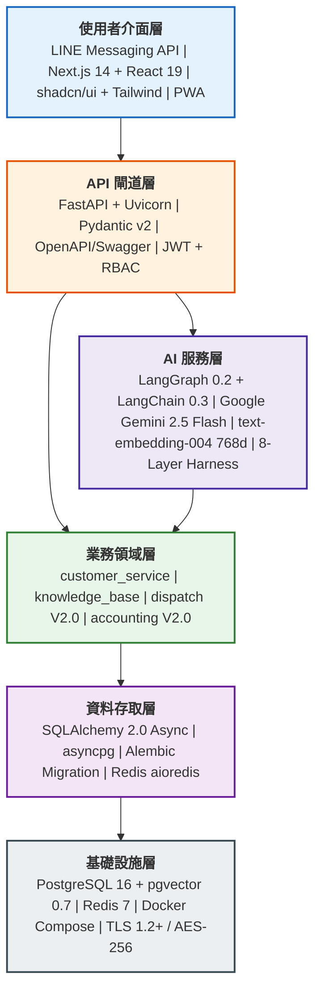
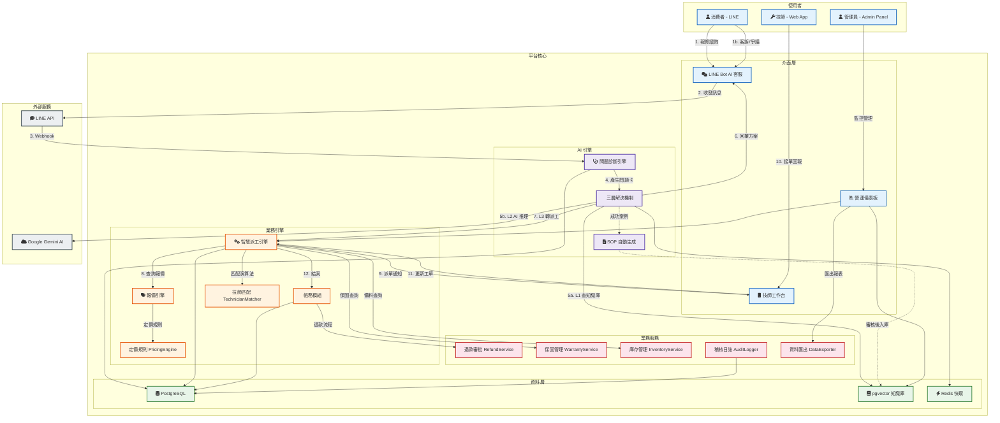

# 系統架構總覽 - 電子鎖智能客服與派工平台

> **架構更新（2026-04-21）**
> Layer 3 補充：LLM 供應商抽象層使用 **LiteLLM**（支援 Vertex AI / OpenAI / Ollama 切換）。
> 部署平台：**Google Cloud Run**（Docker 容器化）。
> Layer 4 的 dispatch V2.0 / accounting V2.0 尚未實作。

**版本:** v2.0 | **更新日期:** 2026-04-04

---

## 1. 系統分層堆疊圖

由上至下六層，上層依賴下層，每層標註具體技術選型。

---

## 2. 系統架構圖 - 資訊流

從消費者發起問題到結案的完整資訊流動路徑，涵蓋三類使用者、平台核心與外部系統。

---

## 3. 功能模組清單與服務列表

### V1.0 - AI 智能客服系統

| 模組 | 服務 | 職責 | 關鍵技術 |
| :--- | :--- | :--- | :--- |
| **LINE Bot 接入** | Webhook Handler | 接收 LINE Webhook、驗證簽章、路由事件 | FastAPI, line-bot-sdk-python 3 |
| **對話管理** | ConversationManager | 對話狀態機 (Idle->Collecting->Resolving->Resolved)、多輪上下文、Session 超時 30min | Redis, 狀態機模式 |
| **問題診斷** | ProblemCardEngine | 從自然語言提取結構化問題卡 (品牌/型號/症狀/位置)、AI 輔助欄位推斷、缺失欄位追問 | LangChain, Gemini 2.5 Flash |
| **三層解決機制** | ThreeLayerResolver | L1: pgvector 語意搜尋 (相似度>=0.85) -> L2: RAG + Gemini 推理 -> L3: 轉人工/建工單 | LangChain LCEL, pgvector HNSW |
| **知識庫管理** | KnowledgeBaseManager | 案例 CRUD、PDF 手冊上傳->分段->Embedding、向量搜尋、增量更新 | PyMuPDF, text-embedding-004 |
| **SOP 自動生成** | SOPGenerator | 監聽成功解決事件->分析對話->AI 草擬 SOP->提交審核佇列 | LangChain, 事件驅動 |
| **LLM 閘道** | LLMGateway | 統一 LLM 呼叫入口 (Gemini 2.5 Flash + Vertex AI)、Provider 抽象層、Prompt 模板管理、Token 追蹤、Retry/Fallback | LangChain, Google AI SDK, Vertex AI |
| **管理後台** | Admin Panel | 知識庫審核、對話紀錄查詢、系統監控、SOP 上架管理 | FastAPI + Jinja2/HTMX (V1.0) |

### V2.0 - 派工、帳務與業務服務系統

| 模組 | 服務 | 職責 | 關鍵技術 |
| :--- | :--- | :--- | :--- |
| **智慧派工** | DispatchService | 技師匹配 (技能x地區x評分x可用時段)、工單生命週期 (Created->Assigned->InProgress->Completed)、推播通知 | 匹配演算法, WebSocket |
| **報價引擎** | PricingService | 計價規則 (品牌x鎖型x難度)、自動報價生成、客戶確認流程 | 規則引擎模式 |
| **帳務結算** | AccountingService | 對帳作業、發票/請款單生成、技師佣金計算、統計報表 | PostgreSQL 交易 |
| **技師工作台** | Technician Web App | 可接案件列表、一鍵接單、進度回報、導航整合、個人帳務 | Next.js 14 + PWA |
| **增強管理後台** | Enhanced Admin Panel | 派工監控、技師管理、帳務審核、營運儀表板 | Next.js 14 + shadcn/ui |
| **工單管理** | WorkOrderService | 工單 CRUD、狀態流轉、工單歷史追蹤、完工照片上傳 | SQLAlchemy, Pydantic |
| **技師管理** | TechnicianService | 技師檔案管理、技能矩陣、可用時段排程、績效評分 | PostgreSQL, Redis |
| **品牌管理** | BrandService | 品牌/型號主檔維護、品牌對應技師技能映射 | PostgreSQL |
| **保固管理** | WarrantyService | 保固期限查詢、保固條件驗證、保固理賠流程 | PostgreSQL |
| **庫存管理** | InventoryService | 零件庫存追蹤、備料建議、庫存預警 | PostgreSQL |
| **爭議處理** | DisputeService | 客訴案件建立、爭議調解流程、退款審批串接 | 狀態機模式 |
| **退款審批** | RefundService | 退款申請受理、多級審批流程、退款執行紀錄 | PostgreSQL 交易 |
| **客戶同意書** | ConsentService | 服務同意書生成、客戶簽署確認、同意紀錄存檔 | PDF 生成 |
| **完工報告** | CompletionService | 完工報告生成、照片附件管理、客戶滿意度回饋 | PostgreSQL, S3 |
| **通訊服務** | MessagingService | LINE Push 訊息、Web Push (技師端)、系統內通知模板 | LINE SDK, WebSocket |
| **財務報表** | FinanceService | 月度營收報表、技師佣金明細、應收應付統計 | PostgreSQL, DataExporter |

### 跨模組共用服務

| 服務 | 職責 |
| :--- | :--- |
| **UserManagement** | LINE 用戶綁定、技師/管理員帳號、JWT 認證、RBAC 權限 (admin/technician/user) |
| **AuditLogger** | 稽核日誌服務，涵蓋 7 種事件類型：API 呼叫、LLM 互動、RAG 來源引用、管理後台審批、工單狀態變更、退款審批、資料匯出 |
| **RBACService** | 角色型存取控制，支援 7 種角色：super_admin / admin / customer_service / technician / finance / auditor / line_user |
| **DataExporter** | 資料匯出服務，支援 CSV/Excel/PDF 格式，涵蓋工單報表、財務報表、稽核日誌匯出 |
| **ESignatureService** | 電子簽章服務，用於服務同意書、完工確認書的數位簽署與驗證 |
| **NotificationService** | LINE Push Message、Web Push (技師端)、系統內通知 |
| **ObservabilityStack** | 結構化日誌 (JSON)、Harness L7 Tracing、Health Check API |

### V2.0 設計規格文件

以下規格文件定義各服務模組的詳細設計，存放於 `docs/02-design/specs/` 目錄：

| 編號 | 文件名稱 | 涵蓋範圍 |
| :--- | :--- | :--- |
| 01 | work_order_lifecycle_spec.md | 工單狀態機、狀態流轉規則、生命週期事件 |
| 02 | technician_management_spec.md | 技師檔案、技能矩陣、可用時段、績效評分 |
| 03 | dispatch_matching_spec.md | 技師匹配演算法、權重配置、匹配結果排序 |
| 04 | pricing_engine_spec.md | 計價規則結構、加成計算、報價生成流程 |
| 05 | warranty_service_spec.md | 保固查詢、保固條件驗證、理賠流程 |
| 06 | inventory_service_spec.md | 庫存追蹤、備料建議、庫存預警閾值 |
| 07 | dispute_resolution_spec.md | 客訴建立、爭議調解、退款審批流程 |
| 08 | consent_esignature_spec.md | 同意書模板、簽署流程、數位簽章驗證 |
| 09 | completion_report_spec.md | 完工報告格式、照片規範、滿意度回饋 |
| 10 | work_order_interaction_flows.md | 工單互動流程、角色操作路徑、狀態轉換圖 |
| 11 | finance_reporting_spec.md | 月度報表、佣金計算、應收應付對帳 |
| 12 | audit_logging_spec.md | 7 種事件類型定義、日誌格式、保留策略 |
| 13 | rbac_permission_spec.md | 7 種角色定義、權限矩陣、API 存取控制 |
| 14 | data_export_spec.md | 匯出格式、排程匯出、資料脫敏規則 |

---
