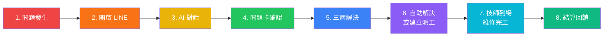
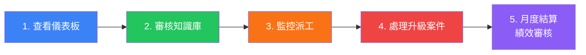
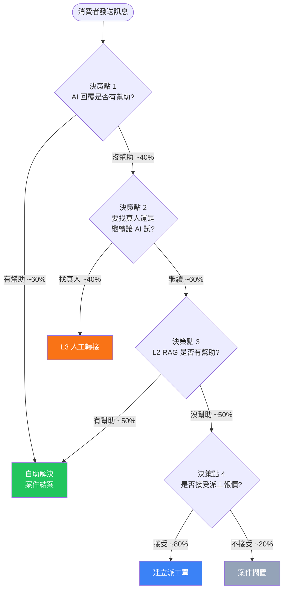
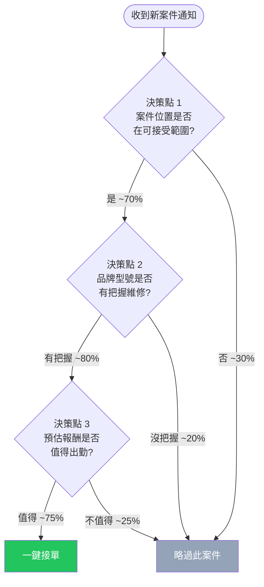
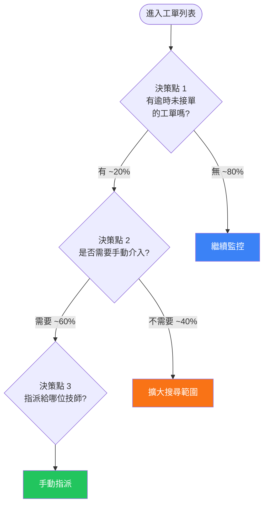

# 專案簡報與產品需求文件 (Project Brief & PRD) - 電子鎖智能客服與派工平台

> **文件現況（2026-04-21）**
> - **V1.0（已上線）**：LINE Bot AI 客服（Epic 1-4, 6）— Skill-based ReAct Agent + Harness Pipeline
> - **V2.0（尚未開始）**：派工系統、帳務平台、Admin Portal（Epic 7-12）— 尚未實作
> - 技術棧差異：LLM 框架已從 LangChain 演進為 **LangGraph + LiteLLM**；V1.0 未使用 Redis
> - 部署平台：**Google Cloud Run**（Docker）

---

**文件版本 (Document Version):** `v1.1`
**最後更新 (Last Updated):** `2026-04-04`
**主要作者 (Lead Author):** `開發團隊`
**審核者 (Reviewers):** `甲方專案負責人, 技術負責人`
**狀態 (Status):** `已批准 (Approved)`

---

## 目錄 (Table of Contents)

1. [專案總覽 (Project Overview)](#第-1-部分專案總覽-project-overview)
2. [商業目標 (Business Objectives) - 「為何做？」](#第-2-部分商業目標-business-objectives---為何做)
3. [使用者故事與允收標準 (User Stories & UAT) - 「做什麼？」](#第-3-部分使用者故事與允收標準-user-stories--uat---做什麼)
4. [範圍與限制 (Scope & Constraints)](#第-4-部分範圍與限制-scope--constraints)
5. [待辦問題與決策 (Open Questions & Decisions)](#第-5-部分待辦問題與決策-open-questions--decisions)

---

**目的**: 本文件旨在定義專案的「為何」與「為誰」，為整個專案設定最高層次的目標和邊界。它是所有後續設計、開發與測試工作的**唯一事實來源 (Single Source of Truth)**。所有 Architecture Decision Records (ADR)、BDD Feature Files、Module Specifications 與 API Design 均以本文件為依據。

---

## 第 1 部分：專案總覽 (Project Overview)

| 區塊 | 內容 |
| :--- | :--- |
| **專案名稱** | Smart Lock AI Support & Service Dispatch SaaS Platform (電子鎖智能客服與派工平台) |
| **專案代號** | SmartLock-SaaS |
| **狀態** | 規劃中 (Planning) |
| **V1.0 目標發布日期** | W17 (AI 智能客服系統上線) |
| **V2.0 目標發布日期** | W31 (派工與帳務平台上線) |
| **核心團隊** | PM/Tech Lead: 開發團隊<br>Domain Expert: 甲方資深技師團隊<br>Stakeholder: 甲方專案負責人 |

### 1.1 專案願景 (Project Vision)

打造一個整合型智慧平台，徹底革新電子鎖售後服務與技師派工流程。透過 AI 與自動化技術，將資深技師的專家知識系統化、可傳承，並消除從報修到結案的所有人工瓶頸。

### 1.2 核心模組 (Core Modules)

本平台由兩大核心模組組成，分兩個版本交付：

| 模組 | 版本 | 說明 |
| :--- | :--- | :--- |
| **Module 1: AI 智能客服系統** | V1.0 | 7x24 自動化常見問題處理、結構化問題診斷 (ProblemCard)、三層解決機制、自進化知識庫 |
| **Module 2: 技師派工與帳務平台** | V2.0 | 智慧媒合派工、標準化報價引擎、全生命週期透明追蹤、自動化財務流程 |

### 1.3 交付時程 (Release Roadmap)

```
V1.0 AI 智能客服系統 (W1-W17, 共 17 週)
├── Phase 0: 需求確認與架構設計 (W1-W2)
├── Phase 1: AI 客服 MVP (W3-W7)
├── Phase 2: 知識庫完善與三層引擎 (W8-W12)
├── Phase 3: V1.0 UAT 使用者驗收測試 (W13-W15)
└── Phase 4: V1.0 正式部署上線 (W16-W17)

V2.0 技師派工與帳務平台 (W18-W31, 共 14 週)
├── Phase 5: V2.0 需求分析與系統設計 (W18-W19)
├── Phase 6: 派工系統 MVP (W20-W24)
├── Phase 7: 帳務系統與整合 (W25-W29)
└── Phase 8: V2.0 UAT 與正式上線 (W30-W31)
```

### 1.4 關鍵利害關係人 (Key Stakeholders)

| 角色 | 身份 | 職責 |
| :--- | :--- | :--- |
| **甲方 (Client)** | 電子鎖公司 | 提供領域知識、歷史案例資料、測試數據、LINE 官方帳號、品牌授權資訊 |
| **乙方 (Developer)** | 平台開發團隊 | 系統架構設計、全端開發、AI 模型整合、部署維運 |
| **消費者 (Consumer)** | 終端使用者 | 透過 LINE Bot 進行報修、諮詢、追蹤案件 |
| **技師 (Technician)** | 簽約維修技師 | 透過 Web App 接單、回報、管理帳務 |
| **總部管理員 (HQ Admin)** | 甲方營運人員 | 透過 Admin Panel 管理知識庫、監控營運、處理客訴、財務對帳 |

---

## 第 2 部分：商業目標 (Business Objectives) - 「為何做？」

### 2.1 背景與痛點 (Background & Pain Points)

| 痛點類型 | 現況描述 | 影響程度 |
| :--- | :--- | :--- |
| **知識不可擴展** | 客服能力完全依賴資深技師的個人經驗。問題透過 LINE 文字、圖片、影片等非結構化方式湧入，知識無法被保存、檢索與傳承。新進人員需要數月才能上手。 | 高 - 直接影響服務品質與人力成本 |
| **診斷效率低落** | 每次報修都需要客服人員人工逐步詢問品牌、型號、故障現象，然後在腦中或紙本比對可能原因。重複性極高，且品質因人而異。 | 高 - 平均處理時間長、誤判率高 |
| **派工流程碎片化** | 從 LINE 接到報修 → 紙本記錄 → 電話/LINE 聯繫技師 → Excel 記帳 → 銀行轉帳，整條流程全部手動，無法追蹤、無法稽核。 | 高 - 效率低下、容易出錯、無法規模化 |
| **帳務不透明** | 技師墊款、公司預付款項、完工結算等資金流向混亂，月底對帳耗時且爭議頻繁。 | 中高 - 影響技師信任與公司現金流管理 |
| **缺乏數據洞察** | 無法統計常見故障類型、地區分布、技師績效、客戶滿意度等關鍵營運數據。決策完全憑直覺。 | 中 - 影響長期營運策略 |

### 2.2 策略契合度 (Strategic Alignment)

本專案直接支持甲方的核心戰略目標：

1. **服務品質標準化**: 透過 AI 智能客服，將不一致的人工服務轉變為標準化、可量化的自動化服務流程
2. **營運效率提升**: 透過派工與帳務自動化，大幅降低行政人力成本，使團隊能專注於高價值工作
3. **規模化能力**: 建立可擴展的 SaaS 平台架構，未來可服務多品牌、多區域的電子鎖售後市場
4. **知識資產化**: 將散落在個人腦中的專家知識轉化為公司的數位資產，降低人員流動風險

### 2.3 成功指標 (Success Metrics)

| 指標類型 | 指標描述 | 目標值 | 量測方式 |
| :--- | :--- | :--- | :--- |
| **主要指標 - AI 準確率** | AI 客服回答準確率 | >= 80% | 50 題標準測試集 (甲方提供真實案例) |
| **主要指標 - 併發支援** | 系統同時服務使用者數 | V1.0 >= 50 人 / V2.0 >= 100 人 | 壓力測試 (k6 / Locust) |
| **主要指標 - E2E 流程** | 完整流程可走通 | 報修 → AI 診斷 → 派工 → 完工 → 結算 | End-to-End 測試 |
| **次要指標 - 系統穩定性** | 上線後穩定運行天數 | >= 7 天 | 監控系統 (uptime, error rate) |
| **次要指標 - 回應速度** | AI 首次回應時間 | < 5 秒 | 系統日誌統計 |
| **次要指標 - 自助解決率** | 消費者無需轉人工即可解決的比例 | >= 60% (V1.0 上線 3 個月後) | 對話日誌分析 |

---

## 第 3 部分：使用者故事與允收標準 (User Stories & UAT) - 「做什麼？」

*這是連接「商業需求」與「技術實現」的橋樑。每個使用者故事都應直接對應到下一個階段的 BDD 情境。本部分涵蓋 V1.0 與 V2.0 所有功能，按 Epic 分組。*

---

### V1.0 - AI 智能客服系統

---

### Epic 1: LINE Bot AI 智能客服 (LINE Bot AI Customer Service)

*核心價值: 消費者透過 LINE 即可獲得 7x24 即時智能客服，處理常見問題如電池更換、WiFi 設定、密碼重設等。*

| 使用者故事 ID | 描述 (As a, I want to, so that) | 核心允收標準 (UAT) | 連結至 BDD 文件 |
| :--- | :--- | :--- | :--- |
| **US-001** | **As a** 消費者,<br>**I want to** 在 LINE 中向智能客服發送文字描述我的電子鎖問題,<br>**so that** 系統能識別我的意圖並開始協助我排障。 | 1. 消費者發送文字訊息後，系統在 5 秒內回應。<br>2. 系統正確識別意圖類型 (報修、諮詢、投訴、其他)。<br>3. 系統針對已識別的意圖，開始對應的對話流程。<br>4. 無法識別時，回覆引導訊息而非錯誤訊息。 | [`epic_01_line_bot.feature`] |
| **US-002** | **As a** 消費者,<br>**I want to** 與 AI 客服進行多輪對話，逐步描述問題細節 (品牌、型號、故障現象),<br>**so that** 系統能蒐集足夠資訊進行精確診斷。 | 1. 系統能維持對話上下文，跨多輪訊息追蹤已蒐集的資訊。<br>2. 系統主動引導消費者補充缺失的關鍵資訊 (品牌、型號、故障描述)。<br>3. 單一對話 session 至少支援 20 輪來回。<br>4. 消費者可隨時改口或修正先前提供的資訊。 | [`epic_01_line_bot.feature`] |
| **US-003** | **As a** 消費者,<br>**I want to** 發送故障現場的照片或影片給 AI 客服,<br>**so that** 系統能透過視覺資訊輔助判斷問題。 | 1. 系統接收 LINE 傳送的圖片 (JPEG/PNG)，並使用 Vision AI 分析內容。<br>2. 系統從圖片中識別鎖具品牌、型號、故障外觀等資訊。<br>3. 圖片分析結果整合至對話上下文與 ProblemCard。<br>4. 不支援的媒體格式 (如 .gif 動圖) 給予友善提示。<br>5. 單張圖片處理時間 < 10 秒。 | [`epic_01_line_bot.feature`] |
| **US-004** | **As a** 消費者,<br>**I want to** 在對話中隨時查詢我之前的報修案件狀態,<br>**so that** 我不需要打電話也能掌握維修進度。 | 1. 消費者輸入「查詢進度」或類似意圖時，系統查詢其綁定的歷史案件。<br>2. 回覆最近一筆案件的當前狀態 (待處理/已派工/維修中/已完成)。<br>3. 無歷史案件時回覆友善提示。 | [`epic_01_line_bot.feature`] |

---

### Epic 2: ProblemCard 結構化問題診斷卡 (ProblemCard Generation)

*核心價值: 將非結構化的對話內容自動轉化為結構化的「問題診斷卡 (ProblemCard)」，作為後續解決方案搜尋與派工的依據。*

| 使用者故事 ID | 描述 (As a, I want to, so that) | 核心允收標準 (UAT) | 連結至 BDD 文件 |
| :--- | :--- | :--- | :--- |
| **US-005** | **As a** 系統 (自動化流程),<br>**I want to** 在對話過程中自動從消費者的描述中擷取關鍵欄位，組成 ProblemCard,<br>**so that** 後續的解決方案搜尋與派工能基於結構化資料進行。 | 1. ProblemCard 至少包含以下欄位：`brand` (品牌)、`model` (型號)、`symptom` (故障現象)、`category` (問題類別)、`urgency` (緊急程度)、`media_urls` (附件)。<br>2. 在對話中蒐集到足夠資訊 (至少品牌 + 故障現象) 後自動生成。<br>3. 欄位值來自對話上下文的 NLU 擷取，非硬編碼。 | [`epic_02_problem_card.feature`] |
| **US-006** | **As a** 消費者,<br>**I want to** 在 ProblemCard 生成後確認或修正其中的資訊,<br>**so that** 確保診斷依據的正確性。 | 1. ProblemCard 生成後，以 LINE Flex Message 格式展示給消費者確認。<br>2. 消費者可透過按鈕或文字修正任一欄位。<br>3. 確認後 ProblemCard 狀態轉為 `confirmed`，進入解決方案搜尋流程。 | [`epic_02_problem_card.feature`] |
| **US-007** | **As a** 管理員,<br>**I want to** 在 Admin Panel 中查看所有已生成的 ProblemCard 列表與詳情,<br>**so that** 我能監控問題分布與客服品質。 | 1. Admin Panel 提供 ProblemCard 列表頁面，支援按狀態、品牌、日期篩選。<br>2. 點擊可查看完整的 ProblemCard 內容及關聯的對話記錄。<br>3. 列表支援分頁，單頁顯示 20 筆。 | [`epic_02_problem_card.feature`] |

---

### Epic 3: 三層解決機制 (Three-Layer Resolution Engine)

*核心價值: 基於 ProblemCard，依序透過三個層次尋找解決方案：案例庫向量搜尋 → 產品手冊 RAG → 人工客服轉接。逐層升級，在最低成本層級解決問題。*

| 使用者故事 ID | 描述 (As a, I want to, so that) | 核心允收標準 (UAT) | 連結至 BDD 文件 |
| :--- | :--- | :--- | :--- |
| **US-008** | **As a** 消費者,<br>**I want to** 系統優先從歷史成功案例中搜尋相似問題的解決方案,<br>**so that** 我能快速獲得經過驗證的解決步驟。 | 1. ProblemCard 確認後，系統自動對案例庫進行向量相似度搜尋。<br>2. 相似度 >= 0.85 的案例視為命中，取 Top-3 結果。<br>3. 命中時，將案例的解決方案以步驟化格式回覆消費者。<br>4. 搜尋延遲 < 3 秒。 | [`epic_03_resolution_engine.feature`] |
| **US-009** | **As a** 消費者,<br>**I want to** 當案例庫無匹配時，系統自動從產品手冊中搜尋相關資訊回答我,<br>**so that** 即使是罕見問題也有機會自助解決。 | 1. 第一層 (案例庫) 未命中時，自動觸發第二層 RAG Pipeline。<br>2. 系統從對應品牌/型號的產品手冊 chunks 中進行語義搜尋。<br>3. 搜尋結果經 LLM 整合後，以自然語言回覆消費者。<br>4. 回覆中標註資訊來源 (如「根據 XX 型號安裝手冊第 X 頁」)。<br>5. RAG 回覆延遲 < 8 秒。 | [`epic_03_resolution_engine.feature`] |
| **US-010** | **As a** 消費者,<br>**I want to** 當 AI 無法解決我的問題時，能無縫轉接到真人客服,<br>**so that** 我的問題不會被卡住。 | 1. 第一層 + 第二層均未命中，或消費者明確表示「找真人」時，觸發人工轉接。<br>2. 轉接時，完整的 ProblemCard 與對話摘要自動傳遞給客服人員。<br>3. 消費者收到轉接通知，告知預估等待時間。<br>4. 非上班時間轉接時，建立待處理工單並通知消費者將在上班時間回覆。 | [`epic_03_resolution_engine.feature`] |
| **US-011** | **As a** 消費者,<br>**I want to** 在收到 AI 提供的解決方案後回饋是否有效,<br>**so that** 系統能持續改善回答品質。 | 1. AI 回覆解決方案後，附帶「有幫助 / 沒幫助」的快速回饋按鈕。<br>2. 回饋「有幫助」：案件標記為自助解決，解決方案信心分數 +1。<br>3. 回饋「沒幫助」：自動升級至下一層解決引擎。<br>4. 回饋資料記錄至資料庫供後續分析。 | [`epic_03_resolution_engine.feature`] |

---

### Epic 4: 自進化知識庫 (Self-Evolving Knowledge Base)

*核心價值: 系統從成功解決的案例中自動生成 SOP，經審核後納入知識庫，形成「使用 → 回饋 → 學習 → 改善」的正向循環。*

| 使用者故事 ID | 描述 (As a, I want to, so that) | 核心允收標準 (UAT) | 連結至 BDD 文件 |
| :--- | :--- | :--- | :--- |
| **US-012** | **As a** 系統 (自動化流程),<br>**I want to** 從標記為「已解決」的案件中自動產生 SOP 草稿,<br>**so that** 專家知識能被系統化保存。 | 1. 案件狀態轉為「已解決」且消費者回饋「有幫助」時，觸發 SOP 生成。<br>2. LLM 從完整對話記錄與 ProblemCard 中提取：問題描述、適用條件、解決步驟、注意事項。<br>3. SOP 草稿狀態為 `draft`，等待人工審核。<br>4. 相似問題不重複生成 SOP (相似度 >= 0.90 的問題合併)。 | [`epic_04_knowledge_base.feature`] |
| **US-013** | **As a** 管理員,<br>**I want to** 在 Admin Panel 中審核 AI 自動生成的 SOP 草稿,<br>**so that** 確保納入知識庫的內容品質達標。 | 1. Admin Panel 提供 SOP 審核佇列，顯示所有 `draft` 狀態的 SOP。<br>2. 管理員可查看 SOP 內容、原始對話、ProblemCard。<br>3. 管理員可「核准」、「退回修改」或「刪除」SOP。<br>4. 核准後 SOP 狀態轉為 `approved`。 | [`epic_04_knowledge_base.feature`] |
| **US-014** | **As a** 管理員,<br>**I want to** 一鍵將已核准的 SOP 發布至知識庫，使 AI 客服立即可用,<br>**so that** 新知識能快速生效，無需重新訓練模型。 | 1. 已核准的 SOP 可一鍵「發布」，狀態轉為 `published`。<br>2. 發布後，SOP 內容自動向量化並索引至案例庫 (Vector DB)。<br>3. 發布後 60 秒內，AI 客服回答相關問題時即可命中新 SOP。<br>4. 支援「下架」已發布的 SOP，從向量索引中移除。 | [`epic_04_knowledge_base.feature`] |

---

### Epic 5: Admin Panel V1.0 (管理後台 V1.0)

*核心價值: 為總部管理員提供知識庫管理、對話監控、營運數據儀表板等核心管理功能。*

| 使用者故事 ID | 描述 (As a, I want to, so that) | 核心允收標準 (UAT) | 連結至 BDD 文件 |
| :--- | :--- | :--- | :--- |
| **US-015** | **As a** 管理員,<br>**I want to** 在 Admin Panel 中管理知識庫內容 (案例、產品手冊、SOP),<br>**so that** 我能維護 AI 客服的知識基礎。 | 1. 支援上傳產品手冊 (PDF)，系統自動切片、向量化、索引。<br>2. 支援手動新增/編輯/刪除案例條目。<br>3. 支援匯入歷史案例 (CSV 格式)。<br>4. 手冊上傳後顯示處理進度 (分片中/索引中/完成)。<br>5. 支援按品牌、型號分類管理。 | [`epic_05_admin_panel_v1.feature`] |
| **US-016** | **As a** 管理員,<br>**I want to** 查看所有消費者與 AI 客服的對話記錄,<br>**so that** 我能監控 AI 回答品質並發現改善機會。 | 1. 對話列表按時間倒序排列，支援按日期、狀態、消費者篩選。<br>2. 點擊對話可查看完整對話內容，包含文字、圖片、ProblemCard。<br>3. 每筆對話標示解決途徑 (案例庫命中/RAG/人工/未解決)。<br>4. 支援匯出對話記錄 (CSV)。 | [`epic_05_admin_panel_v1.feature`] |
| **US-017** | **As a** 管理員,<br>**I want to** 在儀表板上查看 AI 客服的關鍵營運指標,<br>**so that** 我能即時掌握系統運行狀態與服務品質。 | 1. 儀表板顯示：今日對話數、自助解決率、平均回應時間、AI 準確率。<br>2. 顯示問題類別分布 (圓餅圖)。<br>3. 顯示每日對話量趨勢 (折線圖，近 30 天)。<br>4. 顯示各品牌報修數量排行。<br>5. 資料每 5 分鐘自動更新或支援手動刷新。 | [`epic_05_admin_panel_v1.feature`] |

---

### Epic 6: 安全防護 (Security & Content Filtering)

*核心價值: 確保 AI 客服系統不被惡意利用，保護 Prompt、知識庫內容安全，並過濾不當內容。*

| 使用者故事 ID | 描述 (As a, I want to, so that) | 核心允收標準 (UAT) | 連結至 BDD 文件 |
| :--- | :--- | :--- | :--- |
| **US-018** | **As a** 系統管理者,<br>**I want to** 系統能偵測並阻擋 Prompt Injection 攻擊,<br>**so that** AI 不會被誘導洩露系統 Prompt 或執行非預期行為。 | 1. 輸入包含「忽略先前指令」「列出你的 system prompt」等注入模式時，系統拒絕執行並回覆預設安全回應。<br>2. 維護一份注入模式黑名單，支援動態更新。<br>3. 所有被攔截的注入嘗試記錄至安全日誌。<br>4. 誤攔率 < 1% (正常對話不被誤判為注入)。 | [`epic_06_security.feature`] |
| **US-019** | **As a** 系統管理者,<br>**I want to** 系統能過濾不適當的使用者輸入 (色情、暴力、辱罵等),<br>**so that** 平台維持專業的服務環境。 | 1. 使用者輸入經過內容過濾層，偵測不當內容。<br>2. 偵測到不當內容時，回覆友善的引導訊息，不進入 AI 處理流程。<br>3. 連續 3 次不當輸入後，暫時限制該使用者的對話功能 (冷卻 10 分鐘)。<br>4. 不當內容記錄至內容審計日誌。 | [`epic_06_security.feature`] |
| **US-020** | **As a** 系統管理者,<br>**I want to** AI 的回覆受到 Output Guardrail 約束，只回答電子鎖相關問題,<br>**so that** AI 不會被引導回答無關或敏感話題。 | 1. AI 回覆前經過 Output Guardrail 檢查，確保內容與電子鎖服務相關。<br>2. 被引導討論政治、宗教、競品比較等話題時，禮貌拒絕並引導回服務主題。<br>3. AI 回覆不包含未經驗證的維修建議 (如涉及電路改裝等危險操作)。 | [`epic_06_security.feature`] |

---

### V2.0 - 技師派工與帳務平台

---

### Epic 7: 技師工作台 (Technician Workbench)

*核心價值: 為簽約技師提供專屬的 Web App，可瀏覽案件池、一鍵接單、提交完工報告、管理個人帳務。類似 Uber 司機端的體驗。*

| 使用者故事 ID | 描述 (As a, I want to, so that) | 核心允收標準 (UAT) | 連結至 BDD 文件 |
| :--- | :--- | :--- | :--- |
| **US-021** | **As a** 技師,<br>**I want to** 在工作台中查看我所在區域且符合我技能的待派案件池,<br>**so that** 我能主動選擇適合自己的案件。 | 1. 案件池僅顯示符合技師「服務區域」與「品牌技能」的案件。<br>2. 每筆案件顯示：地址區域、品牌型號、問題摘要、緊急程度、預估報酬。<br>3. 案件池即時更新 (Polling 或 WebSocket，延遲 < 30 秒)。<br>4. 支援按距離、報酬、緊急程度排序。 | [`epic_07_technician_workbench.feature`] |
| **US-022** | **As a** 技師,<br>**I want to** 一鍵接受案件並確認預計到達時間,<br>**so that** 我能快速鎖定工作機會，消費者也能收到通知。 | 1. 點擊「接單」後，案件狀態變更為「已派工」，從其他技師的案件池中移除。<br>2. 系統要求技師輸入預計到達時間。<br>3. 消費者自動收到 LINE 通知：「技師 XXX 已接單，預計 XX:XX 到達」。<br>4. 接單後 30 分鐘內未出發可取消，不影響績效。 | [`epic_07_technician_workbench.feature`] |
| **US-023** | **As a** 技師,<br>**I want to** 在完成維修後提交完工報告 (含照片、實際使用材料、工時),<br>**so that** 系統能據此計算費用並通知消費者。 | 1. 完工報告表單包含：維修前/後照片 (必填)、實際施工內容、使用材料清單、實際工時。<br>2. 提交後案件狀態自動變更為「待確認」。<br>3. 消費者收到 LINE 通知，含完工摘要與費用明細。<br>4. 照片上傳支援壓縮，單張 < 5MB。 | [`epic_07_technician_workbench.feature`] |
| **US-024** | **As a** 技師,<br>**I want to** 在帳戶中心查看我的歷史案件、累計收入、待結算金額,<br>**so that** 我能清楚掌握自己的財務狀況。 | 1. 帳戶中心顯示：本月已完成案件數、本月累計收入、待結算金額、已結算金額。<br>2. 歷史案件列表支援按月份篩選。<br>3. 每筆案件可查看完整的費用明細 (報價、實際、墊款、結算)。<br>4. 收入摘要支援匯出 (PDF)。 | [`epic_07_technician_workbench.feature`] |

---

### Epic 8: 智慧派工引擎 (Smart Dispatch Engine)

*核心價值: 基於品牌技能、服務區域、技師可用性進行智慧媒合，同時支援管理員手動指派。*

| 使用者故事 ID | 描述 (As a, I want to, so that) | 核心允收標準 (UAT) | 連結至 BDD 文件 |
| :--- | :--- | :--- | :--- |
| **US-025** | **As a** 系統 (自動化流程),<br>**I want to** 當案件需要派工時，自動根據品牌/區域/技能匹配可用技師,<br>**so that** 派工效率最大化，無需人工介入。 | 1. 匹配條件：技師需具備該品牌維修技能 + 服務區域涵蓋案件地址 + 當前狀態為「可接單」。<br>2. 排序依據：距離 > 技能匹配度 > 歷史評分 > 當月接單量 (均衡分配)。<br>3. 匹配結果 Top-5 推播至技師工作台。<br>4. 30 分鐘內無人接單，自動擴大搜尋範圍或通知管理員。 | [`epic_08_dispatch_engine.feature`] |
| **US-026** | **As a** 管理員,<br>**I want to** 手動將案件指派給特定技師 (覆蓋自動匹配),<br>**so that** 處理特殊情況 (VIP 客戶、特定技師擅長等)。 | 1. 管理員在案件詳情頁可選擇「手動指派」。<br>2. 系統顯示所有符合基本條件的技師列表 (含當前狀態、距離、評分)。<br>3. 指派後技師收到推播通知，案件直接進入其工作台。<br>4. 手動指派的案件標記為「管理員指派」，與自動匹配區別。 | [`epic_08_dispatch_engine.feature`] |
| **US-027** | **As a** 技師,<br>**I want to** 收到新案件推播通知 (Web Push / LINE),<br>**so that** 我能第一時間知道有新的工作機會。 | 1. 新案件匹配到技師時，透過 Web Push Notification 推播。<br>2. 同時透過 LINE 發送案件摘要通知 (含快速接單連結)。<br>3. 通知延遲 < 10 秒。<br>4. 技師可在設定中選擇通知偏好 (Web Push / LINE / 兩者皆是)。 | [`epic_08_dispatch_engine.feature`] |

---

### Epic 9: 報價引擎 (Pricing Engine)

*核心價值: 建立「品牌 x 鎖型 x 施工難度」的標準化報價矩陣，消除人工報價的不一致性，支援特殊加價項目。*

| 使用者故事 ID | 描述 (As a, I want to, so that) | 核心允收標準 (UAT) | 連結至 BDD 文件 |
| :--- | :--- | :--- | :--- |
| **US-028** | **As a** 管理員,<br>**I want to** 在 Admin Panel 中維護「品牌 x 鎖型 x 工項」的標準報價表,<br>**so that** 系統能自動產生一致的報價。 | 1. 報價表為三維矩陣：品牌 (Samsung, Yale, Gateman...) x 鎖型 (密碼鎖, 指紋鎖, 電子把手...) x 工項 (安裝, 維修, 換電池, 更換面板...)。<br>2. 每個組合可設定基礎費用 (工資 + 標準材料)。<br>3. 支援批量匯入/匯出 (CSV)。<br>4. 報價變更記錄版本歷史。 | [`epic_09_pricing_engine.feature`] |
| **US-029** | **As a** 系統 (自動化流程),<br>**I want to** 根據案件的 ProblemCard 自動生成報價單,<br>**so that** 消費者在派工前就能知道預估費用。 | 1. 系統從 ProblemCard 的品牌、型號、問題類別自動查表產生基礎報價。<br>2. 報價單包含：基礎工資、標準材料費、小計。<br>3. 自動加入適用的特殊加價 (如夜間加價、遠程加價、高樓加價)。<br>4. 報價單透過 LINE Flex Message 展示給消費者確認。 | [`epic_09_pricing_engine.feature`] |
| **US-030** | **As a** 管理員,<br>**I want to** 設定與管理特殊加價規則 (夜間加價、遠程加價、假日加價、高樓加價),<br>**so that** 報價能反映實際施工成本。 | 1. 支援新增自訂加價規則，每條規則定義：名稱、觸發條件、加價方式 (固定金額/百分比)。<br>2. 預設規則：夜間 (22:00-06:00) +30%、假日 +50%、遠程 (>30km) +$500。<br>3. 規則可啟用/停用，支援優先順序設定。<br>4. 多條規則可疊加計算。 | [`epic_09_pricing_engine.feature`] |

---

### Epic 10: 帳務系統 (Accounting System)

*核心價值: 自動化處理技師墊款、公司預付款項的對帳與結算，產生結算報表與記帳憑證，消除手工 Excel 對帳。*

| 使用者故事 ID | 描述 (As a, I want to, so that) | 核心允收標準 (UAT) | 連結至 BDD 文件 |
| :--- | :--- | :--- | :--- |
| **US-031** | **As a** 管理員,<br>**I want to** 系統自動追蹤每筆案件的墊款與預付款項,<br>**so that** 月底對帳不再需要人工比對。 | 1. 案件完成時，系統記錄：消費者已付金額、技師墊付材料費、公司應收/應付。<br>2. 每筆財務異動產生一筆帳務記錄 (transaction log)。<br>3. 技師可在完工報告中申報墊付金額 (附發票照片)。<br>4. 管理員可審核技師的墊付申請 (核准/駁回)。 | [`epic_10_accounting.feature`] |
| **US-032** | **As a** 管理員,<br>**I want to** 按月產生技師結算報表,<br>**so that** 我能一鍵完成月度結算。 | 1. 每月初系統自動生成上月的技師結算報表。<br>2. 報表包含：技師姓名、完成案件數、基礎工資總計、墊付款總計、扣款項目、應結算金額。<br>3. 管理員可逐筆審核或批量核准。<br>4. 核准後產生可匯出的結算憑證 (PDF)。<br>5. 報表支援匯出 Excel 供會計系統匯入。 | [`epic_10_accounting.feature`] |
| **US-033** | **As a** 管理員,<br>**I want to** 系統自動生成記帳憑證 (含借方/貸方科目),<br>**so that** 可直接匯入會計系統，減少人工登帳。 | 1. 每筆結算完成後，系統產生對應的記帳憑證。<br>2. 憑證格式符合台灣會計準則 (借方/貸方科目、金額、摘要)。<br>3. 支援匯出格式：PDF (列印用)、CSV (匯入會計系統用)。<br>4. 憑證編號自動遞增，不重複。 | [`epic_10_accounting.feature`] |

---

### Epic 11: Admin Panel V2.0 (管理後台 V2.0)

*核心價值: 在 V1.0 的基礎上擴展營運監控儀表板、客訴處理流程、案件全生命週期追蹤等派工相關管理功能。*

| 使用者故事 ID | 描述 (As a, I want to, so that) | 核心允收標準 (UAT) | 連結至 BDD 文件 |
| :--- | :--- | :--- | :--- |
| **US-034** | **As a** 管理員,<br>**I want to** 在營運儀表板上查看派工系統的即時狀態與關鍵指標,<br>**so that** 我能即時掌握外勤營運全貌。 | 1. 儀表板顯示：今日待派案件數、已派案件數、完成案件數、平均派工到完工時間。<br>2. 地圖視覺化顯示技師分布與案件位置 (Google Maps)。<br>3. 技師可用狀態一覽 (可接單/維修中/離線)。<br>4. 異常告警：超過 2 小時未接單的案件標紅。 | [`epic_11_admin_panel_v2.feature`] |
| **US-035** | **As a** 管理員,<br>**I want to** 追蹤每筆案件的完整生命週期 (報修 → AI 診斷 → 派工 → 維修 → 完工 → 結算),<br>**so that** 任何環節出問題都能快速定位。 | 1. 案件詳情頁顯示完整的狀態變更時間軸 (Timeline)。<br>2. 每個狀態節點記錄：時間、操作者、備註。<br>3. 支援按狀態篩選案件列表 (如查看所有「維修中」的案件)。<br>4. 案件搜尋支援：案件編號、消費者電話、技師姓名、地址關鍵字。 | [`epic_11_admin_panel_v2.feature`] |
| **US-036** | **As a** 管理員,<br>**I want to** 處理消費者客訴案件 (建立、指派、追蹤、結案),<br>**so that** 客訴能被系統化處理，不會遺漏。 | 1. 支援手動建立客訴案件，關聯原始維修案件。<br>2. 客訴案件有獨立的狀態流程：待處理 → 處理中 → 待確認 → 已結案。<br>3. 客訴可指派給特定處理人員。<br>4. 客訴處理過程記錄完整的溝通紀錄。<br>5. 客訴統計納入儀表板 (客訴率、平均處理時間)。 | [`epic_11_admin_panel_v2.feature`] |
| **US-037** | **As a** 管理員,<br>**I want to** 管理技師的基本資料、技能認證、服務區域,<br>**so that** 派工引擎有正確的匹配依據。 | 1. 技師管理頁面可新增/編輯/停用技師帳號。<br>2. 每位技師可設定：基本資料、品牌技能 (多選)、服務區域 (多選)、帳戶資訊。<br>3. 技能認證支援過期日期管理，到期前 30 天自動提醒。<br>4. 停用的技師不會出現在派工匹配中。 | [`epic_11_admin_panel_v2.feature`] |

---

### Epic 12: 情緒分流與合約補充功能 (Sentiment Triage & Contract Compliance)

*核心價值: 滿足合約 V21 第 9.3 條、第 4.4(a)(d) 條之驗收要求，包括負面情緒偵測、主動照片引導、家族成員覆核機制。*

| 使用者故事 ID | 描述 (As a, I want to, so that) | 核心允收標準 (UAT) | 連結至 BDD 文件 |
| :--- | :--- | :--- | :--- |
| **US-038** | **As a** AI 客服系統,<br>**I want to** 即時偵測消費者訊息中的負面情緒關鍵詞（如「不能接受」「要求投訴」「太離譜」「找你們主管」）,<br>**so that** 系統能觸發優先回應協議並即時通知真人管理員介入。 | 1. 負面情緒識別率 >= 90%（合約 4.4(a) 要求）。<br>2. 偵測到負面情緒後 3 秒內觸發優先回應。<br>3. 同步以 LINE 推播通知管理員（含對話摘要 + ProblemCard 連結）。<br>4. 對話標記 `sentiment_label = "negative"` 並記錄至 ProblemCard。<br>5. 系統自動切換為安撫語氣回覆模板。 | [`epic_12_sentiment_triage.feature`] |
| **US-039** | **As a** AI 客服系統,<br>**I want to** 當消費者描述模糊時主動引導上傳特定部位照片（側邊鎖舌、把手樣式、錯誤代碼顯示），<br>**so that** ProblemCard 完整率能提升至合約要求的 85% 以上。 | 1. 當 ProblemCard completeness_score < 0.85 且缺少關鍵視覺資訊時觸發。<br>2. 以 LINE Flex Message 展示引導圖示，標示應拍攝的部位。<br>3. 使用者上傳照片後附加至 ProblemCard attachment_links 欄位。<br>4. 圖片僅作為附件存儲，不進行 AI 影像辨識（合約 SOW 2.1(4) 排除項）。 | [`epic_12_photo_guidance.feature`] |
| **US-040** | **As a** 甲方指定之家族成員,<br>**I want to** 對 SOP 草稿與重要營運決策進行覆核並留下紀錄,<br>**so that** 滿足合約 4.4(d) 家族成員覆核紀錄之驗收要求。 | 1. 管理後台新增「家族覆核」角色，僅限甲方指定人員。<br>2. SOP 草稿經一般管理員審核通過後，須再經家族覆核員確認方可正式入庫。<br>3. 覆核紀錄包含：覆核人 ID、時間戳、覆核意見、通過/退回狀態。<br>4. 所有覆核紀錄不可刪除，供稽核查詢。<br>5. 覆核率 100%（所有 SOP 入庫前均須家族覆核）。 | [`epic_12_family_review.feature`] |

---

## 第 4 部分：範圍與限制 (Scope & Constraints)

### 4.1 功能性需求 (In Scope)

#### V1.0 功能範圍

| 模組 | 功能 | 優先級 |
| :--- | :--- | :--- |
| **LINE Bot 智能客服** | 文字意圖辨識、多輪對話、圖片附件（不含 AI 影像辨識）、對話記憶、情緒分流 | P0 (必須) |
| **ProblemCard** | 自動生成、消費者確認、結構化儲存 | P0 (必須) |
| **三層解決機制** | 案例庫向量搜尋、產品手冊 RAG、人工轉接 | P0 (必須) |
| **自進化知識庫** | SOP 自動生成、審核、一鍵發布 | P1 (重要) |
| **Admin Panel V1.0** | 知識庫管理、對話記錄、基礎儀表板 | P0 (必須) |
| **安全防護** | Prompt Injection 防護、內容過濾、Output Guardrail | P0 (必須) |

#### V2.0 功能範圍

| 模組 | 功能 | 優先級 |
| :--- | :--- | :--- |
| **技師工作台** | 案件池瀏覽、一鍵接單、完工報告、帳戶中心 | P0 (必須) |
| **智慧派工引擎** | 自動匹配、手動指派、推播通知 | P0 (必須) |
| **報價引擎** | 標準報價矩陣、特殊加價、自動報價 | P0 (必須) |
| **帳務系統** | 墊款追蹤、月結報表、記帳憑證 | P1 (重要) |
| **Admin Panel V2.0** | 營運儀表板、案件追蹤、客訴處理、技師管理 | P0 (必須) |

### 4.2 非功能性需求 (NFRs)

| 類別 | 需求 | 目標值 |
| :--- | :--- | :--- |
| **性能** | AI 首次回應時間 | < 5 秒 |
| **性能** | 案例庫向量搜尋延遲 | < 3 秒 |
| **性能** | RAG Pipeline 回覆延遲 | < 8 秒 |
| **性能** | 頁面載入時間 (Admin Panel) | < 2 秒 |
| **併發** | V1.0 同時在線使用者 | >= 50 |
| **併發** | V2.0 同時在線使用者 | >= 100 |
| **可用性** | 系統 Uptime | >= 95%（合約基準；營運目標可高於此） |
| **安全性** | 所有 API 通訊加密 | HTTPS / TLS 1.2+ |
| **安全性** | 使用者認證 | JWT Token + Refresh Token |
| **安全性** | 敏感資料加密 | AES-256 at rest |
| **安全性** | Prompt Injection 攔截率 | >= 95% |
| **安全性** | 內容過濾誤攔率 | < 1% |
| **可觀測性** | 結構化日誌 | JSON 格式，含 trace_id |
| **可觀測性** | 錯誤監控 | 異常自動告警 (Email/LINE) |
| **資料備份** | 資料庫備份頻率 | 每日自動備份 |
| **資料備份** | 備份保留期限 | 30 天 |
| **品質** | 後端測試覆蓋率 (pytest) | >= 70% |

### 4.3 不做什麼 (Out of Scope)

以下項目明確排除在本專案範圍外，避免範圍蔓延：

| 項目 | 排除原因 |
| :--- | :--- |
| **多語言支援** | V1.0/V2.0 僅支援繁體中文，多語言為未來規劃 |
| **消費者原生 App** | 消費者端僅透過 LINE Bot 互動，不開發獨立 App |
| **線上金流整合** | 不整合第三方金流 (如綠界、藍新)，付款由線下處理 |
| **技師 GPS 即時追蹤** | 不實作即時定位追蹤，僅記錄出發/到達時間點 |
| **庫存管理系統** | 材料庫存不在本專案範圍，技師自行管理 |
| **消費者評價系統** | 不實作消費者對技師的評分評價功能，為未來規劃 |
| **多租戶 (Multi-tenancy)** | V1.0/V2.0 為單一甲方專用，SaaS 多租戶架構為未來規劃 |
| **LINE Pay 整合** | 不整合 LINE Pay 作為支付方式 |
| **語音對話** | 不支援語音辨識或語音回覆，僅文字與圖片 |

### 4.4 假設與依賴 (Assumptions & Dependencies)

#### 假設 (Assumptions)

| 編號 | 假設描述 | 影響 |
| :--- | :--- | :--- |
| A-001 | 甲方提供至少 200 筆歷史維修案例作為初始知識庫種子資料 | 影響 AI 初始準確率 |
| A-002 | 甲方提供所有品牌的產品手冊 (PDF) 用於 RAG 建構 | 影響第二層解決引擎的覆蓋率 |
| A-003 | 消費者使用 LINE 作為主要溝通管道，不需要支援其他即時通訊工具 | 決定技術架構 |
| A-004 | 技師具備基本的智慧型手機操作能力，能使用 Web App | 影響技師端 UI 設計 |
| A-005 | 初期服務區域僅涵蓋台灣本島 | 影響地理匹配邏輯 |
| A-006 | 甲方於 W1 提供 LINE Official Account 及 Messaging API Channel 資訊 | 影響開發啟動時間 |

#### 外部依賴 (External Dependencies)

| 編號 | 依賴項目 | 提供者 | 用途 | 風險等級 |
| :--- | :--- | :--- | :--- | :--- |
| D-001 | LINE Messaging API | LINE Corporation | 消費者對話管道、Webhook 接收訊息、發送回覆 | 低 - 成熟穩定的服務 |
| D-002 | Google Gemini 3 Pro API [^1] | Google | 意圖辨識、對話生成、SOP 生成、ProblemCard 擷取 | 中 - 需監控 API 配額與成本 |
| D-003 | Google Embeddings API | Google | 文本向量化 (案例庫、產品手冊 chunks) | 中 - 與 D-002 相同風險 |
| ~~D-004~~ | ~~Google Gemini Vision API~~ | ~~Google~~ | ~~圖片分析 (故障照片辨識)~~ | **已移除 -- 合約 SOW 2.1(4) 明確排除 AI 影像辨識** |
| D-005 | Google Maps API | Google | V2.0 地圖視覺化、距離計算 | 低 - 成熟穩定的服務 |

#### 技術約束 (Technical Constraints)

| 編號 | 約束描述 | 原因 |
| :--- | :--- | :--- |
| T-001 | LINE Messaging API 作為主要客戶對話管道 | 甲方需求，消費者不需安裝額外 App |
| T-002 | Google Gemini 3 Pro 作為 LLM [^1] | 中文理解能力最佳，結構化輸出能力成熟 |
| T-003 | PostgreSQL 作為主要關聯式資料庫 | 開源、成熟、支援 JSON 欄位 |
| T-004 | 向量資料庫用於案例/手冊語義搜尋 | 核心功能需求 (pgvector 或 Qdrant 待 ADR 決定) |
| T-005 | Docker 容器化部署 | 環境一致性、可移植性 |
| T-006 | FastAPI 作為後端框架 | Python 生態系、非同步支援、自動 API 文件 |
| T-007 | 前端框架待 ADR 決定 (React / Next.js) | Admin Panel 與技師工作台 |

---

## 第 5 部分：待辦問題與決策 (Open Questions & Decisions)

### 5.1 已決定事項 (Decisions Made)

| 決策 ID | 描述 | 決定結果 | 日期 | 負責人 | ADR 連結 |
| :--- | :--- | :--- | :--- | :--- | :--- |
| D-001 | 主要資料庫選型 | PostgreSQL | 2026-02-17 | Tech Lead | [ADR-001] |
| D-002 | LLM 選型 | Google Gemini 3 Pro [^1] | 2026-02-17 | Tech Lead | [ADR-002] |
| D-003 | 消費者端通訊管道 | LINE Messaging API | 2026-02-17 | PM / 甲方 | [ADR-003] |
| D-004 | 後端框架 | FastAPI (Python) | 2026-02-17 | Tech Lead | [ADR-004] |
| D-005 | 部署方式 | Docker 容器化 | 2026-02-17 | Tech Lead | [ADR-005] |

#### 5.1.1 2026-05-22 會議拍板（業主）

業主於 2026-05-22 一次拍板 **29 條 ADR**（ADR-0031 ~ ADR-0059），涵蓋 GAP 跨團隊決策 / P0 業務規則 / AI 邊界 + 治理 / Pre-mortem 應對。完整索引見：

- [`3-adr/INDEX.md`](../../3-adr/INDEX.md) — 全 29 條 ADR 主索引
- [`2-meetings/2026-05-22/ACTION-ITEMS-2026-05-22.md`](../../2-meetings/2026-05-22/ACTION-ITEMS-2026-05-22.md) — 會議 punch list + Cascade 進度
- [`0-strategy/PAIN-POINTS-SUMMARY-2026-05-21.md §A.1`](../../0-strategy/PAIN-POINTS-SUMMARY-2026-05-21.md) — Pre-mortem F1~F7 裁決狀態

**對 PRD 影響最大的 ADR**：

| ADR | 對應 PRD 章節 / Epic | 影響 |
|---|---|---|
| ADR-0031 | Epic 1 LINE Bot / Epic 8 派工 | AI 不可直接 `convert_to_work_order`，必須 1-click 人審 |
| ADR-0032 | Epic 1 / Epic 11 Admin Panel | 地址結案前 422 硬 gate（業主備註調整：派工不擋、結案擋）|
| ADR-0033 | Epic 2 ProblemCard | completeness_score ≥ 0.85 才自動派工 |
| ADR-0034 | Epic 1 / FR SLA | urgent 4 類具名定義 |
| ADR-0035 / ADR-0054 | Epic 1 / Epic 9 報價 | AI 永禁 final quote，僅可給 range |
| ADR-0038 | Epic 4 自進化知識庫 | SOP 高風險雙審 / FAQ 單審 |
| ADR-0039 | Epic 9 / Epic 10 | 取消費 5 階段 system 自判 + 全階段客服可覆寫（業主備註調整）|
| ADR-0040 | Epic 10 帳務 | 退款核准依責任歸屬分層 |
| ADR-0042 | Epic 5 Admin Panel V1.0 / Epic 11 | RBAC 4 層固化 + 後台 configurable |
| ADR-0043 | 全 Epic | Contract Template 物件 + tenant scope |
| ADR-0046 | Epic 5 Admin Panel | ChangeRequest 物件化 workflow |
| ADR-0047 | Epic 6 Security | AI Forbidden 集中 charter + 200 題 Eval pass < 95% block |
| ADR-0048 | Epic 1 / Epic 3 | AI 轉真人 7 條硬規則 |
| **ADR-0050** | Epic 12 合約 4.4(d) | Evidence 可見性矩陣（Family Reviewer 角色明文）|
| **ADR-0051** | Epic 12 合約 4.4 / NFRs | Evidence Retention 分層（GDPR 7 天執行）|
| **ADR-0055** | NFR / 全 Epic | SKILL ↔ LLM 解耦合約 — vendor swap 可移植 |
| **ADR-0057** | Epic 4 / Epic 6 | 合約 / 規則走 RAG 文件檢索，禁寫進 prompt |
| **ADR-0059** | V2+ Roadmap | 電子鎖 IoT 狀態訊號接入規格（§D3 護城河）|

> 加粗者（ADR-0050, 0051, 0055, 0057, 0059）為本次會議**新增的合規 / 解耦 / 護城河**重點，必須在 V1.0 / V2.0 規劃中明確排程。

### 5.2 待決定事項 (Open Decisions)

| 問題 ID | 描述 | 候選方案 | 目標決定日期 | 負責人 |
| :--- | :--- | :--- | :--- | :--- |
| Q-001 | 向量資料庫選型 | A: pgvector (PostgreSQL 擴展，部署簡單)<br>B: Qdrant (專用向量 DB，性能更好) | W1 | Tech Lead |
| Q-002 | Admin Panel / 技師工作台前端框架 | A: React + Vite (輕量、靈活)<br>B: Next.js (SSR、SEO，但本專案可能不需要) | W1 | Tech Lead |
| Q-003 | LINE Bot SDK 選擇 | A: line-bot-sdk-python (官方 SDK)<br>B: 直接使用 LINE API (更靈活) | W2 | Tech Lead |
| Q-004 | 人工轉接的具體實現方式 | A: 轉接至甲方既有的客服 LINE 群組<br>B: 在 Admin Panel 內建客服聊天介面 | W2 | PM / 甲方 |
| Q-005 | 部署環境 | A: 甲方自有伺服器<br>B: 雲端 (AWS/GCP)<br>C: VPS (Linode/DigitalOcean) | W1 | PM / 甲方 |
| Q-006 | 技師推播通知技術方案 | A: Web Push API<br>B: LINE Notify<br>C: 兩者並行 | W18 | Tech Lead |
| Q-007 | 報價引擎的特殊加價規則引擎實作 | A: 硬編碼條件判斷<br>B: 規則引擎 DSL (可設定化) | W19 | Tech Lead |
| Q-008 | 記帳憑證格式是否需要符合特定會計軟體匯入格式 | 需與甲方會計確認使用的會計軟體 | W19 | PM / 甲方 |
| Q-009 | 消費者付款方式與流程 | A: 現場現金/轉帳 (線下)<br>B: 產生繳費連結 (線上) | W19 | PM / 甲方 |
| Q-010 | 甲方是否需要 LINE LIFF (LINE Front-end Framework) 整合 | 可讓消費者在 LINE 內開啟 Web 表單 (如確認報價) | W2 | PM / 甲方 |

### 5.3 風險登記 (Risk Register)

| 風險 ID | 描述 | 可能性 | 影響 | 緩解策略 |
| :--- | :--- | :--- | :--- | :--- |
| R-001 | Google AI API 費用超出預算 | 中 | 高 | 設定 API 呼叫速率限制與月度費用上限；快取重複問題的回答；使用 Embedding 快取 |
| R-002 | 甲方提供的歷史案例數量不足或品質不佳 | 中 | 高 | W1 確認資料量與品質；不足時優先使用產品手冊 RAG 補足；降低案例庫搜尋的信心閾值 |
| R-003 | AI 幻覺 (Hallucination) 導致錯誤的維修建議 | 中 | 高 | Output Guardrail 限制回覆範圍；不確定時引導轉人工；回覆中標註信心程度 |
| R-004 | LINE Messaging API 的訊息格式限制影響 UX 設計 | 低 | 中 | 充分研究 LINE Flex Message 能力；必要時使用 LIFF 擴展 |
| R-005 | 消費者描述模糊，AI 無法有效擷取 ProblemCard 欄位 | 高 | 中 | 設計漸進式引導對話流程；提供品牌/型號的快速選單 (Quick Reply) |
| R-006 | 技師對新系統的接受度低 | 中 | 中 | V2.0 Phase 5 安排技師訪談與原型測試；設計簡潔的 Mobile-First UI |

---

*本文件為「電子鎖智能客服與派工平台」專案的唯一事實來源。所有後續的架構設計 (ADR)、行為驅動開發 (BDD)、模組規格 (Module Spec)、API 設計均以本文件為依據。任何需求變更須經變更審核流程，更新本文件後方可執行。*

---

[^1]: V1.0 實際採用 Gemini 2.5 Flash (見 ADR-006)

---

## Appendix — User Journey Map (merged from former E1x--user-journey-map.md)

# 電子鎖智能客服與派工平台 — 使用者旅程地圖

> **文件現況（2026-04-21）**
> - **消費者旅程**：V1.0 已上線（LINE Bot AI 客服 → 故障排除 → 轉接真人）
> - **技術師傅 / 管理者 / 客服主管旅程**：V2.0 尚未實作，為未來規劃

> **版本:** v1.0 | **日期:** 2026-03-31
> **關聯文件:** `02_project_brief_and_prd.md`, `05_architecture_and_design_document.md`, `executive_architecture_overview.md`

---

## 目錄

- [1. 消費者旅程地圖 (Consumer Journey Map)](#1-消費者旅程地圖-consumer-journey-map)
- [2. 技師旅程地圖 (Technician Journey Map)](#2-技師旅程地圖-technician-journey-map)
- [3. 管理員旅程地圖 (Admin Journey Map)](#3-管理員旅程地圖-admin-journey-map)
- [4. 情緒曲線總覽 (Emotion Curves)](#4-情緒曲線總覽-emotion-curves)
- [5. 關鍵決策點分析 (Key Decision Points)](#5-關鍵決策點分析-key-decision-points)
- [6. 客服主管旅程 (CS Manager Journey)](#6-客服主管旅程-cs-manager-journey)
- [7. 異常流程使用者旅程 (Exception Flow Journeys)](#7-異常流程使用者旅程-exception-flow-journeys)

---

## 1. 消費者旅程地圖 (Consumer Journey Map)

### 1.1 旅程總覽

消費者透過 LINE Bot 與平台互動，從發現電子鎖問題到最終解決（自助或派工），共經歷 8 個階段。




---

### 1.2 各階段詳細描述

#### 階段 1：問題發生


| 維度       | 內容                                                             |
| -------- | -------------------------------------------------------------- |
| **情境**   | 消費者在家中或辦公室遇到電子鎖故障——門鎖無法開啟、密碼失靈、電池耗盡警示、指紋辨識失敗、門鎖發出異常聲響、忘記管理密碼等。 |
| **行為**   | 嘗試基本排除（換電池、重新輸入密碼、重啟門鎖），上網搜尋解決方法，詢問身邊親友。                       |
| **想法**   | 「怎麼突然壞了？」「會不會是電池沒電？」「找誰修比較快？」                                  |
| **情緒**   | 焦慮 / 不安（尤其無法進門時為高度焦慮）                                          |
| **接觸點**  | 無（尚未與平台互動）                                                     |
| **系統動作** | 無                                                              |


#### 階段 2：開啟 LINE，向 Smart Lock Bot 發送訊息


| 維度       | 內容                                                                              |
| -------- | ------------------------------------------------------------------------------- |
| **情境**   | 消費者透過 LINE 搜尋或掃描 QR Code 加入品牌 LINE 官方帳號，點擊 Rich Menu 中的「報修諮詢」或直接發送文字訊息。         |
| **行為**   | 開啟 LINE App → 進入官方帳號 → 點擊 Rich Menu 按鈕或直接輸入文字描述問題。                              |
| **想法**   | 「用 LINE 就能報修，蠻方便的。」「希望能快點得到回覆。」                                                 |
| **情緒**   | 期待 / 略有不耐                                                                       |
| **接觸點**  | LINE App → 品牌官方帳號 → Rich Menu                                                   |
| **系統動作** | LINE Webhook 接收事件 → 建立或恢復 Conversation Session → 對話狀態機初始化為 `Idle` → 回覆歡迎訊息與引導提示 |


#### 階段 3：AI 對話 — 多輪對話蒐集資訊


| 維度       | 內容                                                                                                                                                   |
| -------- | ---------------------------------------------------------------------------------------------------------------------------------------------------- |
| **情境**   | AI 客服透過自然語言對話，逐步引導消費者提供關鍵資訊：品牌、型號、故障現象、安裝位置、緊急程度等。支援文字與圖片輸入。                                                                                         |
| **行為**   | 回答 AI 的追問（「請問是哪個品牌的電子鎖？」「可以描述一下故障狀況嗎？」），上傳故障部位照片，修正 AI 理解錯誤的資訊。                                                                                      |
| **想法**   | 「它好像真的聽得懂我在說什麼。」「問得蠻仔細的，希望能一次解決。」「怎麼還在問？快點幫我解決啦！」                                                                                                    |
| **情緒**   | 從期待逐漸轉為不耐（若對話輪次過多） / 若 AI 理解準確則感到驚喜                                                                                                                  |
| **接觸點**  | LINE 對話介面（文字、圖片、Flex Message 選項按鈕）                                                                                                                   |
| **系統動作** | ConversationManager 維持對話狀態（`Idle` → `Collecting`）→ ProblemCardEngine 即時從對話中擷取結構化欄位（品牌/型號/症狀/位置/緊急程度）→ AI 輔助推斷缺失欄位 → 針對不足資訊生成追問 → 圖片附件存儲至 ProblemCard |


#### 階段 4：ProblemCard 生成 — 消費者確認


| 維度       | 內容                                                                                                      |
| -------- | ------------------------------------------------------------------------------------------------------- |
| **情境**   | 系統蒐集足夠資訊後自動生成結構化的 ProblemCard（問題診斷卡），以 LINE Flex Message 格式展示給消費者確認。                                    |
| **行為**   | 審閱 Flex Message 中的問題摘要（品牌、型號、故障描述、位置），點擊「確認」或修正個別欄位。                                                    |
| **想法**   | 「整理得蠻清楚的。」「型號寫錯了，讓我改一下。」                                                                                |
| **情緒**   | 安心（問題被系統化記錄） / 輕微挫折（若需要修正）                                                                              |
| **接觸點**  | LINE Flex Message（ProblemCard 確認卡片）                                                                     |
| **系統動作** | ProblemCardEngine 生成 Flex Message → 消費者確認後 ProblemCard 狀態轉為 `confirmed` → 對話狀態轉為 `Resolving` → 觸發三層解決引擎 |


#### 階段 5：三層解決引擎 — L1 / L2 / L3


| 維度       | 內容                                                                                                                                                                                                               |
| -------- | ---------------------------------------------------------------------------------------------------------------------------------------------------------------------------------------------------------------- |
| **情境**   | 系統依序嘗試三個層級尋找解決方案：L1 案例庫向量搜尋 → L2 RAG 產品手冊推理 → L3 人工轉接/派工。                                                                                                                                                        |
| **行為**   | 接收 AI 提供的解決方案，嘗試按照步驟操作，點擊「有幫助」或「沒幫助」按鈕回饋。                                                                                                                                                                        |
| **想法**   | L1 命中：「太好了，有人遇過一樣的問題！」 / L2 命中：「原來手冊上有寫，我之前沒注意到。」 / L3 升級：「看來比較複雜，需要專業人員來看。」                                                                                                                                     |
| **情緒**   | L1/L2 命中 → 滿意、安心 / L3 升級 → 理解但略感失望                                                                                                                                                                               |
| **接觸點**  | LINE 文字回覆（步驟化解決方案）、「有幫助/沒幫助」快速回饋按鈕                                                                                                                                                                               |
| **系統動作** | **L1:** ResolutionService 對案例庫進行 pgvector 語意搜尋（相似度 >= 0.85），命中則回覆步驟化解決方案。**L2:** L1 未命中 → 觸發 RAG Pipeline，從產品手冊 chunks 中檢索 → Gemini 整合生成回覆（標註來源頁碼）。**L3:** L1+L2 均未命中，或消費者回饋「沒幫助」，或消費者要求「找真人」→ 轉人工客服通知 / 建立待派工單。 |


#### 階段 6：自助解決 或 建立派工


| 維度       | 內容                                                                                                                                 |
| -------- | ---------------------------------------------------------------------------------------------------------------------------------- |
| **情境**   | 根據三層引擎結果分流：(A) 消費者成功自行解決問題；(B) 問題需要技師現場維修，系統建立派工單並告知預估費用。                                                                          |
| **行為**   | (A) 回饋「有幫助」，結束對話。(B) 確認報價、提供詳細地址與偏好時段、等待技師接單通知。                                                                                    |
| **想法**   | (A)「不用找人來修，省了一筆錢！」 (B)「費用還算合理，希望師傅快點來。」                                                                                            |
| **情緒**   | (A) 滿意 / 成就感 (B) 接受 / 期待                                                                                                           |
| **接觸點**  | LINE Flex Message（報價單、地址確認表單）、LINE Push 通知（技師已接單）                                                                                  |
| **系統動作** | (A) 案件標記為「自助解決」→ 觸發 SOP 自動生成 → 記錄回饋。(B) ProblemCard → DispatchEngine 建立工單 → PricingEngine 自動報價 → 推送至符合條件技師的案件池 → 技師接單後 LINE 通知消費者。 |


#### 階段 7：技師到場，維修完工


| 維度       | 內容                                                       |
| -------- | -------------------------------------------------------- |
| **情境**   | 技師按照預約時間到場，根據 ProblemCard 與工單資訊進行維修。完工後提交完工報告。           |
| **行為**   | 等待技師到達，配合技師進行維修，確認維修結果。                                  |
| **想法**   | 「師傅很專業，已經知道問題在哪了。」「修好了，終於可以正常用了。」                        |
| **情緒**   | 等待中略焦慮 → 維修完成後滿意 / 放心                                    |
| **接觸點**  | LINE Push 通知（技師出發、預計到達時間）、現場互動                           |
| **系統動作** | 技師端提交完工報告（照片、材料清單、工時）→ 工單狀態更新為「待確認」→ LINE 通知消費者完工摘要與費用明細 |


#### 階段 8：結算與回饋


| 維度       | 內容                                                                                    |
| -------- | ------------------------------------------------------------------------------------- |
| **情境**   | 消費者確認維修結果，完成付款（現場現金/轉帳），系統結案。                                                         |
| **行為**   | 查看費用明細，現場付款，回覆對服務的整體感受。                                                               |
| **想法**   | 「整個流程還蠻順的。」「下次有問題還是用 LINE 就好。」                                                        |
| **情緒**   | 滿意 / 安心 / 若費用超出預期則有不滿                                                                 |
| **接觸點**  | LINE Flex Message（結案通知、費用明細）                                                          |
| **系統動作** | 工單狀態轉為 `Completed` → AccountingModule 記錄帳務（消費者付款、技師墊付款項）→ 案件歸檔 → 觸發 SOP 自動生成（若為新案例型態） |


---

## 2. 技師旅程地圖 (Technician Journey Map)

### 2.1 旅程總覽

技師透過 Web App（PWA）與平台互動，從收到推播通知到完成結算，共經歷 6 個階段。


---

### 2.2 各階段詳細描述

#### 階段 1：收到推播通知 — 新案件匹配


| 維度       | 內容                                                                                 |
| -------- | ---------------------------------------------------------------------------------- |
| **情境**   | 平台根據技師的品牌技能、服務區域、評分、可用時段自動匹配新案件，透過 Web Push 與 LINE 推播同時通知。                         |
| **行為**   | 查看手機推播通知，確認案件基本資訊（區域、品牌、問題類型）。                                                     |
| **想法**   | 「附近有新案子，看看值不值得接。」                                                                  |
| **情緒**   | 好奇 / 期待（有工作機會）                                                                     |
| **接觸點**  | Web Push Notification、LINE Push Message                                            |
| **系統動作** | DispatchEngine 匹配 Top-5 技師 → NotificationService 發送 Web Push + LINE 推播（含案件摘要與快速連結） |


#### 階段 2：瀏覽案件池 — 評估案件


| 維度       | 內容                                                          |
| -------- | ----------------------------------------------------------- |
| **情境**   | 技師打開 Web App 的案件池頁面，瀏覽所有符合自身條件的待派案件。                        |
| **行為**   | 在案件池中按距離、報酬、緊急程度排序，查看案件詳情（地址區域、品牌型號、問題摘要、ProblemCard、預估報酬）。 |
| **想法**   | 「這個地方離我蠻近的。」「dormakaba 的我比較拿手。」「預估報酬還可以。」                     |
| **情緒**   | 理性評估 / 若無合適案件則失望                                            |
| **接觸點**  | Technician Web App — 案件池頁面（`/pool`）                         |
| **系統動作** | API 回傳篩選後案件列表（僅符合技師技能 + 服務區域）→ 即時更新（Polling < 30 秒延遲）       |


#### 階段 3：接單，確認 ETA


| 維度       | 內容                                                                              |
| -------- | ------------------------------------------------------------------------------- |
| **情境**   | 技師決定接下案件，點擊「接單」按鈕並輸入預計到達時間。                                                     |
| **行為**   | 點擊「一鍵接單」→ 輸入預計到達時間 → 確認。                                                        |
| **想法**   | 「趕快按，不然被別人搶走了。」「大概一小時內可以到。」                                                     |
| **情緒**   | 積極 / 緊迫感（競爭性接單）                                                                 |
| **接觸點**  | Technician Web App — 案件詳情頁 → 接單確認對話框                                            |
| **系統動作** | 工單狀態變更為 `Assigned` → 案件從其他技師案件池中移除 → 消費者收到 LINE 通知（技師姓名、預計到達時間）→ 30 分鐘內未出發可免責取消 |


#### 階段 4：導航到場，執行維修


| 維度       | 內容                                                           |
| -------- | ------------------------------------------------------------ |
| **情境**   | 技師依照工單上的地址前往現場，參考 ProblemCard 上的診斷資訊進行維修。                    |
| **行為**   | 查看工單詳情中的地址與 ProblemCard → 導航前往 → 到場後確認故障 → 執行維修。             |
| **想法**   | 「ProblemCard 寫得蠻清楚的，大概知道要帶什麼工具。」「到了現場看情況比描述的複雜。」             |
| **情緒**   | 專注 / 若問題比預期複雜則有壓力                                            |
| **接觸點**  | Technician Web App — 工單詳情頁（`/my-orders/[id]`）、Google Maps 導航 |
| **系統動作** | 工單狀態更新為 `InProgress`（技師點擊「開始維修」）→ 記錄到場時間戳                    |


#### 階段 5：提交完工報告


| 維度       | 內容                                                                                 |
| -------- | ---------------------------------------------------------------------------------- |
| **情境**   | 維修完成後，技師在 Web App 上填寫完工報告。                                                         |
| **行為**   | 拍攝維修前/後對比照片（必填）→ 填寫實際施工內容 → 勾選使用材料 → 填寫實際工時 → 申報墊付金額（如有）→ 提交。                      |
| **想法**   | 「拍照記錄一下，免得後面有爭議。」「墊了材料費，記得申報。」                                                     |
| **情緒**   | 成就感（完成工作）/ 若表單太複雜則不耐                                                               |
| **接觸點**  | Technician Web App — 完工回報表單                                                        |
| **系統動作** | 照片上傳（壓縮至 < 5MB）→ 完工報告入庫 → 工單狀態變更為「待確認」→ LINE 通知消費者完工摘要與費用明細 → PricingEngine 計算最終費用 |


#### 階段 6：帳戶中心 — 查看結算


| 維度       | 內容                                                               |
| -------- | ---------------------------------------------------------------- |
| **情境**   | 技師在帳戶中心查看本次收入、累計收入、待結算金額、墊付款核銷狀態。                                |
| **行為**   | 開啟帳戶中心 → 查看本月收入摘要 → 檢視歷史工單與收入明細 → 確認墊付款核銷進度。                     |
| **想法**   | 「這個月做了不少案子。」「墊付款什麼時候下來？」                                         |
| **情緒**   | 滿意（收入增加）/ 焦慮（墊付款未核銷）                                             |
| **接觸點**  | Technician Web App — 帳戶中心頁面（`/account`）                          |
| **系統動作** | API 回傳技師個人帳務摘要（本月完成案件數、累計收入、待結算、已結算）→ 歷史工單列表（按月份篩選）→ 收入摘要匯出（PDF） |


---

## 3. 管理員旅程地圖 (Admin Journey Map)

### 3.1 日常工作流程

管理員透過 Admin Panel 進行日常營運管理，以下為典型的每日工作流程。




---

### 3.2 各階段詳細描述

#### 階段 1：查看儀表板 — 掌握全局


| 維度       | 內容                                                                           |
| -------- | ---------------------------------------------------------------------------- |
| **情境**   | 每日上班第一件事，登入 Admin Panel 查看營運儀表板。                                             |
| **行為**   | 查看今日對話數、自助解決率、待派工單數、異常告警 → 識別需要關注的指標 → 決定今日優先處理事項。                           |
| **想法**   | 「今天自助解決率下降了，要看看是不是知識庫需要更新。」「有 3 張工單超過 2 小時沒人接，要手動介入。」                        |
| **情緒**   | 專注 / 若指標異常則緊張                                                                |
| **接觸點**  | Admin Panel — 營運儀表板（`/dashboard`）                                            |
| **系統動作** | 自動載入今日 KPIs → 問題類別分布圓餅圖 → 每日對話量趨勢（近 30 天）→ 各品牌報修排行 → 異常工單標紅告警 → 資料每 5 分鐘自動更新 |


#### 階段 2：審核知識庫 — SOP 草稿佇列、手冊上傳


| 維度       | 內容                                                                                                                                               |
| -------- | ------------------------------------------------------------------------------------------------------------------------------------------------ |
| **情境**   | 檢查 AI 自動生成的 SOP 草稿佇列，審核品質後決定核准、退回或刪除。管理新上傳的產品手冊。                                                                                                 |
| **行為**   | 進入 SOP 審核佇列 → 逐一查看 SOP 草稿（對照原始對話與 ProblemCard）→ 核准 / 退回 / 刪除 → 確認核准的 SOP 已發布至知識庫。上傳新的產品手冊 PDF。                                                   |
| **想法**   | 「這個 SOP 寫得不錯，核准入庫。」「這個步驟描述不夠精確，退回讓 AI 重新生成。」                                                                                                     |
| **情緒**   | 專注 / 成就感（知識庫持續完善）                                                                                                                                |
| **接觸點**  | Admin Panel — SOP 審核佇列（`/knowledge-base/sop-drafts`）、手冊管理（`/knowledge-base/manuals`）                                                             |
| **系統動作** | 載入 `draft` 狀態 SOP 列表 → 審核後狀態變更（`approved` / `rejected` / `deleted`）→ 核准後自動向量化並索引至案例庫 → 60 秒內 AI 客服可命中新 SOP → 手冊上傳後觸發 PDF 切分 + Embedding Pipeline |


#### 階段 3：監控派工 — 工單狀態追蹤


| 維度       | 內容                                                                  |
| -------- | ------------------------------------------------------------------- |
| **情境**   | 查看待處理、進行中、已完成的工單，監控派工引擎運作狀態，處理逾時未接單的案件。                             |
| **行為**   | 進入工單列表 → 按狀態篩選（待派/已派/進行中/完成）→ 查看逾時工單 → 手動指派技師 → 檢視技師可用狀態。           |
| **想法**   | 「這張單超過 2 小時沒人接，我手動指派給李師傅。」「今天已完成 15 張單，效率不錯。」                       |
| **情緒**   | 掌控感 / 若大量逾時則有壓力                                                     |
| **接觸點**  | Admin Panel — 工單列表（`/work-orders`）、工單詳情（`/work-orders/[id]`）        |
| **系統動作** | 載入工單列表（含狀態篩選、搜尋）→ 逾時工單自動標紅 → 手動指派時顯示符合條件的技師列表（含狀態/距離/評分）→ 指派後推播通知技師 |


#### 階段 4：處理升級案件 — 情緒告警、客訴


| 維度       | 內容                                                                                                     |
| -------- | ------------------------------------------------------------------------------------------------------ |
| **情境**   | 處理 AI 偵測到負面情緒的對話、消費者客訴案件、技師回報的異常狀況。                                                                    |
| **行為**   | 查看情緒告警通知 → 進入對話詳情檢視上下文 → 決定是否介入 → 客訴案件建立/指派/追蹤。                                                        |
| **想法**   | 「這位客人很不滿，先電話聯繫安撫。」「客訴要在 24 小時內回覆。」                                                                     |
| **情緒**   | 緊張 / 責任感                                                                                               |
| **接觸點**  | Admin Panel — 對話詳情（`/conversations/[id]`）、客訴管理（V2.0）                                                   |
| **系統動作** | 情緒偵測引擎標記 `sentiment_label = "negative"` → LINE 推播通知管理員 → 對話列表中高亮顯示 → 客訴案件獨立狀態流程（待處理 → 處理中 → 待確認 → 已結案） |


#### 階段 5：月度結算與績效審核


| 維度       | 內容                                                                                              |
| -------- | ----------------------------------------------------------------------------------------------- |
| **情境**   | 每月初進行上月度的帳務結算、技師績效審核、營運報表產出。                                                                    |
| **行為**   | 進入帳務管理 → 審核技師月結報表 → 核准/退回墊付款申請 → 產生結算憑證 → 匯出 Excel 供會計系統匯入 → 審核技師績效指標。                          |
| **想法**   | 「這個月墊付款比較多，要確認發票都齊全。」「張師傅完成率高，但客訴也有 2 件，要關注。」                                                   |
| **情緒**   | 專注（數字密集工作）/ 完成後有成就感                                                                             |
| **接觸點**  | Admin Panel — 帳務管理（`/accounting`）、技師管理（`/technicians`）                                          |
| **系統動作** | 自動生成月度技師結算報表 → 逐筆/批量審核 → 核准後產生結算憑證（PDF）→ 匯出 Excel → 記帳憑證自動產出（借方/貸方科目）→ 技師績效統計（完成案件數、平均完工時間、客訴率） |


---

## 4. 情緒曲線總覽 (Emotion Curves)

### 4.1 消費者情緒曲線

```
情緒值
  5 |                                              ★ 自助解決
  4 |                          ●                 ●       ● 完工結算
  3 |              ●                                        
  2 |    ●                                           
  1 | ●                   (L3 轉派工)
  0 |─────────────────────────────────────────────────────→ 階段
    問題  開啟  AI    問題卡  三層   自助/   技師    結算
    發生  LINE  對話  確認   解決   派工    到場    回饋
```

**關鍵轉折點：**

- **最低點：** 階段 1（問題發生）— 焦慮、不安
- **回升點：** 階段 4（問題卡確認）— 問題被系統化記錄，感到安心
- **最高點：** 階段 6（自助解決）— 自己搞定的成就感
- **風險點：** 階段 3（AI 對話過長）— 若追問超過 5 輪，不耐感顯著上升

### 4.2 技師情緒曲線

```
情緒值
  5 |                   ●                    ● 提交完工
  4 |         ●                                    ● 查看收入
  3 |  ●                        ●                       
  2 |                                                
  1 |                                                
  0 |─────────────────────────────────────────────→ 階段
    收到    瀏覽    接單    到場    提交     帳戶
    通知    案件池  確認    維修    完工     結算
```

**關鍵轉折點：**

- **最高點：** 階段 3（成功搶到單）與 階段 5（完工提交）
- **風險點：** 階段 4（現場問題比 ProblemCard 描述更複雜）— 壓力上升
- **持續關注：** 階段 6（墊付款核銷速度）— 影響長期合作意願

### 4.3 管理員情緒曲線

```
情緒值
  5 |    ●                                    ● 結算完成
  4 |              ●              
  3 |                       ●                       
  2 |                              ●                
  1 |                                                
  0 |─────────────────────────────────────────────→ 階段
    儀表板  知識庫  監控    處理    月度
    概覽    審核   派工    客訴    結算
```

**關鍵轉折點：**

- **最高點：** 階段 1（一切正常時的掌控感）與 階段 5（月度結算完成）
- **最低點：** 階段 4（處理客訴）— 壓力最大
- **風險點：** 大量工單逾時（階段 3）— 需要密集手動介入

---

## 5. 關鍵決策點分析 (Key Decision Points)

### 5.1 消費者決策點




### 5.2 技師決策點




### 5.3 管理員決策點




---

## 6. 客服主管旅程 (CS Manager Journey)

### 6.1 旅程概覽
客服主管處理升級客訴、審查 AI 診斷品質、管理 SOP 審核流程。

### 6.2 旅程階段

| 階段 | 觸發 | 主管動作 | 系統支援 | 情緒 |
|---|---|---|---|---|
| 1. 客訴接收 | 系統通知：高風險客訴 (anger_level >= 4) | 查看客訴詳情 + 對話紀錄 + 完工照片 | 自動拉取工單+ProblemCard+對話 | 緊張 |
| 2. 調查分析 | 客訴指派給自己 | 比對 AI 診斷 vs 實際結果，釐清責任 | ai_prediction_hit 比對、技師完工報告 | 專注 |
| 3. 方案提出 | 調查完成 | 提出解決方案（道歉/補償/退款/重做） | 退款金額試算、補償方案模板 | 決策壓力 |
| 4. 客戶溝通 | 方案確認 | LINE/電話聯繫客戶、協商解決 | 一鍵發送方案 Flex Message | 溝通壓力 |
| 5. 結案追蹤 | 客戶接受 | 確認補償執行、更新客訴狀態 | 自動結案 + 30 天追蹤 (BR-014) | 釋放 |
| 6. 品質改善 | 月度 | 審查 AI 診斷正確率、審核 SOP 草稿 | OCAP 報表、L7 數據儀表板 | 成就感 |

### 6.3 關鍵決策點

```
客訴嚴重度判定:
  anger_level >= 4 → 立即處理 (SLA < 24h)
  anger_level < 4  → 排隊處理 (SLA < 3 工作日)

退款審批:
  金額 ≤ $10K  → 客服主管自行核准
  金額 ≤ $100K → 升級至營運主管
  金額 > $100K → 營運主管 + 財務主管雙簽
```

---

## 7. 異常流程使用者旅程 (Exception Flow Journeys)

> 對應 `requirements/10_work_order_interaction_flows.md` Flow 2-10

### 7.1 範圍變更旅程 (技師視角)

| 階段 | 動作 | 系統互動 | 痛點 |
|---|---|---|---|
| 到場發現不符 | 比對 ProblemCard vs 現場實況 | 拍照記錄差異 | 客戶期望落差 |
| 提交變更申請 | APP 填寫新範圍 + 上傳照片 | 自動重新報價 (Pricing Engine) | 等待客戶回應 |
| 等待客戶決定 | 待命（SLA < 24h） | 系統推播新報價給客戶 | 空等浪費時間 |
| 繼續或改期 | 執行客戶決定 | 狀態更新 (scope_changed → in_progress 或 rescheduled) | 改期需重新安排 |

### 7.2 缺料旅程 (技師視角)

| 階段 | 動作 | 系統互動 | 痛點 |
|---|---|---|---|
| 發現缺料 | 確認缺什麼零件/規格 | APP 提交 material_request | 客戶失望 |
| 部分完工 | 能做的先做 | 記錄已完成項目 | 不確定零件到貨時間 |
| 等待備料 | 回報預計到貨 (SLA < 72h) | 系統通知客戶等待 | 改期溝通成本 |
| 二次到場 | 帶齊零件完成 | 建立新工單 (rescheduled_from_id) | 額外交通成本 |

### 7.3 Red_Code 緊急旅程 (客戶視角)

| 階段 | 時間 | 客戶感受 | 系統動作 |
|---|---|---|---|
| 被鎖門外 | T+0 | 恐慌 | 偵測 Red_Code 關鍵字 |
| AI 即時回應 | T+30 秒 | 稍安 | 「正在為您緊急安排技師」+ 備用鑰匙/行動電源建議 |
| 技師派出 | T+15 分鐘 | 等待中 | 推播技師資訊 + ETA + 導航連結 |
| 技師到場 | T+2 小時內 | 釋放 | 到場打卡 → 緊急開鎖 |
| 後續處理 | 完工後 | 感謝 | 免緊急加價（首次）→ 滿意度調查 |

### 7.4 品質不合格 / 二次派工旅程 (客戶視角)

| 階段 | 時間 | 客戶感受 | 系統動作 |
|---|---|---|---|
| 修了又壞 | 完工後 7 天內 | 憤怒 | 偵測「修了又壞」「昨天才修好」關鍵字 |
| 自動升級 | 即時 | 被重視 | 二次客訴自動建立 + S 級技師強制指派 (BR-005) |
| 免費回訪 | 24h 內 | 期待 | 「已安排資深技師免費回訪」|
| 根因修復 | 到場 | 安心 | S 級技師完整診斷 → 修復 → 完工報告 |
| 原技師追責 | 後台 | — | 原技師標記「診斷不完整」→ 扣績效分 |

---

> **文件結尾**
> 本文件定義了電子鎖智能客服與派工平台五類使用者旅程地圖（消費者、技師、管理員、客服主管、異常流程），作為 UX 設計、功能開發、測試驗收的參考依據。

