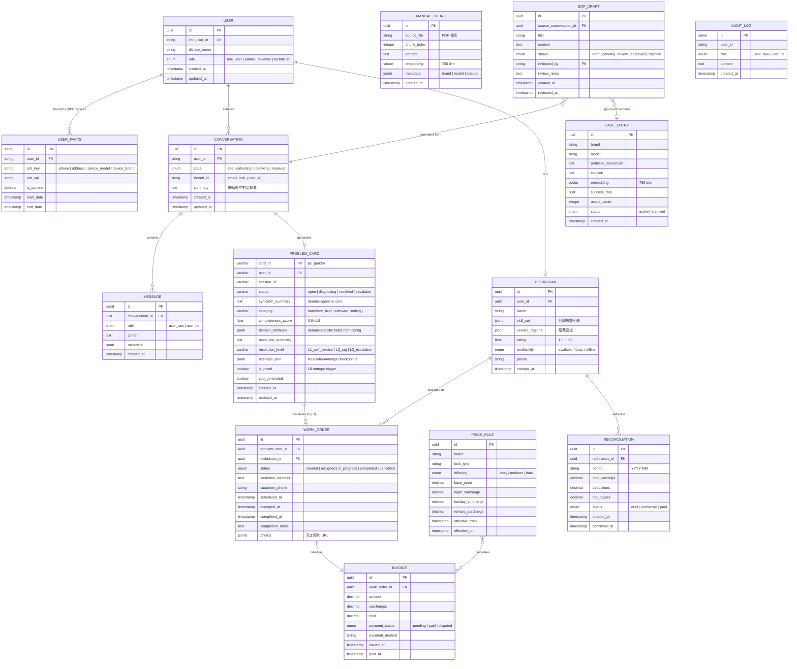
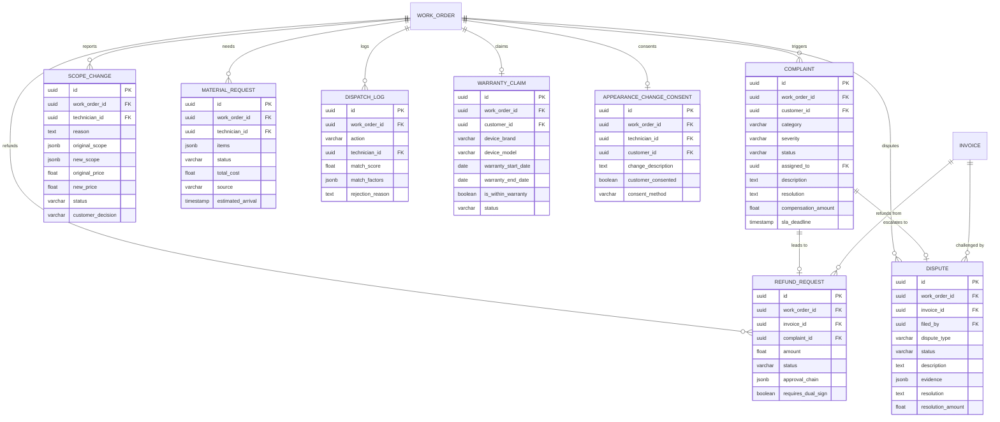

# 06 — Entity Relationship Diagram（實體關聯圖）

> **為什麼重要？** 定義資料核心，確保資料模型正確支撐所有業務場景。

## 概述

本圖定義平台所有核心實體（Entity）、屬性及其關聯，分為 V1.0 客服領域與 V2.0 派工帳務領域。

---

## 完整 ERD

---

## 實體說明

### V1.0 核心實體

| 實體 | 領域 | 說明 | 關鍵特性 |
|:-----|:-----|:-----|:---------|
| **User** | 身份管理 | 統一使用者（LINE 用戶、管理員、技師） | RBAC 角色區分 |
| **User Facts** | 使用者資料 | SCD Type 2 歷史追蹤（電話、地址、設備品牌型號） | is_current + start/end_date |
| **Conversation** | 客服對話 | 對話 Session，含狀態機與記憶壓縮 | thread_id 對應 LangGraph |
| **Message** | 客服對話 | 單則訊息（含原始/處理後/AI 回覆三類） | 審計追蹤 |
| **ProblemCard** | 問題診斷 | 結構化問題卡 (domain-agnostic core + JSONB domain_attributes) | Harness L1 核心 artifact，支援多領域切換 |
| **Case Entry** | 知識庫 | 歷史案例 + 768 維向量，供 L1 搜尋 | HNSW 索引 + MMR |
| **Manual Chunk** | 知識庫 | PDF 手冊分段 + 向量，供 L2 RAG | 分段索引 |
| **SOP Draft** | 知識庫 | AI 自動生成 SOP，待審核發佈 | 審核工作流 |
| **Audit Log** | 審計 | 全訊息記錄（user_raw / user / ai） | 合規追蹤 |

### V2.0 核心實體

| 實體 | 領域 | 說明 | 關鍵特性 |
|:-----|:-----|:-----|:---------|
| **Technician** | 派工 | 技師 Profile（技能/區域/評分/可用性） | JSON 技能矩陣 |
| **Work Order** | 派工 | 工單生命週期管理 | 狀態機 5 階段 |
| **Price Rule** | 計價 | 品牌×鎖型×難度定價矩陣 | 加成規則 |
| **Invoice** | 帳務 | 服務帳單 | 付款狀態追蹤 |
| **Reconciliation** | 帳務 | 技師月結對帳 | 審核工作流 |

---

## 向量知識庫集合

| 集合名稱 | 資料來源 | 維度 | 索引 | Agent 使用者 |
|:---------|:---------|:-----|:-----|:------------|
| kb_video | 硬體維修影片 | 768 | HNSW | hardware_technician |
| kb_line_chat | LINE 對話紀錄 | 768 | HNSW | sales_representative |
| kb_website | 門市網站資訊 | 768 | HNSW | store_assistant |
| kb_youtube | APP 教學影片 | 768 | HNSW | app_specialist |
| kb_gdrive | PDF 產品手冊 | 768 | HNSW | manual_librarian |

---

## V2.0 工單異常處理擴展

