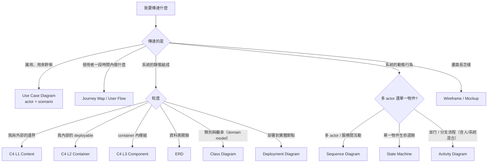
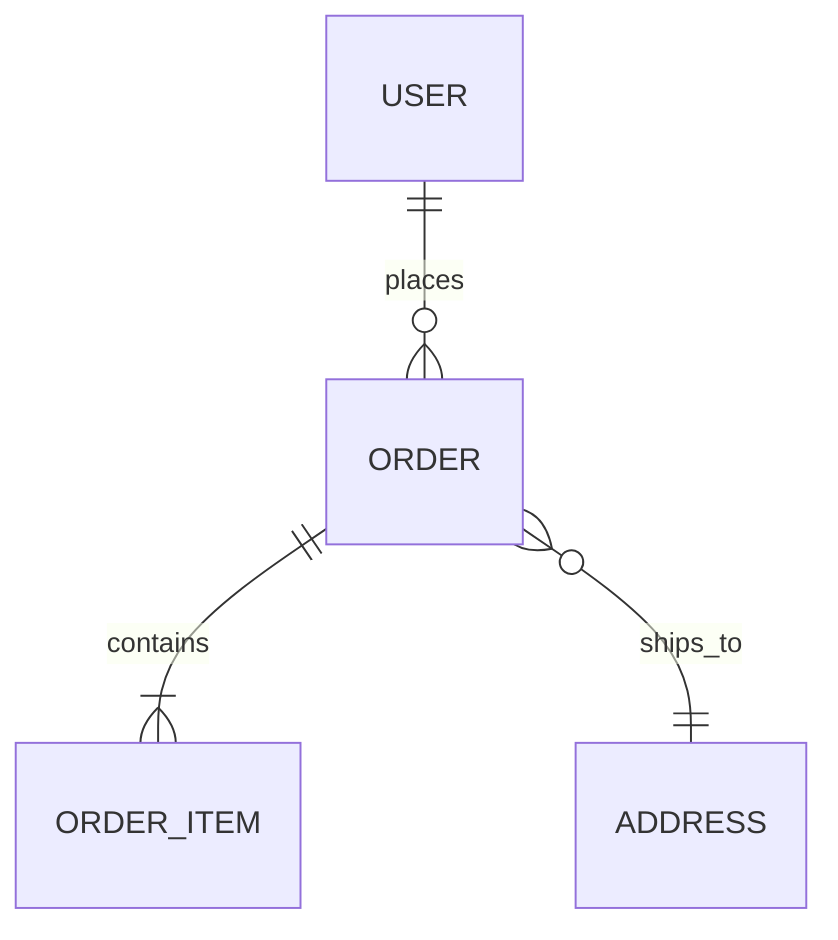
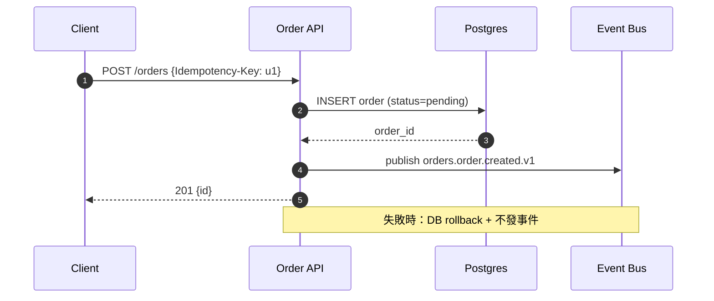
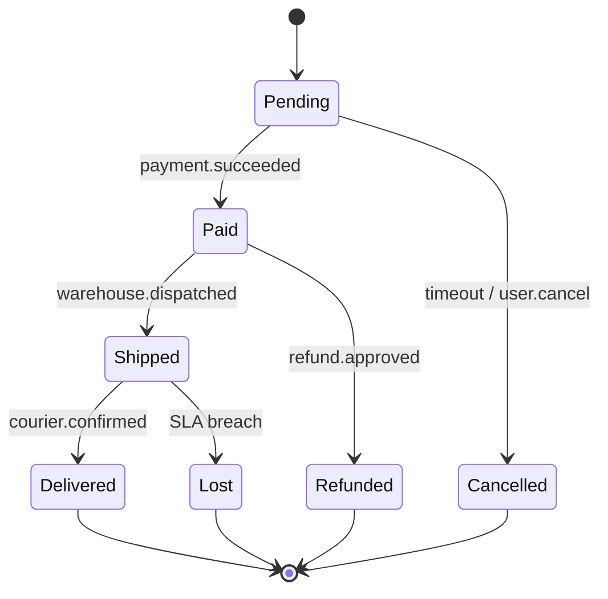
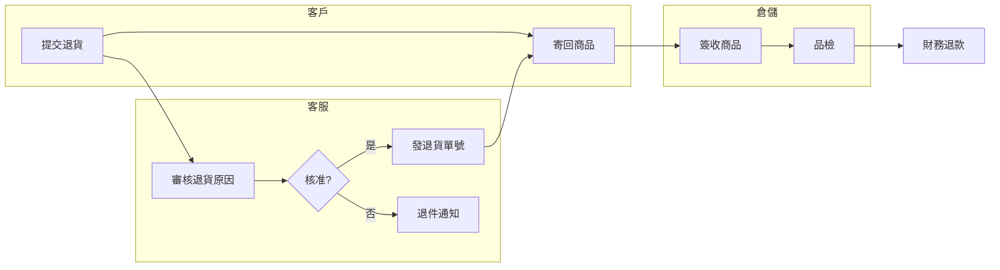
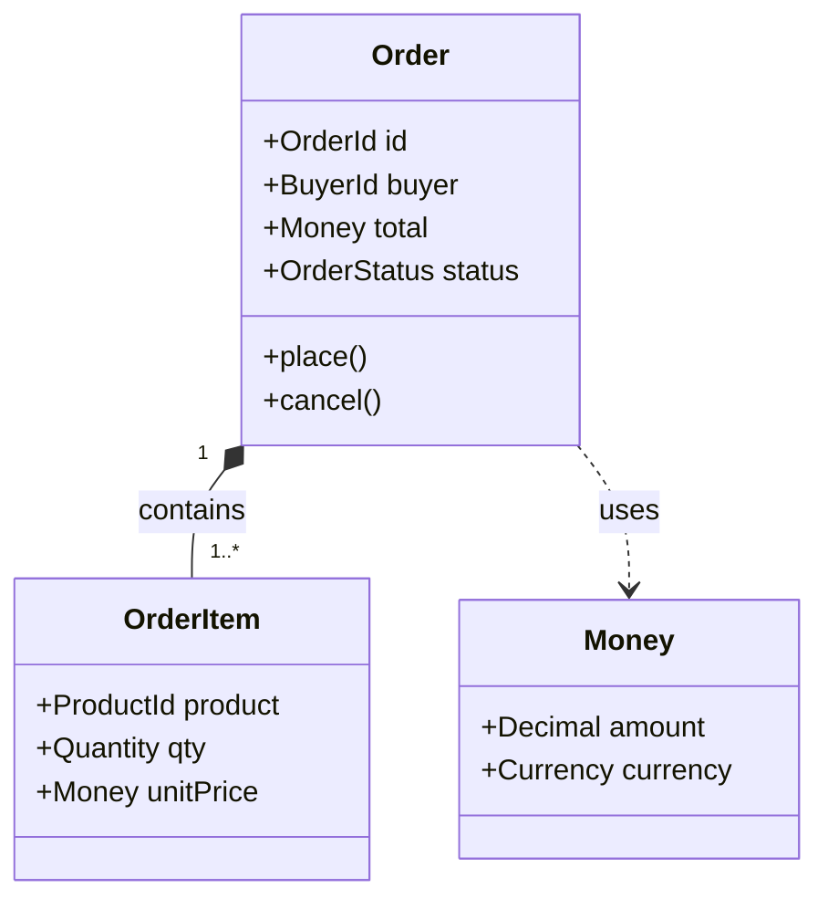
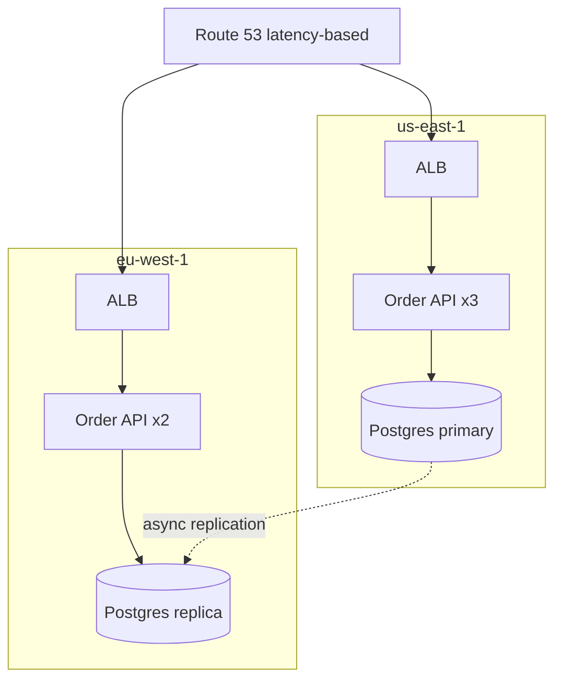
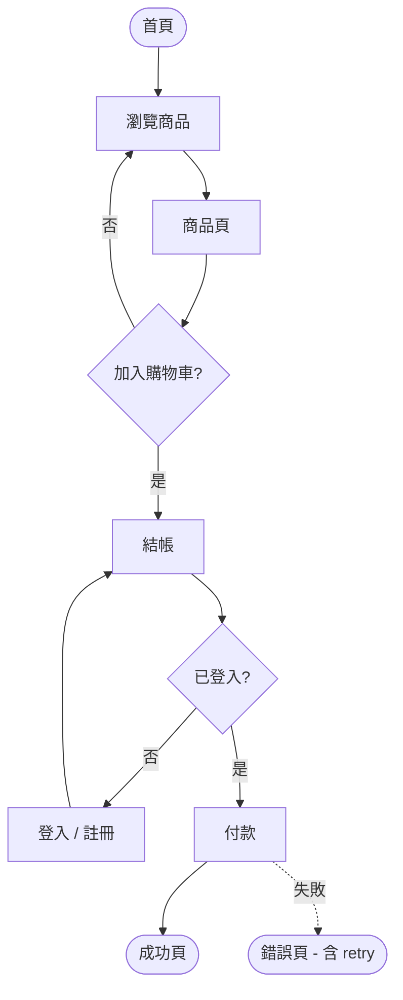
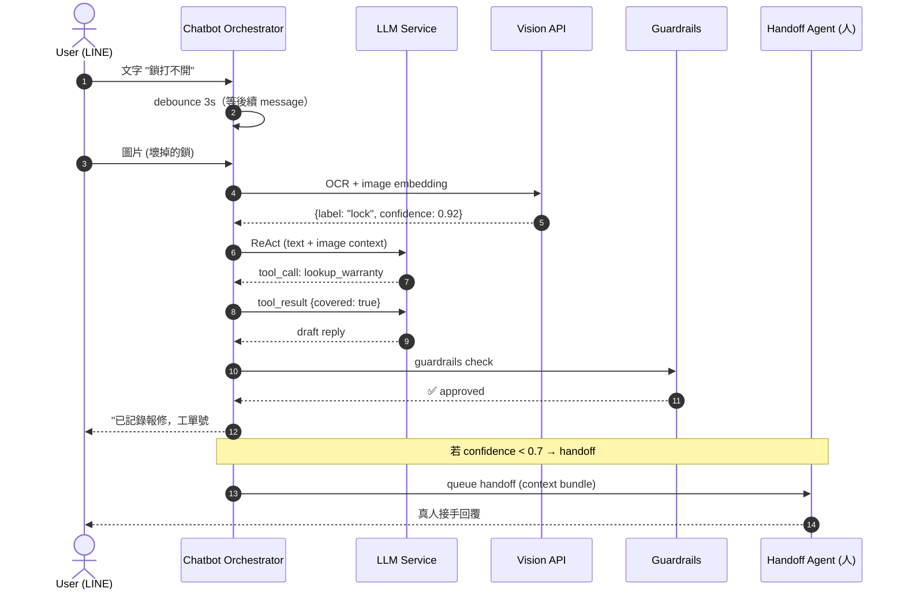
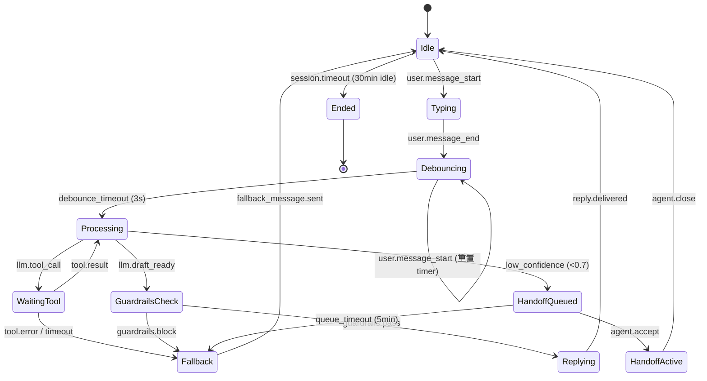

# 07 — Diagram Picker

「我要表達什麼 → 該畫哪種圖 → 用哪種 notation」的決策參照。涵蓋 UML 9 種主要圖、C4 4 層、ERD 3 種 notation、wireframe 4 個粒度。devteam-analyst / devteam-arch / devteam-design / devteam-ux 畫圖前必查；critique 時 sa / arch / sd / ux persona 用本檔當「該畫卻沒畫」的判據。

對應 [[06_quality_attributes_catalog]] §6（C4 層級對照）。

---

## 1. Quick Picker — 我要表達什麼

**口訣**：
- **結構靜態** → C4（系統粒度）/ Class（程式粒度）/ ERD（資料）/ Deployment（基礎設施）
- **行為動態** → Sequence（誰呼誰）/ State（什麼變什麼）/ Activity（依序做什麼）
- **使用者面** → Use Case（範圍）/ User Flow（路徑）/ Wireframe（畫面）

---

## 2. By Scenario — 圖類型對比

### 2.1 行為類：Sequence vs State vs Activity

| 圖 | 主角 | 軸 | 何時用 | 不該用的場景 |
|:---|:-----|:---|:-------|:-------------|
| **Sequence** | 多個 actor / service | 縱軸時間、橫軸物件 | API 呼叫鏈、整合互動、Auth flow、跨服務 transaction | 單一物件內部狀態流轉、純流程無對話 |
| **State Machine** | 單一聚合根 / 物件 | 狀態節點 + 轉移條件 | Order（pending→paid→shipped）、Subscription、Workflow item lifecycle | 多物件互動、無明顯「狀態」概念的純流程 |
| **Activity** | 流程本身（含人 + 系統） | 動作節點 + 分支 / 並行 | 業務 SOP、ETL pipeline、含 swim lane 的責任分配 | 單純物件狀態（用 State）、API 互動（用 Sequence） |

**判斷試金石**：
- 問句是「**誰**對**誰**做什麼」→ Sequence
- 問句是「這東西**現在處於**什麼狀態」→ State Machine
- 問句是「**接下來**做什麼、可不可並行」→ Activity

### 2.2 結構類：Class vs Component vs C4 各層

| 圖 | 抽象度 | 何時用 | DevTeam 對應 |
|:---|:-------|:-------|:--------------|
| **C4 L1 Context** | 系統與外部 | 對外溝通範圍、新 stakeholder onboarding | `templates/c4-l1.md`（必畫） |
| **C4 L2 Container** | 內部 deployable units | service / DB / cache / queue 拓樸 | `templates/c4-l2.md`（必畫） |
| **C4 L3 Component** | 容器內部模組 | 複雜 container 內部職責切分 | `templates/c4-l3.md`（按需，複雜才畫） |
| **UML Component** | 程式碼層級的可替換單元 | library / plugin 邊界、interface 提供與消費 | 罕用，能用 C4 L3 取代就用 C4 |
| **UML Class** | domain model | bounded context 內 entity / value object 關聯、繼承 | DDD aggregate 設計時用 |
| **UML Deployment** | 實體 / 虛擬節點 | 跨 AZ / region 拓樸、k8s node 分布 | C4 L2 已含部分；多區域才獨立畫 |
| **C4 L4 Code** | class / function | 通常不畫，交給 IDE / class diagram | — |

**規則**：DevTeam 預設 C4 L1 + L2 必畫，L3 按需；UML Class 只在 domain model 複雜時補；Deployment 只在多區域 / 高可用拓樸需溝通時補。**不畫 L4。**

### 2.3 資料類：ERD notation 三選一

| Notation | 視覺特徵 | 適合 | 不適合 |
|:---------|:---------|:-----|:-------|
| **Crow's Foot**（IE / Martin） | 用「魚爪」表多端 | **DevTeam 預設**。物理資料庫設計、邏輯模型、跨團隊溝通。Mermaid `erDiagram` 原生支援 | 概念模型階段（過於細節） |
| **Chen** | 菱形實體關係、橢圓屬性 | 學術、概念建模、第一輪 brainstorm | 工程交付（太冗長） |
| **UML Class as ERD** | 用 class diagram 表 entity | 已用 DDD class diagram、想統一 notation | 純資料層團隊（DBA 不熟 UML） |

**預設**：Mermaid `erDiagram`（Crow's Foot），與 `templates/erd.md` 對齊。Chen 只在 PRD 階段需要對非工程 stakeholder 解釋資料概念時用。

關係基數速記：
- `||--||` 1:1
- `||--o{` 1:0..N
- `||--|{` 1:1..N
- `}o--o{` 0..N:0..N（須 junction table 拆）

### 2.4 介面類：Wireframe 4 個粒度

| 粒度 | 何時 | 該包含 | 不該包含 |
|:-----|:-----|:-------|:---------|
| **Sketch / Low-fi** | 與 PM 對齊資訊架構、IA 階段 | 區塊框、主要 CTA 位置、頁面間連線 | 顏色、字體、實際 copy |
| **Wireframe（hi-fi 灰階）** | 與工程 / QA 對齊 layout 與互動 | 所有元素 + 真實 copy（或 placeholder 標 TBD）+ state 列表（empty/loading/error/success）+ responsive 斷點 | 品牌色、Hover micro-interaction |
| **Mockup** | 設計 review、客戶簽核 | 完整視覺、token、icon、illustration | 完整 interactive prototype |
| **Prototype** | 使用性測試、串接驗證 | 可點擊、含過場動畫、含 error path | — |

**Annotation 規範**（hi-fi wireframe 起）：
- 每個 interactive 元件標 `[state: default / hover / focus / disabled / loading / error]`
- 每個動態文字標 `{i18n_key}` 或 `{api.field}` 來源
- 每個 CTA 標 `→ {下個 screen / API}`
- 每張圖必含 `breakpoints: [mobile/tablet/desktop]` 對應
- a11y 註：tab order、aria-label、對比度 ratio

**State coverage checklist**（缺一 → UX persona 標 blocker）：
- [ ] empty（首次無資料）
- [ ] loading（spinner / skeleton）
- [ ] partial（資料載入到一半 / 無限滾動）
- [ ] error（呼叫失敗、超時、403）
- [ ] success（正常）
- [ ] offline（PWA / mobile 必加）

---

## 3. By Role × Phase

| Driver | Phase | 必畫圖 | 按需圖 |
|:-------|:------|:-------|:-------|
| **devteam-pm** | P0 Discovery | — | （無，文字 PRD 為主） |
| **devteam-ux** | P1 Analysis | User Flow（Mermaid flowchart）、State coverage 表 | Journey map、IA tree、Wireframe（低保真） |
| **devteam-analyst** | P1 Analysis | Use Case Diagram（or 文字 UC table）、State Machine（核心聚合根） | Activity（業務 SOP）、Sequence（複雜 integration） |
| **devteam-arch** | P2 Architecture | C4 L1 + C4 L2 | C4 L3（複雜 container）、Deployment（多區域）、Sequence（critical path） |
| **devteam-design** | P3 Design（API） | Sequence（關鍵 endpoint flow）、ERD（Crow's Foot） | Class（DDD aggregate）、Component（library 邊界） |
| **devteam-qa** | P4 Delivery | — | Decision table（複雜 rule 測試）、Sequence（E2E scenario） |
| **devteam-ops** | P5 Release | Deployment（含 rollout topology）、Activity（runbook 流程） | Sequence（incident response flow） |

---

## 4. Snippets — Mermaid 起手式

### 4.1 Sequence

### 4.2 State Machine

### 4.3 Activity（含 swim lane）

### 4.4 Class（DDD aggregate）

### 4.5 Deployment（多 region）

### 4.6 User Flow

---

## 5. Anti-patterns（critique 必抓）

- ❌ **用 Sequence 畫狀態流轉**（應該 State Machine）
- ❌ **用 State Machine 畫多服務互動**（應該 Sequence）
- ❌ **C4 L4 class diagram 出現在架構文件**（過細，交給 IDE）
- ❌ **Sequence 沒有 `autonumber`**（critique 無法引用具體步驟）
- ❌ **ERD 沒標基數**（`||--o{` 那種）— DBA 看不出 1:N or N:N
- ❌ **ERD 用 Chen notation 交給工程實作**（DBA 通常熟 Crow's Foot）
- ❌ **wireframe 只畫 happy path**（缺 empty / error / loading）
- ❌ **wireframe 沒標 responsive 斷點**（mobile / tablet / desktop 不同 layout 沒交代）
- ❌ **User Flow 沒 error path**（呼叫失敗 / 403 怎麼辦沒畫）
- ❌ **state machine 有 dead end 但沒標 `[*]` 終結態**（讀者以為流程未完）
- ❌ **整份架構文件只有一張圖**（要嘛 C4 不分層，要嘛 sequence 把所有 flow 塞一張）
- ❌ **多張圖之間沒有 cross-ref**（看完不知道 L2 的某個 container 對應哪個 L3）

---

## 5.5 Chatbot Multimodal + 多輪異步 Diagram Picker

> Source: Roundtable B (2026-05-28) D2 — Chatbot A01-A12 對話流呈現形式。
> 場景：使用者透過 LINE / Web Chat 與 AI bot 交握，含 debounce 等待、ReAct loop、guardrails 中斷、handoff 給真人、multimodal 輸入（文字 + 圖片）。

### 5.5.1 為什麼單一 flowchart 不夠

| 表達需求 | flowchart 為何不適 |
|:---------|:--------------------|
| 多 actor 交握（user / AI / orchestrator / handoff agent / external tool） | flowchart 沒有 actor 軸，誰呼誰看不出來 |
| 異步等待（debounce window / streaming response） | flowchart 沒有時間軸，等待 vs 處理混在一起 |
| 對話 session 生命週期（idle / typing / waiting_ai / handoff_queued / handoff_active / fallback / ended） | flowchart 表流程不表狀態，state 轉換用 condition node 表達會爆 |
| 中斷與恢復（guardrails 拒答、tool call 失敗、超時重試） | flowchart 的中斷會變多分支，可讀性差 |
| Multimodal fork（文字 → OCR → ReAct vs 圖片 → vision API → ReAct） | flowchart 可表分支但無法表「同 session 多次 fork-join」 |

### 5.5.2 推薦組合 — Sequence + State Machine 雙圖

**Sequence diagram**（actor 交握 + 時間軸）：用於表達「誰呼誰、debounce 何時啟動、handoff 怎麼接手」。

**State Machine**（session lifecycle）：用於表達「對話 session 從 idle 走到 ended 的所有狀態轉換」。

兩圖**對應同一 use case 但視角不同**：
- Sequence 主角是 message flow（用戶 → AI → tool → 用戶）
- State machine 主角是 session 本身

每張 chatbot user flow / FR 殼 acceptance 段建議**兩圖並存**：
- sequence 給工程實作參考（API 呼叫、timing）
- state machine 給 QA + UX 對齊（state coverage、edge case）

### 5.5.3 Sequence Diagram 範例（Chatbot A06 報修 intake 含 multimodal + handoff）

要點：
- **autonumber** 必加（critique 才能引用步驟）
- debounce 用 `CB->>CB` 自迴圈表達
- handoff 用 `Note over` + 後續 `HA->>U` 表達
- guardrails 用獨立 participant，凸顯為 cross-cutting concern

### 5.5.4 State Machine 範例（Chatbot Session Lifecycle）

要點：
- 每個 state 是 session 的單一觀察狀態（不是 UI screen）
- 邊上標 event（如 `user.message_end`、`guardrails.block`） — 對應 FR `emits_events` 欄位
- Fallback / Ended 是吸收態（terminal）
- Debouncing 自迴圈表達「等更多訊息時間 reset」

### 5.5.5 Anti-patterns（chatbot 特有）

| Anti-pattern | 為什麼錯 | 正確做法 |
|:-------------|:---------|:---------|
| 單一 flowchart 表達整個 chatbot 流程 | 多 actor + 異步 + 中斷無法在 flowchart 表達 | sequence + state machine 雙圖 |
| sequence 沒畫 guardrails 路徑 | guardrails 是 cross-cutting，不畫 = 漏 alternate flow | guardrails 為獨立 participant，含 block 路徑 |
| state machine 只畫 happy path（Idle → Processing → Replying → Idle） | 漏 fallback / handoff / timeout | 強制畫 Fallback + HandoffQueued + Ended 終結態 |
| sequence 把 debounce 當「沒事發生」省略 | debounce 是有意義的 timing 決策，QA 要測 window | 用自迴圈或 `Note` 明示 debounce 時間 |
| handoff 流用 sequence 但沒在 state machine 對應 state | sequence 看到 handoff 但 state 沒對齊 → 兩圖不一致 | sequence 內每個 handoff event 對應 state machine 一個 transition |
| Multimodal（文字+圖片）只畫文字路徑 | 圖片路徑（OCR / vision API）獨特，漏掉 = scope 不完整 | sequence 內含 vision API 呼叫 + state machine 處理路徑共用 Processing 但不同 entry note |

### 5.5.6 對應 FR 殼與 user flow 的分工

| 文件 | 放什麼 chatbot 內容 |
|:-----|:--------------------|
| `docs/ux/by-module/A06-flow.md`（user flow by-module 子檔） | sequence + state machine 雙圖；journey level step；UI state 列表 |
| `docs/analysis/fr/FR-NNNN.md`（chatbot FR 殼） | acceptance G/W/T；**Example Dialogue** sub-section（3-5 條 scripted dialogue + a11y variant，A3.6 強制） |
| `docs/architecture/c4-l3-*.md` | Chatbot Orchestrator container 內部 component（LLM client / guardrails / tool registry） |

[ref: KB-13 §9 粒度切分檢核表]、[ref: cascade-2026-05-28-context-pack.md §1.2 D2]

---

## 6. Cross-ref

- [[06_quality_attributes_catalog]] §6 — C4 層級對照（本檔 §2.2 延伸）
- [[08_api_design_catalog]] §6 — OpenAPI snippet（sequence 圖內的 API 呼叫應對應 OpenAPI endpoint）
- [[10_resilience_patterns]] §2 — sequence 圖內的失敗路徑該對應 retry / circuit breaker pattern
- `templates/c4-l1.md` / `c4-l2.md` / `c4-l3.md` — 套用本檔 §2.2
- `templates/erd.md` — 套用本檔 §2.3（Crow's Foot 預設）
- `templates/system-spec.md` — UC + State Machine 段落套用本檔 §2.1
- `templates/user-flow.md` — User Flow + Wireframe state coverage 套用本檔 §2.4

**Critique 鐵則**：State coverage checklist（§2.4）有缺項 → UX persona 必標 blocker；ERD 缺基數 → DBA persona 必標 blocker；C4 缺 L1 或 L2 → arch persona 必標 blocker。
