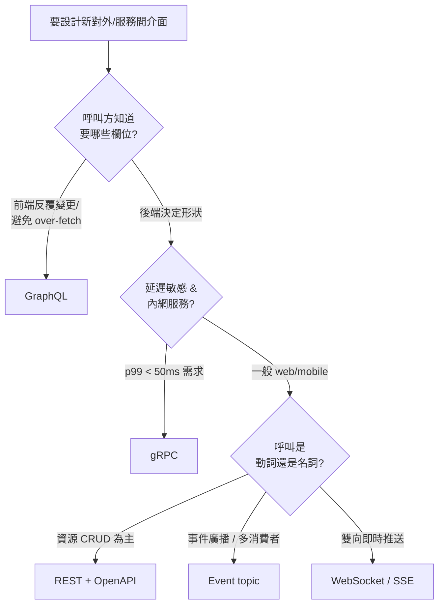

# 08 — API Design Catalog

API 風格選型、resource / event 命名、error model、versioning 的決策參照。devteam-design 寫 OpenAPI / event contract 前必讀，devteam-arch 寫 integration ADR 前必讀，sd / dba / qa persona critique API 文件時必查。

對應 [[06_quality_attributes_catalog]] §7（OpenAPI 必填欄位）與 NIST SSDF PW。

---

## 1. Quick Picker — 4 種 API 風格選哪個



| 風格 | 何時用 | 不該用的場景 |
|:-----|:-------|:-------------|
| **REST** | 預設選擇。對外公開 API、CRUD-heavy、跨組織整合 | 即時雙向、複雜聚合查詢 |
| **GraphQL** | BFF、行動端、頻繁變更的前端、避免 N+1 over-fetch | 服務間後端通訊、簡單 CRUD（殺雞用牛刀） |
| **gRPC** | 內網微服務間、串流、低延遲（p99 < 50ms） | 對外公開（瀏覽器原生不支援） |
| **Event topic** | 通知多消費者、解耦、CQRS 寫入側、audit log | 需要同步回傳值的呼叫 |
| **WebSocket / SSE** | 聊天、即時推播、long-poll 替代 | 一次性請求-回應 |

**預設**：對外 API → REST + OpenAPI 3.1；內部服務間 → 視延遲與耦合度選 REST or gRPC；跨 bounded context → Event。

---

## 2. By Scenario — Naming Convention

### 2.1 REST resource

| 規則 | 對 | 錯 |
|:-----|:---|:---|
| 用複數名詞 | `/users`, `/orders` | `/user`, `/getOrder` |
| 巢狀只到 2 層 | `/users/{id}/orders` | `/users/{id}/orders/{oid}/items/{iid}/tags` |
| Verb 走 HTTP method | `POST /orders` | `POST /createOrder` |
| 動作型用 sub-resource | `POST /orders/{id}/cancel` | `POST /cancelOrder?id=...` |
| filter / sort / page 用 query | `GET /orders?status=paid&sort=-created_at&page=2` | `GET /orders/paid/sorted/page2` |
| kebab-case 路徑、snake_case body | `/order-items` + `{ "order_id": "..." }` | `/orderItems` + `{ "OrderId": "..." }` |
| ID 用 UUID 或 ULID 不用自增 | `"id": "01HQ..."` | `"id": 12345` |

### 2.2 GraphQL schema

- 型別 PascalCase（`User`、`OrderItem`），field camelCase（`createdAt`）
- Query 名詞、Mutation 動詞 + 名詞（`createOrder`、`cancelOrder`）
- Input type 必獨立（`CreateOrderInput`），不要重用 output type 當 input
- 用 Relay-style cursor pagination（`edges { node }` + `pageInfo`）；不要 offset
- Deprecation 用 `@deprecated(reason: "...")`，不刪 field 至少 2 releases

### 2.3 gRPC service / method

- service 名詞複數 + `Service`：`OrderService`、`UserService`
- method 動詞 + 名詞：`GetOrder`、`ListOrders`、`StreamEvents`
- request / response message 後綴 `Request` / `Response`：`GetOrderRequest`
- proto 檔放 `proto/<bounded_context>/<service>.proto`，版本走 package：`package orders.v1;`

### 2.4 Event topic / message

格式：`<domain>.<entity>.<action>.<version>`

| 範例 | 何時 |
|:-----|:-----|
| `orders.order.created.v1` | Order 聚合根建立 |
| `orders.order.status_changed.v1` | 狀態轉移（payload 含 from/to） |
| `payments.refund.requested.v1` | 跨 bounded context 通知 |

規則：
- 用過去式（`created`、`paid`、`shipped`），事件是已發生事實
- payload 必含 `event_id`（UUID）+ `occurred_at`（ISO 8601）+ `trace_id`
- 版本 v1 / v2 並存期 ≥ 2 sprint，不允許 in-place breaking change
- topic name 與 routing key 都用 dot-separated，不混合 `-` `_`

---

## 3. Error Model

### 3.1 HTTP status × domain error code 對應

| 情境 | HTTP | 何時 |
|:-----|:-----|:-----|
| 請求欄位缺失 / 型別錯 | **400** | client 改 payload 就會成功 |
| 業務規則違反（合法請求但邏輯拒絕） | **422** | client 改 payload 不一定能成功（例：餘額不足） |
| 未認證 | **401** | 沒帶 / 過期 token |
| 已認證但無權限 | **403** | 帶 token 但角色不對 |
| 資源不存在 | **404** | 注意：對未授權資源也回 404 避免列舉攻擊 |
| 冪等鍵衝突 / 樂觀鎖衝突 | **409** | 重試會穩定失敗 |
| 不支援的 Content-Type / Accept | **415** / **406** | |
| 觸發速率限制 | **429** | 必附 `Retry-After` header |
| 暫時依賴失敗 | **503** | 必附 `Retry-After`，client 應 retry |
| 上游 timeout | **504** | |
| 未預期錯誤 | **500** | 必有 `trace_id`，內部 alert |

**判 400 vs 422 的試金石**：「同樣 payload 重試會不會通過？」會 → 422 業務拒絕；不會 → 400 格式問題。

### 3.2 Domain error code 結構

統一 payload schema：
```json
{
  "error": {
    "code": "ORD-422-001",
    "message": "Insufficient balance",
    "details": [{ "field": "balance", "required": 500, "actual": 120 }],
    "trace_id": "01HQ...",
    "doc_url": "https://docs.example.com/errors/ORD-422-001"
  }
}
```

Code 格式：`<DOMAIN>-<HTTP>-<SEQ>`
- `DOMAIN`：3 大寫字母對應 bounded context（`ORD` = orders、`PAY` = payments、`USR` = users、`AUTH` = auth、`SYS` = 跨域系統錯）
- `HTTP`：對應的 HTTP status
- `SEQ`：domain 內 3 位數流水

**Prefix range 保留**（避免 domain 撞號）：
| Prefix | Domain | 範圍 |
|:-------|:-------|:-----|
| `SYS-*` | 跨域系統錯（infra、timeout、unknown） | 001-099 保留 |
| `AUTH-*` | 認證授權 | 001-099 保留 |
| `<feature 3字>-*` | 各 feature domain 自管 | 100+ 為 feature 新增段 |

每新增 error code 必須：
1. 寫進該 service 的 `docs/api/errors-<service>.md`
2. 補對應的 i18n message key
3. （若是 retryable）標 `retryable: true` 在 OpenAPI x-error metadata

### 3.3 Retry / idempotency 政策

| Method | Idempotent? | Client 該 retry? |
|:-------|:------------|:------------------|
| GET / HEAD / OPTIONS | ✓ 天然 idempotent | 任何 5xx / 網路錯都可 retry |
| PUT / DELETE | ✓ 天然 idempotent | 同上 |
| POST | ✗ 預設非 idempotent | **必須**透過 `Idempotency-Key` header 才能安全 retry |
| PATCH | 視實作（建議 idempotent） | 同 POST |

POST 的 Idempotency-Key：
- Client 產 UUID v4，TTL 至少 24h
- Server 第一次處理後快取結果，第二次同 key 直接回原 response
- Key 衝突但 payload 不同 → 422 `SYS-422-001`

---

## 4. Versioning

| 策略 | 何時用 | 範例 |
|:-----|:-------|:-----|
| **URI versioning** | 對外公開 REST | `/v1/orders`、`/v2/orders` |
| **Header versioning** | 不想動 URL（多版本灰度） | `Accept: application/vnd.example.v2+json` |
| **Field-level deprecation** | GraphQL / 漸進淘汰 | `@deprecated(reason: "use ...")` |
| **gRPC package** | 內網 | `orders.v1` → `orders.v2` |
| **Event suffix** | 事件 | `orders.order.created.v1` → `.v2` |

**Breaking change policy**（任一風格通用）：
- 新增可選欄位、新增 endpoint、新增 enum value（**若 client 用 strict parser 也算 breaking**） → minor，stale-minor cascade
- 刪欄位、改型別、改 enum 語義、刪 endpoint、改 error code 語義 → major，必走 ADR + 2 sprint 並存期 + consumer 升級確認
- 並存期間在舊版回應加 `Deprecation` + `Sunset` header（RFC 8594）

---

## 5. By Role × Phase

| Driver | Phase | 必讀段落 |
|:-------|:------|:---------|
| **devteam-arch** | P2（integration ADR） | §1（選風格）、§4（版本策略寫進 ADR Consequences） |
| **devteam-design** | P3（OpenAPI） | §1 → §2.1 → §3 → §4 全段 |
| **devteam-design** | P3（event contract） | §2.4、§3.3（event 也要 idempotency 概念：consumer 端去重） |
| **devteam-design** | P3（gRPC） | §2.3、§3.1（gRPC status code → 仍須 map 到 §3.1 對應語義） |
| **devteam-analyst** | P1（integration inventory） | §1（標每個 integration 用哪種風格 + 為什麼） |
| **devteam-qa** | P4（contract test） | §3.1（每個 status code 至少 1 個 negative case）、§3.3（idempotency 必有測試） |
| **devteam-ops** | P5（runbook） | §3.1（5xx 與 429 的 alert / 處置）、§4（breaking change rollout 流程） |

---

## 6. Snippets — 起手式

### 6.1 OpenAPI error component
```yaml
components:
  schemas:
    Error:
      type: object
      required: [error]
      properties:
        error:
          type: object
          required: [code, message, trace_id]
          properties:
            code:    { type: string, pattern: '^[A-Z]{3,4}-\d{3}-\d{3}$' }
            message: { type: string }
            details: { type: array, items: { type: object } }
            trace_id: { type: string }
            doc_url:  { type: string, format: uri }
  responses:
    Error400: { description: Bad Request, content: { application/json: { schema: { $ref: '#/components/schemas/Error' } } } }
    Error422: { description: Unprocessable, content: { application/json: { schema: { $ref: '#/components/schemas/Error' } } } }
```

### 6.2 Idempotency-Key 標註
```yaml
paths:
  /orders:
    post:
      parameters:
        - in: header
          name: Idempotency-Key
          required: true
          schema: { type: string, format: uuid }
      x-idempotency:
        ttl: PT24H
        key_source: client
```

### 6.3 Event envelope
```json
{
  "event_id":   "01HQ...",
  "event_type": "orders.order.created.v1",
  "occurred_at": "2026-05-18T10:23:00Z",
  "trace_id":   "01HQ...",
  "producer":   "orders-svc@v3.2.1",
  "data": { "order_id": "...", "buyer_id": "...", "total_amount": 12000 }
}
```

---

## 7. Anti-patterns（critique 必抓）

- ❌ `POST /createOrder` / `GET /getOrders`（RPC over REST）
- ❌ HTTP 200 + `{"success": false, "error": "..."}`（吞錯，client 必須兩層解析）
- ❌ 404 同時表示「真不存在」與「無權限」卻不一致（要嘛全 404，要嘛 403/404 分流且文件明示）
- ❌ POST 不要求 Idempotency-Key 就鼓勵 client retry
- ❌ Error message 給人讀，code 沒結構（無法程式化分類）
- ❌ Enum 加值不算 breaking（strict parser client 會炸）
- ❌ 5xx 不附 `trace_id`（事故無法跨服務追）
- ❌ 同一 endpoint 既改 schema 又改語義不換版本
- ❌ Event payload 用「現在式」（`order.create`）—— 事件是已發生事實必過去式
- ❌ topic naming 混合 dot / dash / underscore（`orders.order-created_v1`）

---

## 8. Cross-ref

- [[06_quality_attributes_catalog]] §7 — OpenAPI 必填欄位
- [[10_resilience_patterns]] §2.1 — retry / backoff 與本檔 §3.3 idempotency 連動
- [[09_observability_catalog]] §3 — error response 的 `trace_id` 對應 trace 規範
- `templates/openapi.yaml` — 套用本檔 §6.1 + §6.2
- `templates/adr.md` — breaking change 必寫 ADR
- 缺 error code 結構 / Idempotency-Key 政策 / breaking change policy → **Gate 5a 阻擋**（critique 必標 blocker）
