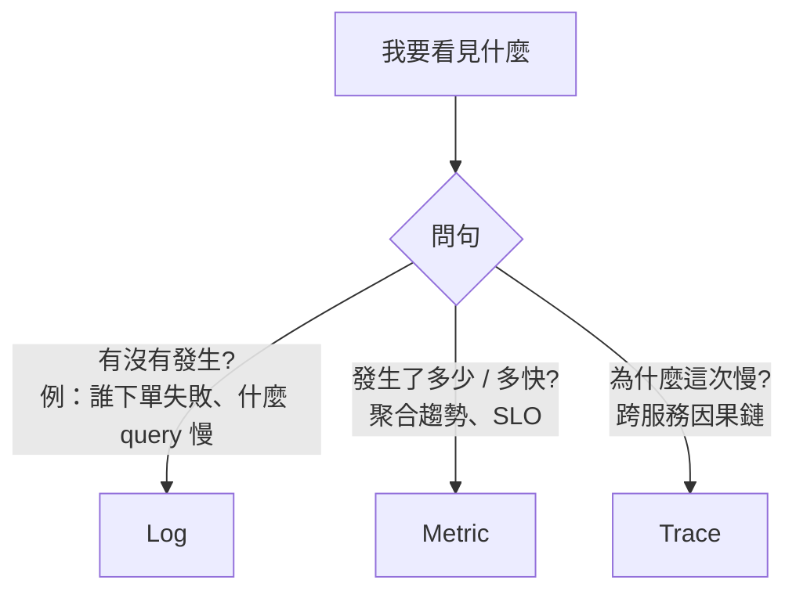

# 09 — Observability Catalog

「我要看見什麼 → 該用 log / metric / trace 哪個 → 命名規則 → 該埋在哪個邊界 → alert 怎麼接 SLO」的決策參照。devteam-arch 寫 observability 前置需求時必讀，devteam-design 設計 telemetry hooks 時必查，devteam-ops 寫 runbook + alert 時必引。

對應 [[06_quality_attributes_catalog]] §1（Operability）、§2（SLI/SLO）與 Google SRE Workbook。

---

## 1. Quick Picker — 三柱選哪個



| 柱 | 形態 | 強項 | 弱項 | Cost |
|:---|:-----|:-----|:-----|:-----|
| **Log** | 事件記錄（structured JSON） | 高保真細節、單一事件可重建 | 量大 / 難聚合 / 搜尋慢 | 高（vol） |
| **Metric** | 時序數字聚合 | 趨勢、alert、SLO、低延遲 | 無法回頭看單一請求 | 低（cardinality 是隱形成本） |
| **Trace** | 跨服務 span tree | 因果鏈、root cause、latency 拆解 | 取樣後資料不完整 | 中（vol + storage） |

**鐵則**：
- 不要把所有東西都 log（log everything → log nothing useful）
- 不要把所有維度做成 metric label（cardinality 爆炸 → 帳單爆炸）
- Trace 不能全採樣（生產用 head-based 1-5% + tail-based 異常加採）

**三柱串接**：log 必含 `trace_id`、metric label 必含 `service` / `endpoint`，事故時可從 alert（metric）→ 受影響 trace → 該 trace 對應的 log。

---

## 2. Structured Log

### 2.1 Log Level 用法

| Level | 何時 | 範例 |
|:------|:-----|:-----|
| **DEBUG** | 開發 / 排錯用，生產通常關閉 | `db.query.sql = "SELECT ..."` |
| **INFO** | 業務里程碑、狀態轉移 | `order.created order_id=...`、`user.login user_id=...` |
| **WARN** | 異常但業務可繼續（觸發 fallback、retry 成功） | `cache.miss key=...`、`retry.success attempt=2` |
| **ERROR** | 業務失敗 / 需人關注 | `payment.failed reason=insufficient_balance` |
| **FATAL** | 服務即將終止 | 啟動失敗 / OOM / panic |

**規則**：
- WARN 必須包含「為什麼是 warn 而不是 error」的 context
- ERROR 必須包含 `trace_id` + 足以重現的 input（去 PII）
- 不要用 INFO 紀錄高頻事件（每請求一筆 → 用 metric）
- 不要用 ERROR 記錄使用者錯誤（400 不是系統 error，是 INFO）

### 2.2 Structured log schema

每筆 log 必含：
```json
{
  "timestamp": "2026-05-18T10:23:00.123Z",
  "level": "INFO",
  "service": "orders-svc",
  "version": "3.2.1",
  "env": "prod",
  "trace_id": "01HQ...",
  "span_id": "...",
  "user_id": "<hashed or null>",
  "event": "order.created",
  "data": { "order_id": "...", "total_amount": 12000 }
}
```

- `event` 用 `<domain>.<action>` snake_case（與 event topic 同 schema）
- `data` 內**不放原始 PII**（email / phone / 身分證），改放 hash 或 ID
- 不要 log 整個 request / response body（用 trace 採樣才適合）

### 2.3 PII 與 log

| 欄位 | 處理 |
|:-----|:-----|
| Email / Phone / 身分證 | hash（SHA-256 + salt）或完全遮罩 |
| 密碼 / Token | **永遠不 log**（用 placeholder `"***"`） |
| 信用卡 | **永遠不 log**（PCI DSS 違規） |
| IP | 視合規要求 hash 或截斷（IPv4 末 octet 0、IPv6 末 64 bit 0） |
| User ID（內部 UUID） | OK，但跨服務跨表已可重建身分時視為 quasi-identifier |

詳見 [[11_data_and_stack_catalog]] §1（data classification）。

---

## 3. Metric

### 3.1 命名規則

`<service>.<subsystem>.<measure>.<unit>` snake_case，dot-separated。

| 範例 | 解讀 |
|:-----|:-----|
| `orders_svc.http.request.duration_ms` | Orders service HTTP 請求耗時毫秒 |
| `orders_svc.http.request.count` | 請求數 |
| `orders_svc.db.connection.in_use` | 當前使用中連線數 |
| `payments_svc.refund.success.rate` | 退款成功率 |

**規則**：
- 結尾必含 unit（`_ms` / `_bytes` / `_count` / `_rate` / `_percent`）
- counter 用 `_count` / `_total`，gauge 用名詞，histogram 用 `_duration_*`
- 不要把同一指標的不同單位拆成不同 metric（用 unit suffix 區分）

### 3.2 Label / Tag 設計（cardinality 守門）

| 維度 | 允許值範圍 | 註 |
|:-----|:-----------|:---|
| `service` | 固定（< 100） | ✓ |
| `env` | prod / staging / dev | ✓ |
| `endpoint` / `route_pattern` | 路徑 pattern 化（`/users/:id` 不是 `/users/12345`） | ✓ 必須 pattern 化 |
| `status_code` | 數十個 | ✓ |
| `tenant_id` / `user_id` | **危險**（百萬+） | ❌ 除非真的需要 per-tenant SLO |
| `error_code` | domain code 數十-數百 | ✓ |
| `request_id` / `trace_id` | 無限 | ❌ 永遠不要放 metric label |

**Cardinality 公式**：所有 label 值的笛卡爾積。若超過 10K 就要重新審視；超過 100K 必爆。

### 3.3 SLI 命名與計算

SLI 名稱：`<service>.<sli_type>`

| SLI 類型 | 計算 | 命名範例 |
|:---------|:-----|:---------|
| Availability | `(2xx + 3xx + 4xx_client_error) / total` | `orders_svc.availability` |
| Latency | `requests_faster_than_threshold / total` | `orders_svc.latency_p95_under_500ms` |
| Quality | `correct_results / total_results` | `search_svc.quality_relevance` |
| Freshness | `data_within_freshness_window / total` | `feed_svc.freshness_under_60s` |
| Correctness | `events_deduped / total_events` | `orders_svc.correctness_dedup` |
| Throughput | `processed_items / window_seconds` | `etl_svc.throughput_rows_per_s` |

**規則**：SLI **必須是使用者感受得到的指標**，不是「CPU < 80%」「memory < 4GB」（那是 resource metric，不是 SLI）。詳見 [[06_quality_attributes_catalog]] §2。

---

## 4. Trace

### 4.1 Span 粒度

| 該開 span | 不該開 span |
|:----------|:------------|
| 入口請求（HTTP / gRPC / event consume） | 每個 function call（爆量） |
| 對外呼叫（DB / cache / 下游 service） | for-loop 內部 |
| 主要業務步驟（驗證 / 計價 / 扣款） | 純 in-memory 計算 |
| Async job 整體 + 內部關鍵步驟 | 簡單 getter / setter |

### 4.2 Span 命名

`<verb>.<noun>` 或 `<service>.<operation>`：
- `db.select.orders` / `db.insert.orders`
- `redis.get.user_cache`
- `http.post.payments_svc/refund`
- `kafka.consume.orders.order.created.v1`
- `business.calculate_total`

### 4.3 Span attributes（必含）

- `service.name`、`service.version`、`service.env`
- `http.method` / `http.status_code` / `http.route`（pattern 化）
- `db.system` / `db.statement`（去參數，避 PII）
- `messaging.system` / `messaging.destination`
- `error` = true / false；error 時加 `error.type` + `error.message`

採 OpenTelemetry semantic conventions（不要自造）。

### 4.4 取樣策略

| 策略 | 何時 |
|:-----|:-----|
| **Head-based 1-5%** | 預設，cost 控管 |
| **Tail-based（基於 latency / error）** | 異常請求保留 100%，正常請求採樣 |
| **Always sample**（100%） | 開發 / staging |
| **Always sample for VIP / 特定 tenant** | 重要客戶 debug |
| **Always sample for 特定 endpoint** | 新功能 ramp up 階段 |

---

## 5. Telemetry Hook — 該埋在哪些邊界

| 邊界 | log | metric | trace |
|:-----|:----|:-------|:------|
| **HTTP / gRPC ingress** | request + response（去 body / PII） | count / duration / status | span（root） |
| **HTTP / gRPC egress**（呼叫下游） | error 才 log | count / duration / status | child span |
| **DB query** | slow query（>500ms）才 log | query count / duration / pool wait | child span |
| **Cache 操作** | miss 才 log（DEBUG） | hit_rate / miss_rate | child span（高頻可省） |
| **Event publish** | INFO（含 event_id） | publish count | child span |
| **Event consume** | INFO 開始 + 結束 | consume count / lag / process_duration | span（root，與上游 trace 透過 trace_id 串） |
| **狀態轉移**（state machine） | INFO（from→to） | transition count | event 加在 span 上 |
| **Error / Exception** | ERROR 必 log | error count | span.error = true |
| **Rate limit 觸發** | WARN | limit_hit count | span event |
| **Circuit breaker 狀態變化** | WARN（CLOSED→OPEN→HALF_OPEN） | state gauge + transition count | span event |
| **Fallback 觸發** | WARN（降級內容、原因） | fallback count | span event |
| **Auth fail** | INFO（不是 ERROR） | count by reason | — |

**核心原則**（critique 必抓）：
- 任何「使用者請求」入口必開 root span + log + metric
- 任何「跨進程呼叫」必傳 trace context（W3C `traceparent` header）
- 任何「降級 / 失敗 / 異常」必有對應 log + metric + alert

---

## 6. Alert Routing 與 SLO 連動

### 6.1 Alert 設計原則

| 原則 | 反例 |
|:-----|:-----|
| **每個 alert 對應一個 runbook action** | 「磁碟使用 > 80%」這種無 action |
| **基於 SLI 而非 resource metric** | 「CPU 高」改成「latency p99 超 SLO」 |
| **多步驟燒掉 error budget 才 page** | 5min spike 就半夜 page（噪音） |
| **嚴重度分級對應通知通道** | 全部都 page on-call |

### 6.2 Burn rate alert（Google SRE Workbook）

對 30-day error budget 設兩段警報：
| Window / Burn rate | 意義 | 通知 |
|:-------------------|:-----|:-----|
| 1h window, burn rate 14.4x | 2% budget 已燒掉，繼續這速度 2 天燒完 | Page on-call |
| 6h window, burn rate 6x | 5% budget 已燒掉，繼續這速度 5 天燒完 | Page on-call |
| 1d window, burn rate 3x | 10% budget 已燒掉，1/3 月用完 | Ticket / Slack |
| 3d window, burn rate 1x | 即將燒完，但不急 | Slack 通知 |

### 6.3 Alert metadata（每個 alert 必含）

```yaml
alert: orders_svc_availability_burn_fast
expr: <burn rate query>
labels:
  severity: page
  service: orders-svc
  team: orders
annotations:
  summary: "Orders availability burning 14.4x of error budget (1h)"
  description: "..."
  runbook: "https://runbooks/orders/availability-burn"
  dashboard: "https://grafana/d/orders-overview"
  slo: "99.9% availability over 30d"
```

缺 `runbook` / `dashboard` link → SRE persona 必標 blocker。

### 6.4 嚴重度通知對應

| Severity | 觸發何時 | 通道 |
|:---------|:---------|:-----|
| **page / SEV-1** | SLO 即將破、業務關鍵 down | PagerDuty → on-call 手機 |
| **ticket / SEV-2** | budget 持續燒、非即時 | Jira / Linear + Slack |
| **notice / SEV-3** | 趨勢警示、警示前兆 | Slack channel only |
| **info** | 部署、健康變化 | activity feed |

---

## 7. By Role × Phase

| Driver | Phase | 必讀段落 |
|:-------|:------|:---------|
| **devteam-arch** | P2（observability 前置需求） | §1（三柱選哪個）、§3.3 SLI 命名、§5 telemetry hook 邊界 |
| **devteam-arch** | P2（NFR matrix Operability 欄） | §6.2 burn rate 設計 |
| **devteam-design** | P3（API / module） | §3.2 cardinality 守門、§4.2 span 命名、§5 hook 邊界 |
| **devteam-design** | P3（event consumer） | §5（consume 邊界）、§4.3 trace context 傳遞 |
| **devteam-qa** | P4（observability 可測性） | §5（測試是否每個 hook 真有觸發） |
| **devteam-ops** | P5（runbook + alert） | §6 全段、§2.1 log level、§3.1 metric naming |
| **devteam-ops** | P5（SLO doc） | §3.3 SLI、§6.2 burn rate alert |

---

## 8. Anti-patterns（critique 必抓）

- ❌ **SLI 用 resource metric**（「CPU < 80%」「memory < 4GB」）— 不是使用者感受
- ❌ **SLO 沒對應 error budget**（無法判斷該不該凍結 release）
- ❌ **Alert 沒對應 runbook link**（半夜被叫起來查不到該做什麼）
- ❌ **每個請求都 INFO log**（用 metric 取代）
- ❌ **log 寫整段 request body**（PII + 量爆）
- ❌ **metric label 放 user_id / trace_id**（cardinality 爆 → 帳單爆）
- ❌ **trace 100% 採樣到生產**（cost 爆）
- ❌ **trace 跨服務不傳 context**（trace tree 斷掉）
- ❌ **error log 沒 trace_id**（事故無法跨服務追）
- ❌ **password / token / 信用卡 出現在 log**（合規違規）
- ❌ **alert 全部都 page severity**（noise → on-call 麻木）
- ❌ **CB / fallback / rate limit 觸發不發任何 telemetry**
- ❌ **span 開到每個 function**（trace tree 爆）
- ❌ **同一指標多個單位拆 metric**（`request_time_ms` + `request_time_s` 並存）

---

## 9. Cross-ref

- [[06_quality_attributes_catalog]] §1 Operability、§2 SLI/SLO — 本檔 §3.3 / §6 對應
- [[08_api_design_catalog]] §3.2（error payload 含 trace_id） — 本檔 §1 三柱串接
- [[10_resilience_patterns]] §2.3（CB 必發 alert）、§2.6（rate limit 必發 alert） — 本檔 §5 / §6
- [[11_data_and_stack_catalog]] §1（PII / data classification） — 本檔 §2.3
- `templates/runbook.md` — alert 表套用 §6.3
- `templates/c4-l3.md` — Observability hook 標註套用 §5
- `templates/release-readiness.md` — SLO doc + dashboard link
- 缺 SLI 定義 / burn rate alert / runbook link → **Gate 4 / Gate 7 阻擋**
