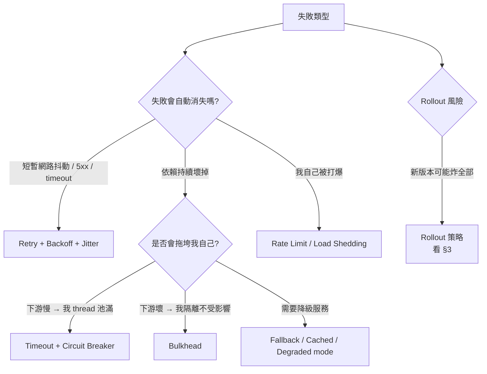
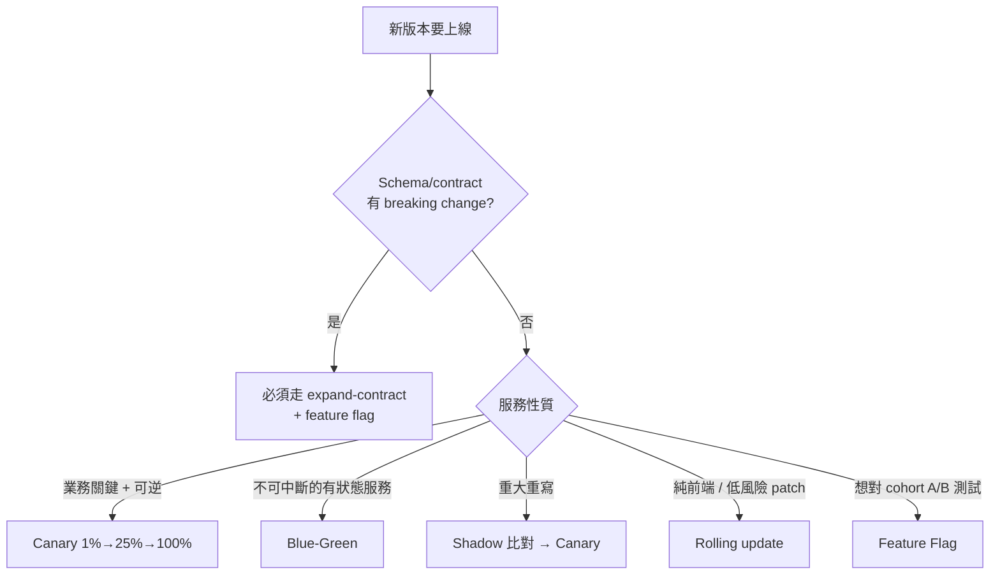

# 10 — Resilience Patterns

面對失敗的兩類決策參照：(a) **runtime failure 處理**（retry / circuit breaker / bulkhead / timeout / fallback），(b) **rollout failure 控管**（藍綠 / 金絲雀 / 紅黑 / shadow / feature flag）。devteam-arch 寫 NFR matrix + failure modes 時必讀，devteam-design 寫 module / event consumer 時必查，devteam-ops 寫 rollback plan + runbook 時必引。

對應 [[06_quality_attributes_catalog]] §1（Reliability、Availability、Operability）與 NIST SSDF RV。

---

## 1. Quick Picker — 我面對什麼失敗



| 場景 | 該用的 pattern | 段落 |
|:-----|:---------------|:-----|
| 對下游服務 / DB 呼叫 | Timeout（必）+ Retry（GET/idempotent only）+ Circuit Breaker（高頻呼叫） | §2.1 §2.2 §2.3 |
| Thread pool / connection pool 共用 | Bulkhead 隔離 | §2.4 |
| 非關鍵功能（推薦、排名） | Fallback：cache / 預設值 / 降級 | §2.5 |
| Public API 防爆 | Rate limit + Load shedding | §2.6 |
| 新版本上線 | Canary → 全量 / Blue-green / Feature flag | §3 |

---

## 2. Runtime Failure Patterns

### 2.1 Retry + Backoff + Jitter

| 場景 | 配置 |
|:-----|:-----|
| Idempotent GET / PUT / DELETE | 最多 3 次，exponential backoff（base 200ms, factor 2）+ full jitter |
| Non-idempotent POST（已用 Idempotency-Key） | 同上 |
| Non-idempotent POST（無 Idempotency-Key） | **禁止 retry**（critique 必標 blocker） |
| Event consumer | 視 broker：Kafka 用 retry topic + DLQ；SQS 用 visibility timeout |
| Migration / Backfill | 必須 idempotent + 可斷點續跑 + retry 不限次數 |

**Backoff 公式**（full jitter，AWS Builders' Library 推薦）：
```
sleep = random(0, min(cap, base * 2^attempt))
```
範例：base=200ms, cap=10s, attempt=0..5 → 第 N 次 sleep 範圍 [0, 200ms·2^N]，避免群體同步重試打爆下游（thundering herd）。

**Retry budget**（Google SRE 概念）：retry 量不應超過原請求量的 10%（否則代表系統處於失效狀態，應該 fail fast 而非加重下游負擔）。

### 2.2 Timeout（一切的基礎）

**規則**：所有外部呼叫**必須有 timeout**。沒寫 = 用 framework 預設 = 通常無限大 = 連鎖崩潰起點。

| 呼叫類型 | 建議 timeout |
|:---------|:--------------|
| 同 region 內服務間 | connect 100ms / read 1-3s |
| 跨 region 服務間 | connect 500ms / read 3-10s |
| DB query | 視 query 類型，OLTP < 1s、analytics < 30s |
| Cache（Redis） | 50-200ms |
| 外部第三方 API | 視 SLA，常 5-30s |
| Async job 內呼叫 | 可較寬鬆，但仍須有上限 |

**Cascading timeout 原則**：上游 timeout > 下游 timeout + retry 預算，否則下游剛重試完，上游已經放棄。

### 2.3 Circuit Breaker

```
CLOSED ──失敗率/數量超閾值──▶ OPEN ──冷卻時間 (e.g. 30s)──▶ HALF-OPEN
   ▲                                                          │
   └─────────── 連續 N 次成功 ──────────────────────────────────┘
                       │
                       └─ 任何失敗 ──▶ OPEN（重新冷卻）
```

| 參數 | 建議 | 註 |
|:-----|:-----|:---|
| 觸發閾值 | 連續 5 次失敗 **或** 50%/30s 滑動窗 | 高頻服務用率，低頻用次數 |
| OPEN 冷卻 | 30s 起跳，視下游恢復時間 | 太短會 thrash，太長使用者體感差 |
| HALF-OPEN 試探 | 連續 3 次成功才回 CLOSED | 避免抖動 |
| **必有 half-open 試探** | — | critique 必抓：永久 OPEN 等於沒設 CB |

**Anti-pattern**：CB 沒有 half-open（永久 OPEN 須人工重啟）、CB 觸發後不發 alert、CB OPEN 期間沒有 fallback（直接 5xx 給 client）。

### 2.4 Bulkhead

把資源池切隔（thread pool / connection pool / queue），讓一個下游壞不會拖死其他下游。

| 隔離方式 | 適用 |
|:---------|:-----|
| **Thread pool per dependency** | Hystrix 風格、Java 系統 |
| **Semaphore per dependency** | 輕量、無 thread 切換 cost |
| **Connection pool per DB** | 永遠分開，不共用 |
| **Container / Pod 隔離** | k8s namespace / deployment 切分流量 |

判準：是否有 ≥ 2 個下游共用一個資源池？有 → 任一壞就全壞 → 必須 bulkhead。

### 2.5 Fallback

| 情境 | Fallback 策略 |
|:-----|:--------------|
| 推薦 / 排名服務壞 | 回熱門商品清單 |
| 個人化 banner 壞 | 回預設 banner |
| Profile 服務壞 | 回 cache 的舊資料 + 標 stale |
| 翻譯服務壞 | 回原文 |
| Search 壞 | 回 popular keywords 列表 |
| 付款服務壞 | **不可 fallback**（業務關鍵），必須直接告知 client + retry |

**規則**：fallback 必須對使用者**明示降級**（UI 標「資料可能為舊」），不可悄悄回假資料。

### 2.6 Rate Limit + Load Shedding

| 機制 | 何時用 |
|:-----|:-------|
| **Token bucket / Leaky bucket** | 對外 API、防濫用 |
| **Per-user / Per-API-key 限速** | SaaS 多租戶 |
| **Adaptive load shedding** | 服務 CPU / latency 超閾值時主動 drop 低優先請求（priority queue） |
| **Backpressure** | 上游應感知下游容量，主動降速（gRPC / Reactor 系統） |

回 429 必附 `Retry-After`（見 [[08_api_design_catalog]] §3.1）。

---

## 3. Rollout Strategy

### 3.1 對比表

| 策略 | 流量切分 | 回滾時間 | 風險範圍 | 成本 | 何時用 |
|:-----|:---------|:---------|:---------|:-----|:-------|
| **Big-bang** | 100% → 100% | 重新部署舊版（分鐘級） | 全部使用者 | 低 | **不推薦**（除非極簡內部工具） |
| **Rolling update** | 漸進替換 instance（k8s 預設） | rolling back 同等時間 | 在替換中那段 | 低 | 內部工具、低風險 patch |
| **Blue-Green** | 0% / 100% 切換 | DNS / LB 切回（秒級） | 全使用者，但回滾快 | 中（雙倍資源） | 不可中斷的服務、需快速 rollback |
| **Canary** | 1% → 5% → 25% → 50% → 100%（每段觀察 metric） | 切回 0%（秒級） | 僅 canary 比例使用者 | 中 | **預設選擇**（多數正式服務） |
| **Shadow / Mirror** | 0% 對使用者，100% 流量複製比對 | N/A（本就 0% 對使用者） | 0 | 高（雙倍計算 + 比對成本） | 重大重寫、行為比對驗證 |
| **Feature Flag** | 程式內依旗標切換（per-user / per-cohort） | 旗標關閉（秒級，無需部署） | 開旗的 cohort | 低（一旦平台就緒） | A/B、漸進開放、emergency kill switch |

### 3.2 選擇樹



### 3.3 Canary 必備 evidence（Release Ready Gate 7）

- [ ] Canary 比例階梯（例：1% → 5% → 25% → 50% → 100%）
- [ ] 每階段觀察時間（例：30min）
- [ ] 觀察 metric（error rate / p99 latency / 業務 KPI）
- [ ] Halt 條件（error rate > baseline + 0.5% 就停）
- [ ] Auto rollback 觸發條件
- [ ] 手動 rollback 步驟 + 演練紀錄
- [ ] 是否與 schema migration 解耦（migration 必先於 canary）

### 3.4 Feature Flag 三大用法

| 用法 | 範例 | 移除節奏 |
|:-----|:-----|:---------|
| **Release toggle** | 新功能漸進開放 | 全量後 1-2 sprint 移除 |
| **Ops toggle / kill switch** | 緊急關掉昂貴功能（推薦演算法） | 長期保留 |
| **Experiment toggle** | A/B 測試 | 實驗結束移除 |
| **Permission toggle** | 付費 tier 區隔 | 長期保留（其實是業務邏輯） |

**規則**：Release toggle 必須有「移除截止日」寫進 ADR / DR，否則旗標永遠累積 → 程式碼變成 if-else 地獄。

### 3.5 Schema 變更的 expand-contract（rollout 與 migration 解耦）

不可一步完成的 schema breaking change：
```
Step 1 Expand:  加新欄位 / 新表 / 新事件版本（向下相容）
Step 2 Dual write: app 同寫新舊
Step 3 Backfill: 把舊資料補進新欄位
Step 4 Dual read: app 同讀並比對
Step 5 Cut over: 切到只讀新
Step 6 Contract: 移除舊欄位 / 舊表 / 舊事件版本
```

每步間隔至少 1 sprint，每步可獨立 rollback。

---

## 4. Recovery 量化 — RTO / RPO / MTTR

| 指標 | 定義 | 影響決策 |
|:-----|:-----|:---------|
| **RTO** (Recovery Time Objective) | 災難後多久回到服務 | DR 策略、backup 頻率 |
| **RPO** (Recovery Point Objective) | 災難後可接受丟失多少資料 | replication 模式 |
| **MTTR** (Mean Time To Recover) | 從事故到復原平均時間 | 自動化 rollback、runbook 覆蓋率 |
| **MTTD** (Mean Time To Detect) | 從事故發生到 alert 觸發 | 監控覆蓋率、SLI 設計 |
| **MTBF** (Mean Time Between Failures) | 失效間隔 | 容量規劃、預防性維護 |

### RTO / RPO 與技術選擇對應

| RTO / RPO 等級 | 技術 |
|:---------------|:-----|
| RTO 數天 / RPO 數小時 | nightly backup 即可 |
| RTO 數小時 / RPO 1h | hourly snapshot + WAL replay |
| RTO < 1h / RPO < 5min | async replication，failover playbook 演練 |
| RTO < 5min / RPO ~0 | sync replication，multi-AZ active-passive |
| RTO ~0 / RPO 0 | multi-region active-active（昂貴，僅金流 / 醫療等級） |

**規則**：RTO / RPO 是業務決策（成本 vs 風險），不是技術自選。NFR matrix 內必明示，缺 → arch persona 必標 blocker（Gate 4）。

---

## 5. By Role × Phase

| Driver | Phase | 必讀段落 |
|:-------|:------|:---------|
| **devteam-arch** | P2（NFR + ADR + failure modes） | §1 全文、§4 RTO/RPO、§3.1 rollout 對比 → 寫進 ADR Consequences |
| **devteam-arch** | P2（C4 L2/L3 內 failure modes） | §2.1-§2.6 → 為每個跨服務呼叫標 retry / timeout / CB 策略 |
| **devteam-design** | P3（OpenAPI / event consumer） | §2.1（哪些 endpoint 可 retry）、§2.2（timeout 寫進 x-governance） |
| **devteam-design** | P3（schema migration） | §3.5 expand-contract |
| **devteam-qa** | P4（chaos / NFR test） | §2.3 CB 行為測試、§3.3 canary halt 條件測試 |
| **devteam-ops** | P5（runbook + release readiness） | §3.3 canary evidence checklist、§4 RTO/RPO 對應 DR playbook |
| **devteam-ops** | P5（alert） | §2.3 CB OPEN 必發 alert、§2.6 429 spike 必發 alert |

---

## 6. Anti-patterns（critique 必抓）

- ❌ **Retry without timeout**（無限重試 → 連鎖崩潰）
- ❌ **Non-idempotent POST 自動 retry**（重複扣款 / 重複出貨）
- ❌ **Retry 沒 backoff + jitter**（thundering herd）
- ❌ **CB 沒 half-open**（永久 OPEN）
- ❌ **CB 觸發無 alert**（默默壞掉）
- ❌ **Fallback 悄悄回假資料**（使用者以為一切正常）
- ❌ **付款 / 金流走 fallback**（業務關鍵不可降級）
- ❌ **Big-bang 上線業務關鍵服務**
- ❌ **Canary 無 halt 條件**（觀察了寂寞）
- ❌ **Schema breaking change 直接 cut over，無 expand-contract**
- ❌ **Feature flag 無移除截止日**（旗標永遠累積）
- ❌ **沒寫 RTO / RPO，只寫「高可用」**
- ❌ **rollback 寫「kubectl rollout undo」就交差**（無 schema rollback、無資料修復）
- ❌ **Timeout 用 framework 預設**（通常等於沒設）
- ❌ **上游 timeout < 下游 timeout + retry 預算**（cascading 失效）

---

## 7. Cross-ref

- [[06_quality_attributes_catalog]] §1（Reliability / Availability / Operability）、§2（SLI/SLO）— 本檔 §4 RTO/RPO 對應 SLO 預算
- [[08_api_design_catalog]] §3.3（idempotency）— 本檔 §2.1 retry 前提
- [[08_api_design_catalog]] §3.1（429 / 503 + Retry-After）— 本檔 §2.6 rate limit 回傳格式
- [[09_observability_catalog]] §6（alert routing）— 本檔 §2.3 CB / §2.6 limit alert 對應
- [[07_diagram_picker]] §4.5（Deployment diagram）— rollout 策略多 region 用
- `templates/adr.md` — failure modes 與 rollout 策略寫進 Consequences
- `templates/runbook.md` — §2-§3 對應 rollback procedure + common incidents
- `templates/release-readiness.md` — §3.3 canary checklist 對應 readiness items
- 缺 RTO / RPO、CB 無 half-open、無 canary halt 條件 → **Gate 4 / Gate 7 阻擋**
