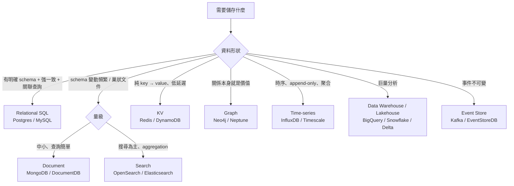
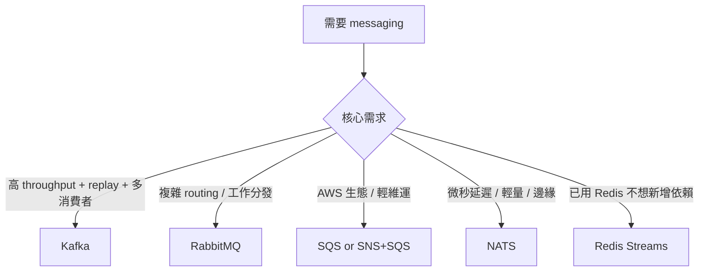

# 11 — Data Classification & Stack Picker

兩類「該選哪個」決策參照：(a) **資料分類與 PII 處理**（合規最低底線），(b) **技術棧選型**（DB / messaging / auth / cache）。devteam-analyst 標 integration / data sensitivity 時必查，devteam-arch 寫 ADR 選技術棧時必引，devteam-design 寫 ERD + data dictionary 時必引。

對應 [[06_quality_attributes_catalog]] §1 Security/Privacy/Auditability、NIST SSDF PS/PW、GDPR、台灣個資法。

---

## Part A — Data Classification & PII

## 1. 四級分類定義

| 等級 | 定義 | 範例 | 處置最低要求 |
|:-----|:-----|:-----|:--------------|
| **Public** | 對外公開、無存取限制 | 商品型錄、blog 文章、公司地址 | 無 |
| **Internal** | 員工內部使用，外洩不致重大損失 | 內部 wiki、財報草稿、產品 roadmap | RBAC、員工帳號可存取 |
| **Confidential** | 外洩會造成商業 / 法務損失 | 客戶清單、合約價、業務策略、源碼 | RBAC + 加密儲存 + 存取 audit log |
| **Restricted** | 外洩會違反法規 / 重大個資外洩 | PII、信用卡、健康紀錄、密碼 | RBAC + at-rest + in-transit 加密 + 存取 audit + retention + 跨境傳輸限制 |

**規則**：欄位等級**取系統內最高等級**。一張表有任何 Restricted 欄位 → 整張表需要 Restricted 級保護。

---

## 2. PII 三類識別矩陣

| 類型 | 定義 | 範例 | 處置 |
|:-----|:-----|:-----|:-----|
| **Identifier**（直接識別） | 單一欄位即可識別個人 | 姓名、身分證、手機、email、地址 | 必加密 + 必 audit + 視合規需可刪除（GDPR right to erasure） |
| **Quasi-identifier**（準識別） | 單一欄位不識別，**組合**可識別 | 性別 + 生日 + 郵遞區號（87% 可識別美國人）、IP + UA、device fingerprint | k-anonymity（同組至少 k 人）/ 聚合呈現 |
| **Sensitive**（敏感） | 揭露會造成歧視 / 傷害 | 健康、宗教、政治、性傾向、犯罪紀錄、生物特徵、未成年資料 | Restricted 級 + 額外法規（HIPAA / 個資法特種個資） |

**Quasi-identifier 警示**：以為「我沒存身分證所以不是 PII」是錯的。一張匿名表只要含「生日 + 性別 + 郵遞區號」就已是準識別資料，須 k-anonymity 處理或視為 PII。

---

## 3. GDPR + 台灣個資法欄位標示

### 3.1 ERD column 必標欄位

於 ERD `templates/erd.md` data dictionary 內每個欄位標：

```
| column | type | classification | pii_type | retention | consent_required | jurisdictions | notes |
|--------|------|----------------|----------|-----------|------------------|---------------|-------|
| email  | str  | restricted     | identifier | 帳號刪除後 30 天 | yes | EU,TW | GDPR right to erasure |
| dob    | date | restricted     | quasi-identifier | 帳號刪除後 30 天 | yes | EU,TW | |
| health | str  | restricted     | sensitive | 法定保存 7 年 | yes (explicit) | TW | 個資法特種個資 |
```

### 3.2 必達合規要點

| 法規 | 要點 | 對應實作 |
|:-----|:-----|:---------|
| **GDPR Art. 5** | 目的限制、最小化 | 收集前明示目的，不收非必要欄位 |
| **GDPR Art. 7** | 同意可撤回 | consent 紀錄 + revoke API |
| **GDPR Art. 15** | 存取權 | 使用者可下載自己資料 |
| **GDPR Art. 17** | 被遺忘權 | 軟刪 + 期限後硬刪 + 備份內也須清 |
| **GDPR Art. 20** | 可攜權 | 匯出機器可讀格式（JSON / CSV） |
| **GDPR Art. 25** | Privacy by design | ADR 必含 privacy 影響評估 |
| **GDPR Art. 32** | 安全措施 | 加密、access control、incident response |
| **GDPR Art. 33** | 72 小時內通報外洩 | runbook 必含 incident 通報流程 |
| **GDPR Art. 44-49** | 跨境傳輸 | 標 `jurisdictions`，跨境必有 SCC / 適足性決定 |
| **個資法第 6 條** | 特種個資（醫療、基因、性生活、健康檢查、犯罪、社會活動） | 額外同意 + 嚴格限制使用目的 |
| **個資法第 8 條** | 蒐集告知義務 | 表單上明示蒐集者、目的、利用期間/地區/方式 |
| **個資法第 11 條** | 正確性、必要性 | 期限後刪除或停止處理 |
| **個資法第 27 條** | 安全維護 | 對應 GDPR Art. 32 |

### 3.3 Retention 標示格式

| 樣式 | 範例 |
|:-----|:-----|
| 絕對期限 | `90 days from creation` |
| 觸發條件 | `30 days after account deletion` |
| 法定保存 | `statutory: 7 years (商業會計法)` |
| 永久 | `permanent`（極少數，須 ADR 證明合理） |

每個 PII 欄位**必須有 retention 標示**。缺 → DBA persona 必標 blocker。

---

## Part B — Stack Picker

## 4. Database 選型

### 4.1 決策樹



### 4.2 對比表

| 類型 | 強項 | 弱項 | 何時選 |
|:-----|:-----|:-----|:-------|
| **Relational（Postgres）** | ACID、JOIN、成熟、Postgres 已能做 JSON/搜尋/PostGIS | 水平擴展需 sharding 工夫 | **預設選擇**（80% 場景） |
| **Document（MongoDB）** | schema 彈性、巢狀文件查詢 | 弱一致（已改善但仍弱於 SQL）、容易濫用無 schema | 真正 schemaless 的內容、CMS |
| **Search（Elasticsearch）** | 全文搜尋、aggregation 強 | 不是 source of truth、reindex 昂貴 | 商品搜尋、log 搜尋（次選） |
| **KV（Redis）** | 微秒級延遲、原生 pub/sub / stream | 容量受 RAM 限制（Redis）、無複雜查詢 | cache、session、rate limit |
| **KV（DynamoDB）** | 全管、無上限、ms 延遲 | query 模式須先設計（PK/SK） | mobile backend、IoT |
| **Graph** | 多 hop 關聯查詢 | 學習曲線、小 case 殺雞用牛刀 | 社交圖、推薦、權限拓樸、詐欺 |
| **Time-series** | 寫入優化、時間聚合、retention 自動 | 不適合事務 | metric、IoT、log |
| **Data Warehouse** | OLAP、PB 級分析 | 不適合 OLTP（延遲秒-分鐘） | BI、報表、ML feature store |
| **Event Store** | append-only、event sourcing | 需配 read model、複雜 | CQRS / 強 audit 需求 |

**Anti-pattern**：用 SQL 做時序資料（IOPS 炸）、用 Mongo 做需要強一致的金流、用 Redis 當 source of truth（重啟資料消失）、用 KV 模擬 RDBMS（多次 round trip）。

---

## 5. Messaging / Event 選型

### 5.1 對比表

| 系統 | 模式 | 順序保證 | 持久化 | 延遲 | 何時選 |
|:-----|:-----|:---------|:-------|:-----|:-------|
| **Kafka** | pub/sub + log | partition 內保證 | 預設長期 | ms | 高 throughput、event sourcing、stream processing |
| **RabbitMQ** | queue + pub/sub | queue 內保證 | 可選 | ms | 任務 queue、複雜 routing（exchange / binding） |
| **AWS SQS** | queue | FIFO 模式有保證 | 預設 4 天 | ms | 簡單任務 queue、無維運成本 |
| **AWS SNS + SQS** | pub/sub → queue | 透過 SQS | 同上 | ms | AWS 生態的事件廣播 |
| **NATS** | pub/sub + queue + KV | 視模式 | JetStream 持久化 | μs-ms | 輕量、邊緣、IoT |
| **Google Pub/Sub** | pub/sub | 可選 ordered key | 7 天 | ms | GCP 生態 |
| **Redis Streams** | log-like | 順序保證 | 可選持久化 | μs | 輕量場景，已用 Redis |

### 5.2 選擇樹



**選擇前必問**：
- 是 queue（一個 message 一個 consumer 處理）還是 pub/sub（多 consumer）？
- 需要嚴格順序嗎？跨 partition 就不保證
- 失敗怎辦？DLQ（dead letter queue）規劃了沒？
- replay 能力？（事故後重放歷史 event）

---

## 6. Auth / AuthZ 選型

### 6.1 對比表

| 機制 | 用途 | 何時選 |
|:-----|:-----|:-------|
| **OAuth 2.0 + OIDC** | 第三方登入、SSO、delegated authorization | 對外 user-facing、跨組織整合 |
| **JWT（access token）** | stateless API auth | 微服務間、短期 token；**勿當 session** |
| **Refresh Token** | 換新 access token | 配合 JWT |
| **API Key** | 程式對程式、長期、低變更 | server-to-server B2B、internal tooling |
| **mTLS** | 雙向 TLS 憑證認證 | 內網服務間、零信任 |
| **Session cookie**（server-side） | 傳統 web session | 同源 web app，需可立即撤銷 |
| **Session cookie + SameSite + CSRF token** | — | web 必加防護 |
| **SAML 2.0** | 企業 SSO（舊但仍主流） | enterprise B2B、HRIS / IdP |
| **HMAC signed request** | webhook 驗簽 | 對外 webhook |
| **Magic link / OTP** | passwordless | mobile、低頻登入 |
| **WebAuthn / Passkey** | 無密碼、強驗證 | 高安全需求、現代瀏覽器 |

### 6.2 場景對應

| 場景 | 推薦組合 |
|:-----|:---------|
| Web app（B2C） | OAuth/OIDC for social + session cookie + CSRF |
| Web app（B2B / enterprise） | SAML or OIDC + session cookie |
| Public API（B2B 開發者） | OAuth 2.0 client credentials or API Key |
| Mobile app | OIDC + PKCE → access token + refresh token |
| 微服務間 | mTLS or service mesh（Istio / Linkerd） |
| Webhook 接收 | HMAC signed + replay protection（timestamp + nonce） |
| Admin / 高權限操作 | base auth + Step-up MFA |

**Anti-pattern**：
- ❌ JWT 當 session（不可立即撤銷）；要撤銷得另加 denylist，那就失去 stateless 意義
- ❌ JWT 放在 localStorage（XSS 可偷）；要嘛 httpOnly cookie，要嘛 in-memory
- ❌ API key hardcode 在 mobile app（會被反編譯撈出）
- ❌ 沒有 MFA 卻保護高敏資料
- ❌ Refresh token 不 rotate（一次外洩永久淪陷）
- ❌ OAuth 沒用 state + PKCE（CSRF + intercept 風險）
- ❌ webhook 沒驗簽就信任 payload

---

## 7. Cache 選型

| 層 | 何時 |
|:---|:-----|
| **In-process cache（LRU）** | 高頻 / 低變動 / 容忍多實例不同步（如：feature flag 短 TTL） |
| **Distributed cache（Redis / Memcached）** | 跨實例共享、session、rate limit token |
| **CDN edge cache** | 靜態資源、可被緩存的 GET API（含 cache-control header） |
| **DB query cache / materialized view** | 重複的昂貴查詢 |
| **HTTP cache（Cache-Control / ETag）** | 任何冪等 GET |

**失效策略**：
- TTL（time-to-live）：簡單但可能 stale
- Write-through：寫時同寫 cache，一致性好但寫慢
- Write-back：寫 cache 後 async 寫 DB，快但有資料遺失風險
- Cache aside（lazy）：讀時 miss 才填，最常見

---

## 8. By Role × Phase

| Driver | Phase | 必讀段落 |
|:-------|:------|:---------|
| **devteam-analyst** | P1（integration inventory + business rules） | §1-§3（每個資料欄位需標分類） |
| **devteam-arch** | P2（ADR 技術棧選型） | §4-§7 對比表 + 選擇樹 |
| **devteam-arch** | P2（NFR Security / Privacy 欄） | §1-§3（合規對應） |
| **devteam-design** | P3（ERD + data dictionary） | §1-§3.1（必標欄位） |
| **devteam-design** | P3（API auth design） | §6（auth 機制） |
| **devteam-qa** | P4（security test） | §3.2（GDPR / 個資法測項） |
| **devteam-ops** | P5（runbook / incident） | §3.2 Art. 33 通報流程、§6 token revoke 流程 |

---

## 9. Anti-patterns（critique 必抓）

**Data**：
- ❌ 收集前沒明示目的（GDPR Art. 5 違反）
- ❌ PII 欄位無 retention 標示
- ❌ 「我只存生日 + 性別 + zip 不算 PII」（忽略 quasi-identifier）
- ❌ 軟刪後備份仍含 PII 永久保留
- ❌ 跨境傳輸沒標 `jurisdictions` 也沒 SCC
- ❌ Sensitive（健康 / 性傾向）混在 Confidential 級保護
- ❌ 同意紀錄沒版本（使用者「我何時同意過什麼版本的條款」答不出）

**Stack**：
- ❌ 選 Mongo 卻需要跨集合 transaction
- ❌ 用 SQL 跑 100M+ 時序資料（IOPS 炸）
- ❌ 用 Redis 當 source of truth
- ❌ Kafka 跨 partition 期待順序
- ❌ JWT 當 session 又要可撤銷
- ❌ API key hardcode 在 mobile app
- ❌ Webhook 不驗簽
- ❌ 選技術棧無 ADR（無法追溯 trade-off）

---

## 10. Cross-ref

- [[06_quality_attributes_catalog]] §1 Security/Privacy/Auditability — 本檔 §1-§3
- [[08_api_design_catalog]] §3.2 error code SYS-/AUTH- — 本檔 §6 auth fail 對應
- [[09_observability_catalog]] §2.3 PII in log — 本檔 §2 quasi-identifier 影響
- [[10_resilience_patterns]] §4 RTO/RPO — 本檔 §4 DB 選型影響 replication 策略
- `templates/erd.md` — 套用本檔 §3.1 column metadata
- `templates/adr.md` — 技術棧選型必寫 ADR，參本檔 §4-§7
- 缺 retention / classification / jurisdictions 標示、技術棧選型無 ADR → **Gate 4 / Gate 5b 阻擋**
