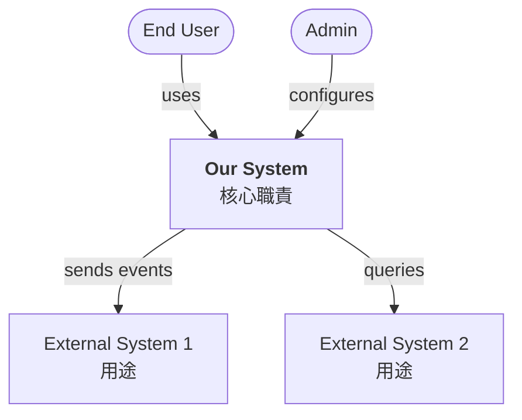

# C4 Level 1 — System Context — <Feature Name>

> **Owner**: devteam-arch
> **Status**: draft | reviewed | frozen | superseded
> **Version**: v<n>
> **Last updated**: <YYYY-MM-DD>
> **Related**: docs/prd/<feature>.md, docs/analysis/system-spec-<feature>.md

---

## Purpose

呈現「我們的系統」與「外部 actor / 系統」的高層關係。一張圖看完整 system boundary。

---

## Context Diagram

---

## Actors

| Actor | 描述 | 主要互動 |
|:------|:-----|:---------|
| End User | <persona> | uses OurSystem |
| Admin | <persona> | configures OurSystem |

## External Systems

| System | Owner | 互動方向 | Protocol | SLA dependency |
|:-------|:------|:---------|:---------|:---------------|
| Stripe | external | outbound | REST | 99.95% |
| ... | ... | ... | ... | ... |

---

## System Responsibility（一句話）

> Our System 負責 <what>，不負責 <what not>。

## 邊界澄清

- ✅ In scope: ...
- ❌ Out of scope: ...（引用 PRD）

---

## Downstream Consumers
- docs/architecture/c4-l2-<feature>.md
- 所有 driver skill 都會引用此圖以對齊 system boundary
