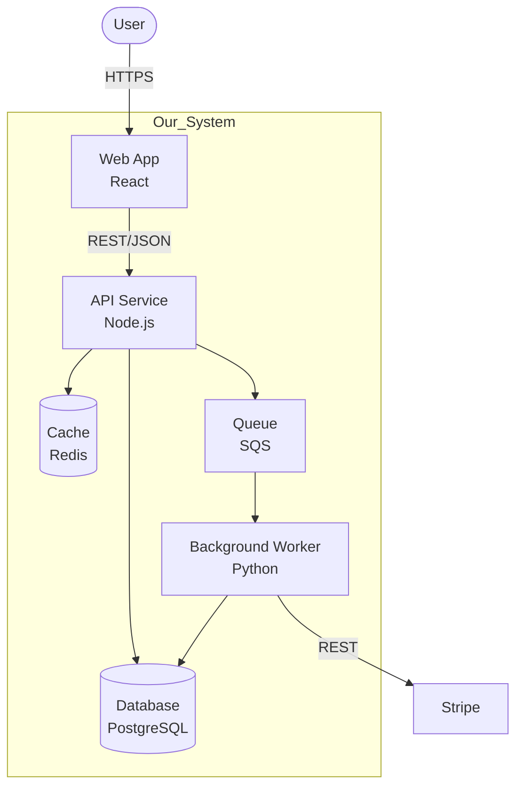

# C4 Level 2 — Containers — <Feature Name>

> **Owner**: devteam-arch
> **Status**: draft | reviewed | frozen | superseded
> **Version**: v<n>
> **Last updated**: <YYYY-MM-DD>
> **Related**: docs/architecture/c4-l1-<feature>.md

---

## Purpose

呈現「Our System」內部的 deployable / runtime 單元（containers），以及它們之間的協作。

---

## Container Diagram

---

## Containers

| Container | Tech | Responsibility | Owner |
|:----------|:-----|:---------------|:------|
| Web App | React 19 + Vite | UI, client-side routing | FE team |
| API Service | Node.js + Fastify | REST API, business logic | BE team |
| Background Worker | Python + Celery | async jobs, integration | BE team |
| Database | PostgreSQL 15 | primary data store | DBA |
| Cache | Redis 7 | session + hot data | BE team |
| Queue | AWS SQS | event-driven jobs | platform |

---

## Inter-Container Communication

| From | To | Protocol | Sync/Async | Idempotency | Failure handling |
|:-----|:---|:---------|:-----------|:------------|:-----------------|
| Web | API | HTTPS / JSON | sync | n/a | retry on 5xx |
| API | DB | TCP / SQL | sync | n/a | connection pool |
| API | Queue | AWS API | async | message dedup id | DLQ |
| Worker | Ext | HTTPS | sync | idempotency key | retry + backoff |

---

## Deployment Topology

| Environment | Region | HA | Notes |
|:------------|:-------|:---|:------|
| dev | us-east-1 | single AZ | shared |
| staging | us-east-1 | single AZ | per-PR previews |
| production | us-east-1 + us-west-2 | multi-AZ | active-passive |

---

## Trust Boundaries

- **Public boundary**: Web ↔ Internet（CDN + WAF）
- **Internal boundary**: API ↔ DB / Cache（VPC private subnet）
- **External boundary**: Worker ↔ Stripe（mTLS）

---

## Downstream Consumers
- docs/architecture/c4-l3-<feature>.md（若需要 component 細節）
- docs/api/openapi-<service>.yaml（每個 container 對應 API spec）
- docs/architecture/adr/*.md（technology choice 的 ADR）
- docs/ops/runbook-<service>.md（每個 container 對應 runbook）
