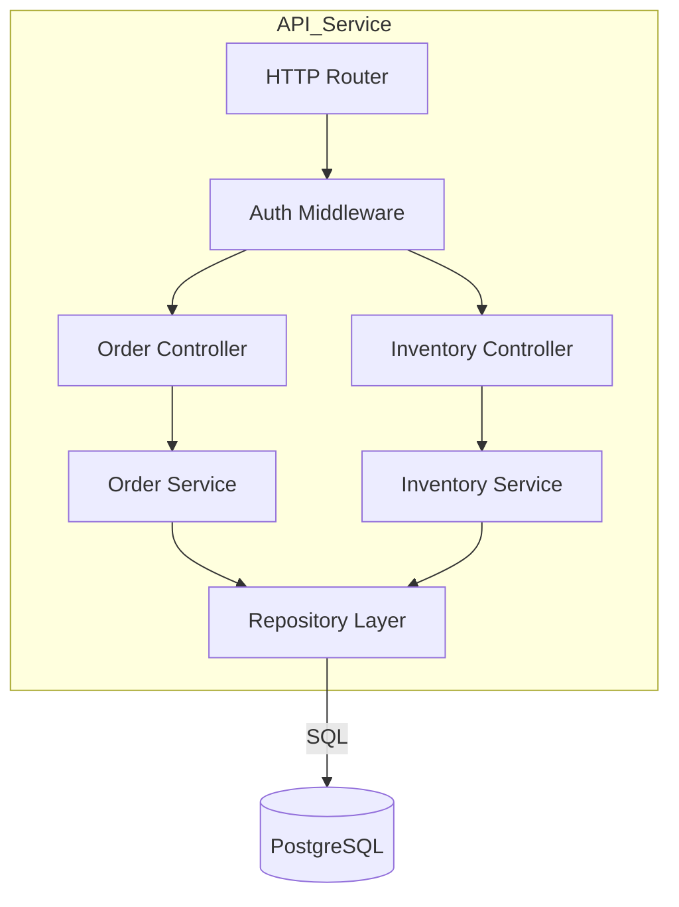

# C4 Level 3 — Components — {Container Name}

> **📋 Status**: draft | reviewed | frozen | superseded
> **🗓 Last updated**: YYYY-MM-DD
> **👤 Owner**: `devteam-arch` (with `devteam-design` for module-level)
> **🔖 Version**: v{n}
> **🎯 Container**: {which container from L2}
> **🔗 Related**: [`docs/architecture/c4-l2-{feature}.md`](./c4-l2-{feature}.md)

---

## 📋 Executive Summary

> [!TIP]
> **TL;DR (30s)**: Component view of **{container}**. **{N} components**, **{M} interfaces**. Pattern: {layered / hexagonal / pipes-filters / etc}.

| 維度 | 摘要 |
|:---|:---|
| **🎯 Container** | {name} |
| **🧩 Components** | {N} |
| **🔌 Interfaces** | {M} (internal + external) |
| **🏗 Pattern** | {architectural pattern} |
| **🚀 狀態** | {emoji} {status} |

> [!NOTE]
> **L3 只在複雜 container 才需要**。簡單 container（CRUD service / single-purpose worker）在 L2 已清楚，不必下到 L3。

---

## 🎯 Purpose

呈現某個 container 內部的主要 components。**只有複雜 container 才需要 L3**（簡單 container 在 L2 就清楚）。

---

## Component Diagram

---

## Components

| Component | Responsibility | Depends on | Exposes |
|:----------|:---------------|:-----------|:--------|
| HTTP Router | route dispatch | — | URL endpoints |
| Auth Middleware | JWT validation, RBAC | identity provider | request context |
| Order Controller | request/response mapping | OrderService | REST endpoints |
| Order Service | business logic | Repository, InventoryService | domain operations |
| Repository | data access | DB | CRUD methods |

---

## Failure Modes

| Failure | Detection | Recovery |
|:--------|:----------|:---------|
| DB connection lost | Repository timeout | retry with backoff, fail over to read replica |
| Auth provider down | Middleware timeout | cache valid tokens 60s, degrade to read-only |
| ... | ... | ... |

---

## Downstream Consumers
- 對應的 module design / API spec
- Test plan 的 integration cases
