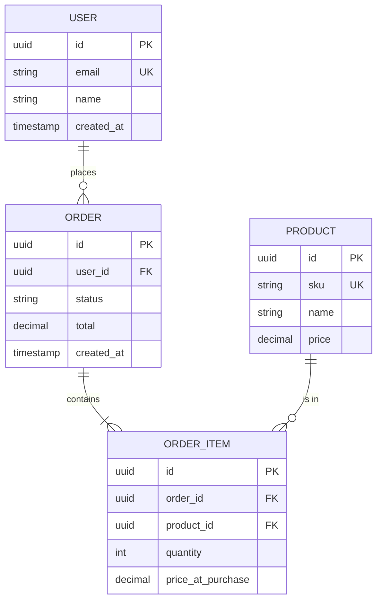

# ERD & Data Design — <Feature Name>

> **Owner**: devteam-design (DBA persona)
> **Status**: draft | reviewed | frozen | superseded
> **Version**: v<n>
> **Last updated**: <YYYY-MM-DD>
> **Related**: docs/analysis/system-spec-<feature>.md, docs/architecture/adr/ADR-*.md

---

## Logical Model



---

## Data Dictionary

<!-- HINT: 每欄位的 PII 分類套 KB 11 §1（4 級 public/internal/confidential/restricted）+ §2（identifier/quasi-identifier/sensitive）；Retention 標示套 KB 11 §3.3；缺 retention / classification / jurisdictions → DBA persona 必標 blocker。 -->

### Table: `users`

| Column | Type | Constraints | Index | Classification | PII type | Retention | Consent | Jurisdictions | Notes |
|:-------|:-----|:------------|:------|:---------------|:---------|:----------|:--------|:--------------|:------|
| id | UUID | PK, default gen_random_uuid() | PK | ✗ | indefinite | |
| email | VARCHAR(320) | UNIQUE, NOT NULL | unique idx | **PII (Identifier)** | indefinite while active; 30d after deletion | GDPR Article 17 |
| name | VARCHAR(200) | NOT NULL | — | **PII** | same as above | |
| password_hash | VARCHAR(255) | NOT NULL | — | **Sensitive** | indefinite while active | bcrypt cost 12+ |
| created_at | TIMESTAMPTZ | NOT NULL, default now() | — | ✗ | indefinite | |
| deleted_at | TIMESTAMPTZ | nullable | partial idx (where not null) | ✗ | indefinite | soft delete |

### Table: `orders`

| Column | Type | Constraints | Index | PII | Retention | Notes |
|:-------|:-----|:------------|:------|:----|:----------|:------|
| id | UUID | PK | PK | ✗ | 7 years (tax) | |
| user_id | UUID | FK → users.id, NOT NULL | idx | ✗ | 7 years | |
| status | VARCHAR(32) | NOT NULL, CHECK in (...) | idx | ✗ | 7 years | state machine |
| total | NUMERIC(12,2) | NOT NULL, CHECK > 0 | — | ✗ | 7 years | money column |
| created_at | TIMESTAMPTZ | NOT NULL, default now() | idx | ✗ | 7 years | |

---

## Migration Plan

<!-- HINT: Schema breaking change (drop column / rename / change type) 必走 KB 10 §3.5 expand-contract 6 步：Expand → Dual write → Backfill → Dual read → Cut over → Contract；每步可獨立 rollback。不可一步完成。 -->

### Migration: <id> — <description>

**Up:**
```sql
BEGIN;

CREATE TABLE IF NOT EXISTS orders (
  id UUID PRIMARY KEY DEFAULT gen_random_uuid(),
  user_id UUID NOT NULL REFERENCES users(id),
  status VARCHAR(32) NOT NULL CHECK (status IN ('pending', 'paid', 'shipped', 'cancelled')),
  total NUMERIC(12,2) NOT NULL CHECK (total > 0),
  created_at TIMESTAMPTZ NOT NULL DEFAULT now()
);

CREATE INDEX idx_orders_user_id ON orders(user_id);
CREATE INDEX idx_orders_status ON orders(status);
CREATE INDEX idx_orders_created_at ON orders(created_at DESC);

COMMIT;
```

**Down (rollback):**
```sql
BEGIN;
DROP TABLE IF EXISTS orders;
COMMIT;
```

**Backfill** (若需要):
```sql
-- 從舊表 / 外部來源回填
-- 必須是 idempotent，可分批，不阻塞線上流量
```

---

## Migration Rehearsal Checklist

- [ ] 在 staging 跑過完整 up + down
- [ ] 估算 production 執行時間（用相近資料量試）
- [ ] 確認沒有 long-running lock（必要時用 `CREATE INDEX CONCURRENTLY`）
- [ ] Backfill 可中斷續跑
- [ ] Application code 必須先支援新舊 schema 並存（forward compatible）

---

## Indexing Strategy

| Query pattern | Index | Selectivity | Notes |
|:--------------|:------|:------------|:------|
| WHERE user_id = ? | idx_orders_user_id | high | 主要 access pattern |
| WHERE status = 'pending' | idx_orders_status | medium | dashboard query |
| ORDER BY created_at DESC | idx_orders_created_at | — | 列表分頁 |

避免過度索引（每個 index 拖慢 write）。

---

## PII / Compliance Map

<!-- HINT: 合規對應表套 KB 11 §3.2（GDPR Art. 5/7/15/17/20/25/32/33/44-49 + 個資法第 6/8/11/27 條）。特種個資（健康 / 性傾向 / 犯罪 / 生物特徵）必標 Sensitive。跨境傳輸必標 jurisdictions + SCC 文件連結。 -->

| Table.column | Classification | Regulation | Jurisdictions | Action on deletion request |
|:-------------|:---------------|:-----------|:--------------|:---------------------------|
| users.email | PII Identifier | GDPR, 個資法 | hard delete after 30d |
| users.name | PII | GDPR | same as above |
| users.password_hash | Sensitive | PCI-adjacent | hard delete immediately |
| orders.* | financial | tax law | retain 7 years even after user deletion → anonymize user_id |

---

## Backup & Retention

- **Full backup**: daily, retained 30 days
- **PITR**: 7 days
- **Cross-region replica**: yes (us-west-2)

---

## Downstream Consumers
- docs/architecture/adr/*.md（若有 schema decision）
- docs/api/openapi-<service>.yaml（DTO 對應）
- docs/ops/runbook-<service>.md（backup / restore SOP）
- docs/qa/test-plan-<release>.md（資料測試策略）
