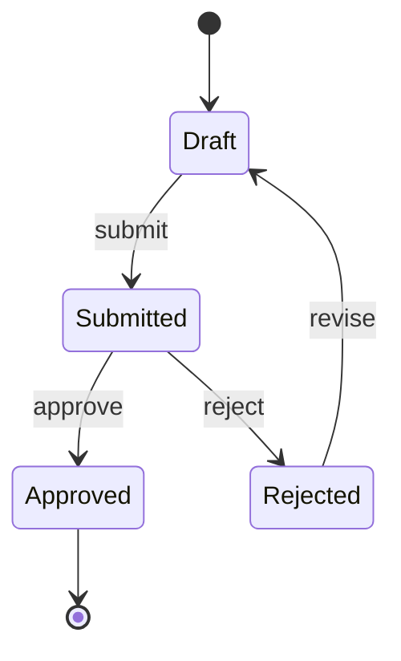

# System Spec — {Feature Name}

> **📋 Status**: draft | reviewed | frozen | superseded
> **🗓 Last updated**: YYYY-MM-DD
> **👤 Owner**: `devteam-analyst` (SA persona)
> **🔖 Version**: v{n}
> **🔗 Related PRD**: [`docs/prd/{feature}.md`](../../docs/prd/{feature}.md)
> **🔗 Related UX**: [`docs/ux/user-flow-{feature}.md`](../../docs/ux/user-flow-{feature}.md)
> **🔗 Related ADR/DR**: ADR-NNN · DR-NNN

---

## 📋 Executive Summary

> [!TIP]
> **TL;DR (30s)**: {一句話講完系統範圍 — N use cases、M actors、K events、最大整合風險。}

| 維度 | 摘要 |
|:---|:---|
| **🎯 範圍** | {N} use cases, {M} actors, {K} events |
| **🔌 主要整合** | {top 1-3 external systems} |
| **⚠️ 最高風險** | {1-line description of biggest risk} |
| **🚀 狀態** | {emoji} {status} |
| **🎯 下一步** | {next concrete action — e.g., Gate 3 freeze} |

---

## 👥 Actors

| Actor | Type | 描述 | 觸發頻率 |
|:---|:---|:---|:---|
| {name} | 👤 human · 🤖 system · ⏰ time | {description} | {e.g., per session / hourly} |

---

## 📋 Use Cases

### UC-001: {name}

| 欄位 | 內容 |
|:---|:---|
| **Actor** | {actor} |
| **Trigger** | {event} |
| **Pre-conditions** | {state required} |
| **Post-conditions** | {state after} |
| **Source** | PRD FR-001 |
| **Verification** | test (E2E) |

**Main flow**:
1. ...
2. ...

**Alternative flows**:
- A1: {branch + steps}

**Exception flows**:
- E1: {error + handling}

**Acceptance Criteria** (Given/When/Then):
- **Given** {state}
- **When** {action}
- **Then** {result}

### UC-002: ...

---

## 📐 Business Rules Catalog

| Rule ID | Description | Source | Priority | Exception | Owner |
|:---|:---|:---|:---:|:---|:---|
| BR-001 | {rule statement} | {stakeholder / regulation} | M / S / C | {when does not apply} | BA |

> [!IMPORTANT]
> **禁忌**：規則只在群組長口頭存在 → 升格 blocker。所有 BR 必須有 source（PRD section / regulation / stakeholder doc）。

---

## 🔄 State Model

> [!NOTE]
> 選圖前先讀 [[07_diagram_picker]] §2.1：「現在處於什麼狀態」→ state machine；「誰對誰做什麼」→ sequence；「接下來做什麼」→ activity。State machine 必標 `[*]` 終結態（[[07_diagram_picker]] §5 anti-pattern）。

| State | Allowed transitions | Conditions |
|:---|:---|:---|
| Draft | Submitted | 必填欄位齊 |
| Submitted | Approved · Rejected | 簽核者已指派 |
| ... | ... | ... |

---

## 📡 Events（系統事件目錄）

> [!NOTE]
> Event 命名 + payload schema 套 [[08_api_design_catalog]] §2.4（`domain.entity.action.v1` 過去式）與 §6.3 envelope（必含 `event_id` / `occurred_at` / `trace_id`）。

| Event | Producer | Consumer | Payload schema | Catalog ref |
|:---|:---|:---|:---|:---|
| `orders.order.created.v1` | Order service | Inventory, Email | envelope per [[08_api_design_catalog]] §6.3 | §2.4 |
| ... | ... | ... | ... | ... |

---

## 🔌 Integration Inventory

> [!NOTE]
> Protocol 選擇參 [[08_api_design_catalog]] §1（REST/GraphQL/gRPC/event/WebSocket 決策樹）；Auth 選擇參 [[11_data_and_stack_catalog]] §6.2；Failure handling 套 [[10_resilience_patterns]] §1 quick picker（retry / CB / timeout / fallback）。

| External System | Direction | Protocol | Auth | Failure handling | Data classification |
|:---|:---|:---|:---|:---|:---|
| Stripe | outbound | REST | Bearer | retry + idempotency key | 🔴 Restricted (payment) |
| ... | ... | ... | ... | ... | ... |

---

## 🎯 Functional Boundary

### ✅ In Scope
- ...

### ❌ Out of Scope

> [!WARNING]
> Out of Scope 必須引用 PRD scope，不可在此擴張範圍。如需擴張寫 DR。

- ... (引用 PRD scope)

---

## ⚠️ Assumptions & Open Questions

| ID | Type | Statement | Owner | Due |
|:---|:---|:---|:---|:---|
| A-1 | Assumption | {假設} | analyst | — |
| OQ-1 | Open Question | {question} | 業主 | YYYY-MM-DD |

---

## 🔗 Downstream Consumers

| Doc | 用途 |
|:---|:---|
| [`docs/architecture/c4-{feature}.md`](../../docs/architecture/c4-{feature}.md) | C4 architecture diagram |
| [`docs/architecture/adr/ADR-*.md`](../../docs/architecture/adr/) | Architecture decisions |
| [`docs/api/openapi-{service}.yaml`](../../docs/api/openapi-{service}.yaml) | API contract |
| [`docs/data/erd-{feature}.md`](../../docs/data/erd-{feature}.md) | Data model |
| [`docs/qa/test-plan-{release}.md`](../../docs/qa/test-plan-{release}.md) | Test plan |

---

## ✍️ Sign-off

- [ ] **SA / Analyst** (owner): ____________ / Date: ____________
- [ ] **BA**: ____________ / Date: ____________
- [ ] **Review verdict** (from `reviews/Gate3_SystemSpec-{feature}-{date}.md`): ✅ ready / ⚠️ revise / ❌ blocked

---

**End of System Spec**

> 給業主：你主要看 **📋 Executive Summary** + **📐 Business Rules** + **⚠️ Open Questions** 三段。Use cases / Events / Integration 是給下游 phase 用。
