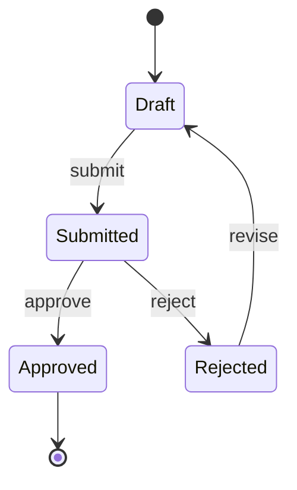

# System Spec — <Feature Name>

> **Owner**: devteam-analyst (SA persona)
> **Status**: draft | reviewed | frozen | superseded
> **Version**: v<n>
> **Last updated**: <YYYY-MM-DD>
> **Related PRD**: docs/prd/<feature>.md
> **Related UX**: docs/ux/user-flow-<feature>.md
> **Related ADR/DR**: <list>

---

## Actors

| Actor | Type | 描述 |
|:------|:-----|:-----|
| <name> | human / system / time | ... |

## Use Cases

### UC-001: <name>

- **Actor**: <actor>
- **Trigger**: <event>
- **Pre-conditions**: <state required>
- **Main flow**:
  1. ...
  2. ...
- **Alternative flows**:
  - A1: <branch + steps>
- **Exception flows**:
  - E1: <error + handling>
- **Post-conditions**: <state after>
- **Acceptance Criteria** (Given/When/Then):
  - Given <state>
  - When <action>
  - Then <result>
- **Source**: PRD FR-001
- **Verification method**: test (E2E)

### UC-002: ...

---

## Business Rules Catalog

| Rule ID | Description | Source | Priority | Exception | Owner |
|:--------|:------------|:-------|:---------|:----------|:------|
| BR-001 | <rule statement> | <stakeholder / regulation> | M / S / C | <when does not apply> | BA |

**禁忌**：規則只在群組長口頭存在 → 升格 blocker。

---

## State Model（若適用）

| State | Allowed transitions | Conditions |
|:------|:--------------------|:-----------|
| Draft | Submitted | 必填欄位齊 |
| ... | ... | ... |

---

## Events（系統事件目錄）

| Event | Producer | Consumer | Payload schema |
|:------|:---------|:---------|:---------------|
| `order.created` | Order service | Inventory, Email | { order_id, items, ... } |

---

## Integration Inventory

| External System | Direction | Protocol | Auth | Failure handling |
|:----------------|:----------|:---------|:-----|:-----------------|
| Stripe | outbound | REST | Bearer | retry + idempotency key |
| ... | ... | ... | ... | ... |

---

## Functional Boundary

### In Scope
- ...

### Out of Scope
- ... (引用 PRD scope)

---

## Assumptions & Open Questions

- **A-1**: <假設>
- **OQ-1**: <open question + who decides + by when>

---

## Downstream Consumers
- docs/architecture/c4-<feature>.md
- docs/architecture/adr/ADR-*.md
- docs/api/openapi-<service>.yaml
- docs/data/erd-<feature>.md
- docs/qa/test-plan-<release>.md
