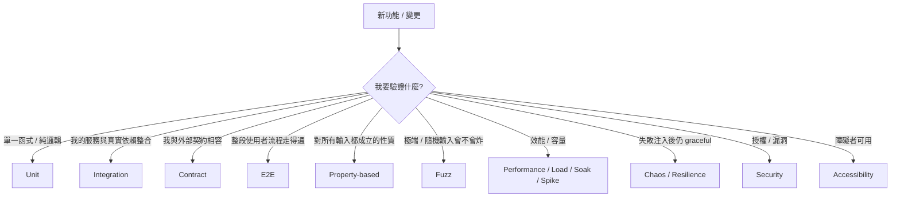

# Test Plan — <Release / Feature>

> **Owner**: devteam-qa
> **Status**: draft | reviewed | frozen | superseded
> **Version**: v<n>
> **Last updated**: <YYYY-MM-DD>
> **Related**: docs/prd/<feature>.md, docs/analysis/system-spec-<feature>.md, docs/api/openapi-<service>.yaml

---

## Scope

### In Scope
- <feature(s) covered>

### Out of Scope
- <explicit exclusions>

---

## Test Type Picker — 該寫哪一層的 case

<!-- 本段是 devteam-qa 的 in-template 決策樹（不另開 KB）。對應 KB 06 §8 ISTQB 概念。 -->



| Type | 寫的時機 | 範圍 | 預期數量 | 何時不該寫 |
|:-----|:---------|:-----|:---------|:-----------|
| **Unit** | 純邏輯 / domain rule / 工具函式 | 1 個 function or class | 最多（基數） | 純 IO wrapper（測 mock 沒意義） |
| **Integration** | 服務與**真實**依賴（DB / cache / queue）整合；用 testcontainers 起真實 instance | 1 個 service + 1-2 依賴 | 中等 | 純 in-memory 邏輯（用 unit） |
| **Contract** | 確保 producer / consumer 對 OpenAPI / event schema 相容；schema 變更必跑 | 1 個 endpoint or event type | 等於 endpoint 數量；KB 08 §3.1 每 status code 至少 1 case；§3.3 idempotency 必有 case | 內部呼叫無契約（用 integration） |
| **E2E** | 使用者真實 flow happy + 主要 error path | 1 條 user flow | 少量（只挑 P0/P1） | 細節驗證（用 lower level；E2E 寫太多 → 慢且脆） |
| **Property-based** | 對「對所有 X，f(X) 滿足 P」的性質；payment / pricing / pure function 特別有用 | 1 個函式 + invariant | 視 invariant 數量 | 隨機沒意義的場景 |
| **Fuzz** | 對輸入解析器 / 反序列化 / 對外 API 邊界；安全敏感 | 1 個 parser / endpoint | 視風險 | 完全內部受信任邊界 |
| **Performance** | 對應 NFR baseline / soak / spike 三組 | 1 個關鍵 endpoint or job | 每 release 至少 1 組 baseline | NFR 未設 baseline（先讓 arch 補） |
| **Chaos / Resilience** | 驗證 KB 10 §2 pattern 真會觸發（CB 真會 open、retry 真有 backoff、fallback 真有切換） | 1 個 dependency boundary | 對應 §2 的每個 pattern 1 個 case | 無 resilience pattern 的 endpoint |
| **Security** | OWASP Top 10 / NIST SSDF；auth boundary / privilege escalation / secret scan / dep vuln | 全 service | per release | （永遠該寫） |
| **Accessibility** | UX flow 內 WCAG level 對應；axe-core + 鍵盤 + screen reader | 全 UI flow | per release | 純後端 service |

**該寫哪一層？三原則**：
1. **Test pyramid**：Unit > Integration > E2E。E2E 寫太多 → 緩慢、易碎。
2. **同一行為盡量在最低層測**：能 unit 就不 integration，能 integration 就不 E2E。
3. **跨契約測試在 contract layer**：別在 E2E 才發現 OpenAPI 不一致。

**Anti-pattern**（critique 必抓）：
- ❌ 對 mock 寫 integration test（mock 與 prod 偏差會讓你被 bite）
- ❌ E2E 取代 contract test
- ❌ 寫了 `expect(true).toBe(true)` 之類的占位
- ❌ Idempotency 邏輯沒有 test（KB 08 §3.3 必驗）
- ❌ CB / fallback / retry 邏輯沒有 chaos test（KB 10 §2 必驗）

---

## Test Levels

| Level | Tools | Owner | 自動化率目標 |
|:------|:------|:------|:-------------|
| Unit | Jest / pytest | dev | 80%+ |
| Integration | testcontainers + supertest | QA + dev | 60%+ |
| Contract | Pact / Schemathesis (OpenAPI driven) | QA | 100% endpoint coverage |
| E2E | Playwright | QA | core happy + main error paths |
| Property-based | fast-check / hypothesis | dev | 對 invariant 明確的邏輯 |
| Fuzz | jazzer / atheris | QA + security | parser / 對外邊界 |
| Performance | k6 / Locust | QA | per release |
| Chaos / Resilience | Toxiproxy / Litmus / 自製 fault injection | QA + SRE | per release（驗 KB 10 §2 pattern） |
| Security | OWASP ZAP / Trivy / Semgrep | QA + security | per release |
| Accessibility | axe-core / manual screen reader | QA + UX | per release |

---

## Test Environment

| Env | Purpose | Data | Reset cadence |
|:----|:--------|:-----|:--------------|
| dev | developer self-test | synthetic | on demand |
| staging | full integration | anonymized prod subset | weekly |
| pre-prod | release validation | prod-like | per release |

---

## Test Data Strategy

- **Synthetic**: faker for 80% cases
- **Anonymized prod subset**: for performance + edge case
- **PII handling**: 任何離開 prod 的資料必須過 anonymizer
- **Tear-down**: 每次測試後自動清除

---

## Test Cases（高層摘要）

| Case ID | Use Case Ref | Level | Priority | Automated | Notes |
|:--------|:-------------|:------|:---------|:----------|:------|
| TC-001 | UC-001 happy | E2E | P0 | ✓ | core flow |
| TC-002 | UC-001 error: payment fail | Integration | P0 | ✓ | retry path |
| TC-003 | UC-001 a11y | E2E + manual | P1 | partial | screen reader manual |

詳細案例見 `qa/cases/<release>/`。

---

## Non-Functional Test Coverage

### Performance
- **Baseline**: p95 < 500ms @ 100 rps
- **Soak**: 2h sustained @ 50 rps，無 leak
- **Spike**: 10x baseline 30s，recover within 1m

### Security
- OWASP Top 10 掃描
- Authn / Authz boundary 測試（vertical + horizontal privilege escalation）
- Secret scan in artifacts
- Dependency vulnerability scan (Trivy / Snyk)

### Accessibility
- WCAG <level> conformance
- axe-core 自動掃描
- 鍵盤 only flow 走通
- Screen reader（NVDA / VoiceOver）spot check

---

## Defect Triage Rules

| Severity | 定義 | SLA 修復 | Blocker for release? |
|:---------|:-----|:---------|:---------------------|
| S1 (Critical) | 主功能不能用 / 安全漏洞 / 資料損毀 | 24h | yes |
| S2 (Major) | 重要功能受損 / 有 workaround | 3 days | yes (unless deferred by PM) |
| S3 (Minor) | 邊緣案例 / cosmetic | next release | no |
| S4 (Trivial) | 文字 / 視覺微調 | backlog | no |

---

## Entry Criteria（可以開始測試）

- [ ] Build 成功
- [ ] Smoke test 綠燈
- [ ] Test environment ready
- [ ] Test data loaded
- [ ] Feature flags configured

## Exit Criteria（測試完成）

- [ ] 所有 P0 test cases 執行且 passed
- [ ] 所有 P1 test cases 執行（pass 或 deferred with PM approval）
- [ ] 0 個 S1 defect
- [ ] ≤ N 個 S2 defect（N 由 PM 與 QA 商定）
- [ ] Performance baseline 滿足
- [ ] Security scan 無 high/critical
- [ ] a11y axe-core 0 critical
- [ ] Test completion report 寫好

---

## Test Completion Report 範本

文末或獨立檔案 `qa/completion-<release>.md`：

```markdown
## Test Completion — <release>

- Cases executed: X / Y
- Pass rate: ZZ%
- Open defects: <list by severity>
- Performance: <pass/fail vs baseline>
- Security: <findings>
- a11y: <findings>
- Recommendation: GO / NO-GO / CONDITIONAL（with conditions）
```

---

## Downstream Consumers
- docs/release/readiness-<date>.md（QA 證據來源）
- docs/ops/runbook-<service>.md（incident pattern from test findings）
