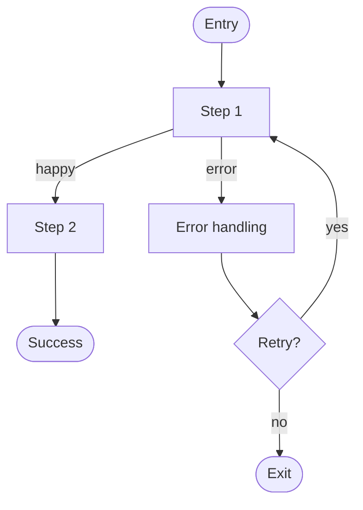

# User Flow — {Feature Name}

> **📋 Status**: draft | reviewed | frozen | superseded
> **🗓 Last updated**: YYYY-MM-DD
> **👤 Owner**: `devteam-ux` (UX persona)
> **🔖 Version**: v{n}
> **🔗 Related PRD**: [`docs/prd/{feature}.md`](../../docs/prd/{feature}.md)
> **🔗 Related ADR/DR**: ADR-NNN · DR-NNN

---

## 📋 Executive Summary

> [!TIP]
> **TL;DR (30s)**: User flow for **{primary persona}** doing **{Job-to-be-Done}**. **{N} steps** main path, **{M} edge cases**. State coverage: loading / empty / error / success **all defined**.

| 維度 | 摘要 |
|:---|:---|
| **👤 Primary persona** | {role} |
| **🎯 Job-to-be-Done** | {one sentence} |
| **📊 Main path steps** | {N} |
| **🔁 Edge cases** | {M} |
| **♿ A11y level** | WCAG {AA / AAA / N/A} |
| **🚀 狀態** | {emoji} {status} |

---

## 🎯 Overview

- **Primary Persona**: <from PRD>
- **Primary Job-to-be-Done**: <one sentence>
- **Entry points**: <where user starts>
- **Success state**: <what "done" looks like>

---

## Journey Map（高層）

```
[Discover] → [Onboard] → [Use] → [Retain]
   │           │          │        │
   pain        friction   value    habit
```

> 用 PRD 的 scenarios 對應到 journey 階段。

---

## Core Flow（任務主線）

### Flow 1: <Task Name>



**Steps:**
1. **<Step 1 name>**：使用者做什麼 / 系統回應什麼 / 預期時間
2. **<Step 2 name>**：...

**Branching points:**
- 條件 A → 走 Path A
- 條件 B → 走 Path B

---

## State Coverage（每個畫面 / 每個狀態）

對每個 step 列出：

| Step | Happy | Empty | Loading | Error | Offline |
|:-----|:------|:------|:--------|:------|:--------|
| Step 1 | ✓ | ✓ | ✓ | retry / skip | cache / banner |
| Step 2 | ✓ | n/a | ✓ | ✓ | ✓ |

**禁忌**：不可只畫 happy path。Empty / Loading / Error / Offline 至少在主線上要齊。

---

## Edge Cases

- **EC-1**: <情境 + 預期行為>
- **EC-2**: ...

---

## Accessibility 檢查

- [ ] 顏色非唯一資訊載體（contrast、色盲）
- [ ] 鍵盤可完整操作（tab order、focus ring）
- [ ] Screen reader 語意（aria-label、landmark）
- [ ] Touch target ≥ 44pt
- [ ] 動畫可關閉（prefers-reduced-motion）
- WCAG Level 目標: <A / AA / AAA>

---

## Telemetry Hooks（給 QA & SRE 用）

| Event | 觸發點 | 屬性 |
|:------|:-------|:-----|
| `user_flow.step_completed` | Step N 完成 | step_id, duration_ms, persona |
| `user_flow.error` | error path | step_id, error_code |
| `user_flow.success` | success state | total_duration_ms |

---

## Assumptions & Open Questions

- **A-1**: <假設，待 stakeholder 確認>
- **OQ-1**: <open question + who decides + by when>

---

## Downstream Consumers
- docs/analysis/system-spec-<feature>.md（轉成 use cases）
- docs/qa/test-plan-<release>.md（測試案例）
- docs/api/openapi-<service>.yaml（前端整合需求）
