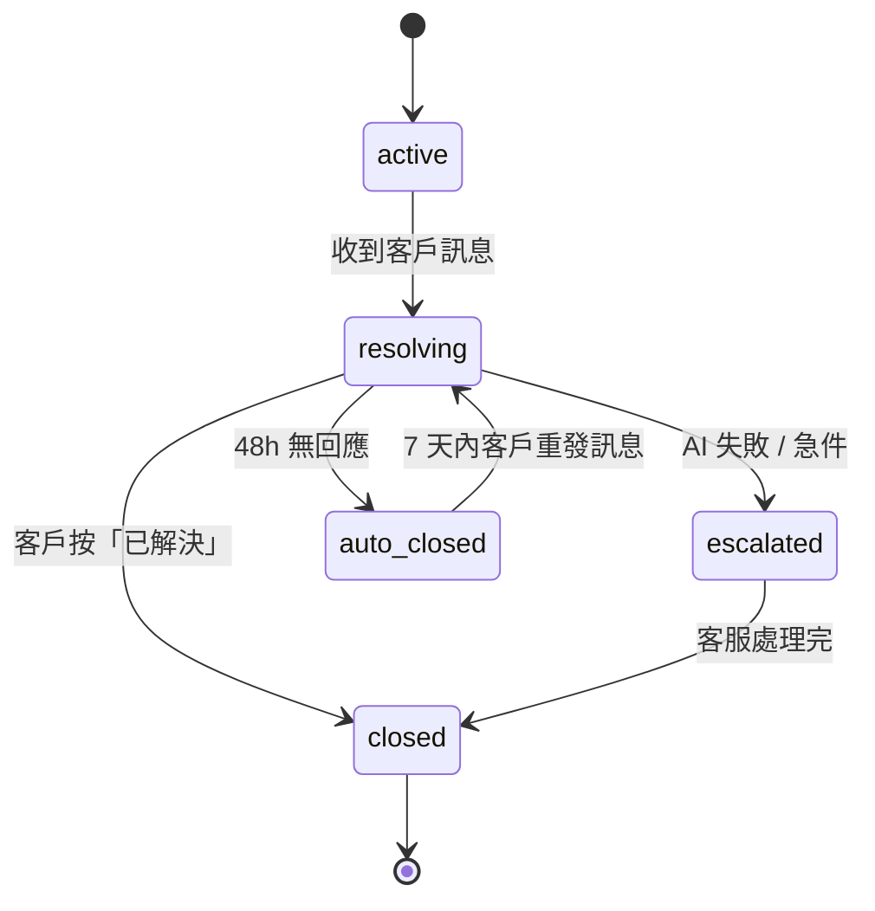
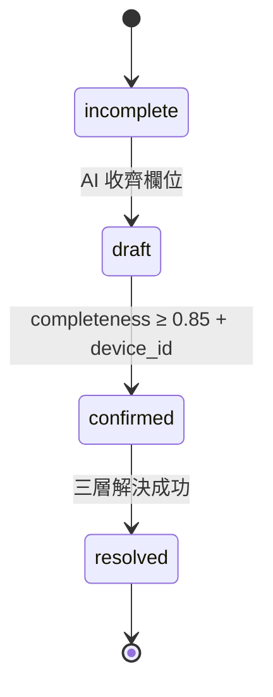
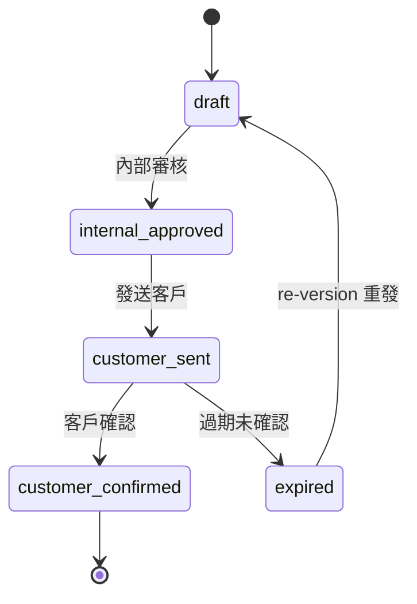
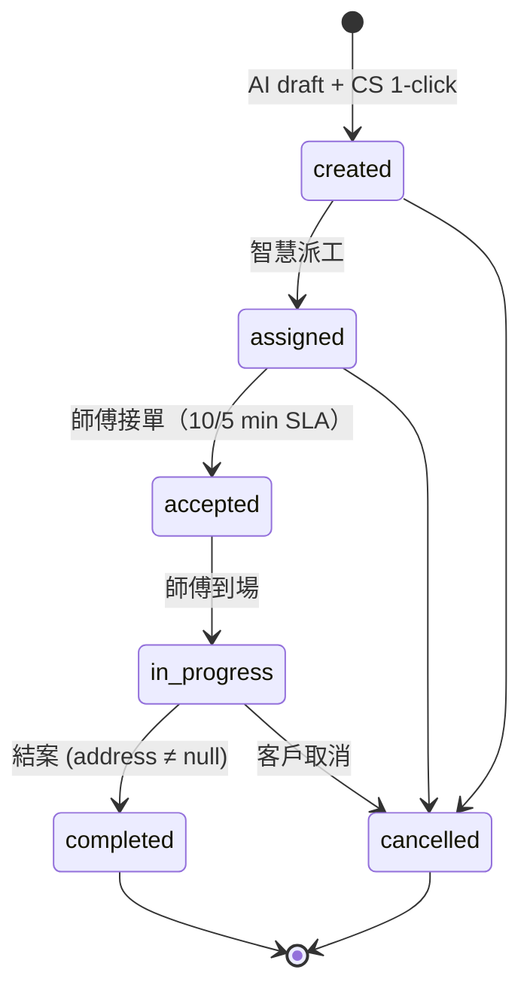
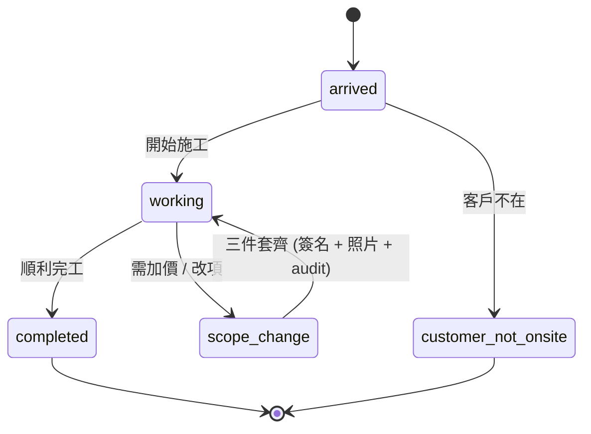
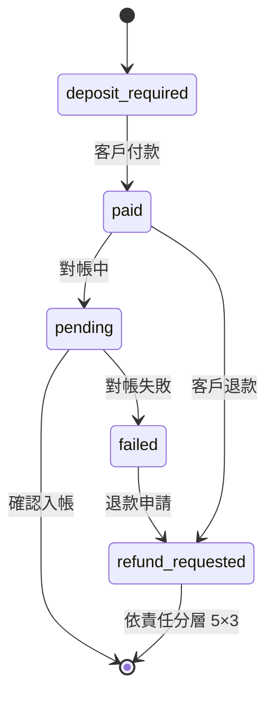
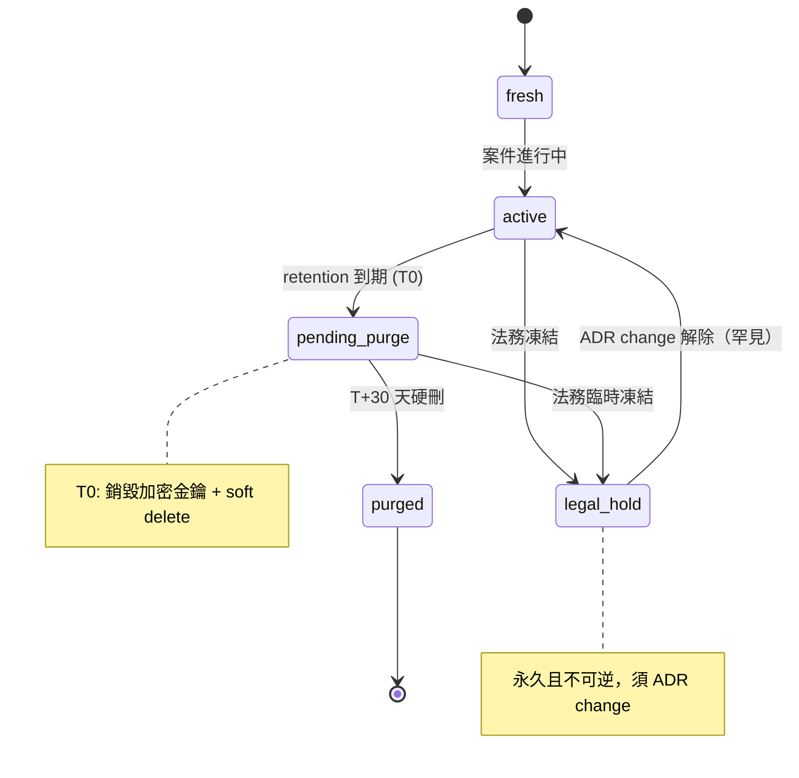

# System Spec — 智慧鎖 SaaS 平台

> **狀態**：v1 draft（Gate 3 ready）
> **更新**：2026-05-23
> **負責人**：SA + BA
> **關聯**：[PRD v2.1](../prd/smart-lock-saas.md) · [User Flow v1](../ux/user-flow-smart-lock-saas.md)

---

## §0 摘要

> [sa 視角] 14 個業務物件、7 個狀態機、18 個 use case、21 個 domain event、14 個 integration endpoint。
> [ba 視角] 64 條業務規則（business rules）、合約 4.4(a)(d) / SOW 2.1(4) / 9.3 / §9 終止條款全有對應 FR、stakeholder 18 角色四層權限。

兩個視角不混段。本檔以 sa 主筆（actor-step / precondition / postcondition），ba 視角以 `> [ba 視角]` 注入。

---

## §1 業務物件（System Boundary 內的 actor 與 entity）

> [sa] 列出系統邊界內的 entity + actor。
> [ba 視角] 必帶欄位含合規 / 多租戶要求（policy-driven），不純粹資料模型。

| 物件 | 系統 actor / entity | 必帶欄位（v2.1）|
|:---|:---|:---|
| Customer | external actor + entity | `id` / `tenant_id` / `brand_scope[]` / `locale` / `pii_retention_policy` / `line_user_id` / `phone(crypto)` / `addresses[]` |
| Site | entity | `id` / `site_group_id`（建案）/ `address(crypto)` / `geo_district` / `tenant_id` |
| Device | entity | `serial` / `brand` / `model` / `purchase_date` / `warranty_start_date` / `warranty_mode`（5 模式）/ `tenant_id` |
| Conversation | entity | `id` / `channel_type` / `summary` / `state` / `started_at` / `auto_closed_at` / `tenant_id` |
| ProblemCard | entity | `id` / `conversation_id` / `device_id` / `brand` / `model` / `symptom[]` / `urgency`（急件 4 類）/ `completeness_score` / `media_refs[]` / `state` / `tenant_id` |
| Quote | entity | `id` / `pc_id` / `version` / `effective_date` / `approval_chain` / `range_only`（AI 不可 final）/ `tenant_id` |
| WorkOrder | entity | `id` / `pc_id` / `state` / `state_history[]` / `address`（結案前 422 gate）/ `tenant_id` / `idempotency_key` / `created_by`（AI 草擬 + 客服確認）|
| Onsite | entity | `id` / `wo_id` / `arrival_proof` / `material_used[]` / `customer_signature` / `scope_change_events[]` |
| Evidence | entity | `sha256`（PK）/ `tenant_id` / `wo_id` / `retention_class` / `legal_hold` / `purged_at` / `dek_id`（envelope 加密）|
| Settlement | entity（7 帳本）| `ledger_type` / `period` / `audit_trail[]` / `partner_id` |
| ContractTemplate（v2.1）| entity | `id` / `tenant_id` / `partner_id` / `version` / `scope[]` / `liability_matrix` / `visibility_rule + effective scope snapshot` / `sla` / `monthly_settlement_rule` |
| ChangeRequest（v2.1）| entity | `id` / `type`（policy/price/rbac/sla/template/contract）/ `apply_by` / `approve_chain` / `effective_date` / `audit_trail[]` |
| SOP / Skill（v2.1）| entity（知識資產）| `id` / `version` / `risk_level`（high/low）/ `dual_review_status` / `family_review_status` / `published_at` |
| TransferEvent（Forum F-02）| event entity | `(conversation_id, transfer_event_seq)` / `rule_triggered_by` enum {hard_rule_0048_a..g, ai_proactive_offer, customer_explicit_request, agent_pickup}（由 deterministic rule engine 寫入）|

> [ba 視角] PII 欄位（phone / address / signature）受 GDPR Art.17、個資法 §11 / §27、合約 4.4(a)(d) 三層 policy 拘束。tenant_id 為一級欄位（ADR-0030），不得 nullable，不得跨租戶可見。

---

## §2 狀態機（State Machines）

> [sa] 每個 entity 的合法狀態轉移；precondition 條件式列在 transition 上。

### 2.1 Conversation

- Precondition for `auto_closed`：state=resolving AND no_customer_message_since ≥ 48h
- Postcondition：set `auto_closed_at`；7 天內客戶訊息 → 自動 reopen 回 resolving

### 2.2 ProblemCard

- `confirmed` precondition：`completeness ≥ 0.85`（ADR-0033）AND `device_id` non-null

### 2.3 Quote

- `customer_sent` precondition：`range_only = true`（AI 路徑）OR human approval（final quote 路徑）

### 2.4 WorkOrder

- `created` precondition：PC state=confirmed
- `completed` precondition：**address IS NOT NULL**（合約 9.3 + ADR-0032 結案前 422 hard gate）

### 2.5 Onsite

- `scope_change` precondition：客戶簽名 + Evidence 照片 + audit log 三件套都備齊（ADR-0049）
- 金額分層 precondition：≤500 師傅自確 / 501-2000 客服 / >2000 主管+三方

### 2.6 Payment / Refund

- `refund_requested` 進入後依責任歸屬 5×3=15 分層裁決（ADR-0040）

### 2.7 Evidence Lifecycle（v2.1 expanded）

---

## §3 Business Rules（給 ba 視角閱讀）

> [ba 主筆] 64 條業務規則 + 合規條文引用。policy-driven，違反 = block release。

### BR-Conversation
- **BR-Conv-001**：對話 48h 無回應 → auto_closed。引用 ADR-0037
- **BR-Conv-002**：7d 內客戶有訊息可 reopen
- **BR-Conv-003**：負面情緒識別 ≥ 90%。引用合約 4.4(a)。違反 = 合約 §9 終止 risk

### BR-ProblemCard
- **BR-PC-001**：同 active issue 一張 PC。引用 ADR-0036。unique 條件 `(conv_id, device_id, active_status)`
- **BR-PC-002**：completeness_score ≥ 0.85 才自動派工。引用 ADR-0033
- **BR-PC-003**：completeness gate 觸發 photo guide。引用合約 9.3
- **BR-PC-004**：completeness 彙總 KPI K4 = (PC.score ≥ 0.85 數) / (PC 進入確認階段數)。分母排除 24h 無回應 PC

### BR-Quote / AI 邊界
- **BR-Quote-001**：AI 可給 range，**永禁** final / 折扣 / 保固免費。引用 ADR-0035 / 0054 / 0047
- **BR-Quote-002**：Guardrail 三規則偵測（NTD 數字無修飾語 / 折扣關鍵字 / 保固免費）。違反 = 合約信任崩盤 risk
- **BR-Quote-003**：保固期內 / 建案案件 AI 給 range 後必轉真人 final

### BR-WorkOrder
- **BR-WO-001**：AI 永不直接 `convert_to_work_order`；必須客服 1-click 確認。引用 ADR-0031
- **BR-WO-002**：結案 422 hard gate：address 必驗。引用 ADR-0032 業主備註版
- **BR-WO-003**：取消費 5 階段 system 自判 + 全階段客服可覆寫 + audit log。引用 ADR-0039 業主備註版

### BR-Dispatch / Onsite
- **BR-Disp-001**：接單 SLA 一般 10min / 急件 5min + per-brand override。引用 ADR-0045
- **BR-Disp-002**：30min 無人接 → 擴大範圍 + 通知客服
- **BR-Onsite-001**：scope change 三件套 + 金額分層。引用 ADR-0049
- **BR-Onsite-002**：Material owner ∈ {platform, brand, locksmith}。引用 ADR-0052
- **BR-Onsite-003**：主鎖 + >1000 高價零件強制 serial。引用 ADR-0053

### BR-Settlement
- **BR-Set-001**：7 帳本（Customer AR / Tech AP / Cash Collection / Brand Settle / Dispatcher Commission / Refund / Invoice & Tax）
- **BR-Set-002**：append-only ledger，更正用 reversal entry
- **BR-Set-003**：退款依責任歸屬分層 5×3=15。引用 ADR-0040
- **BR-Set-004**：車馬費 80% 師傅 / 20% 平台（同區 500 / 跨區 800 / 遠距 1200，per-contract override）。引用 ADR-0041

### BR-RBAC
- **BR-RBAC-001**：4 層原則固化（顧客 / 營運 / 財務 / 治理），具體欄位後台 configurable。引用 ADR-0042
- **BR-RBAC-002**：跨 tenant 零洩漏。引用 ADR-0030
- **BR-RBAC-003**：18 角色 RBAC 矩陣走 Admin Panel UI 設定 + ChangeRequest

### BR-PII / Evidence（合約紅線）
- **BR-PII-001a**：legal-hold 永久且不可逆（解除需 ADR change）。引用合約 4.4(d)
- **BR-PII-001b**：GDPR forget 7d，例外：legal-hold 已生效則拒絕並 customer notice。引用 GDPR Art.17
- **BR-PII-001c**：retention default（1y / RMA+3y / eternal）。引用個資法 §11
- **BR-PII-001d**：visibility filter 在 read 路徑且 fail-closed。引用個資法 §27
- **BR-PII-002**：fail-closed 三層（mutation full deny / read flagged full deny / read unflagged last-known-good + header）
- **BR-PII-003**：Cron = scanner / DGS = sole executor，cron **不可**直接 DELETE
- **BR-PII-004**：two-phase purge — T0 銷毀加密金鑰，T+30d 硬刪

### BR-AI 邊界 / SOP
- **BR-AI-001**：AI Forbidden 200 題 Eval pipeline，pass <95% block deploy。引用 ADR-0047
- **BR-AI-002**：AI 轉真人 7 條硬規則。引用 ADR-0048
- **BR-AI-003**：`rule_triggered_by` 必由 deterministic rule engine 寫入（非 LLM 自報）。Forum F-02 裁決
- **BR-SOP-001**：高風險 SOP（報價 / 退款 / 法律）雙審 = 客服主管 + Domain Expert。引用 ADR-0038
- **BR-SOP-002**：Family Reviewer 第二關，SLA 24h；缺席 ≥ 24h 暫停 publish + escalate；累計 ≥ 3 件未審 → 觸發 ChangeRequest 提名替補。引用合約 4.4(d)
- **BR-SOP-003**：SOP approved → 60s 內向量化發布

### BR-ChangeRequest
- **BR-CR-001**：政策 / 價格 / 權限 / SLA / 模板 / 合約 instance 變更走 `apply → approve → effective_date → audit`。引用 ADR-0046
- **BR-CR-002**：緊急走 emergency track（簡化簽核但 audit 完整）

### BR-Contract Template（Forum F-01）
- **BR-CT-001**：V1 CRUD limited to draft state；狀態轉移延 V2 走 sub-resource action
- **BR-CT-002**：Schema 凍結到欄位級
- **BR-CT-003**：Row-level policy 禁 DB 直改 + ChangeRequest 強制入口
- **BR-CT-004**：Dogfood — 第一甲方 W-2 前用 API 建出 instance（exit criteria）

---

## §4 Use Cases（actor-step 分解）

> [sa 主筆] 每個 UC 含 primary actor / pre-condition / main path / post-condition / alternative flow。

### V1 必交（合約紅線 / 上線必備）

| UC | Title | Primary Actor | Pre-condition | Main Path | Post-condition |
|:---|:---|:---|:---|:---|:---|
| UC-001 | LINE 報修自助 | 消費者 | LINE bind | S1 主流程 | PC resolved + audit |
| UC-002 | 急件強制轉真人 | 消費者 / 客服 | urgent 4 類觸發 | 5min 內 transfer | TransferEvent log |
| UC-003 | AI 收集 PC | 系統 | conv active | 多輪對話 + photo guide | PC.completeness ≥ 0.85 |
| UC-004 | AI 報價 range | 系統 / 消費者 | PC confirmed | AI 給 range + 引導真人 | Quote.range_only=true |
| UC-005 | 三層解決 | 系統 / 消費者 | PC confirmed | 案例庫 → RAG → 真人 | 解決或 escalate |
| UC-006 | 客戶確認結案 | 消費者 | resolved | 按已解決 OR 48h auto_close | Conv.state=closed |
| UC-007 | reopen | 消費者 | closed 7d 內 | 訊息進入 | conv.reopened + K2 分子 -1 |
| UC-008 | Admin 知識庫管理 | 管理員 | RBAC 治理層 | 上傳手冊 / SOP 草稿 review | Knowledge entry |
| UC-009 | SOP 雙審 | 客服主管 / Domain Expert | SOP draft + risk=high | 雙簽 + Family Reviewer | published in 60s |
| UC-010 | Family Reviewer 覆核 | Family Reviewer | SOP dual_review_status=approved | 24h SLA 內 review | sop.family_review_status |
| UC-011 | ChangeRequest workflow | 管理員 | 政策變更需求 | apply → approve → effective | audit_trail |
| UC-012 | RBAC 設定 | 管理員 | 治理層 | Admin UI 設定 + ChangeRequest | RBAC matrix update |
| UC-013 | GDPR forget | 消費者 / DPO | request | DGS BR-PII-001 check → 7d 內執行 OR customer notice | audit_trail |
| UC-014 | 稽核員唯讀 | 稽核員 | 治理層 | read evidence + audit log | access log |
| UC-015 | AI Forbidden Eval | 系統 / QA | deploy | 200 題自動跑 | block deploy if <95% |
| UC-016 | Image moderation gate | 系統 | webhook image | strip / reject | violation count = 0 |
| UC-017 | Contract Template CRUD V1 | sd lead / 甲方 | tenant_admin | dogfood API + ChangeRequest hook | ContractTemplate instance |
| UC-018 | Bronze 收集 | 系統 | 任何業務事件 | 同步寫 21 events | Bronze ETL feed |

### V2 + V1.5（沿用 PRD-0001 v1.1 Epic 7-11 US-021~037）
- UC-019 ~ UC-035 略；詳見既有 baseline。

---

## §5 Event Flow（Domain Events）

> [sa] system boundary 上的 event 與 retention。

| Event | Retention | Trigger Actor | Consumer |
|:---|:---|:---|:---|
| `conversation.message.received` | 1y | LINE webhook | AI agent + audit |
| `user_facts.updated` | eternal | system (SCD2) | Episodic memory |
| `skill.loaded` | 90d | Tool Registry | observability |
| `problem_card.create_requested` | 1y | AI 草擬 | PC pipeline |
| `problem_card.created` | 1y | system | UI + audit |
| `problem_card.confirmed` | 1y | customer | dispatch trigger |
| `problem_card.resolved` | 1y | customer | SOP trigger |
| `work_order.created` | RMA+3y | CS（1-click 確認後）| dispatch engine |
| `work_order.assigned` | RMA+3y | system | technician notification |
| `work_order.accepted` | RMA+3y | technician | customer notify |
| `work_order.completed` | RMA+3y | technician | settlement |
| `evidence.uploaded` | 依 retention_class | technician / system | DGS + cache invalidation |
| `ai_quality.feedback` | 1y | customer | K1 / K2 monitor |
| `policy.decision` | eternal | DGS / Guardrail | audit + observability |
| `kill_switch.activated` | eternal | ops | incident |
| `transfer_event.fired`（v2.1）| 1y | deterministic rule engine | C2 instrumentation |
| `contract_template.changed`（v2.1）| RMA+3y | API + outbox | audit + cache |
| `gdpr_forget.requested`（v2.1）| eternal | data subject | DGS purge pipeline |
| `legal_hold.flipped`（v2.1）| eternal | 法務 | push invalidation ≤ 5s |
| `purge_audit.entry`（v2.1）| eternal | DGS phase-1/2 | ledger + hash chain |

---

## §6 Integration Inventory（system boundary 外的接口）

| ID | 方向 | 類型 | 描述 |
|:---|:---|:---|:---|
| INT-001 | Inbound | webhook | LINE Messaging API webhook + HA retry |
| INT-002 | Outbound | REST | LINE push message |
| INT-003 | Outbound | gRPC/REST | Gemini 2.5 Flash via LiteLLM |
| INT-004 | Outbound | REST | Google Embeddings |
| INT-005 | Outbound | REST | Google Maps（V2 派工地圖）|
| INT-006 | Inbound | REST | 師傅 Web App API（V2）|
| INT-007 | Inbound | REST | Admin Panel API |
| INT-008 | Outbound | Webhook | Web Push（V2）|
| INT-009 | Inbound | Webhook | LINE Notify（V2 alt）|
| INT-010 | Internal | REST | DGS purge / read API（v2.1）|
| INT-011 | Internal | Outbox poller | DGS → invalidation bus |
| INT-012 | Outbound | KMS | per-tenant DEK envelope encryption |
| INT-013 | Outbound | API | 外部知識傳承平台 ingestion（V2+）|
| INT-014 | Inbound | MQTT/HTTPS | 電子鎖 IoT 訊號接入（V2+）|

---

## §7 Acceptance Criteria（給 QA 寫 test plan）

- UC-001~018 V1 必交：BDD scenario 寫到 [`../qa/test-plan-smart-lock-saas.md`](../qa/test-plan-smart-lock-saas.md)
- KPI 各 acceptance：K1 200 題、K3 100 題 / 月、K8 200 題 block deploy
- 合約紅線 acceptance：UC-013（GDPR）+ UC-016（image gate）+ UC-010（Family Reviewer）+ BR-PII-001a~d 100% pass

---

## §8 Gate 3 Exit Criteria

- ✅ 14 業務物件 schema 列出
- ✅ 7 永恆狀態機 + 1 Evidence lifecycle 定義（含 precondition / postcondition）
- ✅ 64 條 BR-X 業務規則 + 合規條文引用
- ✅ 18 V1 use cases + V2 use case reference
- ✅ 21 Domain Events catalogue
- ✅ 14 Integration endpoints
- ⏳ BDD scenario 詳細待 P4 完成

---

**Gate 3 System Spec Freeze** — ✅ ready
