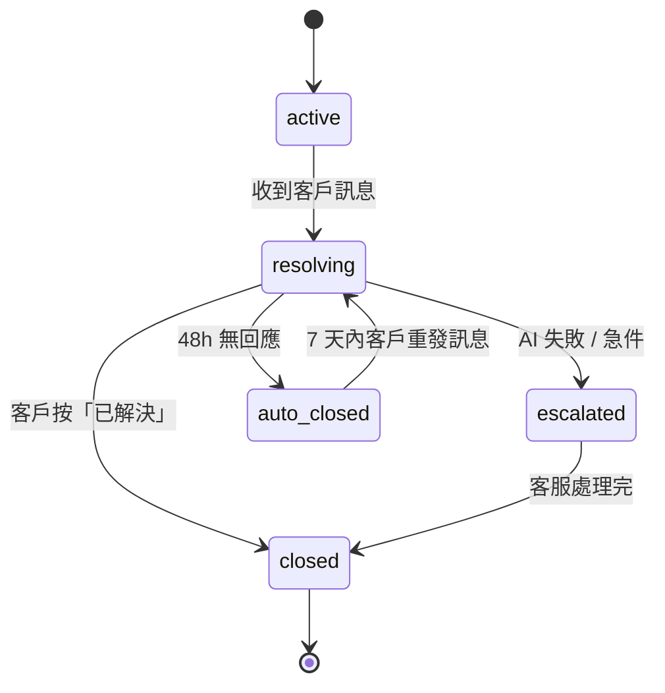
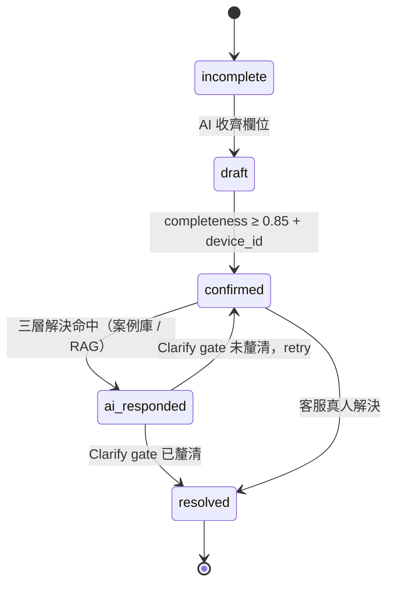
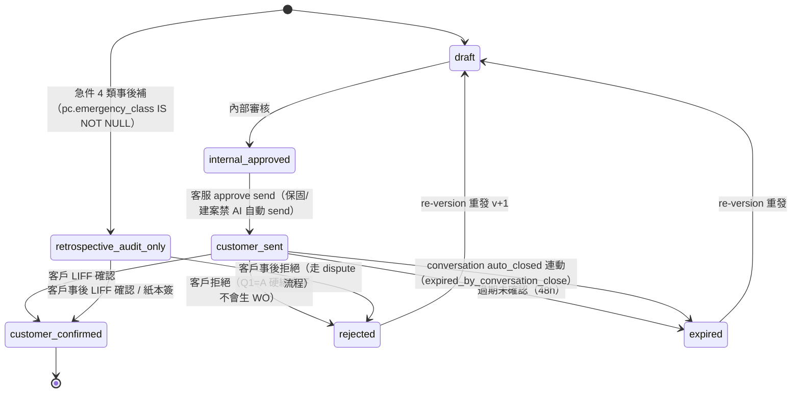
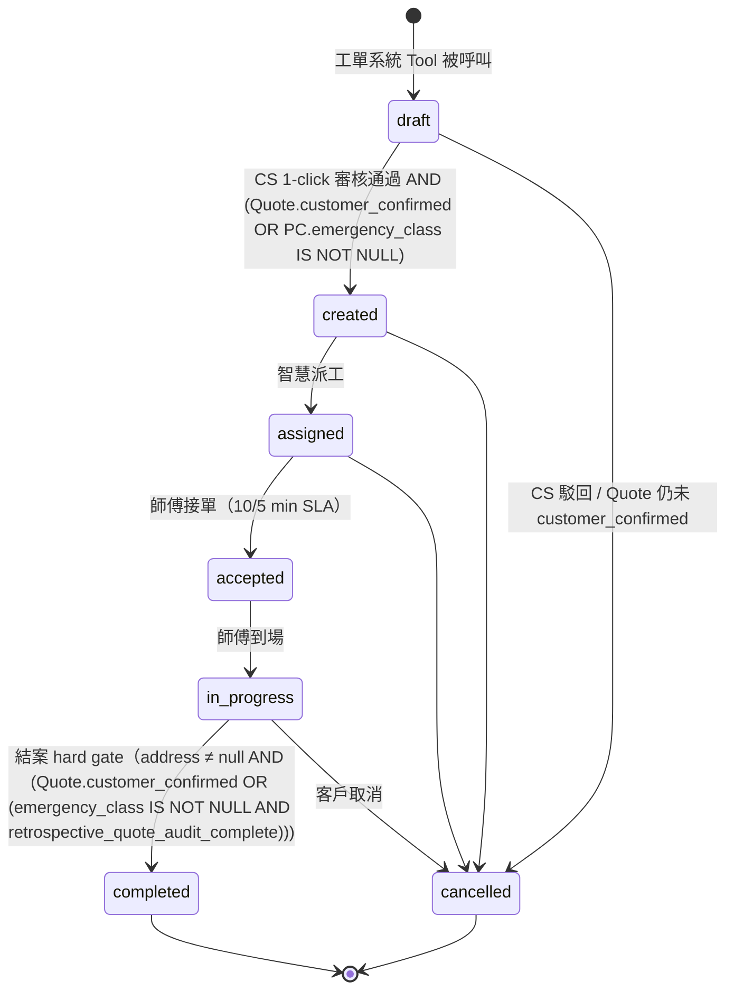
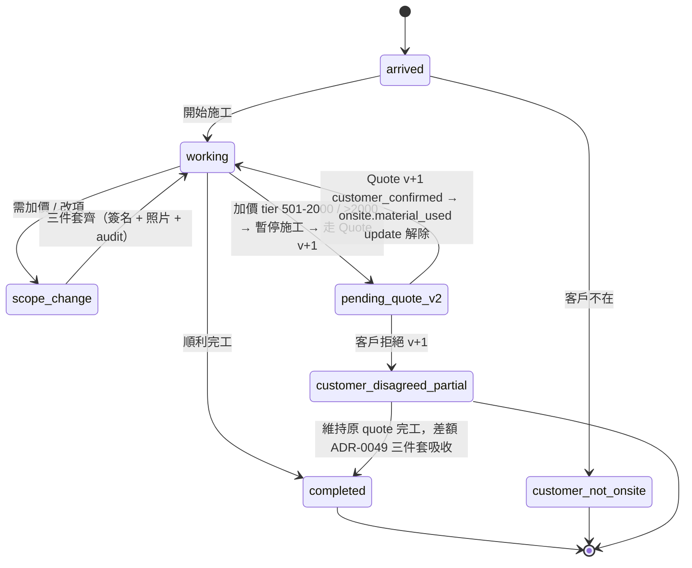
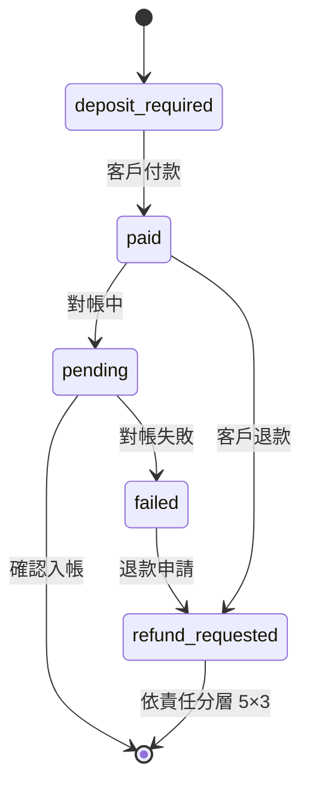
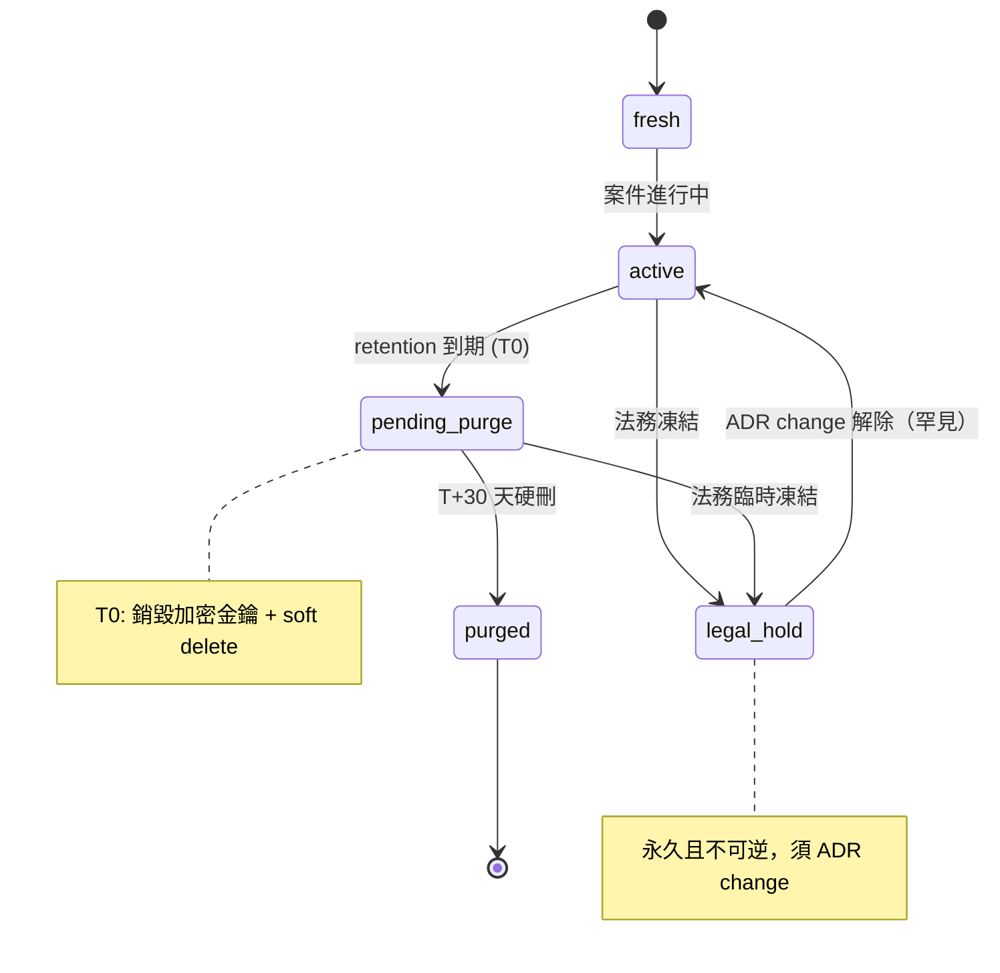

# System Spec — 智慧鎖 SaaS 平台

> **狀態**：v2.2 draft（Gate 3 ready — Forum 2026-05-26-Q01 quote-pricing-engine cascade）
> **更新**：2026-05-26
> **負責人**：SA + BA
> **關聯**：[PRD v2.1](../prd/smart-lock-saas.md) · [User Flow v1](../ux/user-flow-smart-lock-saas.md)
>
> **v2.2 變更摘要**（Forum 2026-05-26-Q01 收斂 + 業主 4 條 binary choice：Q1=A 硬綁定 / Q2=A 重構句型 / Q3=A 急件跳 quote / Q4=A Lookup table）：
> - §2.3 Quote state machine：加 `rejected` state + `retrospective_audit_only` 急件事後 audit 路徑
> - §2.4 WorkOrder state machine：`created` precondition 硬綁 `Quote.customer_confirmed`（業主 Q1=A）；`completed` precondition 加急件 carve-out
> - §2.5 Onsite state machine：加 `pending_quote_v2` 中間態（scope change 501-2000 暫停施工銜接 quote v+1）
> - §3 Business Rules：新增 / 修訂 11 條（BR-Quote-003 升級、BR-Quote-004 新增、BR-WO-001/002 修訂、BR-WO-004 新增、BR-Onsite-004 新增、BR-Pricing-001~004 新增、BR-AI-NEW）
> - §4 Use Cases：新增 UC-019（Quote 客戶確認）、UC-020（急件事後 quote audit）、UC-021（onsite re-quote）
> - 引用新 ADR：ADR-0062（Pricing Engine V2 bounded context）/ ADR-0063（AI Quote-related Utterance Boundary）/ ADR-0064（Pricing Rule Snapshot immutable content-addressable）/ ADR-0065（ChangeRequest.type lookup table migration）/ ADR-0066（Quote ↔ WO Lifecycle Hard Binding + Emergency carve-out）；修訂 ADR-0046（type lookup table）/ ADR-0039（補 reason code）

---

## §0 摘要

> [sa 視角] 14 個業務物件、7 個狀態機（v2.2 Quote/WO/Onsite 三個 state machine 擴充新中間態）、21 個 V1+V2.2 use case、21 個 domain event、14 個 integration endpoint。
> [ba 視角] **75 條**業務規則（v2.1 64 條 + v2.2 Forum Q-01 新增 11 條：BR-Quote-003 升級、BR-Quote-004、BR-WO-001/002 修訂、BR-WO-004、BR-Onsite-004、BR-Pricing-001~004、BR-AI-NEW），合約 4.4(a)(d) / SOW 2.1(4) / 9.3 / §9 終止條款全有對應 FR、stakeholder 18 角色四層權限。

兩個視角不混段。本檔以 sa 主筆（actor-step / precondition / postcondition），ba 視角以 `> [ba 視角]` 注入。

---

## §1 業務物件（System Boundary 內的 actor 與 entity）

> [sa] 列出系統邊界內的 entity + actor。
> [ba 視角] 必帶欄位含合規 / 多租戶要求（policy-driven），不純粹資料模型。

| 物件 | 系統 actor / entity | 必帶欄位（v2.1）|
|:---|:---|:---|
| Customer | external actor + entity | `id` / `tenant_id` / `brand_scope[]` / `locale` / `pii_retention_policy` / `line_user_id` / `phone(crypto)` / `addresses[]` |
| Site | entity | `id` / `site_group_id`（建案）/ `address(crypto)` / `geo_district` / `tenant_id` |
| Device | entity | `serial` / `brand` / `model` / `purchase_date` / `warranty_start_date` / `warranty_mode`（5 模式）/ `tenant_id` |
| Conversation | entity | `id` / `channel_type` / `summary` / `state` / `started_at` / `auto_closed_at` / `tenant_id` |
| ProblemCard | entity | `id` / `conversation_id` / `device_id` / `brand` / `model` / `symptom[]` / `urgency`（急件 4 類）/ `urgency_detected_at`（Intent 階段時間戳）/ `completeness_score` / `media_refs[]` / `state` / `clarification_confirmed_at`（AI 主動確認問題釐清時點，resolved 前置條件）/ `clarification_attempts`（連續未釐清次數）/ `tenant_id` |
| Quote | entity | `id` / `pc_id` / `version` / `effective_date` / `approval_chain` / `range_only`（AI 不可 final）/ `tenant_id` |
| WorkOrder | entity | `id` / `pc_id` / `state` / `state_history[]` / `address`（結案前 422 gate）/ `tenant_id` / `idempotency_key` / `create_trigger` enum {ai_path_customer_triggered, cs_path_csagent_triggered}（誰呼叫工單 Tool）/ `created_by`（CS 1-click 確認者）|
| Onsite | entity | `id` / `wo_id` / `arrival_proof` / `material_used[]` / `customer_signature` / `scope_change_events[]` |
| Evidence | entity | `sha256`（PK）/ `tenant_id` / `wo_id` / `retention_class` / `legal_hold` / `purged_at` / `dek_id`（envelope 加密）|
| Settlement | entity（7 帳本）| `ledger_type` / `period` / `audit_trail[]` / `partner_id` |
| ContractTemplate（v2.1）| entity | `id` / `tenant_id` / `partner_id` / `version` / `scope[]` / `liability_matrix` / `visibility_rule + effective scope snapshot` / `sla` / `monthly_settlement_rule` |
| ChangeRequest（v2.1）| entity | `id` / `type`（policy/price/rbac/sla/template/contract）/ `apply_by` / `approve_chain` / `effective_date` / `audit_trail[]` |
| SOP / Skill（v2.1）| entity（知識資產）| `id` / `version` / `risk_level`（high/low）/ `dual_review_status` / `family_review_status` / `published_at` |
| TransferEvent（Forum F-02）| event entity | `(conversation_id, transfer_event_seq)` / `rule_triggered_by` enum {hard_rule_0048_a..g, ai_proactive_offer, customer_explicit_request, agent_pickup}（由 deterministic rule engine 寫入）|

> [ba 視角] PII 欄位（phone / address / signature）受 GDPR Art.17、個資法 §11 / §27、合約 4.4(a)(d) 三層 policy 拘束。tenant_id 為一級欄位（ADR-0030），不得 nullable，不得跨租戶可見。

---

## §2 狀態機（State Machines）

> [sa] 每個 entity 的合法狀態轉移；precondition 條件式列在 transition 上。

### 2.1 Conversation



- Precondition for `auto_closed`：state=resolving AND no_customer_message_since ≥ 48h
- Postcondition：set `auto_closed_at`；7 天內客戶訊息 → 自動 reopen 回 resolving

### 2.2 ProblemCard



- `confirmed` precondition：`completeness ≥ 0.85`（ADR-0033）AND `device_id` non-null
- `ai_responded` precondition：三層解決命中（案例庫 hit ≥0.85 OR RAG 整合回覆已發送）
- **`resolved` precondition（AI 路徑）**：`clarification_confirmed_at IS NOT NULL`（AI 主動詢問「問題釐清了嗎？」客戶答「已釐清」）— **「有幫助 / 沒幫助」feedback 是平行品質訊號（K8 Eval / SOP trigger），不可作為 resolved 的 trigger**
- **`resolved` precondition（CS 路徑）**：客服在 CSHandle 階段判斷問題已解決
- 連續 `clarification_attempts ≥ 3` 未釐清 → 升級轉真人（escalated 路徑）

### 2.3 Quote（v2.2 expanded — Forum Q-01 Q1+Q2+Q3 cascade）



- **`customer_sent` precondition**（業主 Q2=A 重構句型 + BR-Quote-003 升級）：
  - `range_only = true`（AI 路徑，僅 range 不含 final 數字）OR human approval（final quote 路徑）
  - **保固期內 / 建案案件** quote：**AI 永禁觸發 LIFF send**，LIFF 必由客服手動 approve send（BR-Quote-003 升級）
  - 引用 ADR-0063 AI Quote-related Utterance Boundary（AI 不複誦個案金額，僅 announce existence + 引導查看 LIFF/Flex）
- **`rejected` precondition / postcondition**：
  - precondition：客戶在 LIFF 明示拒絕（reason_code enum {`customer_rejected`, `customer_unreachable`, `quote_expired`}）
  - postcondition：寫 audit_trail；若已派工（Q1=A 硬綁定下不應發生）→ 走 dispute 流程；可走 `rejected → draft` re-version v+1（`supersedes_quote_id` self-FK 串鏈）
- **`retrospective_audit_only` precondition / postcondition**（業主 Q3=A 急件跳過 quote 事後補）：
  - precondition：`pc.emergency_class IS NOT NULL` AND WO 已建立並走完 onsite（locked_out / trapped_inside / safety_risk 三類）
  - postcondition：客服必須在 onsite 結束後 4h 內補 send retrospective_audit_only quote；客戶於 LIFF 事後確認 / 紙本簽（補完整 audit 鏈）
  - 引用 ADR-0066 Quote ↔ WO Lifecycle Hard Binding + Emergency Carve-out
- **`expired` 同步機制**：當 conversation auto_closed 時若 quote 仍 active，同步寫 `expired_by_conversation_close`（保留 audit source 區分）；LIFF 進入時若 quote 已 expired_by_conversation_close → 顯示「對話已結案，請重新報修」
- **Snapshot 機制**：每筆 quote 寫入 `snapshot_hash text` FK → `pricing_rule_snapshot` immutable table（content-addressable by sha256）；不入 journal_entry hash chain，透過 audit_trail pointer 串。引用 ADR-0064

### 2.4 WorkOrder（v2.2 expanded — Forum Q-01 Q1=A 硬綁定 + Q3=A 急件 carve-out）



- 工單系統作為共用 Tool，由 **AI 路徑（客戶觸發開單）** 或 **CS 路徑（客服直接觸發）** 呼叫；AI 不可繞過客戶自行建單（BR-AI-越權邊界，同 final quote 攔截原則）
- `draft` precondition：AI 路徑 → PC state=resolved AND 客戶在 SuggestWO 節點選擇開工單；CS 路徑 → CSHandle 中客服判斷需派工。`create_trigger` 欄位記錄 {ai_path_customer_triggered, cs_path_csagent_triggered}
- **`created` precondition（業主 Q1=A 硬綁定 + Q3=A 急件 carve-out）**：
  ```
  CS 1-click 審核通過 AND (
      (PC.state=resolved AND Quote.state=customer_confirmed)
      OR (PC.state=resolved AND PC.emergency_class IS NOT NULL)
  )
  ```
  - 一般路徑：必須有 `Quote.state=customer_confirmed`（業主原話「客服報價 → 客人確認 → 才立工單」字面落地）
  - 急件路徑（locked_out / trapped_inside / safety_risk）：carve-out 允許跳過 quote 直接 WO，但必須走後續 retrospective_audit_only quote 補位
  - 引用 ADR-0066 Quote ↔ WO Lifecycle Hard Binding + Emergency Carve-out
- **`completed` precondition（結案 422 hard gate v2.2）**：
  ```
  address IS NOT NULL AND (
      Quote.state=customer_confirmed
      OR (PC.emergency_class IS NOT NULL AND retrospective_quote_audit_complete)
  )
  ```
  - 雙必驗：地址（合約 9.3 + ADR-0032）+ quote 客戶確認（業主 Q1=A）
  - 急件例外：`retrospective_quote_audit_complete = true`（4h 內補完事後 audit quote 即可結案；逾時 → audit alert 升級主管 review）
  - 引用 ADR-0032 + ADR-0066

### 2.5 Onsite（v2.2 expanded — Forum Q-01 D6-B' onsite re-quote 銜接）



- `scope_change` precondition（≤500 師傅自確 path）：客戶簽名 + Evidence 照片 + audit log 三件套都備齊（ADR-0049）
- **金額分層 precondition**（v2.2 onsite re-quote 銜接）：
  - **≤500**：師傅自確 → `scope_change` 三件套 → 回 `working`
  - **501-2000**：先 `working → pending_quote_v2`（**暫停施工**）→ 自動建 Quote v+1 → 客戶 LIFF 確認 → `pending_quote_v2 → working` 並 update `onsite.material_used`
  - **>2000**：同上 + 主管覆核 + 三方協商
- `pending_quote_v2` precondition：onsite 加價 tier ≥ 501 + Quote v+1 已建立並送出（state=customer_sent）；師傅 App 顯示「等待客戶確認」blocker，不可繼續操作 `material_used`
- `customer_disagreed_partial` postcondition：onsite.state 維持原 quote 完工；差額由 ADR-0049 三件套吸收（不擴 quote）+ ChangeRequest 進客服 escalate queue
- **LIFF 失敗 fallback**：見 §3 BR-Onsite-004（QR code → 紙本簽 + ADR-0049 三件套 + 主管覆核）
- 引用 ADR-0049 三件套 + ADR-0066 Quote ↔ WO Lifecycle Hard Binding

### 2.6 Payment / Refund



- `refund_requested` 進入後依責任歸屬 5×3=15 分層裁決（ADR-0040）

### 2.7 Evidence Lifecycle（v2.1 expanded）



---

## §3 Business Rules（給 ba 視角閱讀）

> [ba 主筆] 64 條業務規則 + 合規條文引用。policy-driven，違反 = block release。

### BR-Conversation
- **BR-Conv-001**：對話 48h 無回應 → auto_closed。引用 ADR-0037
- **BR-Conv-002**：7d 內客戶有訊息可 reopen
- **BR-Conv-003**：負面情緒識別 ≥ 90%。引用合約 4.4(a)。違反 = 合約 §9 終止 risk

### BR-ProblemCard
- **BR-PC-001**：同 active issue 一張 PC。引用 ADR-0036。unique 條件 `(conv_id, device_id, active_status)`
- **BR-PC-002**：completeness_score ≥ 0.85 才自動派工。引用 ADR-0033
- **BR-PC-003**：completeness gate 觸發 photo guide。引用合約 9.3
- **BR-PC-004**：completeness 彙總 KPI K4 = (PC.score ≥ 0.85 數) / (PC 進入確認階段數)。分母排除 24h 無回應 PC

### BR-Quote / AI 邊界
- **BR-Quote-001**：AI 可給 range，**永禁** final / 折扣 / 保固免費。引用 ADR-0035 / 0054 / 0047
- **BR-Quote-002**：Guardrail 三規則偵測（NTD 數字無修飾語 / 折扣關鍵字 / 保固免費）。違反 = 合約信任崩盤 risk
- **BR-Quote-003**（v2.2 升級）：**保固期內 / 建案案件 quote 全流程 AI 不觸發 LIFF send**；LIFF 必由客服手動 approve send。Server-side enforce：`POST /quotes/{id}:send-to-customer` `sender_role=ai_agent AND pc.case_type IN [warranty, project] → 403 AI_FORBIDDEN_WARRANTY_PROJECT`。引用 ADR-0035 / 0054 / 0063（Forum Q-01 ba-B-3）
- **BR-Quote-004**（v2.2 新增）：**LIFF 確認窗口期間若客戶 sentiment 觸發負面情緒**（合約 4.4(a) BR-Conv-003），quote.state 凍結 + 強制轉真人 final review。引用合約 4.4(a) + BR-Conv-003（Forum Q-01 ba-B-3）

### BR-WorkOrder
- **BR-WO-001**（v2.2 修訂 — 業主 Q1=A 硬綁定）：AI 永不直接 `convert_to_work_order`；必須客服 1-click 確認。**`WO.created` 強制要求 `Quote.state=customer_confirmed OR pc.emergency_class IS NOT NULL`**（業主原話「客服報價 → 客人確認 → 才立工單」字面落地 + 急件 carve-out）。引用 ADR-0031 + ADR-0066
- **BR-WO-002**（v2.2 修訂 — 業主 Q1=A + Q3=A）：結案 422 hard gate — **address 必驗 AND (Quote.state=customer_confirmed OR (emergency_class IS NOT NULL AND retrospective_quote_audit_complete))**。雙必驗（地址 + quote 客戶確認）；急件 carve-out 允許事後補 quote audit 後解鎖結案。引用 ADR-0032 + ADR-0066
- **BR-WO-003**：取消費 5 階段 system 自判 + 全階段客服可覆寫 + audit log。引用 ADR-0039 業主備註版
- **BR-WO-004**（v2.2 新增 — 業主 Q3=A 急件事後 audit）：**急件 4 類（locked_out / trapped_inside / safety_risk / angry_customer_high_risk）事後補 quote audit** — onsite 結束後 4h 內客服必須補 `retrospective_audit_only` quote → 客戶 LIFF 事後確認 / 紙本簽。逾時 → audit alert + 升級主管 review；連續 ≥ 3 次逾時 → ChangeRequest 進客服主管 escalate queue。引用 ADR-0066

### BR-Dispatch / Onsite
- **BR-Disp-001**：接單 SLA 一般 10min / 急件 5min + per-brand override。引用 ADR-0045
- **BR-Disp-002**：30min 無人接 → 擴大範圍 + 通知客服
- **BR-Onsite-001**：scope change 三件套 + 金額分層。引用 ADR-0049
- **BR-Onsite-002**：Material owner ∈ {platform, brand, locksmith}。引用 ADR-0052
- **BR-Onsite-003**：主鎖 + >1000 高價零件強制 serial。引用 ADR-0053
- **BR-Onsite-004**（v2.2 新增 — Forum Q-01 ba-C-3）：**onsite 加價 501-2000 LIFF 確認失敗 fallback**：
  1. 師傅 App 出示 QR code → 客戶手機掃 → 同框架 LIFF（首選 fallback）
  2. 若仍失敗 → 客戶紙本簽 + 師傅拍照 + audit log → 等同 ADR-0049 三件套（金額分層升級 >2000 處理層級走主管覆核）
  3. 客戶拒絕 v+1 → onsite.state 進入 `customer_disagreed_partial` 中間態 → 維持原 quote 完工，差額由 ADR-0049 三件套吸收（不擴 quote）+ ChangeRequest 進客服 escalate queue
  - 引用 ADR-0049 + ADR-0066

### BR-Pricing（v2.2 新增 — Forum Q-01 D1-B + D4-B + D7-B' cascade）
- **BR-Pricing-001**（bounded context）：**Pricing engine 落 `api/pricing/` sub-module**（與 `api/quote/` 平級，不抽獨立 service）；對外介面：pricing → quote 走 in-process call（`PricingEngineService.calculate(input) → PricingResult`）；pricing → WO **無直接介面**（WO 透過 `quote_id` reference 拿快照）；pricing → AI agent **禁止直接呼叫**（透過 `quote` aggregate 讀，enforce ADR-0035/0054/0063 邊界）；pricing → settlement 透過 `quote.snapshot_hash` reference。Failure mode：pricing engine down → admin banner alert + 客服降級為 D1-A 手填模式（保底退路）+ override SLI >20% 7 天連續觸發 page。引用 ADR-0062
- **BR-Pricing-002**（snapshot 機制）：**Quote pricing snapshot 採 immutable content-addressable table**（`pricing_rule_snapshot` keyed by sha256 of canonical_form）；`quote.snapshot_hash text` FK → `pricing_rule_snapshot.snapshot_hash`（append-only，不可 UPDATE/DELETE）；**獨立 hash chain，不入 journal_entry hash chain**（業務 audit vs 財務憑證分流），透過 `audit_trail.snapshot_hash` reference pointer 串。DPO sign-off：snapshot `contract_template_id` 可反推客戶 → 列入 BR-PII-001b purge 連動清單；retention = settlement 後 5 年 hard delete。引用 ADR-0064 + ADR-VCH-002 註腳修訂
- **BR-Pricing-003**（治理 authority matrix）：**Pricing rule 變更走 `change_request.type='pricing_rule'`（透過 lookup table，業主 Q4=A）**；approval chain 四級：

  | ChangeRequest type | Approval chain |
  |:---|:---|
  | `pricing_rule` 全域 | 平台主管 + Legal + 會計 + Domain Expert（四簽）|
  | `pricing_rule` per-contract override | brand 主管 + Legal + 會計（三簽）|
  | `price` 個案調整（單筆 quote）| 客服主管（單簽 + audit）|
  | emergency_pricing_track（急件 4 類加速版）| 客服主管 + 24h 內 backfill 會計（兩階段）|

  引用 ADR-0065 + ADR-0046 修訂 + ADR-0028 hard constraint #1
- **BR-Pricing-004**（effective_date 規則）：
  1. **Effective_at 不允許 retroactive**：`effective_at >= approved_at + 24h grace`（衝突偵測在 ChangeRequest approve 階段 422 reject）
  2. **已 send 的 quote 不重算**（`snapshot_hash` 保證 immutability）
  3. **未 send 的 quote.draft state 重 attach 新 rule**（draft 不享有 snapshot 凍結保護）
  - 引用 ADR-0065（Forum Q-01 ba-C-4）

### BR-AI / Charter（v2.2 補強）
- **BR-AI-NEW**（v2.2 新增 — Forum Q-01 Q2=A 重構句型 + ba-B-1）：**AI 在對話中不複誦個案 quote final 金額**（即使 quote.state=customer_sent 後也不可）；僅 announce existence + 引導查看 LIFF / Flex 系統訊息。Server-side enforcement：`sender_role=ai_agent` 必走 `POST /quotes/{id}:send-to-customer` 拿 server-generated `flex_message_template_id`，AI 訊息文字模板由 server template 限定，**無自由文 NTD 數字**。Guardrail 規則保持 ADR-0035 原文（NTD <number> 無修飾語 → regen）。引用 ADR-0035 / ADR-0054 / ADR-0063 / ADR-0028 hard constraint #1

### BR-Settlement
- **BR-Set-001**：7 帳本（Customer AR / Tech AP / Cash Collection / Brand Settle / Dispatcher Commission / Refund / Invoice & Tax）
- **BR-Set-002**：append-only ledger，更正用 reversal entry
- **BR-Set-003**：退款依責任歸屬分層 5×3=15。引用 ADR-0040
- **BR-Set-004**：車馬費 80% 師傅 / 20% 平台（同區 500 / 跨區 800 / 遠距 1200，per-contract override）。引用 ADR-0041

### BR-RBAC
- **BR-RBAC-001**：4 層原則固化（顧客 / 營運 / 財務 / 治理），具體欄位後台 configurable。引用 ADR-0042
- **BR-RBAC-002**：跨 tenant 零洩漏。引用 ADR-0030
- **BR-RBAC-003**：18 角色 RBAC 矩陣走 Admin Panel UI 設定 + ChangeRequest

### BR-PII / Evidence（合約紅線）
- **BR-PII-001a**：legal-hold 永久且不可逆（解除需 ADR change）。引用合約 4.4(d)
- **BR-PII-001b**：GDPR forget 7d，例外：legal-hold 已生效則拒絕並 customer notice。引用 GDPR Art.17
- **BR-PII-001c**：retention default（1y / RMA+3y / eternal）。引用個資法 §11
- **BR-PII-001d**：visibility filter 在 read 路徑且 fail-closed。引用個資法 §27
- **BR-PII-002**：fail-closed 三層（mutation full deny / read flagged full deny / read unflagged last-known-good + header）
- **BR-PII-003**：Cron = scanner / DGS = sole executor，cron **不可**直接 DELETE
- **BR-PII-004**：two-phase purge — T0 銷毀加密金鑰，T+30d 硬刪

### BR-AI 邊界 / SOP
- **BR-AI-001**：AI Forbidden 200 題 Eval pipeline，pass <95% block deploy。引用 ADR-0047
- **BR-AI-002**：AI 轉真人 7 條硬規則。引用 ADR-0048
- **BR-AI-003**：`rule_triggered_by` 必由 deterministic rule engine 寫入（非 LLM 自報）。Forum F-02 裁決
- **BR-SOP-001**：高風險 SOP（報價 / 退款 / 法律）雙審 = 客服主管 + Domain Expert。引用 ADR-0038
- **BR-SOP-002**：Family Reviewer 第二關，SLA 24h；缺席 ≥ 24h 暫停 publish + escalate；累計 ≥ 3 件未審 → 觸發 ChangeRequest 提名替補。引用合約 4.4(d)
- **BR-SOP-003**：SOP approved → 60s 內向量化發布

### BR-ChangeRequest
- **BR-CR-001**：政策 / 價格 / 權限 / SLA / 模板 / 合約 instance 變更走 `apply → approve → effective_date → audit`。引用 ADR-0046
- **BR-CR-002**：緊急走 emergency track（簡化簽核但 audit 完整）

### BR-Contract Template（Forum F-01）
- **BR-CT-001**：V1 CRUD limited to draft state；狀態轉移延 V2 走 sub-resource action
- **BR-CT-002**：Schema 凍結到欄位級
- **BR-CT-003**：Row-level policy 禁 DB 直改 + ChangeRequest 強制入口
- **BR-CT-004**：Dogfood — 第一甲方 W-2 前用 API 建出 instance（exit criteria）

---

## §4 Use Cases（actor-step 分解）

> [sa 主筆] 每個 UC 含 primary actor / pre-condition / main path / post-condition / alternative flow。

### V1 必交（合約紅線 / 上線必備）

| UC | Title | Primary Actor | Pre-condition | Main Path | Post-condition |
|:---|:---|:---|:---|:---|:---|
| UC-001 | LINE 報修自助 | 消費者 | LINE bind | S1 主流程（含 Intent → 急件偵測 → 三層 → AI 回應 → Clarify gate） | PC resolved + audit |
| UC-002 | 急件強制轉真人 | 消費者 / 客服 | **Intent 階段判定 urgent 4 類**（含怒客 sentiment） | **Bypass 三層**，5min 內 transfer | TransferEvent log + PC.urgency_detected_at |
| UC-003 | AI 收集 PC | 系統 | conv active | 多輪對話 + photo guide | PC.completeness ≥ 0.85 |
| UC-004 | AI 報價 range | 系統 / 消費者 | PC confirmed | AI 給 range + 引導真人 | Quote.range_only=true |
| UC-005 | 三層解決 + Clarify gate | 系統 / 消費者 | PC confirmed | 案例庫 → RAG → AI 主動詢問「問題釐清了嗎？」 | PC.clarification_confirmed_at 寫入 |
| UC-005a | AI 品質 feedback（平行訊號） | 消費者 | AI 已回應 | 按「有幫助 / 沒幫助」 | ai_quality.feedback 事件，**不影響 PC 流轉** |
| UC-006 | 客戶確認結案 | 消費者 | PC resolved（已過 Clarify gate） | 按已解決 OR 48h auto_close | Conv.state=closed |
| UC-006a | 客戶觸發開工單（AI 路徑） | 消費者 | PC resolved AND AI 建議派工 | 客戶在 SuggestWO 點「要派工」→ 工單 Tool draft → CS 1-click | WorkOrder.create_trigger=ai_path_customer_triggered |
| UC-006b | 客服觸發開工單（CS 路徑） | 客服 | CSHandle 中判斷需派工 | 客服直接呼叫工單 Tool → 自動 CS 1-click | WorkOrder.create_trigger=cs_path_csagent_triggered |
| UC-007 | reopen | 消費者 | closed 7d 內 | 訊息進入 | conv.reopened + K2 分子 -1 |
| UC-008 | Admin 知識庫管理 | 管理員 | RBAC 治理層 | 上傳手冊 / SOP 草稿 review | Knowledge entry |
| UC-009 | SOP 雙審 | 客服主管 / Domain Expert | SOP draft + risk=high | 雙簽 + Family Reviewer | published in 60s |
| UC-010 | Family Reviewer 覆核 | Family Reviewer | SOP dual_review_status=approved | 24h SLA 內 review | sop.family_review_status |
| UC-011 | ChangeRequest workflow | 管理員 | 政策變更需求 | apply → approve → effective | audit_trail |
| UC-012 | RBAC 設定 | 管理員 | 治理層 | Admin UI 設定 + ChangeRequest | RBAC matrix update |
| UC-013 | GDPR forget | 消費者 / DPO | request | DGS BR-PII-001 check → 7d 內執行 OR customer notice | audit_trail |
| UC-014 | 稽核員唯讀 | 稽核員 | 治理層 | read evidence + audit log | access log |
| UC-015 | AI Forbidden Eval | 系統 / QA | deploy | 200 題自動跑 | block deploy if <95% |
| UC-016 | Image moderation gate | 系統 | webhook image | strip / reject | violation count = 0 |
| UC-017 | Contract Template CRUD V1 | sd lead / 甲方 | tenant_admin | dogfood API + ChangeRequest hook | ContractTemplate instance |
| UC-018 | Bronze 收集 | 系統 | 任何業務事件 | 同步寫 21 events | Bronze ETL feed |

### V2.2 必交（Forum Q-01 quote-pricing-engine cascade — 業主 Q1=A / Q2=A / Q3=A / Q4=A 落地）

| UC | Title | Primary Actor | Pre-condition | Main Path | Post-condition |
|:---|:---|:---|:---|:---|:---|
| UC-019 | Quote 客戶確認（一般路徑）| 消費者 | Quote.state=customer_sent AND 客戶 LIFF 授權成功 | 客服 send quote（`POST /quotes/{id}:send-to-customer` channel=line_flex/liff_invite）→ 客戶 LINE 收到 Flex 摘要（AI 訊息只 announce existence + Q-12345，不複誦數字）→ 點開 LIFF → 看明細 + 條款 progressive disclosure → 勾 checkbox 「我已閱讀上方明細與三項條款（金額 / 車馬費 / 保固），同意此報價」→ `POST /quotes/{id}/customer-confirm`（Idempotency-Key + confirm_token TTL=48h）→ 200 customer_confirmed | Quote.state=customer_confirmed；觸發 WO.created 解鎖（業主 Q1=A 硬綁定）；audit_trail 寫 customer_consent_method 區分 liff_full / flex_simple_fallback |
| UC-020 | 急件事後 quote audit（業主 Q3=A）| 客服 + 消費者 | PC.emergency_class IS NOT NULL AND WO 走完 onsite completed | WO 透過 `pc.emergency_class IS NOT NULL` 路徑跳過 quote 直接建 → 急件 5min 轉真人（ADR-0048）→ 派工完工 → onsite 結束後 **4h 內客服必須補 send retrospective_audit_only quote** → 客戶 LIFF 事後確認 / 紙本簽（onsite ADR-0049 三件套作 evidence）→ `retrospective_quote_audit_complete = true` 解鎖 WO.completed audit gate | Quote.state=customer_confirmed（從 retrospective_audit_only）；audit_trail 補完整鏈；逾 4h → audit alert 升級主管 review；連續 ≥3 次逾時觸發 ChangeRequest |
| UC-021 | Onsite re-quote（scope change 501-2000 / >2000）| 師傅 + 消費者 | onsite.state=working AND 加價 tier ≥ 501 | 師傅 App 按加價 → **暫停施工 → onsite.state=pending_quote_v2** → 系統自動建 Quote v+1（`supersedes_quote_id` self-FK 串鏈，引用 `pricing_rule_snapshot.snapshot_hash`）→ 客服 / 主管 approve（分層 501-2000 客服 / >2000 主管+三方）→ send 客戶 LIFF（預設用客戶自己手機；師傅平板僅 fallback）→ 客戶確認 → `onsite.state=pending_quote_v2 → working` 並 update `onsite.material_used` | Quote v+1 customer_confirmed；onsite.material_used 反映新加價；若客戶拒絕 v+1 → `onsite.state=customer_disagreed_partial`（維持原 quote 完工，差額 ADR-0049 三件套吸收）|

### V2 + V1.5（沿用 PRD-0001 v1.1 Epic 7-11 US-021~037）
- UC-022 ~ UC-038 略；詳見既有 baseline（原 UC-019 ~ UC-035 順移 +3 對應 v2.2 新增三條）。

---

## §5 Event Flow（Domain Events）

> [sa] system boundary 上的 event 與 retention。

| Event | Retention | Trigger Actor | Consumer |
|:---|:---|:---|:---|
| `conversation.message.received` | 1y | LINE webhook | AI agent + audit |
| `user_facts.updated` | eternal | system (SCD2) | Episodic memory |
| `skill.loaded` | 90d | Tool Registry | observability |
| `problem_card.create_requested` | 1y | AI 草擬 | PC pipeline |
| `problem_card.created` | 1y | system | UI + audit |
| `problem_card.confirmed` | 1y | customer | dispatch trigger |
| `problem_card.ai_responded` | 1y | AI | Clarify gate trigger |
| `problem_card.clarification_confirmed` | 1y | customer（AI 路徑）/ CS（CS 路徑） | resolved trigger（**取代舊「有幫助」trigger**） |
| `problem_card.clarification_failed` | 1y | customer | retry / escalate |
| `problem_card.resolved` | 1y | customer / CS | SOP trigger |
| `work_order.create_requested` | RMA+3y | customer（AI 路徑）OR CS（CS 路徑），含 `create_trigger` enum | CS 1-click queue |
| `work_order.created` | RMA+3y | CS（1-click 確認後）| dispatch engine |
| `work_order.assigned` | RMA+3y | system | technician notification |
| `work_order.accepted` | RMA+3y | technician | customer notify |
| `work_order.completed` | RMA+3y | technician | settlement |
| `evidence.uploaded` | 依 retention_class | technician / system | DGS + cache invalidation |
| `ai_quality.feedback` | 1y | customer | K1 / K2 monitor |
| `policy.decision` | eternal | DGS / Guardrail | audit + observability |
| `kill_switch.activated` | eternal | ops | incident |
| `transfer_event.fired`（v2.1）| 1y | deterministic rule engine | C2 instrumentation |
| `contract_template.changed`（v2.1）| RMA+3y | API + outbox | audit + cache |
| `gdpr_forget.requested`（v2.1）| eternal | data subject | DGS purge pipeline |
| `legal_hold.flipped`（v2.1）| eternal | 法務 | push invalidation ≤ 5s |
| `purge_audit.entry`（v2.1）| eternal | DGS phase-1/2 | ledger + hash chain |

---

## §6 Integration Inventory（system boundary 外的接口）

| ID | 方向 | 類型 | 描述 |
|:---|:---|:---|:---|
| INT-001 | Inbound | webhook | LINE Messaging API webhook + HA retry |
| INT-002 | Outbound | REST | LINE push message |
| INT-003 | Outbound | gRPC/REST | Gemini 2.5 Flash via LiteLLM |
| INT-004 | Outbound | REST | Google Embeddings |
| INT-005 | Outbound | REST | Google Maps（V2 派工地圖）|
| INT-006 | Inbound | REST | 師傅 Web App API（V2）|
| INT-007 | Inbound | REST | Admin Panel API |
| INT-008 | Outbound | Webhook | Web Push（V2）|
| INT-009 | Inbound | Webhook | LINE Notify（V2 alt）|
| INT-010 | Internal | REST | DGS purge / read API（v2.1）|
| INT-011 | Internal | Outbox poller | DGS → invalidation bus |
| INT-012 | Outbound | KMS | per-tenant DEK envelope encryption |
| INT-013 | Outbound | API | 外部知識傳承平台 ingestion（V2+）|
| INT-014 | Inbound | MQTT/HTTPS | 電子鎖 IoT 訊號接入（V2+）|

---

## §7 Acceptance Criteria（給 QA 寫 test plan）

- UC-001~018 V1 必交：BDD scenario 寫到 [`../qa/test-plan-smart-lock-saas.md`](../qa/test-plan-smart-lock-saas.md)
- KPI 各 acceptance：K1 200 題、K3 100 題 / 月、K8 200 題 block deploy
- 合約紅線 acceptance：UC-013（GDPR）+ UC-016（image gate）+ UC-010（Family Reviewer）+ BR-PII-001a~d 100% pass

---

## §8 Gate 3 Exit Criteria

- ✅ 14 業務物件 schema 列出
- ✅ 7 永恆狀態機 + 1 Evidence lifecycle 定義（含 precondition / postcondition；v2.2 Quote/WO/Onsite 三條擴充新中間態）
- ✅ **75 條** BR-X 業務規則 + 合規條文引用（v2.1 64 條 + v2.2 新增 11 條）
- ✅ 18 V1 + 3 V2.2 use cases（UC-019/020/021）+ V2 use case reference
- ✅ 21 Domain Events catalogue
- ✅ 14 Integration endpoints
- ⏳ BDD scenario 詳細待 P4 完成

### Forum Q-01 cascade 證據鏈（v2.2）

- 業主 4 條 binary choice 決議（2026-05-26）：Q1=A 硬綁定 / Q2=A 重構句型 / Q3=A 急件跳 quote / Q4=A Lookup table
- 來源：`.claude/context/devteam/forum/2026-05-26-2241-Q01-quote-pricing-engine/final-report.md`
- 新增 ADR：ADR-0062 / ADR-0063 / ADR-0064 / ADR-0065 / ADR-0066（由 `/devteam-arch` cascade 階段寫）
- 修訂 ADR：ADR-0046（type lookup table）/ ADR-0039（補 reason code `customer_rejected_post_dispatch_completed`）/ ADR-VCH-002 註腳（pricing snapshot 為 evidence pointer 非 hash chain member）

---

**Gate 3 System Spec Freeze** — ✅ ready (v2.2)
