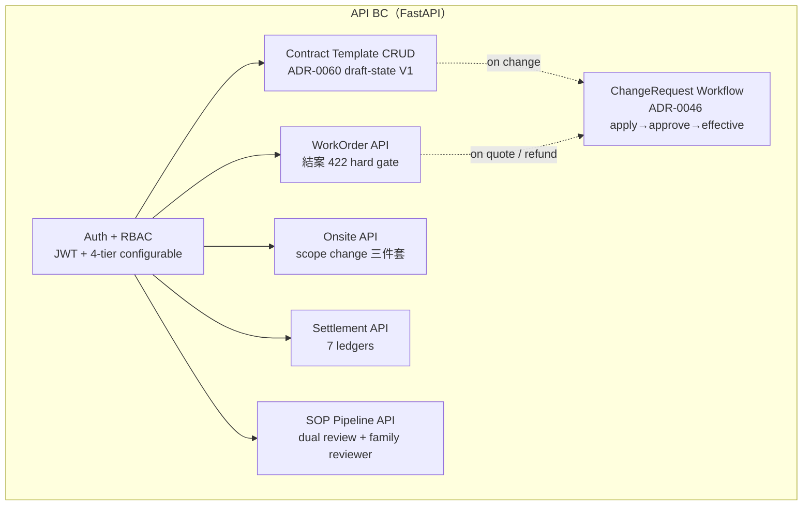
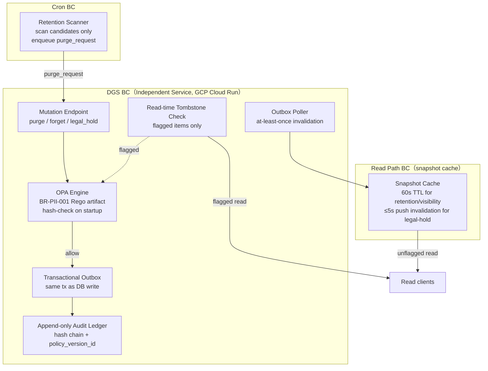
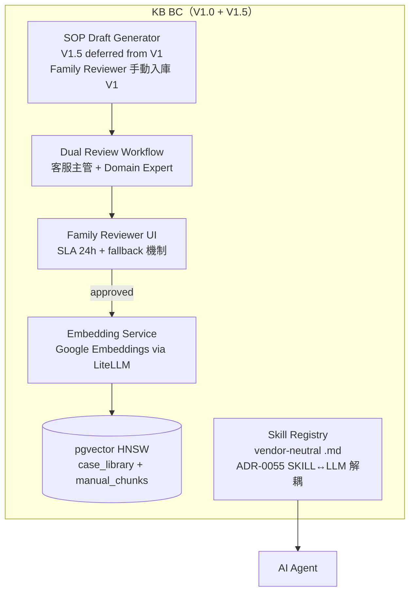
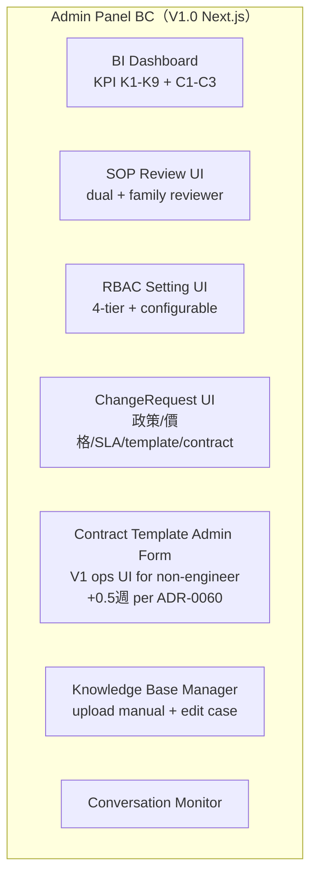

# C4 Level 3 — Component Diagram | 智慧鎖 SaaS 平台

> **狀態**：v1 draft（Gate 4 ready）
> **更新**：2026-05-23
> **負責人**：Architect
> **關聯**：ARCH-0001（C4 L1/L2）+ NFR matrix + ADR-0060/0061

---

## §0 設計框架

延伸 ARCH-0001 C4 L1（System Context）+ L2（Container）到 L3（Component）。聚焦 V1 P0-critical bounded context + Forum F-01/F-04 新增的子系統。

**Bounded context 切法（trade-off）**：

- **AI Agent BC**：AI 對話 / 意圖 / PC 抽取 / 三層解決。coupling 對外只透過 Domain Event + read API
- **API BC**：WorkOrder / Onsite / Settlement / SOP（CRUD + 商業規則）
- **Contract Governance（v2.1，nested in admin-panel V1）**：V1 reversal trigger ≥ 2 partner → 抽離為獨立 module（ADR-0060）
- **DGS BC（v2.1）**：mutation 集中 / read 分層 + 雙軌 cache。獨立 service，blast radius 限縮在 PII / Evidence
- **KB BC**：知識庫向量索引 + SOP 螺旋
- **Admin Panel BC**：BI / RBAC / ChangeRequest / Contract admin form
- **Cron / Job BC**：retention scanner / Eval runner / observability poller

---

## §1 AI Agent Container（C4 L3）

```mermaid
graph TB
    subgraph "AI Agent BC（FastAPI + LangGraph + LiteLLM）"
        Webhook[LINE Webhook Handler<br/>FR-0024 HA retry / dedup 24h]
        Intent[Intent Classifier<br/>4 類: 報修/諮詢/投訴/其他]
        Sentiment[Sentiment Detector<br/>合約 4.4(a) ≥90%<br/>deterministic rule + LLM]
        MultiTurn[Multi-turn Dialogue Manager<br/>Memory 7-layer]
        PCExtractor[ProblemCard Extractor<br/>completeness scorer 0.85 gate]
        ThreeLayer[Three-Layer Resolution<br/>1. Case vector / 2. Manual RAG / 3. Human]
        Guardrail[Output Guardrail<br/>Final quote / 折扣 / 保固免費 偵測<br/>FR-NEW-9 image moderation]
        RuleEngine[Deterministic Rule Engine<br/>ADR-0034 急件 4類 + ADR-0048 7 條轉真人<br/>寫入 transfer_event.rule_triggered_by]
        EvalRunner[Forbidden Eval Runner<br/>200 題 block-deploy gate]
    end

    Webhook --> Intent
    Intent --> Sentiment
    Sentiment --> MultiTurn
    MultiTurn --> PCExtractor
    PCExtractor --> ThreeLayer
    ThreeLayer --> Guardrail
    Guardrail --> Webhook
    RuleEngine -.-> Sentiment
    RuleEngine -.-> ThreeLayer
    EvalRunner -.-> Guardrail
```

**Component 責任**：
- **Webhook Handler** — LINE webhook + idempotency（24h dedup）+ DLQ。blast radius：失敗只影響 LINE 對話 BC
- **Intent Classifier** — 4-class deterministic + LLM hybrid
- **Sentiment Detector** — 90% recall（合約 4.4(a)）；NFR Compliance failure mode 觸發 = §9 終止
- **PC Extractor** — 結構化 brand/model/symptom/urgency；completeness 0.85 為下游 dispatch 的 boundary
- **Three-Layer Resolution** — case_vector / manual_rag / human handoff（ADR-0048 7 rules）
- **Output Guardrail** — 3 規則偵測（number-no-modifier / 折扣 / 保固免費）+ image strip
- **Rule Engine** — 寫 `rule_triggered_by` enum；anti-corruption layer 防 AI gaming C2
- **Eval Runner** — 200 題 corpus 每 deploy 跑；block-deploy gate

---

## §2 API Container



**API endpoints 詳見 P3 OpenAPI**

---

## §3 Data Governance Service（DGS）— V1.0 P0-critical（ADR-0061）



**DGS BC trade-off**：
- 獨立 service = 增 ops 成本 + cross-network mutation hop（+50ms latency）
- 換來合規 audit 獨立性 + reversibility note 量化（從 service 退到 module ~2 sprint）
- failure mode：DGS down → mutation 全停（fail-closed），但 read 路徑用 snapshot cache 繼續

**DGS 元件責任**：
- **OPA Engine** — BR-PII-001 Rego artifact + hash-check + decision log
- **Mutation Endpoint** — purge / forget / legal_hold flip — sole executor，single writer invariant
- **Transactional Outbox** — same DB tx，at-least-once invalidation bus
- **Audit Ledger** — append-only + hash chain + retention eternal
- **Read-time Tombstone Check** — flagged items only（hot path）
- **Cron Scanner** — candidate scanner only，禁直接 DELETE

**SLO**：99.95% availability / mutation p95 < 500ms / invalidation lag p99 ≤ 30s

---

## §4 Knowledge Base Container



---

## §5 Admin Panel Container



---

## §6 Module Boundary 更新

從 ARCH-0001 baseline 4 模組（agent / api / web / data-pipeline）擴展為 V2.1：

| Module | Owner | V1 / V2 | Bounded context |
|:---|:---|:---|:---|
| ai-agent | devteam-arch | V1 | AI Agent BC |
| api | devteam-arch | V1 | API BC（含 Contract Template CRUD nested in admin-panel backend）|
| admin-panel | devteam-arch | V1 | Admin Panel BC |
| **dgs**（NEW）| devteam-arch | V1 | DGS BC（independent service）|
| knowledge-base | devteam-arch | V1（V1.5 SOP auto-gen）| KB BC |
| technician-app | devteam-arch | V2 | API + Web BC |
| data-pipeline（Bronze）| devteam-arch | V1 | Domain Event BC |

**ARCH-0006 reversal trigger**：當 ≥ 2 partner active → 從 admin-panel backend 抽離 `contract-governance` 為獨立 module（ADR-0060）

---

## §7 Failure Modes（與 NFR matrix 連動）

詳見 [`nfr-matrix-smart-lock-saas.md`](nfr-matrix-smart-lock-saas.md) §10 Failure Modes Catalogue。

---

**Gate 4 NFR + ADR Baseline Freeze** — ✅ ready（含 ADR-0060, ADR-0061, NFR matrix, C4 L3）
