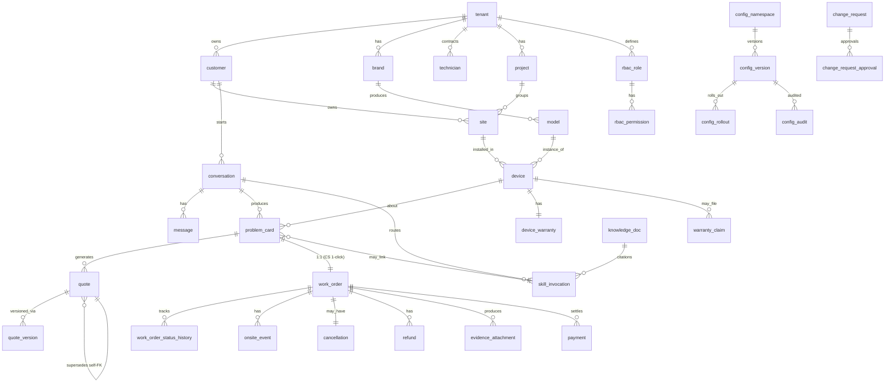

# ERD — Smart Lock SaaS Platform (Phase I MVP)

> **Status**: v1.0 (Gate 5b ready — final-spec module coverage)
> **Date**: 2026-05-28
> **Owner**: DBA (devteam-design)
> **Scope**: Phase I MVP table set covering M01-M07 / M11 / M13-M18 + A01-A12 + S-M01-S-M06
> **Database**: PostgreSQL 16 + pgvector (per OQ-001 / ADR-0002)
> **Companion**: [`ddl-migration-001-init.sql`](./ddl-migration-001-init.sql) — initial migration script
> **Sibling**: [`erd.md`](./erd.md) — v1.1 draft with quote/pricing detail; this file is the Phase I module-coverage version that complements it.

> **Cross-ref**:
> - [PRD v2.3](../../prd/smart-lock-saas.md) §E.2 Phase I module list
> - [System Spec v2.2](../../analysis/system-spec-smart-lock-saas.md) §1 business entities
> - ADR-0030 tenant propagation · ADR-0040 v2 refund SoD · ADR-0042 RBAC L1-L4 ·
>   ADR-0044 warranty mode · ADR-0050 evidence visibility · ADR-0051 retention ·
>   ADR-0060 contract template · ADR-0064 quote snapshot hash chain ·
>   ADR-0066 quote-WO binding · ADR-0067 M18 config governance · ADR-0068 ACL ·
>   ADR-0101 KB scope · ADR-0102 cancellation v2

---

## §0 設計守則（DBA 視角先講壞情境）

| 風險 | 為什麼會炸 | Mitigation |
|:-----|:----------|:-----------|
| 跨 tenant 寫入 | ADR-0030 violation = 信任崩盤 | `tenant_id` 一級欄位 NOT NULL；RLS policy on `tenant_id = current_setting('app.tenant_id')`；session entry 強制設定 |
| PII 明文落地 | 一次 dump = 個資外洩 | Envelope encryption per-tenant DEK；`*_enc bytea` 落欄位；KMS CMK 管 KEK |
| Cron 直接 DELETE 繞 DGS | audit 空白 → GDPR Art.17 違約 | Cron = scanner only；DGS = sole executor；REVOKE DELETE from `cron_role` |
| 結算 / 配置 quote snapshot 解綁 | quote.customer_sent 以上 state 必有 snapshot | `CHECK (state='draft' OR snapshot_hash IS NOT NULL)` + INSERT trigger 雙層 |
| Config dual-source-of-truth | Module 偷 query config DB 繞 ACL | `config_*` 表 GRANT 僅給 `m18_admin_role` + `m18_acl_reader_role`；其他 role REVOKE SELECT |
| Append-only ledger 被 UPDATE | 帳本破洞 → 合規 fail | `BEFORE UPDATE` trigger on `journal_entry` raise exception；REVOKE UPDATE/DELETE from app role |
| Hot table without partition | `work_order`、`message`、`audit_event` 隨時間長 → 查詢爆 | `work_order` partition by `created_at` (monthly)；`message` partition by `created_at` (weekly)；`audit_event` partition by `ts` (monthly) |
| Migration 沒 down script | 上線發現 bug 無法回滾 | 每筆 migration 強制 forward + rollback 配對 |
| 大表 backfill 全表 UPDATE | 數小時 lock contention | Batched `LIMIT 10000 + sleep 100ms`；off-peak window |
| `legal_hold` 用 partition key | flip true 要搬 row 跨 partition | Column-level；partition by `retention_class` 不動 |

---

## §1 Top-level ER



---

## §2 Table Catalog (33 tables — Phase I MVP)

> Schema = **`saas`** (avoid `public`). All tables MUST carry `tenant_id` column unless explicitly marked "global lookup".

### §2.1 Identity & RBAC (7 tables)

#### `saas.tenant` — 租戶主檔
| Column | Type | Constraint | Note |
|:-------|:-----|:-----------|:-----|
| `id` | `uuid` | PK, default `gen_random_uuid()` | |
| `name` | `text` | NOT NULL | |
| `locale` | `text` | default 'zh-TW' | |
| `tenant_status` | `text` | NOT NULL, enum {active, suspended, archived} | |
| `created_at` | `timestamptz` | NOT NULL default `now()` | |
| `updated_at` | `timestamptz` | NOT NULL default `now()` | audit trigger |

#### `saas.brand` — 品牌（V1 單一甲方但 schema 預埋）
| Column | Type | Constraint |
|:-------|:-----|:-----------|
| `id` | `uuid` | PK |
| `tenant_id` | `uuid` | FK → tenant, NOT NULL |
| `name` | `text` | NOT NULL |
| `status` | `text` | enum {active, archived} |
| `partner_id` | `uuid` | FK → partner, nullable (Phase II partner portal) |

#### `saas.project` — 建案（site group anchor）
| Column | Type | Constraint |
|:-------|:-----|:-----------|
| `id` | `uuid` | PK |
| `tenant_id` | `uuid` | FK → tenant |
| `builder_id` | `uuid` | nullable (Phase III) |
| `name` | `text` | NOT NULL |
| `unit_count` | `integer` | default 0 |

#### `saas.user_account` — 系統 actor（CS / tech / admin / family-reviewer 等）
| Column | Type | Constraint |
|:-------|:-----|:-----------|
| `id` | `uuid` | PK |
| `tenant_id` | `uuid` | FK → tenant |
| `display_name` | `text` | NOT NULL |
| `email_enc` | `bytea` | nullable (envelope) |
| `status` | `text` | enum {active, suspended, terminated} |

#### `saas.rbac_role` — 角色 (18 角色 × 4 tier per ADR-0042)
| Column | Type | Constraint |
|:-------|:-----|:-----------|
| `id` | `uuid` | PK |
| `tenant_id` | `uuid` | FK → tenant |
| `role_code` | `text` | NOT NULL e.g. `customer_service_supervisor` |
| `tier` | `text` | enum {L1, L2, L3, L4} |
| `description` | `text` | |

#### `saas.rbac_permission` — 權限矩陣（升維 role × resource × action × scope, ADR-0050 v2）
| Column | Type | Constraint |
|:-------|:-----|:-----------|
| `id` | `uuid` | PK |
| `role_id` | `uuid` | FK → rbac_role |
| `resource` | `text` | e.g. 'work_order', 'evidence' |
| `action` | `text` | enum {view, edit, approve} |
| `scope` | `text` | enum {tenant, brand, project, household} |
| `attr_mask` | `jsonb` | column-level PII mask (ADR-0050 v2) |
| `effective_from` | `timestamptz` | |
| `effective_to` | `timestamptz` | nullable for IT support time-boxed grants |

#### `saas.user_role_binding` — user × role 多對多
| Column | Type | Constraint |
|:-------|:-----|:-----------|
| `user_id` | `uuid` | FK |
| `role_id` | `uuid` | FK |
| `tenant_id` | `uuid` | (denormalized for RLS) |
| `granted_at` | `timestamptz` | |
| `granted_by` | `uuid` | FK → user_account |

### §2.2 Core (5 tables)

#### `saas.customer` — 客戶（PII envelope encryption）
| Column | Type | Constraint | Note |
|:-------|:-----|:-----------|:-----|
| `id` | `uuid` | PK | |
| `tenant_id` | `uuid` | FK → tenant, NOT NULL | RLS |
| `brand_scope` | `text[]` | default '{}' | ADR-0043 |
| `locale` | `text` | default 'zh-TW' | |
| `line_user_id` | `text` | unique within `(tenant_id, line_user_id)` | low-sensitivity, cleartext |
| `phone_enc` | `bytea` | nullable | DEK envelope (PII) |
| `name_enc` | `bytea` | nullable | DEK envelope (PII) |
| `pii_retention_policy` | `text` | enum {default, custom} default 'default' | |
| `dek_id` | `uuid` | FK → tenant_dek | per-tenant DEK ID |
| `created_at` | `timestamptz` | | |
| `purged_at` | `timestamptz` | nullable | two-phase purge anchor |

> **Index**: `(tenant_id, line_user_id) UNIQUE`; `(tenant_id, purged_at) WHERE purged_at IS NOT NULL` (GDPR reverse lookup)

#### `saas.site` — 案場
| Column | Type | Constraint |
|:-------|:-----|:-----------|
| `id` | `uuid` | PK |
| `tenant_id` | `uuid` | FK |
| `customer_id` | `uuid` | FK |
| `project_id` | `uuid` | FK nullable (建案 site group) |
| `address_enc` | `bytea` | PII encrypted |
| `geo_district` | `text` | cleartext (low-sensitivity) |

#### `saas.model` — 鎖型號 (M02)
| Column | Type | Constraint |
|:-------|:-----|:-----------|
| `id` | `uuid` | PK |
| `tenant_id` | `uuid` | FK |
| `brand_id` | `uuid` | FK |
| `sku` | `text` | NOT NULL, unique within `(brand_id, sku)` |
| `category` | `text` | e.g. 'main_lock', 'auxiliary' |

#### `saas.device` — 智慧鎖實體 (ADR-0053 serial mandatory for main lock + >NTD 1000)
| Column | Type | Constraint |
|:-------|:-----|:-----------|
| `id` | `uuid` | PK |
| `tenant_id` | `uuid` | FK |
| `serial` | `text` | nullable (CHECK: NOT NULL if main_lock OR list_price > 1000) |
| `brand_id` | `uuid` | FK |
| `model_id` | `uuid` | FK |
| `site_id` | `uuid` | FK |
| `main_lock` | `boolean` | default false |
| `purchase_date` | `date` | |
| `created_at` | `timestamptz` | |

#### `saas.device_warranty` — 保固（ADR-0044 五模式）
| Column | Type | Constraint |
|:-------|:-----|:-----------|
| `device_id` | `uuid` | PK, FK → device |
| `tenant_id` | `uuid` | (denormalized for RLS) |
| `warranty_mode` | `text` | NOT NULL, enum {purchase, handover, activation, contract, manual_override} |
| `warranty_start_date` | `date` | NOT NULL |
| `warranty_expiry_date` | `date` | NOT NULL |
| `coverage_class` | `text` | enum {full, parts_only, labor_only, expired} |
| `manual_override_reason` | `text` | nullable (required when mode=manual_override) |
| `last_change_request_id` | `uuid` | nullable FK |

### §2.3 Work order pipeline (8 tables)

#### `saas.problem_card` — 問題卡
| Column | Type | Constraint |
|:-------|:-----|:-----------|
| `id` | `uuid` | PK |
| `tenant_id` | `uuid` | FK |
| `conversation_id` | `uuid` | FK |
| `device_id` | `uuid` | FK nullable (urgent path may not yet know device) |
| `urgency` | `text` | enum {normal, urgent_locked_out, urgent_trapped_inside, urgent_safety_risk, urgent_angry_customer_high_risk} |
| `urgency_detected_at` | `timestamptz` | |
| `completeness_score` | `numeric(3,2)` | range 0..1 |
| `state` | `text` | enum {incomplete, draft, confirmed, ai_responded, resolved} |
| `clarification_confirmed_at` | `timestamptz` | nullable |
| `clarification_attempts` | `integer` | default 0 |
| `emergency_class` | `text` | nullable, enum (denormalized from urgency for carve-out FK use) |

> **Unique**: partial index `(conversation_id, device_id) WHERE state IN ('draft','confirmed','ai_responded')` — ADR-0036 active issue rule

#### `saas.quote` — 報價（與既有 erd.md §quote 對齊；本檔僅補 reference）
> Detail schema in `erd.md` v1.1; this file does not redefine to avoid divergence.

#### `saas.quote_version` — 報價 immutable hash chain (ADR-0064)
| Column | Type | Constraint |
|:-------|:-----|:-----------|
| `id` | `uuid` | PK |
| `tenant_id` | `uuid` | FK |
| `quote_id` | `uuid` | FK |
| `version_no` | `integer` | NOT NULL |
| `snapshot_hash` | `text` | NOT NULL, sha256 of canonical_form |
| `prev_hash` | `text` | nullable (chain head) |
| `canonical_payload` | `jsonb` | NOT NULL (frozen) |
| `created_at` | `timestamptz` | NOT NULL |

> **Append-only**: REVOKE UPDATE/DELETE from app role; `BEFORE UPDATE` trigger raise exception.
> **Unique**: `(quote_id, version_no) UNIQUE`; `snapshot_hash UNIQUE` (content-addressable).

#### `saas.work_order` — 工單（partitioned by `created_at` monthly）
| Column | Type | Constraint |
|:-------|:-----|:-----------|
| `id` | `uuid` | PK |
| `tenant_id` | `uuid` | FK |
| `pc_id` | `uuid` | FK |
| `state` | `text` | enum {draft, created, assigned, accepted, in_progress, completed, cancelled} |
| `address_enc` | `bytea` | nullable (filled before close — ADR-0032 hard gate) |
| `assigned_technician_id` | `uuid` | nullable FK |
| `create_trigger` | `text` | enum {ai_path_customer_triggered, cs_path_csagent_triggered} |
| `created_by_user_id` | `uuid` | FK (CS 1-click actor — ADR-0031) |
| `quote_id` | `uuid` | nullable FK (ADR-0066: NULL only for emergency carve-out) |
| `emergency_class` | `text` | nullable (denormalized for carve-out gate) |
| `retrospective_quote_audit_complete` | `boolean` | default false |
| `idempotency_key` | `text` | unique within tenant |
| `created_at` | `timestamptz` | NOT NULL (partition key) |
| `closed_at` | `timestamptz` | nullable |

> **Constraint**: `CHECK ((state != 'completed') OR (address_enc IS NOT NULL))` — ADR-0032
> **Constraint**: `CHECK (quote_id IS NOT NULL OR emergency_class IS NOT NULL)` — ADR-0066
> **Partition**: `PARTITION BY RANGE (created_at)` monthly

#### `saas.work_order_status_history` — 狀態流轉 audit trail (append-only)
| Column | Type | Constraint |
|:-------|:-----|:-----------|
| `id` | `bigserial` | PK |
| `tenant_id` | `uuid` | FK |
| `work_order_id` | `uuid` | FK |
| `from_state` | `text` | |
| `to_state` | `text` | NOT NULL |
| `transitioned_by` | `uuid` | FK → user_account nullable |
| `transitioned_at` | `timestamptz` | NOT NULL default now() |
| `reason_code` | `text` | nullable |
| `evidence_ids` | `uuid[]` | default '{}' |

#### `saas.onsite_event` — 到場 / scope change / completion
| Column | Type | Constraint |
|:-------|:-----|:-----------|
| `id` | `uuid` | PK |
| `tenant_id` | `uuid` | FK |
| `work_order_id` | `uuid` | FK |
| `event_type` | `text` | enum {arrived, started_work, scope_change, pending_quote_v2, completed, customer_not_onsite, customer_disagreed_partial} |
| `gps_lat` | `numeric(9,6)` | |
| `gps_lng` | `numeric(9,6)` | |
| `gps_accuracy_m` | `numeric` | |
| `ts` | `timestamptz` | NOT NULL |
| `evidence_ids` | `uuid[]` | default '{}' |
| `notes` | `text` | |

#### `saas.cancellation` — 取消費 v2 (ADR-0102 6 階段)
| Column | Type | Constraint |
|:-------|:-----|:-----------|
| `id` | `uuid` | PK |
| `tenant_id` | `uuid` | FK |
| `work_order_id` | `uuid` | FK |
| `cancellation_stage` | `text` | NOT NULL, enum {S1, S1_5, S2, S3, S4, S5} |
| `initiator_role` | `text` | enum {customer, customer_service, technician, system_auto} |
| `reason_code` | `text` | FK → `config_reason_code_lookup.code` (via config namespace `cancellation_reason_codes`) |
| `customer_fee` | `numeric(12,2)` | |
| `travel_fee` | `numeric(12,2)` | |
| `technician_penalty` | `numeric(12,2)` | nullable |
| `goodwill_waiver` | `boolean` | default false |
| `audit_event_id` | `uuid` | FK → audit_event |
| `config_version_used` | `text` | NOT NULL (ADR-0067 §5 per-transaction snapshot) |
| `created_at` | `timestamptz` | |

#### `saas.refund` — 退款 (ADR-0040 v2 — 5 tier + SoD)
| Column | Type | Constraint |
|:-------|:-----|:-----------|
| `id` | `uuid` | PK |
| `tenant_id` | `uuid` | FK |
| `work_order_id` | `uuid` | FK |
| `amount` | `numeric(12,2)` | NOT NULL |
| `tier` | `text` | NOT NULL, enum {L1, L2, L3, L4, L5} |
| `refund_class` | `text` | NOT NULL, enum {product, labor, material, travel, inspection} |
| `state` | `text` | enum {pending, approved, executed, rejected} |
| `initiator_user_id` | `uuid` | FK |
| `approver_user_ids` | `uuid[]` | array (multi-sig for L4/L5) |
| `executor_user_id` | `uuid` | FK (system / payment provider) |
| `evidence_ids` | `uuid[]` | |
| `audit_event_id` | `uuid` | FK |
| `created_at` | `timestamptz` | |
| `executed_at` | `timestamptz` | nullable |

> **Constraint**: `CHECK (initiator_user_id != ALL(approver_user_ids) AND initiator_user_id != executor_user_id)` — SoD invariant (BR-M17-01)

### §2.4 Evidence & change-request (3 tables)

#### `saas.evidence_attachment` — 照片 / 簽名 / GPS (ADR-0050 visibility matrix + ADR-0051 retention)
| Column | Type | Constraint |
|:-------|:-----|:-----------|
| `sha256` | `text` | PK (content-addressable) |
| `tenant_id` | `uuid` | FK |
| `work_order_id` | `uuid` | FK nullable |
| `evidence_type` | `text` | enum {photo, signature, gps_proof, document} |
| `visibility_scope` | `jsonb` | NOT NULL — ADR-0050 v2 matrix: `{role_tier, lifecycle_phase, action[], attr_mask}` |
| `retention_class` | `text` | NOT NULL, enum {default_1y, rma_3y, eternal_audit, legal_hold} (ADR-0051) |
| `legal_hold` | `boolean` | default false (column-level, NOT partition key) |
| `dek_id` | `uuid` | FK → tenant_dek |
| `storage_uri` | `text` | NOT NULL (GCS / S3) |
| `created_at` | `timestamptz` | |
| `pending_purge_at` | `timestamptz` | nullable (T0 — DEK destroyed, soft-delete) |
| `purged_at` | `timestamptz` | nullable (T+30d hard delete) |
| `last_known_good_at` | `timestamptz` | nullable (BR-PII-002 cache stale fallback) |

> **Partition**: `PARTITION BY LIST (retention_class)` (4 partitions)
> **Constraint**: `CHECK (NOT legal_hold OR purged_at IS NULL)` (legal_hold blocks purge)
> **Index**: `(tenant_id, retention_class, pending_purge_at) WHERE pending_purge_at IS NOT NULL`

#### `saas.change_request` — 變更申請 (ADR-0046 + ADR-0065 type lookup)
| Column | Type | Constraint |
|:-------|:-----|:-----------|
| `id` | `uuid` | PK |
| `tenant_id` | `uuid` | FK |
| `type_code` | `text` | FK → `change_request_type_dim.code` (lookup table per ADR-0065) |
| `state` | `text` | enum {draft, pending_approval, approved, rejected, effective, retired} |
| `payload_diff` | `jsonb` | NOT NULL |
| `effective_date` | `date` | nullable |
| `reason` | `text` | |
| `created_by` | `uuid` | FK |
| `created_at` | `timestamptz` | |

#### `saas.change_request_approval` — 多簽 1:N (replaces former jsonb)
| Column | Type | Constraint |
|:-------|:-----|:-----------|
| `id` | `uuid` | PK |
| `change_request_id` | `uuid` | FK |
| `approver_user_id` | `uuid` | FK |
| `decision` | `text` | enum {approve, reject, abstain} |
| `decided_at` | `timestamptz` | |
| `rationale` | `text` | |

### §2.5 Chatbot (5 tables)

#### `saas.conversation` (per system spec §1)
| Column | Type | Constraint |
|:-------|:-----|:-----------|
| `id` | `uuid` | PK |
| `tenant_id` | `uuid` | FK |
| `customer_id` | `uuid` | FK |
| `channel_type` | `text` | enum {line, web, hotline} |
| `state` | `text` | enum {active, resolving, escalated, closed, auto_closed} |
| `auto_closed_at` | `timestamptz` | |
| `reopen_count` | `integer` | default 0 |
| `started_at` | `timestamptz` | NOT NULL |

#### `saas.message` — 對話訊息 (partitioned by `created_at` weekly)
| Column | Type | Constraint |
|:-------|:-----|:-----------|
| `id` | `uuid` | PK |
| `tenant_id` | `uuid` | FK |
| `conversation_id` | `uuid` | FK |
| `sender_role` | `text` | enum {customer, ai_agent, cs_agent, system} |
| `text` | `text` | (PII redaction at read-time via mask matrix) |
| `media_refs` | `text[]` | default '{}' |
| `created_at` | `timestamptz` | NOT NULL (partition key) |

#### `saas.skill_invocation` — A03 ReAct tool call audit
| Column | Type | Constraint |
|:-------|:-----|:-----------|
| `id` | `uuid` | PK |
| `tenant_id` | `uuid` | FK |
| `conversation_id` | `uuid` | FK |
| `skill_name` | `text` | |
| `input_hash` | `text` | |
| `output_hash` | `text` | |
| `latency_ms` | `integer` | |
| `guardrail_passed` | `boolean` | |
| `rule_triggered_by` | `text` | (BR-AI-003 deterministic — see openapi schema enum) |
| `citations` | `jsonb` | array of `{doc_id, chunk_id}` |
| `ts` | `timestamptz` | |

#### `saas.knowledge_doc` — KB doc (ADR-0008 mega-doc + ADR-0101 scope)
| Column | Type | Constraint |
|:-------|:-----|:-----------|
| `id` | `uuid` | PK |
| `doc_type` | `text` | enum {mega_doc, manual, sop, faq} |
| `tenant_scope` | `text[]` | NOT NULL, default '{}' (empty = global) |
| `brand_scope` | `text[]` | default '{}' |
| `project_scope` | `text[]` | default '{}' |
| `title` | `text` | |
| `version` | `text` | |
| `effective_date` | `date` | |
| `source_uri` | `text` | |
| `content_hash` | `text` | sha256 — for stale-detection vs ERP master |

> **Index**: GIN on `tenant_scope`, `brand_scope`, `project_scope` for scope filtering
> **Stale SLA**: ADR-0101 §2.1 — must lag master ≤ 24h (monitored via `last_synced_at` + alert)

#### `saas.knowledge_chunk_embedding` — pgvector chunks
| Column | Type | Constraint |
|:-------|:-----|:-----------|
| `id` | `uuid` | PK |
| `doc_id` | `uuid` | FK |
| `chunk_text` | `text` | |
| `embedding` | `vector(768)` | NOT NULL (Google text-embedding-004 dimension) |
| `tenant_scope` | `text[]` | (denormalized for fast scope filter) |

> **Index**: `ivfflat (embedding vector_cosine_ops)` with `lists=100` for pgvector ANN
> **Index**: GIN on `tenant_scope`

### §2.6 Settlement (2 tables — Phase I light; full M12 in Phase II)

#### `saas.payment` — 客戶端付款記錄
| Column | Type | Constraint |
|:-------|:-----|:-----------|
| `id` | `uuid` | PK |
| `tenant_id` | `uuid` | FK |
| `work_order_id` | `uuid` | FK |
| `method` | `text` | enum {onsite_cash, link, bank_transfer} |
| `amount` | `numeric(12,2)` | |
| `state` | `text` | enum {pending, paid, failed} |
| `evidence_id` | `text` | nullable FK → evidence_attachment.sha256 |
| `created_at` | `timestamptz` | |

#### `saas.journal_entry` — append-only ledger (7 帳本 cross-account)
| Column | Type | Constraint |
|:-------|:-----|:-----------|
| `id` | `bigserial` | PK |
| `tenant_id` | `uuid` | FK |
| `ledger_type` | `text` | enum {customer_ar, tech_ap, cash_collection, brand_settle, dispatcher_commission, refund, invoice_tax} |
| `dr_account` | `text` | |
| `cr_account` | `text` | |
| `amount` | `numeric(12,2)` | |
| `source_kind` | `text` | enum {work_order, cancellation, refund, voucher, payment, manual} |
| `source_id` | `uuid` | |
| `prev_hash` | `text` | nullable |
| `entry_hash` | `text` | NOT NULL (sha256 of canonical_form + prev_hash) |
| `created_at` | `timestamptz` | NOT NULL |

> **Append-only**: BEFORE UPDATE / DELETE trigger raise exception
> **Reversal**: corrections use reversal entry (`source_kind='manual'`), never UPDATE
> **Pricing snapshot**: NOT a ledger member (ADR-0064 v2 — quote snapshot lives in `quote_version` with own chain)

### §2.7 Config governance (4 tables — ADR-0067)

#### `saas.config_namespace`
| Column | Type | Constraint |
|:-------|:-----|:-----------|
| `code` | `text` | PK (e.g. 'pricing', 'cancellation_reason_codes', 'sla') |
| `description` | `text` | |
| `json_schema` | `jsonb` | NOT NULL — used for pre-flight validation (ADR-0067 §1) |
| `owner_role_codes` | `text[]` | array of `rbac_role.role_code` allowed to draft |

#### `saas.config_version`
| Column | Type | Constraint |
|:-------|:-----|:-----------|
| `id` | `uuid` | PK |
| `tenant_id` | `uuid` | FK (nullable for global) |
| `namespace` | `text` | FK → config_namespace.code |
| `key` | `text` | NOT NULL |
| `value` | `jsonb` | NOT NULL |
| `state` | `text` | enum {draft, rolling_out, active, retired, rolled_back} |
| `parent_version_id` | `uuid` | nullable FK self |
| `created_by` | `uuid` | FK → user_account |
| `created_at` | `timestamptz` | |
| `activated_at` | `timestamptz` | nullable |

> **Unique**: at most one `state='active'` per `(tenant_id, namespace, key)` — partial unique index

#### `saas.config_rollout`
| Column | Type | Constraint |
|:-------|:-----|:-----------|
| `id` | `uuid` | PK |
| `config_version_id` | `uuid` | FK |
| `strategy` | `text` | enum {canary_5_50_100, instant} |
| `current_stage` | `text` | enum {'5%','50%','100%','rolled_back'} |
| `stage_started_at` | `timestamptz` | |
| `next_stage_eta` | `timestamptz` | |
| `initiator_user_id` | `uuid` | FK |
| `approver_user_id` | `uuid` | FK (CHECK ≠ initiator) |

#### `saas.config_audit`
| Column | Type | Constraint |
|:-------|:-----|:-----------|
| `id` | `bigserial` | PK |
| `tenant_id` | `uuid` | FK |
| `config_version_id` | `uuid` | FK |
| `actor_user_id` | `uuid` | FK |
| `action` | `text` | enum {draft_created, rollout_started, stage_advanced, rolled_back, activated, retired} |
| `diff` | `jsonb` | |
| `ts` | `timestamptz` | NOT NULL |

> **Retention**: ≥ 7y (align with ADR-VCH-002 voucher retention)

### §2.8 Audit & cross-cutting (1 table)

#### `saas.audit_event` — partitioned by `ts` monthly
| Column | Type | Constraint |
|:-------|:-----|:-----------|
| `id` | `uuid` | PK |
| `tenant_id` | `uuid` | FK |
| `event_type` | `text` | NOT NULL |
| `actor_user_id` | `uuid` | nullable (system) |
| `actor_role` | `text` | |
| `source_kind` | `text` | |
| `source_id` | `uuid` | |
| `diff_ref` | `text` | (S3 / GCS URI; PII masked) |
| `trace_id` | `text` | W3C tracecontext |
| `ts` | `timestamptz` | NOT NULL (partition key) |

---

## §3 Cross-cutting policies

### §3.1 RLS (Row-Level Security)

All tables carrying `tenant_id` get policy:

```sql
CREATE POLICY tenant_isolation ON saas.<table>
  USING (tenant_id = current_setting('app.tenant_id', true)::uuid);
ALTER TABLE saas.<table> ENABLE ROW LEVEL SECURITY;
```

Session entry handler MUST `SET LOCAL app.tenant_id = '<uuid>'` before any query. Cross-tenant write blocked.

### §3.2 PII column inventory

| Table | PII columns | Treatment |
|:------|:-----------|:----------|
| `customer` | `phone_enc`, `name_enc` | Envelope encryption per-tenant DEK |
| `site` | `address_enc` | Envelope encryption |
| `user_account` | `email_enc` | Envelope encryption |
| `message` | `text` | Read-time PII mask via `attr_mask` (ADR-0050 v2); training pipeline anonymized |
| `evidence_attachment` | image / signature blobs | Storage encryption + DEK; per-frame visibility mask |
| `audit_event` | `diff_ref` | Server-side PII redaction before persist |

### §3.3 Retention rules (ADR-0051 cross-ref)

| Class | TTL | Storage tier |
|:------|:----|:-------------|
| `default_1y` | 1y | hot PG |
| `rma_3y` | 3y | hot PG → cold S3 after 1y |
| `eternal_audit` | indefinite | hot PG (audit_event, journal_entry, config_audit) |
| `legal_hold` | indefinite (must clear via ADR change) | column flag — does not migrate partition |

### §3.4 Partition map

| Table | Partition key | Strategy |
|:------|:--------------|:---------|
| `work_order` | `created_at` | RANGE monthly |
| `message` | `created_at` | RANGE weekly |
| `audit_event` | `ts` | RANGE monthly |
| `evidence_attachment` | `retention_class` | LIST (4 partitions) |
| `journal_entry` | `created_at` | RANGE monthly |

### §3.5 Index recipes (high-traffic queries)

| Query pattern | Index |
|:--------------|:------|
| WO inbox by tenant + state + recent | `(tenant_id, state, created_at DESC)` partial WHERE state IN ('created','assigned','in_progress') |
| CS queue (problem_card draft) | `(tenant_id, state, created_at DESC)` |
| Audit query by actor / time | `(tenant_id, actor_user_id, ts DESC)` |
| GDPR forget candidate | `(tenant_id, purged_at) WHERE purged_at IS NULL` |
| Config read | covering `(tenant_id, namespace, key, state) INCLUDE (value, id)` partial WHERE state='active' |
| pgvector ANN | `ivfflat (embedding vector_cosine_ops) lists=100` |
| KB scope | GIN on `(tenant_scope, brand_scope, project_scope)` |

---

## §4 Cross-ref to ADRs

| ADR | Enforced where |
|:----|:--------------|
| ADR-0030 tenant propagation | RLS policy on every table; `tenant_id` NOT NULL |
| ADR-0040 v2 refund SoD | `refund.CHECK initiator != approver != executor` |
| ADR-0042 RBAC 4-tier | `rbac_role.tier` + `rbac_permission.action` |
| ADR-0044 warranty mode | `device_warranty.warranty_mode` enum |
| ADR-0050 v2 visibility | `evidence_attachment.visibility_scope` jsonb + `rbac_permission.attr_mask` |
| ADR-0051 retention | `evidence_attachment.retention_class` LIST partition |
| ADR-0053 serial | `device.serial CHECK (NOT NULL when main_lock OR price > 1000)` |
| ADR-0064 quote snapshot | `quote_version` append-only chain |
| ADR-0066 quote-WO binding | `work_order.CHECK (quote_id IS NOT NULL OR emergency_class IS NOT NULL)` |
| ADR-0067 M18 config | 4 tables (`config_namespace`, `config_version`, `config_rollout`, `config_audit`) |
| ADR-0068 ACL | DB-level GRANT — only `m18_admin_role` + `m18_acl_reader_role` can SELECT config tables |
| ADR-0101 KB scope | `knowledge_doc.tenant_scope` + `brand_scope` + `project_scope` arrays + GIN index |
| ADR-0102 cancellation v2 | `cancellation.cancellation_stage` enum (S1-S5) + `reason_code` via config lookup |

---

## §5 Migration plan

| Phase | Migration | Window |
|:------|:----------|:-------|
| **001** init | This file → `ddl-migration-001-init.sql` (full Phase I MVP schema) | T0 (W1) |
| 002 ACL hardening | GRANT/REVOKE separation for `m18_acl_reader_role` (cron / app roles loses direct config SELECT) | T0 + 1w |
| 003 RLS enable | Switch tables to `ENABLE ROW LEVEL SECURITY`; dogfood per-tenant queries | T0 + 2w |
| 004 Partition rollover | Pre-create next-3-months partitions; pg_partman handoff | continuous |
| 005 Phase II (deferred) | M12 settlement detail tables, M14 partner B2B sync tables, A12 governance tables | Phase II planning |

Each migration ships with **forward + rollback** scripts; rollback drilled in staging (PITR window 7d).
