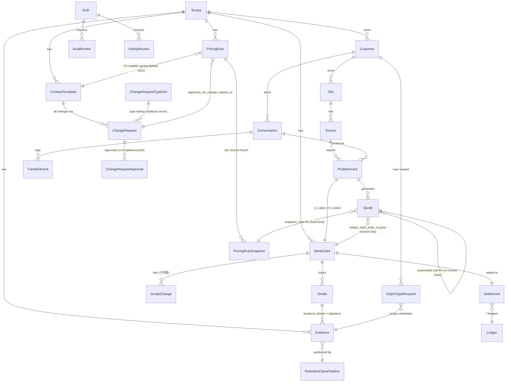

# ERD — 智慧鎖 SaaS 平台

> **狀態**：v1.1 draft（Gate 5b re-freeze pending — Forum 2026-05-26-Q01 cascade）
> **更新**：2026-05-26
> **負責人**：DBA
> **關聯**：System Spec §1 + ADR-0030 / 0050 / 0051 / 0060 / 0061 + ADR-0062 / 0063 / 0064 / 0065 / 0066 + Forum F-04 + Forum 2026-05-26-Q01

---

## §0 風險先行（dba 觀點）

> 先講壞情境，再給 mitigation。

| 風險 | 為什麼會炸 | Mitigation |
|:---|:---|:---|
| Cron 直接 `DELETE` PII 繞過 DGS audit | dual writer race，audit 空白 = §9 終止 | Cron = scanner only；DGS = sole executor；RLS REVOKE DELETE 給 cron role |
| Hard delete 無法證明 PII 已銷毀 | GDPR Art.17 audit 缺證據 | Two-phase purge + crypto-shred per-tenant DEK |
| Migration 沒 down script | 上線當下發現 bug 無法回滾 | 強制 down migration；雙寫期 ≥ 2 release |
| Migration backfill 大表全表 UPDATE | lock contention 數小時 | Batched `LIMIT 10000 + sleep 100ms`；off-peak window |
| `legal_hold` 用 partition key | flip 為 true 要搬 row 跨 partition，IO blowup | Column-level；partition by `retention_class` |
| Partial index 失效 | cron 變 seq scan，每次掃幾百萬 row | 每季 EXPLAIN 驗證 predicate 命中 |
| Outbox bus lag → cache stale | 已 purge 的 row 仍 serve | Transactional outbox + push invalidation + circuit breaker |
| Cross-tenant 寫入 | ADR-0030 違反 = 信任崩潰 | RLS policy on `tenant_id`；每筆 mutation 自動帶 session.tenant_id |
| PII 欄位明文存 | 一次 DB dump = 個資外洩 | Envelope encryption per-tenant DEK + KMS CMK |
| Quote snapshot 解綁（snapshot_hash NULL）| Q1=A 硬綁定下任何 customer_sent 以上 state 必須有 snapshot；NULL = audit chain 斷 | Check constraint `state IN ('draft') OR snapshot_hash IS NOT NULL`；INSERT/UPDATE trigger 雙層防護 |
| ChangeRequest type 4-phase dual-write race | M-2026-05-26-03 Phase 3 雙寫期讀寫切換 race condition | Feature flag gradual rollout + 雙寫 ≥ 2 release + Phase 4 drop column 前 staging PITR drill |
| pricing_rule 無 active rule（seed 缺漏）| pricing engine query miss → 客服需手動 override → SLI 20% page | M-2026-05-26-01 Phase B 客服 seed 完成 gate（每 tenant × brand × service_type × distance_tier 至少 1 條 active rule）+ NFR-Perf-008 alert |
| snapshot_hash 入錯 hash chain | dba-B-3b reject — 若誤入 journal_entry hash chain，業務 audit 污染財務憑證鏈 | ADR-0064 明文分流；audit_trail.snapshot_hash 為 reference pointer 而非 chain member；code review 必檢 |

---

## §1 Top-level ER



---

## §2 Core Tables（V1 P0）

### tenant
- `id` PK
- `name`, `locale`, `tenant_status`
- `created_at`, `updated_at`

### customer（PII，envelope 加密）
- `id` PK
- `tenant_id` FK → tenant（ADR-0030）
- `brand_scope` text[]
- `locale`
- `line_user_id`（cleartext，low sensitivity）
- `phone_enc` bytea（envelope encryption，per-tenant DEK）
- `name_enc` bytea
- `pii_retention_policy` enum [default, custom]
- `created_at`
- **Indexes**：`(tenant_id, line_user_id)` unique；`(tenant_id, purged_at)` 給 GDPR forget reverse lookup
- **Migration risk**：PII 欄位加密化要 2-release 雙寫期（明文 + 密文同時寫），不能一次切

### site
- `id` PK, `customer_id` FK
- `site_group_id`（建案專案）
- `address_enc` bytea
- `geo_district` text
- `tenant_id` FK

### device
- `id` PK
- `serial` text not null（主鎖 + >1000 高價必填，ADR-0053）
- `brand`, `model`
- `purchase_date` date
- `warranty_start_date` date
- `warranty_mode` enum [purchase, handover, activation, contract, manual_override]（ADR-0044）
- `site_id` FK
- `tenant_id` FK

### conversation
- `id` PK
- `customer_id` FK, `tenant_id` FK
- `channel_type` text not null（預留多 channel）
- `state` enum [active, resolving, escalated, closed, auto_closed]
- `auto_closed_at` timestamp
- `reopen_count` int default 0

### problem_card
- `id` PK
- `conversation_id` FK, `device_id` FK, `tenant_id` FK
- `brand`, `model`
- `symptom` text[]
- `urgency` enum [normal, locked_out, trapped_inside, safety_risk, angry_customer_high_risk]（ADR-0034）
- `completeness_score` numeric(3,2)
- `media_refs` text[]
- `state` enum [incomplete, draft, confirmed, resolved]
- `active_status` boolean
- **Unique constraint**：`(conversation_id, device_id, active_status=true)`（ADR-0036；query plan 走 unique index scan）
- **Index**：`(tenant_id, state, urgency)` 給 K-metrics

### work_order
- `id` PK
- `pc_id` FK
- `tenant_id` FK
- `state` enum [created, assigned, accepted, in_progress, completed, cancelled]
- `state_history` jsonb（append-only）
- `address` text nullable（結案 422 hard gate；ADR-0032）
- `idempotency_key` text not null unique
- `created_by_role` text not null check (= 'customer_service')
- **Check constraint**：state=completed 時 address IS NOT NULL

### onsite
- `id` PK, `wo_id` FK
- `arrival_proof_ref` text
- `material_used` jsonb（含 owner: platform/brand/locksmith，ADR-0052）
- `customer_signature_ref` text
- `scope_change_events` jsonb[]

### quote（**Forum 2026-05-26-Q01 cascade — Q1=A 硬綁定**）
- `id` PK
- `pc_id` FK → problem_card（保 ProblemCard parent，dba-B-4 不走 polymorphic）
- `tenant_id` FK → tenant（RLS）
- `version` int
- `effective_date` date
- `approval_chain` jsonb
- `range_only` boolean not null default true（AI 不可 final，ADR-0035）
- **新增（Forum 2026-05-26-Q01）**：
  - `state` enum [draft, internal_approved, customer_sent, customer_confirmed, rejected, expired, retrospective_audit_only] not null
  - `snapshot_hash` text **nullable** FK → `pricing_rule_snapshot(snapshot_hash)`（dba-B-3a hybrid FK；Q1=A 硬綁定 — `state ∈ {customer_sent, customer_confirmed, rejected, expired, retrospective_audit_only}` 強制有 snapshot，由 check constraint enforce；draft / internal_approved state 允許 NULL 過渡）
  - `amount_breakdown` jsonb（frozen pricing display data：base / travel / material / urgency surcharge / total）
  - `supersedes_quote_id` FK → `quote(id)` self-reference nullable（re-version chain）
  - `related_work_order_id` FK → `work_order(id)` nullable（dba-B-4 解 polymorphic — quote 保 PC parent + WO link post-creation）
  - `customer_sent_at` timestamp nullable
  - `customer_confirmed_at` timestamp nullable
  - `customer_consent_method` enum [liff_full, flex_simple_fallback] nullable
  - `consent_ip_enc` bytea nullable（PII envelope encryption per-tenant DEK，ADR-VCH-002 retention = settlement 後 5y）
  - `consent_device_fingerprint_enc` bytea nullable（同上）
  - `audit_trail` jsonb[]（含 `trace_id`、state transition、actor_role）
  - `expired_at` timestamp nullable
- **Check constraint**：
  - `state IN ('draft', 'internal_approved') OR snapshot_hash IS NOT NULL`（Q1=A 硬綁定 — customer_sent 以上必有 snapshot；draft / internal_approved 內部過渡允許 NULL）
  - `state != 'customer_confirmed' OR (customer_confirmed_at IS NOT NULL AND customer_consent_method IS NOT NULL)`
  - `state != 'customer_sent' OR customer_sent_at IS NOT NULL`
- **Indexes**：
  - Partial: `(customer_sent_at) WHERE state='customer_sent' AND purged_at IS NULL`（給過期 cron 用，`CREATE INDEX CONCURRENTLY`，dba-B-5）
  - `(tenant_id, state)`（BI 報表）
  - `(supersedes_quote_id)`（re-version chain query）
  - `(related_work_order_id) WHERE related_work_order_id IS NOT NULL`（WO 反查 quote）
  - `(snapshot_hash)`（snapshot 反查所有引用 quote）
- **RLS**：`tenant_id` isolation enforced（ADR-0030）
- **Backfill**：既有 row（range_only=true）→ `state='draft'`；2-release dual-write（V1 多半無 row）
- **PII classification**：consent_ip / consent_device_fingerprint = PII Class B（envelope encryption + 5y retention）
- **引用**：ADR-0066（Quote state machine + 硬綁定）+ ADR-0063（Snapshot immutable hash）+ ADR-VCH-002（consent retention）

---

## §3 Contract Template（ADR-0060 — V1 P0）

### contract_template
- `id` PK
- `tenant_id` FK
- `partner_id` FK → partner
- `version` int
- `effective_date` date
- `state` enum [draft]（V1 only；V2 加 submitted/approved/published/retired）
- `scope_brand_scope` text[]
- `scope_site_group_scope` text[]
- `liability_matrix` jsonb — `{brand_pct, platform_pct, locksmith_pct, customer_pct, dispute_resolution_party, secondary_responsible}`
- `visibility_rule` jsonb — `{allowed_roles[], effective_scope_snapshot}`
- `sla_definition` jsonb
- `monthly_settlement_rule` jsonb
- `cancellation_fee_tiers` jsonb
- `travel_fee_split` jsonb
- `created_at`, `updated_at`
- **Unique**：`(tenant_id, partner_id, version)`
- **RLS policy**：prevent direct DB UPDATE；only via API + ChangeRequest hook

### change_request（ADR-0046 + ADR-0065 修訂 — Forum 2026-05-26-Q01 Q4=A）
- `id` PK
- `type_code` text **FK → `change_request_type_dim(code)`**（Q4=A — 從 enum 改 lookup table FK，破 ADR-0046 V1 freeze）
- ~~`type` enum [policy, price, rbac, sla, template, contract]~~（**deprecated** — 走 4-phase dual-write migration M-2026-05-26-03 後 drop）
- `apply_by` text
- `approve_chain` jsonb（**deprecated**，由 `change_request_approval` sub-table 取代供 BI 查詢；保留作 V1 compatibility）
- `state` enum [pending, approved, effective, rejected]
- `effective_date` date
- `pricing_rule_version_id` text nullable（**新增** — 引用 `pricing_rule.version`，pricing 類 ChangeRequest 必填）
- `audit_trail` jsonb[]
- **Migration**：4-phase dual-write（M-2026-05-26-03）— Phase 1 加 `type_code` text column (nullable) → Phase 2 backfill from enum → Phase 3 swap reads + writes → Phase 4 drop `type` enum
- **Index**：`(type_code, state, effective_date)`、`(pricing_rule_version_id) WHERE pricing_rule_version_id IS NOT NULL`
- **引用**：ADR-0065（ChangeRequest type lookup table migration）

---

## §3.5 Pricing Engine（Forum 2026-05-26-Q01 cascade — ADR-0062 / 0063 / 0064 / 0065）

> Pricing rule + snapshot 為 V2 pricing engine 落地的核心 schema。Pricing 引擎落在 `api/pricing/` sub-module（與 `api/quote/` 平級，不抽獨立 service）。Quote 透過 `snapshot_hash` 硬綁定 immutable snapshot，達到「報價當下價格、客戶看到的金額、結算時憑證」三點一致。

### pricing_rule（dba-B-2 完整 schema — ADR-0062）
- `id` PK
- `tenant_id` FK → tenant（RLS isolation，ADR-0030）
- `contract_template_id` FK → contract_template **nullable**（global default rules — 全平台預設規則 contract_template_id IS NULL）
- `brand` text not null
- `service_type` enum [repair, replacement, inspection, emergency]
- `distance_tier` enum [same_zone, cross_zone, remote]
- `material_class` text（耗材分類 — 主鎖 / 副鎖 / 鎖芯 / 配件 ...）
- `base_amount` numeric(15,2) not null（基準金額；行程費以 contract_template.travel_fee_split single source of truth 計算，**不**在此重複寫）
- `currency` char(3) default 'TWD'（V3 multi-currency reserved）
- `engine_type` enum [rule_based] default 'rule_based'（**V2.5 reserved 加 'opa'**；arch-B-04 dual resolver 預埋）
- `effective_from` date not null
- `effective_to` date nullable
- `version` int not null
- `rule_payload` jsonb（給 engine trace — 完整 rule body / formula / coefficient）
- `policy_version_hash` text（OPA Rego hash + version，V2.5 預埋）
- `state` enum [draft, active, retired]
- `created_by` text
- `approved_via_change_request_id` FK → change_request nullable（pricing rule 變更必經 ChangeRequest，BR-Pricing-003）
- `created_at`, `updated_at`
- **Unique**：`(tenant_id, contract_template_id, brand, service_type, distance_tier, material_class, version)` — 防同 dimension 兩條 rule 同時 active
- **Check**：
  - `effective_to IS NULL OR effective_to > effective_from`
  - `effective_from >= approved_at + interval '24 hours'`（BR-Pricing-004 grace period — pricing 變更須提前 24h，避免客服 race condition）
- **Partial index**：`(tenant_id, contract_template_id NULLS LAST, brand, service_type, effective_from) WHERE state='active'`（pricing 查詢熱路徑；contract_template_id NULLS LAST 讓 global default 落在尾端）
- **PII classification**：none（金額非敏感）
- **Retention**：永久（quote snapshot 引用 + 7y 帳本鏈追溯）
- **RLS**：`tenant_id` isolation enforced；INSERT/UPDATE only via ChangeRequest API + approval hook
- **引用**：ADR-0062（Pricing Engine V2 bounded context）+ ADR-0065（ChangeRequest lookup table）

### pricing_rule_snapshot（dba-B-3a immutable hybrid FK — ADR-0063 / ADR-0064）
- `snapshot_hash` PK text（sha256 content-addressable，immutable）
- `pricing_rule_id` FK → pricing_rule
- `version` int
- `engine_type` enum [rule_based, opa]（V2.5 dual resolver 預埋）
- `version_id` text（semantic version per engine_type，e.g. `rule_based-v1.4.2` / `opa-v0.3.0`）
- `policy_hash` text（OPA Rego hash if engine_type='opa'）
- `rule_rows` jsonb（**frozen** snapshot of rules at draft time — 完整 rule body + 所有 dimension 維度的 base_amount 矩陣）
- `effective_at` timestamp not null
- `created_at` timestamp not null
- **Immutable**：content-addressable by sha256 hash — **不需 hash_prev 鏈式設計**（dba-B-3b reject 合理 — 業務 audit 非財務憑證，不入 journal_entry hash chain）
- **Append-only**：`BEFORE UPDATE/DELETE RAISE EXCEPTION` trigger
- **Indexes**：
  - `(pricing_rule_id, version)`（給 rule 反查所有 snapshot）
  - `(effective_at)` BRIN（時序查詢）
- **PII classification**：none
- **Retention**：永久（quote 引用 + 結算憑證追溯）
- **引用**：ADR-0063（Pricing Rule Snapshot immutable）+ ADR-0064（snapshot 不入 journal_entry hash chain；以 `audit_trail.snapshot_hash` 為 reference pointer 串）

### change_request_type_dim（dba-B-1 lookup table — Q4=A，ADR-0065）
- `code` PK text（semantic — e.g. `policy`, `price`, `rbac`, `sla`, `template`, `contract`, `pricing_rule`, `emergency_pricing_track`, ...）
- `display_name_zh` text not null
- `display_name_en` text not null
- `description` text
- `requires_approver_roles` text[]（e.g. `['legal','platform_manager','accounting','domain_expert']`）
- `min_approvals` int not null
- `state` enum [active, retired]
- `created_at` timestamp not null
- `retired_at` timestamp nullable
- **Seed rows（M-2026-05-26-02）**：8 個 type — `policy`, `price`, `rbac`, `sla`, `template`, `contract`, `pricing_rule`, `emergency_pricing_track`
- **Note**：取代 ADR-0046 既有 `change_request.type` enum；走 4-phase dual-write migration（M-2026-05-26-03）。Forward compatible — V3 加新 type 只需 INSERT row，不必 schema migration。
- **引用**：ADR-0065（ChangeRequest type lookup table migration）

### change_request_approval（dba C-4 解 BI jsonb 問題）
- `id` PK
- `change_request_id` FK → change_request
- `approver_role` enum [platform_manager, legal, accounting, domain_expert, brand_manager, cs_supervisor]
- `approver_id` text
- `decided_at` timestamp not null
- `decision` enum [approve, reject]
- `comment` text nullable
- **Index**：`(change_request_id, decided_at)`、`(approver_role, decided_at)` BI 用
- **Note**：取代 `change_request.approve_chain` jsonb（jsonb 對 BI 不友善 — GIN index 維護成本 + 跨 row 聚合困難）。`approve_chain` jsonb 保留作 V1 backward compatibility 直到 M-2026-05-26-05 完成
- **引用**：ADR-0065 + BR-Pricing-003（pricing 變更四簽要求 — Legal / DPO / Domain Expert / Platform Manager）

---

## §4 Evidence + DGS（ADR-0050 / 0051 / 0061 — V1 P0-critical）

### evidence
- `sha256` PK（content-addressable）
- `tenant_id` FK
- `wo_id` FK
- `retention_class` enum [hot, warm, cold, legal_hold, gdpr_pending]
- `retention_until` timestamp
- `legal_hold` boolean default false（**column**，NOT partition key — flip 不會搬 row 跨 partition）
- `held_by` text
- `held_at` timestamp
- `hold_reason_id` text
- `purged_at` timestamp nullable — Phase-1（T0）soft-delete
- `dek_id` text — envelope encryption key reference
- `visibility_rule` jsonb
- `lifecycle_days` int（computed）

**Partition**：`BY LIST (retention_class)` → DROP PARTITION 取代 row-level DELETE（IO 降兩個量級）

**Indexes**：
- `(tenant_id, retention_until) WHERE legal_hold = false AND purged_at IS NULL` partial（給 cron scanner）
- `(customer_id, purged_at)` 給 GDPR forget reverse lookup
- 不在 `legal_hold` 單獨建 index（低基數）

**RLS**：tenant_id isolation enforced。`REVOKE DELETE` 給 cron role；`GRANT EXECUTE` 只給 DGS executor function

### purge_audit_ledger（append-only）
- `id` PK（UUID, time-ordered）
- `evidence_id` text not null
- `tenant_id` FK
- `action` enum [phase1_shred, phase2_hard_delete, legal_hold_flipped, gdpr_forget_requested, gdpr_forget_blocked]
- `actor_role` text
- `policy_version_id` text — OPA Rego hash + version
- `denial_reasons` text[]
- `customer_notice` jsonb nullable
- `hash_prev` text — hash chain
- `hash_self` text — sha256(prev + this row's content)
- `created_at` timestamp not null
- **Unique**：hash_self
- **Append-only**：REVOKE UPDATE / DELETE on this table（DBA-level）

### transactional_outbox（Forum F-04）
- `id` PK
- `aggregate_type` text（evidence / contract_template / etc.）
- `aggregate_id` text
- `event_type` text
- `payload` jsonb
- `created_at` timestamp
- `dispatched_at` timestamp nullable
- `dispatch_attempts` int default 0
- `last_error` text
- **Same DB tx** as mutation（atomic guarantee）；polled by outbox poller；at-least-once invalidation

### gdpr_forget_request
- `id` PK
- `customer_id` FK, `tenant_id` FK
- `requested_at` timestamp
- `requested_by` text
- `deadline` timestamp（requested_at + 7d）
- `state` enum [pending, blocked_legal_hold, completed]
- `customer_notice_sent_at` timestamp nullable

---

## §5 Settlement（7 ledgers）

### ledger
- `id` PK
- `ledger_type` enum [customer_ar, technician_ap, cash_collection, brand_settlement, dispatcher_commission, refund_ledger, invoice_tax]
- `tenant_id` FK
- `partner_id` FK nullable

### journal_entry（append-only double-entry, v2.2 update per ADR-VCH-001/002）
- `id` PK
- `ledger_id` FK
- `period` date — yyyy-mm
- `debit_account` text
- `credit_account` text
- `amount` numeric(15,2) — 售後不會兆元級
- `reason_code` ENUM('dispatch_complete', 'refund_full', 'refund_partial', 'brand_settle', 'tax_adjust', 'reversal') NOT NULL — **v2.2 enum 化**
- `reference_type` ENUM('wo', 'rma', 'refund', 'settlement', 'invoice') NOT NULL — **v2.2 enum 化**
- `reference_id` text
- `audit_trail` jsonb
- `created_at`
- **v2.2 新欄**：
  - `payment_method` ENUM('onsite_cash', 'payment_link', 'bank_transfer') — 業主 OQ-008 三路收款
  - `voucher_no` text — `yyyymm-seq`，由 partition 內 sequence 產
  - `issuer_party` ENUM('platform', 'locksmith', 'brand') — keeper schema 必欄（ADR-VCH-001）
  - `tax_doc_ref` JSONB CHECK (`jsonb_typeof(tax_doc_ref->'type')='string' AND tax_doc_ref ? 'doc_id' AND tax_doc_ref ? 'issuer_tax_id'`)
  - `legal_basis` ENUM('TAX_ACT_§38', 'BIZ_ACCT_§11_1', 'BOTH') NOT NULL — 保存期法源（ADR-VCH-002）
  - `hash_prev` text NOT NULL — hash chain（前一筆 row 的 hash_self）
  - `hash_self` text NOT NULL UNIQUE — sha256(hash_prev + serialize(row))，由 BEFORE INSERT trigger 計算
  - `reverses_voucher_id` text nullable — Void 流程用（紅字憑證指向原 voucher_no）
- **Forum 2026-05-26-Q01 註腳（ADR-0064 / ADR-VCH-002 amend）**：
  - `audit_trail` jsonb[] 加 `snapshot_hash` text（**reference pointer to `pricing_rule_snapshot.snapshot_hash`，NOT hash chain member**）
  - `pricing_rule_snapshot` 為業務 audit 非財務憑證，**不**入 journal_entry `hash_self` / `hash_prev` 鏈
  - dba-B-3b reject 合理 — 業務 / 財務 hash chain 分流（snapshot 獨立 content-addressable，journal_entry 走 7 帳本 hash chain）
  - 引用 ADR-0064（snapshot hash 分流）+ ADR-VCH-002 修訂註腳
- **Check**：amount > 0
- **Append-only**：`BEFORE UPDATE/DELETE RAISE EXCEPTION` trigger（DB-level，REVOKE 不夠）；reversal entries 取代 UPDATE/DELETE
- **Composite PK**（v2.2）：`(period, voucher_no)` for 跨 partition 全局唯一
- **Indexes**：
  - `(ledger_id, period)` 給 monthly close
  - `(tax_doc_ref->>'issuer_tax_id')` GIN index 給稅務查調
  - `(payment_method, period)` 給金流對帳
- **Partition (v2.2 改)**：**yearly partition + monthly sub-partition**（PG14 declarative；避免 84 partition query plan 退化）
- **Hash chain trigger**：
  ```sql
  CREATE OR REPLACE FUNCTION journal_entry_hash_chain() RETURNS trigger AS $$
  BEGIN
    NEW.hash_prev := COALESCE(
      (SELECT hash_self FROM journal_entry
       WHERE ledger_id = NEW.ledger_id
       ORDER BY created_at DESC LIMIT 1),
      'GENESIS'
    );
    NEW.hash_self := encode(sha256(NEW.hash_prev || row_to_json(NEW)::text), 'hex');
    RETURN NEW;
  END;
  $$ LANGUAGE plpgsql;

  CREATE TRIGGER journal_entry_hash_chain_before_insert
    BEFORE INSERT ON journal_entry
    FOR EACH ROW EXECUTE FUNCTION journal_entry_hash_chain();
  ```
- **Cold archive**（ADR-VCH-002）：
  - hot 2y in PostgreSQL；T+2y end-of-month → DETACH yearly partition → export Parquet → S3 Glacier Deep Archive
  - rehydrate SLA 12h（稅務查調可接受）
  - `partition_archive_log` ledger 記錄哪個 partition / S3 path / Glacier vault

### refund_request（ADR-0040 — 5×3=15 分層）
- `id` PK, `tenant_id` FK
- `responsibility` enum [brand, platform, locksmith]
- `amount_tier` enum [le_1k, 1k_5k, 5k_30k, 30k_100k, gt_100k]
- `approver_role_required` text（computed from responsibility × amount_tier）
- `approval_chain` jsonb
- `state` enum [pending, approved, rejected, refunded]

---

## §6 SOP（V1 manual + V1.5 auto）

### sop
- `id` PK
- `tenant_id` FK
- `version` int
- `risk_level` enum [high, low] — 報價/退款/法律=high；FAQ=low
- `state` enum [draft, dual_review_pending, family_review_pending, approved, published, retired]
- `content` text
- `dual_review_status` jsonb
- `family_review_status` jsonb（Family Reviewer SLA 24h）
- `published_at` timestamp
- `vector_id` text — pgvector reference

### sop_review_ledger（append-only，FR-NEW-5）
- `id` PK
- `sop_id` FK
- `reviewer_role` enum [cs_supervisor, domain_expert, family_reviewer]
- `reviewer_id` text
- `decision` enum [approve, reject, escalate]
- `comment` text
- `sla_breach` boolean default false
- `created_at` timestamp
- **Append-only**

### family_reviewer_replacement（FR-NEW-5 fallback）
- `id` PK, `replaced_user_id`, `new_user_id`
- `triggered_by` enum [absence_3_pending, manual]
- `via_change_request_id` FK
- `created_at`

---

## §7 RBAC（ADR-0042 4-tier configurable）

user / role / permission 表略（標準 RBAC + tenant_id propagation）

- 4 tier：customer / operation / finance / governance
- per-field configurable via change_request
- Family Reviewer 為 governance tier 之一

---

## §8 KPI Instrumentation（Forum F-02）

### transfer_event
- `(conversation_id, transfer_event_seq)` composite PK
- `rule_triggered_by` enum [hard_rule_0048_a, hard_rule_0048_b, ..., hard_rule_0048_g, ai_proactive_offer, customer_explicit_request, agent_pickup]
- `written_by` text not null — **必須** = 'deterministic_rule_engine'（防 AI gaming）
- `created_at`
- **Check**：`written_by = 'deterministic_rule_engine' OR written_by = 'system_event_pickup'`

### kpi_daily
- `date`, `tenant_id`
- K1 / K2 / K3 / K4 / K5 / K6 / K7 / K8 / K9 columns
- C1 / C2 / C2b_drift / C2c_abandon / C3 columns
- Aggregation views：rolling 7d / 30d

---

## §9 Migration Strategy

- **Backfill batched** `LIMIT 10000 + sleep 100ms`（避免 lock contention；經驗值大表 50M row ≈ 4h with online）
- **2-release 雙寫期** for 任何 schema change（新版讀新欄位、舊版讀舊欄位也能 work）
- **Down migration mandatory**（drop new columns + restore；上線當下發現 bug 才能秒回）
- **Migration scripts** in `migrations/` versioned by datetime
- **Critical migrations** drilled in staging before prod（PITR window 4h）
- **Online migration tools**：pg_repack / pgroll；不要直接 ALTER TABLE 大表

### §9.1 Forum 2026-05-26-Q01 Cascade Migration Plan（5 條）

| ID | 用途 | Phase / 工具 | Down script | Rollback risk | 影響 row 量估計 |
|:---|:-----|:------------|:------------|:--------------|:-----------------|
| **M-2026-05-26-01** | 建 `pricing_rule` + `pricing_rule_snapshot` table；安裝 immutable trigger | 2-phase（**Phase A** schema-only：建 table + index + trigger；**Phase B** 客服 seed default rules：每 tenant × brand × service_type × distance_tier 至少 1 條 active rule，pgroll online apply）| `DROP TABLE pricing_rule_snapshot; DROP TABLE pricing_rule;`（仍空表時可秒回；Phase B seed 後 down 需先卸 quote.snapshot_hash FK） | **低**（V1 新表，無既有 row 引用 — Phase B 前 quote table 尚未引用）| 0 → ~2,000 seed row（10 tenant × 4 brand × 4 service_type × 3 distance × ~5 material_class）|
| **M-2026-05-26-02** | 建 `change_request_type_dim` lookup table + seed 8 個 type rows | 1-phase：建 table + insert 8 row（`policy`, `price`, `rbac`, `sla`, `template`, `contract`, `pricing_rule`, `emergency_pricing_track`）| `DROP TABLE change_request_type_dim;`（M-2026-05-26-03 開始前安全；Phase 3 之後 down 需先還原 change_request.type 寫入路徑）| **低**（lookup table 獨立，未被 FK 引用前可隨意 drop）| 8 row seed |
| **M-2026-05-26-03** | `change_request.type` enum → `change_request.type_code` FK 4-phase dual-write | **Phase 1** ALTER TABLE 加 `type_code text NULL`（concurrent，no lock）；**Phase 2** backfill `UPDATE change_request SET type_code = type::text WHERE type_code IS NULL` batched 10k row + sleep 100ms；**Phase 3** swap reads（feature flag）+ swap writes 雙寫 2 release；**Phase 4** `ALTER TABLE DROP COLUMN type` + 加 FK constraint `type_code → change_request_type_dim(code)` | 每 phase 各自 down — Phase 1 `ALTER TABLE DROP COLUMN type_code`；Phase 2 N/A（讀路徑未切）；Phase 3 swap reads 回 enum；Phase 4 重建 type enum + backfill from type_code | **中**（4-phase dual-write 任一 phase race condition 都可能丟資料；Phase 3 雙寫期 ≥ 2 release；Phase 4 不可逆 — drop column 後需 PITR）| ~100~500 row（V1 ChangeRequest 量低）|
| **M-2026-05-26-04** | `quote` table 加 9 個新欄位 + partial index CONCURRENTLY | 1-phase：`ALTER TABLE quote ADD COLUMN state` + 8 columns（NULL default，no lock）；`CREATE INDEX CONCURRENTLY` 5 條 index；backfill `UPDATE quote SET state='draft' WHERE state IS NULL` batched；最後加 NOT NULL constraint + check constraint | `ALTER TABLE quote DROP COLUMN state, snapshot_hash, ...;` + `DROP INDEX CONCURRENTLY ...;`（10 min 內可回，雙寫 2 release 後 down 需注意應用層相容）| **低-中**（V1 quote table 多半無 row；若有則 backfill 量小；partial index CONCURRENTLY 避免 lock）| V1 ≈ 0；V2 ≈ ~10k row |
| **M-2026-05-26-05** | 建 `change_request_approval` sub-table；backfill 從 `change_request.approve_chain` jsonb | 2-phase（**Phase A** 建 table + index；**Phase B** backfill `INSERT INTO change_request_approval SELECT ... FROM change_request, jsonb_array_elements(approve_chain)`；**Phase C** 切讀路徑；**Phase D**（V3）`approve_chain` jsonb 標 deprecated）| `DROP TABLE change_request_approval;`（Phase A 後安全；Phase C 切讀後 down 需先還原 jsonb 讀取路徑）| **低**（jsonb 仍保留作 fallback；sub-table 為純衍生資料）| ~100~500 row（V1 ChangeRequest 量低；每 CR ~3-4 approval）|

**Migration cascade 順序**：
1. M-2026-05-26-02（lookup table seed）→ **不阻塞** M-2026-05-26-01
2. M-2026-05-26-01 Phase A → M-2026-05-26-04（quote 加欄位）→ M-2026-05-26-01 Phase B（seed default rules + quote.snapshot_hash FK 上線）
3. M-2026-05-26-03 4-phase dual-write（與 M-2026-05-26-04 可並行，獨立表）
4. M-2026-05-26-05 後置（不阻塞 Gate 5b freeze）

**PITR 預演**：M-2026-05-26-03 Phase 4（drop enum column）為唯一不可逆 step，**必須在 staging 走完整 PITR drill 4h 視窗**才能上 prod。

---

## §10 Index + Partition Strategy

| Table | Strategy | 理由 |
|:---|:---|:---|
| evidence | List partition by retention_class（hot/warm/cold/legal_hold/gdpr_pending）| DROP PARTITION 取代 row-level DELETE，IO 降兩個量級 |
| problem_card | Partition by tenant_id（V2+ at scale）| 第二甲方進場時可線上加 partition |
| journal_entry | **v2.2**：yearly partition + monthly sub-partition（PG14 declarative）；retention 7y（hot 2y PG + cold 5y S3 Glacier）| 84 monthly partition query plan 退化；yearly+monthly 平衡 prune + archive；DETACH partition 不 lock |
| purge_audit_ledger | Range partition by created_at（yearly），append-only | hash chain 跨 partition 仍可重播 |
| transactional_outbox | No partition（high churn，vacuumed aggressively）| polled clean，不要 partition |
| pricing_rule | No partition（V1 ~2k row；V3 at scale 評估 by tenant_id）| 熱路徑為 active rule 查詢，partial index 已覆蓋 |
| pricing_rule_snapshot | No partition（immutable + content-addressable hash PK）| sha256 hash 隨機分布，B-tree PK 即可；BRIN on effective_at 給時序掃描 |
| quote | No partition V1；V2+ partition by tenant_id（與 problem_card 同步）| Forum 2026-05-26-Q01 cascade — 過期 cron partial index 已覆蓋熱路徑 |
| change_request_type_dim | No partition（lookup table ~10 row）| seed-only |
| change_request_approval | No partition V1；V2+ 評估 by created_at（BI 查詢）| sub-table 量小 |

**Query plan check**：每季跑 EXPLAIN，確認 partial index / partition pruning 命中。Planner regression（PG 大版本升級後）會讓 cron 變 seq scan。

---

## Gate 5b Exit Criteria

- ✅ ERD 覆蓋 14 業務物件
- ✅ Partition strategy for evidence + journal + purge_audit
- ✅ RLS policy on tenant_id（ADR-0030）
- ✅ Transactional outbox spec
- ✅ Migration batched + down migration mandatory
- ✅ Index strategy for K-metrics + cron scanner + GDPR forget reverse lookup
- ✅ PITR window 4h；DR drill quarterly
- 🔁 **Forum 2026-05-26-Q01 cascade（pending re-freeze）**：
  - ✅ Pricing engine schema（`pricing_rule` + `pricing_rule_snapshot`）落地 — ADR-0062 / 0063
  - ✅ Quote 硬綁定 snapshot（Q1=A）+ 9 個新欄位 + check constraint — ADR-0066
  - ✅ ChangeRequest type 改 lookup table（Q4=A）+ 4-phase dual-write — ADR-0065
  - ✅ Snapshot 獨立 hash（不入 journal_entry chain）+ audit_trail.snapshot_hash reference pointer — ADR-0064
  - ✅ ChangeRequest approval sub-table 解 BI jsonb 問題
  - ✅ 5 條 migration plan + down script + rollback risk + 影響 row 量
  - ⏳ pending Gate 5b re-freeze multi-role review（dba / arch / sd / qa）

---

**Gate 5b DB Schema Freeze** — 🔁 **re-freeze pending**（Forum 2026-05-26-Q01 cascade applied 2026-05-26）
