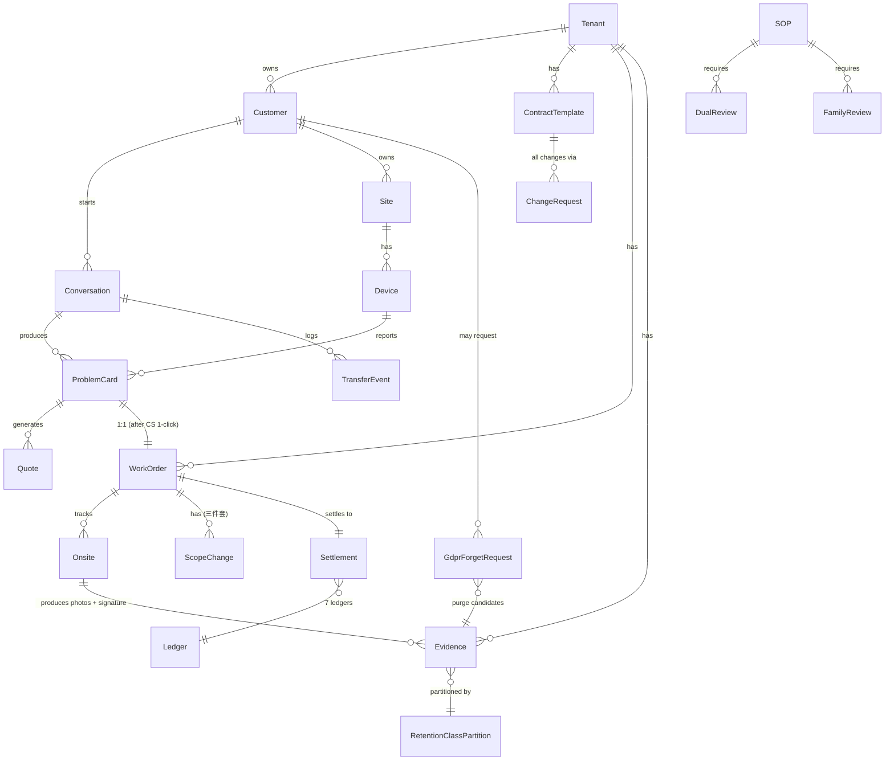

# ERD — 智慧鎖 SaaS 平台

> **狀態**：v1 draft（Gate 5b ready）
> **更新**：2026-05-23
> **負責人**：DBA
> **關聯**：System Spec §1 + ADR-0030 / 0050 / 0051 / 0060 / 0061 + Forum F-04

---

## §0 風險先行（dba 觀點）

> 先講壞情境，再給 mitigation。

| 風險 | 為什麼會炸 | Mitigation |
|:---|:---|:---|
| Cron 直接 `DELETE` PII 繞過 DGS audit | dual writer race，audit 空白 = §9 終止 | Cron = scanner only；DGS = sole executor；RLS REVOKE DELETE 給 cron role |
| Hard delete 無法證明 PII 已銷毀 | GDPR Art.17 audit 缺證據 | Two-phase purge + crypto-shred per-tenant DEK |
| Migration 沒 down script | 上線當下發現 bug 無法回滾 | 強制 down migration；雙寫期 ≥ 2 release |
| Migration backfill 大表全表 UPDATE | lock contention 數小時 | Batched `LIMIT 10000 + sleep 100ms`；off-peak window |
| `legal_hold` 用 partition key | flip 為 true 要搬 row 跨 partition，IO blowup | Column-level；partition by `retention_class` |
| Partial index 失效 | cron 變 seq scan，每次掃幾百萬 row | 每季 EXPLAIN 驗證 predicate 命中 |
| Outbox bus lag → cache stale | 已 purge 的 row 仍 serve | Transactional outbox + push invalidation + circuit breaker |
| Cross-tenant 寫入 | ADR-0030 違反 = 信任崩潰 | RLS policy on `tenant_id`；每筆 mutation 自動帶 session.tenant_id |
| PII 欄位明文存 | 一次 DB dump = 個資外洩 | Envelope encryption per-tenant DEK + KMS CMK |

---

## §1 Top-level ER



---

## §2 Core Tables（V1 P0）

### tenant
- `id` PK
- `name`, `locale`, `tenant_status`
- `created_at`, `updated_at`

### customer（PII，envelope 加密）
- `id` PK
- `tenant_id` FK → tenant（ADR-0030）
- `brand_scope` text[]
- `locale`
- `line_user_id`（cleartext，low sensitivity）
- `phone_enc` bytea（envelope encryption，per-tenant DEK）
- `name_enc` bytea
- `pii_retention_policy` enum [default, custom]
- `created_at`
- **Indexes**：`(tenant_id, line_user_id)` unique；`(tenant_id, purged_at)` 給 GDPR forget reverse lookup
- **Migration risk**：PII 欄位加密化要 2-release 雙寫期（明文 + 密文同時寫），不能一次切

### site
- `id` PK, `customer_id` FK
- `site_group_id`（建案專案）
- `address_enc` bytea
- `geo_district` text
- `tenant_id` FK

### device
- `id` PK
- `serial` text not null（主鎖 + >1000 高價必填，ADR-0053）
- `brand`, `model`
- `purchase_date` date
- `warranty_start_date` date
- `warranty_mode` enum [purchase, handover, activation, contract, manual_override]（ADR-0044）
- `site_id` FK
- `tenant_id` FK

### conversation
- `id` PK
- `customer_id` FK, `tenant_id` FK
- `channel_type` text not null（預留多 channel）
- `state` enum [active, resolving, escalated, closed, auto_closed]
- `auto_closed_at` timestamp
- `reopen_count` int default 0

### problem_card
- `id` PK
- `conversation_id` FK, `device_id` FK, `tenant_id` FK
- `brand`, `model`
- `symptom` text[]
- `urgency` enum [normal, locked_out, trapped_inside, safety_risk, angry_customer_high_risk]（ADR-0034）
- `completeness_score` numeric(3,2)
- `media_refs` text[]
- `state` enum [incomplete, draft, confirmed, resolved]
- `active_status` boolean
- **Unique constraint**：`(conversation_id, device_id, active_status=true)`（ADR-0036；query plan 走 unique index scan）
- **Index**：`(tenant_id, state, urgency)` 給 K-metrics

### work_order
- `id` PK
- `pc_id` FK
- `tenant_id` FK
- `state` enum [created, assigned, accepted, in_progress, completed, cancelled]
- `state_history` jsonb（append-only）
- `address` text nullable（結案 422 hard gate；ADR-0032）
- `idempotency_key` text not null unique
- `created_by_role` text not null check (= 'customer_service')
- **Check constraint**：state=completed 時 address IS NOT NULL

### onsite
- `id` PK, `wo_id` FK
- `arrival_proof_ref` text
- `material_used` jsonb（含 owner: platform/brand/locksmith，ADR-0052）
- `customer_signature_ref` text
- `scope_change_events` jsonb[]

### quote
- `id` PK, `pc_id` FK, `tenant_id` FK
- `version` int
- `effective_date` date
- `approval_chain` jsonb
- `range_only` boolean not null default true（AI 不可 final，ADR-0035）

---

## §3 Contract Template（ADR-0060 — V1 P0）

### contract_template
- `id` PK
- `tenant_id` FK
- `partner_id` FK → partner
- `version` int
- `effective_date` date
- `state` enum [draft]（V1 only；V2 加 submitted/approved/published/retired）
- `scope_brand_scope` text[]
- `scope_site_group_scope` text[]
- `liability_matrix` jsonb — `{brand_pct, platform_pct, locksmith_pct, customer_pct, dispute_resolution_party, secondary_responsible}`
- `visibility_rule` jsonb — `{allowed_roles[], effective_scope_snapshot}`
- `sla_definition` jsonb
- `monthly_settlement_rule` jsonb
- `cancellation_fee_tiers` jsonb
- `travel_fee_split` jsonb
- `created_at`, `updated_at`
- **Unique**：`(tenant_id, partner_id, version)`
- **RLS policy**：prevent direct DB UPDATE；only via API + ChangeRequest hook

### change_request（ADR-0046）
- `id` PK
- `type` enum [policy, price, rbac, sla, template, contract]
- `apply_by` text
- `approve_chain` jsonb
- `state` enum [pending, approved, effective, rejected]
- `effective_date` date
- `audit_trail` jsonb[]

---

## §4 Evidence + DGS（ADR-0050 / 0051 / 0061 — V1 P0-critical）

### evidence
- `sha256` PK（content-addressable）
- `tenant_id` FK
- `wo_id` FK
- `retention_class` enum [hot, warm, cold, legal_hold, gdpr_pending]
- `retention_until` timestamp
- `legal_hold` boolean default false（**column**，NOT partition key — flip 不會搬 row 跨 partition）
- `held_by` text
- `held_at` timestamp
- `hold_reason_id` text
- `purged_at` timestamp nullable — Phase-1（T0）soft-delete
- `dek_id` text — envelope encryption key reference
- `visibility_rule` jsonb
- `lifecycle_days` int（computed）

**Partition**：`BY LIST (retention_class)` → DROP PARTITION 取代 row-level DELETE（IO 降兩個量級）

**Indexes**：
- `(tenant_id, retention_until) WHERE legal_hold = false AND purged_at IS NULL` partial（給 cron scanner）
- `(customer_id, purged_at)` 給 GDPR forget reverse lookup
- 不在 `legal_hold` 單獨建 index（低基數）

**RLS**：tenant_id isolation enforced。`REVOKE DELETE` 給 cron role；`GRANT EXECUTE` 只給 DGS executor function

### purge_audit_ledger（append-only）
- `id` PK（UUID, time-ordered）
- `evidence_id` text not null
- `tenant_id` FK
- `action` enum [phase1_shred, phase2_hard_delete, legal_hold_flipped, gdpr_forget_requested, gdpr_forget_blocked]
- `actor_role` text
- `policy_version_id` text — OPA Rego hash + version
- `denial_reasons` text[]
- `customer_notice` jsonb nullable
- `hash_prev` text — hash chain
- `hash_self` text — sha256(prev + this row's content)
- `created_at` timestamp not null
- **Unique**：hash_self
- **Append-only**：REVOKE UPDATE / DELETE on this table（DBA-level）

### transactional_outbox（Forum F-04）
- `id` PK
- `aggregate_type` text（evidence / contract_template / etc.）
- `aggregate_id` text
- `event_type` text
- `payload` jsonb
- `created_at` timestamp
- `dispatched_at` timestamp nullable
- `dispatch_attempts` int default 0
- `last_error` text
- **Same DB tx** as mutation（atomic guarantee）；polled by outbox poller；at-least-once invalidation

### gdpr_forget_request
- `id` PK
- `customer_id` FK, `tenant_id` FK
- `requested_at` timestamp
- `requested_by` text
- `deadline` timestamp（requested_at + 7d）
- `state` enum [pending, blocked_legal_hold, completed]
- `customer_notice_sent_at` timestamp nullable

---

## §5 Settlement（7 ledgers）

### ledger
- `id` PK
- `ledger_type` enum [customer_ar, technician_ap, cash_collection, brand_settlement, dispatcher_commission, refund_ledger, invoice_tax]
- `tenant_id` FK
- `partner_id` FK nullable

### journal_entry（append-only double-entry, v2.2 update per ADR-VCH-001/002）
- `id` PK
- `ledger_id` FK
- `period` date — yyyy-mm
- `debit_account` text
- `credit_account` text
- `amount` numeric(15,2) — 售後不會兆元級
- `reason_code` ENUM('dispatch_complete', 'refund_full', 'refund_partial', 'brand_settle', 'tax_adjust', 'reversal') NOT NULL — **v2.2 enum 化**
- `reference_type` ENUM('wo', 'rma', 'refund', 'settlement', 'invoice') NOT NULL — **v2.2 enum 化**
- `reference_id` text
- `audit_trail` jsonb
- `created_at`
- **v2.2 新欄**：
  - `payment_method` ENUM('onsite_cash', 'payment_link', 'bank_transfer') — 業主 OQ-008 三路收款
  - `voucher_no` text — `yyyymm-seq`，由 partition 內 sequence 產
  - `issuer_party` ENUM('platform', 'locksmith', 'brand') — keeper schema 必欄（ADR-VCH-001）
  - `tax_doc_ref` JSONB CHECK (`jsonb_typeof(tax_doc_ref->'type')='string' AND tax_doc_ref ? 'doc_id' AND tax_doc_ref ? 'issuer_tax_id'`)
  - `legal_basis` ENUM('TAX_ACT_§38', 'BIZ_ACCT_§11_1', 'BOTH') NOT NULL — 保存期法源（ADR-VCH-002）
  - `hash_prev` text NOT NULL — hash chain（前一筆 row 的 hash_self）
  - `hash_self` text NOT NULL UNIQUE — sha256(hash_prev + serialize(row))，由 BEFORE INSERT trigger 計算
  - `reverses_voucher_id` text nullable — Void 流程用（紅字憑證指向原 voucher_no）
- **Check**：amount > 0
- **Append-only**：`BEFORE UPDATE/DELETE RAISE EXCEPTION` trigger（DB-level，REVOKE 不夠）；reversal entries 取代 UPDATE/DELETE
- **Composite PK**（v2.2）：`(period, voucher_no)` for 跨 partition 全局唯一
- **Indexes**：
  - `(ledger_id, period)` 給 monthly close
  - `(tax_doc_ref->>'issuer_tax_id')` GIN index 給稅務查調
  - `(payment_method, period)` 給金流對帳
- **Partition (v2.2 改)**：**yearly partition + monthly sub-partition**（PG14 declarative；避免 84 partition query plan 退化）
- **Hash chain trigger**：
  ```sql
  CREATE OR REPLACE FUNCTION journal_entry_hash_chain() RETURNS trigger AS $$
  BEGIN
    NEW.hash_prev := COALESCE(
      (SELECT hash_self FROM journal_entry
       WHERE ledger_id = NEW.ledger_id
       ORDER BY created_at DESC LIMIT 1),
      'GENESIS'
    );
    NEW.hash_self := encode(sha256(NEW.hash_prev || row_to_json(NEW)::text), 'hex');
    RETURN NEW;
  END;
  $$ LANGUAGE plpgsql;

  CREATE TRIGGER journal_entry_hash_chain_before_insert
    BEFORE INSERT ON journal_entry
    FOR EACH ROW EXECUTE FUNCTION journal_entry_hash_chain();
  ```
- **Cold archive**（ADR-VCH-002）：
  - hot 2y in PostgreSQL；T+2y end-of-month → DETACH yearly partition → export Parquet → S3 Glacier Deep Archive
  - rehydrate SLA 12h（稅務查調可接受）
  - `partition_archive_log` ledger 記錄哪個 partition / S3 path / Glacier vault

### refund_request（ADR-0040 — 5×3=15 分層）
- `id` PK, `tenant_id` FK
- `responsibility` enum [brand, platform, locksmith]
- `amount_tier` enum [le_1k, 1k_5k, 5k_30k, 30k_100k, gt_100k]
- `approver_role_required` text（computed from responsibility × amount_tier）
- `approval_chain` jsonb
- `state` enum [pending, approved, rejected, refunded]

---

## §6 SOP（V1 manual + V1.5 auto）

### sop
- `id` PK
- `tenant_id` FK
- `version` int
- `risk_level` enum [high, low] — 報價/退款/法律=high；FAQ=low
- `state` enum [draft, dual_review_pending, family_review_pending, approved, published, retired]
- `content` text
- `dual_review_status` jsonb
- `family_review_status` jsonb（Family Reviewer SLA 24h）
- `published_at` timestamp
- `vector_id` text — pgvector reference

### sop_review_ledger（append-only，FR-NEW-5）
- `id` PK
- `sop_id` FK
- `reviewer_role` enum [cs_supervisor, domain_expert, family_reviewer]
- `reviewer_id` text
- `decision` enum [approve, reject, escalate]
- `comment` text
- `sla_breach` boolean default false
- `created_at` timestamp
- **Append-only**

### family_reviewer_replacement（FR-NEW-5 fallback）
- `id` PK, `replaced_user_id`, `new_user_id`
- `triggered_by` enum [absence_3_pending, manual]
- `via_change_request_id` FK
- `created_at`

---

## §7 RBAC（ADR-0042 4-tier configurable）

user / role / permission 表略（標準 RBAC + tenant_id propagation）

- 4 tier：customer / operation / finance / governance
- per-field configurable via change_request
- Family Reviewer 為 governance tier 之一

---

## §8 KPI Instrumentation（Forum F-02）

### transfer_event
- `(conversation_id, transfer_event_seq)` composite PK
- `rule_triggered_by` enum [hard_rule_0048_a, hard_rule_0048_b, ..., hard_rule_0048_g, ai_proactive_offer, customer_explicit_request, agent_pickup]
- `written_by` text not null — **必須** = 'deterministic_rule_engine'（防 AI gaming）
- `created_at`
- **Check**：`written_by = 'deterministic_rule_engine' OR written_by = 'system_event_pickup'`

### kpi_daily
- `date`, `tenant_id`
- K1 / K2 / K3 / K4 / K5 / K6 / K7 / K8 / K9 columns
- C1 / C2 / C2b_drift / C2c_abandon / C3 columns
- Aggregation views：rolling 7d / 30d

---

## §9 Migration Strategy

- **Backfill batched** `LIMIT 10000 + sleep 100ms`（避免 lock contention；經驗值大表 50M row ≈ 4h with online）
- **2-release 雙寫期** for 任何 schema change（新版讀新欄位、舊版讀舊欄位也能 work）
- **Down migration mandatory**（drop new columns + restore；上線當下發現 bug 才能秒回）
- **Migration scripts** in `migrations/` versioned by datetime
- **Critical migrations** drilled in staging before prod（PITR window 4h）
- **Online migration tools**：pg_repack / pgroll；不要直接 ALTER TABLE 大表

---

## §10 Index + Partition Strategy

| Table | Strategy | 理由 |
|:---|:---|:---|
| evidence | List partition by retention_class（hot/warm/cold/legal_hold/gdpr_pending）| DROP PARTITION 取代 row-level DELETE，IO 降兩個量級 |
| problem_card | Partition by tenant_id（V2+ at scale）| 第二甲方進場時可線上加 partition |
| journal_entry | **v2.2**：yearly partition + monthly sub-partition（PG14 declarative）；retention 7y（hot 2y PG + cold 5y S3 Glacier）| 84 monthly partition query plan 退化；yearly+monthly 平衡 prune + archive；DETACH partition 不 lock |
| purge_audit_ledger | Range partition by created_at（yearly），append-only | hash chain 跨 partition 仍可重播 |
| transactional_outbox | No partition（high churn，vacuumed aggressively）| polled clean，不要 partition |

**Query plan check**：每季跑 EXPLAIN，確認 partial index / partition pruning 命中。Planner regression（PG 大版本升級後）會讓 cron 變 seq scan。

---

## Gate 5b Exit Criteria

- ✅ ERD 覆蓋 14 業務物件
- ✅ Partition strategy for evidence + journal + purge_audit
- ✅ RLS policy on tenant_id（ADR-0030）
- ✅ Transactional outbox spec
- ✅ Migration batched + down migration mandatory
- ✅ Index strategy for K-metrics + cron scanner + GDPR forget reverse lookup
- ✅ PITR window 4h；DR drill quarterly

---

**Gate 5b DB Schema Freeze** — ✅ ready
