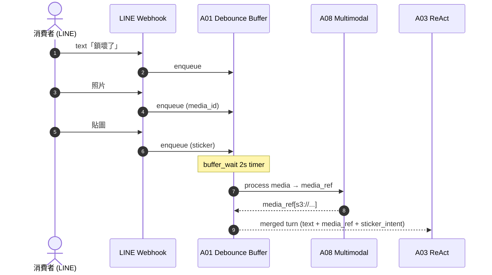
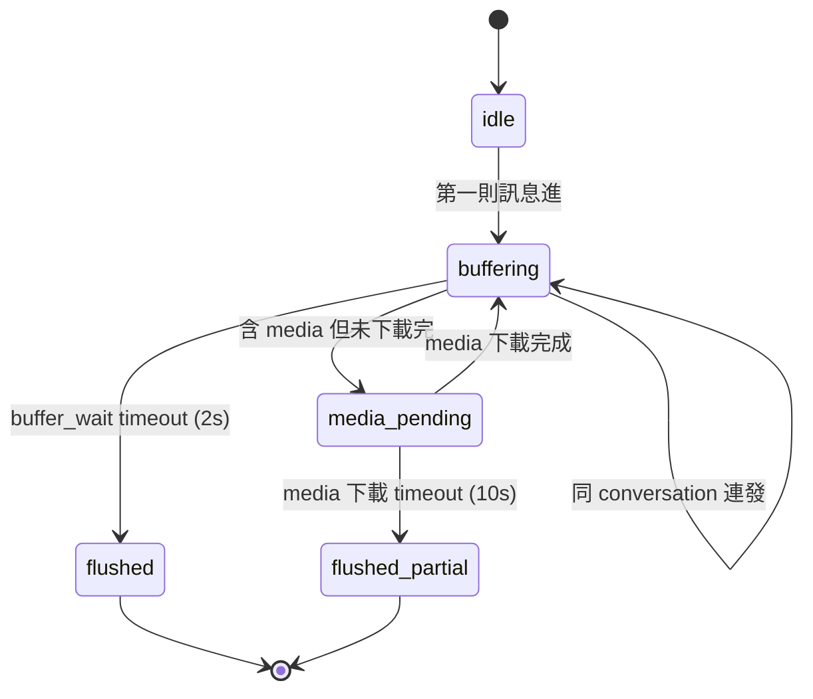

# A01 進線 Debounce — LINE 入口與訊息合併

> **30 秒摘要**：客戶常連發訊息（一行字 + 一張照片 + 一個貼圖），A01 在 `buffer_wait` window 內把碎訊息合併成單一 turn 再給 A03。文字/媒體/貼圖分流；media pending 補齊；同 conversation 只開一張 active PC。

## Sequence Diagram

## State Machine — buffer session

## UI State Coverage

| Step | Happy | Empty | Loading | Error | Offline | annotation |
|:---|:---|:---|:---|:---|:---|:---|
| LINE webhook 接收 | ✓ 即時 ack | 連發 throttle | n/a | webhook retry | LINE 重送 | session: idle → buffering |
| buffer_wait 合併 | ✓ 2s 內合併 | 單則直接 flush | timer 跑中 | 超時 partial flush | n/a | exit: flushed |
| media 處理 | ✓ A08 取得 ref | n/a | download bar | media 大過 10MB → 提示重傳 | local cache | media_pending → buffering |

## a11y notes
- LINE 端走原生 a11y；TalkBack 朗讀順序由 LINE app 控
- 沒有對使用者直接呈現的 UI（後台 buffer），不需 WCAG SC 個別套用

## FR 反向指
| Step | FR | AC |
|:---|:---|:---|
| 訊息合併 | FR-TBD-A01 | AC-01 buffer_wait / AC-02 media pending |

## 相關
- 主檔 Flow S1：[`../user-flow-smart-lock-saas.md#flow-s1`](../user-flow-smart-lock-saas.md)
- Source spec：[`../../_source/02-ai-chatbot-sync.md#a-m01-進線debounce`](../../_source/02-ai-chatbot-sync.md)
