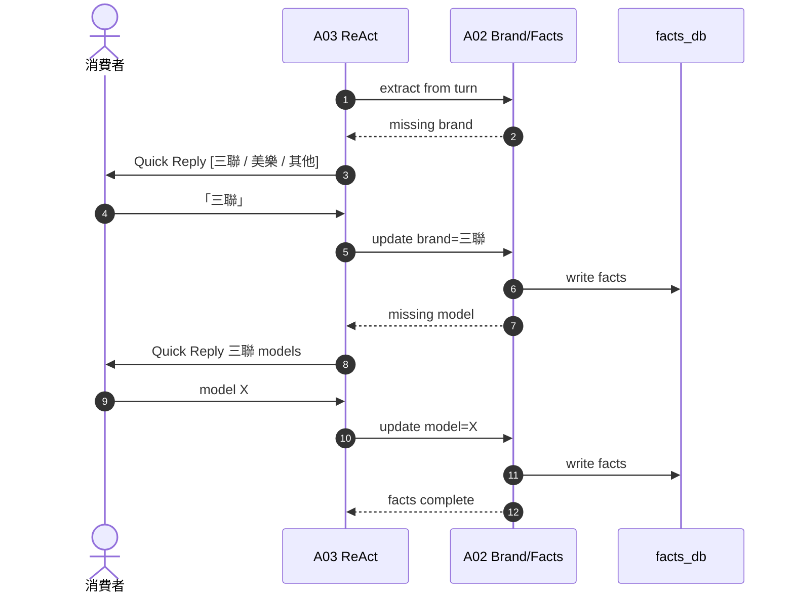
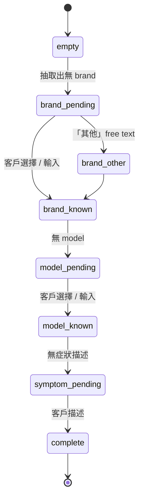

# A02 品牌型號 Profile — Quick Reply + facts

> **30 秒摘要**：當 facts 中 brand 或 model 缺失時主動問；用 LINE Quick Reply 提供常見品牌列表，「其他」進 free text；收齊後寫 facts_db。

## Sequence Diagram

## State Machine — facts collection

## UI State Coverage

| Step | Happy | Empty | Loading | Error | Offline | annotation |
|:---|:---|:---|:---|:---|:---|:---|
| Quick Reply 品牌列表 | ✓ 顯示常見 4-6 個 + 「其他」 | 列表空 → 純 free text | typing indicator | Quick Reply render fail → fallback 純文字 | LINE cached | facts: empty → brand_pending |
| 客戶選「其他」 | ✓ free text 輸入 | n/a | n/a | text 含特殊字 → 清理 | 暫存 | brand_other → brand_known |
| 寫 facts_db | ✓ 200 OK | n/a | < 100ms | DB down → DLQ | 後台重送 | facts entry=complete |

## a11y notes
- Quick Reply label 清楚（「品牌：三聯」非「三聯」）給 screen reader
- WCAG 2.5.5：Quick Reply button ≥ 44×44 (LINE 原生符合)

## FR 反向指
| Step | FR | AC |
|:---|:---|:---|
| brand quick reply | FR-TBD-A02 | AC-01 常見品牌列表 / AC-02 「其他」free text |

## 相關
- 主檔：[`../user-flow-smart-lock-saas.md#flow-s1`](../user-flow-smart-lock-saas.md)
- Source：[`../../_source/02-ai-chatbot-sync.md#a-m02-品牌型號profile`](../../_source/02-ai-chatbot-sync.md)
