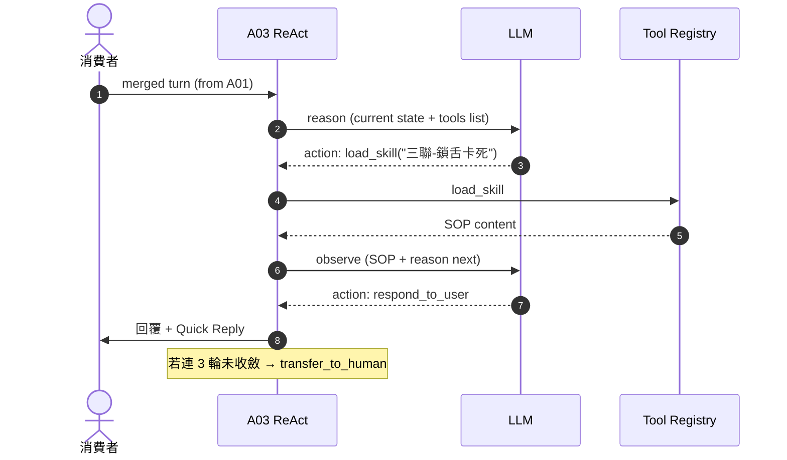
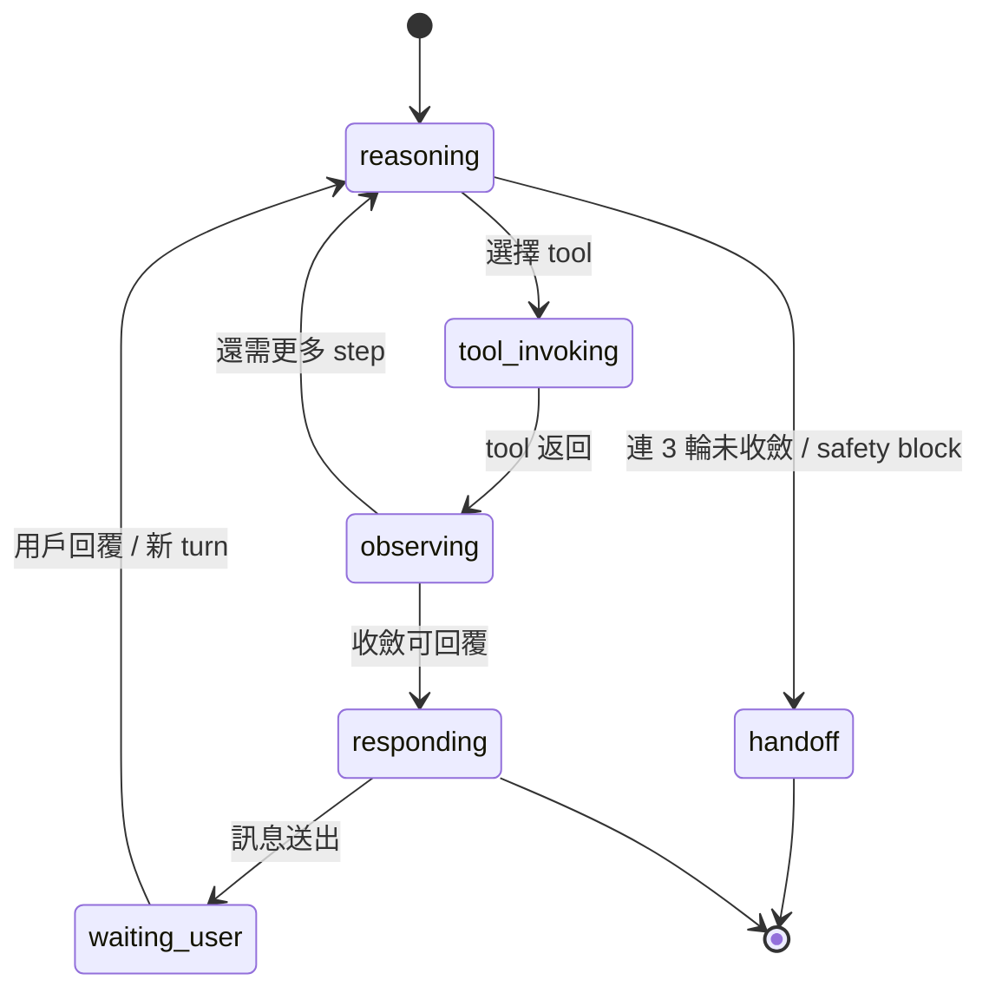

# A03 ReAct Agent — LangGraph + tools

> **30 秒摘要**：A03 是 chatbot 大腦，用 LangGraph 跑 ReAct loop（reason → act → observe）；可用 tools = `load_skill` / `update_user_info` / `transfer_to_human` / `invoke_convert_to_wo`（後者必經 human gate）。

## Sequence Diagram — ReAct loop 一輪

## State Machine — agent session

## UI State Coverage

| Step | Happy | Empty | Loading | Error | Offline | annotation |
|:---|:---|:---|:---|:---|:---|:---|
| AI thinking | ✓ typing indicator | n/a | < 3s p95 | LLM timeout → fallback message | LINE banner | session: reasoning |
| tool invoke | ✓ tool 返回 | tool 無結果 → 改問 | < 1s | tool fail → 降級 / handoff | offline 無法呼叫 → handoff | tool_invoking → observing |
| 回覆送出 | ✓ Flex / text | n/a | < 500ms | render fail → 純文字 | LINE 暫存 | exit: waiting_user |

## a11y notes
- typing indicator 走 LINE 原生
- 回覆 Flex Message 朗讀順序：標題 → 內文 → button label
- Quick Reply ≥ 44×44 (LINE 原生)

## FR 反向指
| Step | FR | AC |
|:---|:---|:---|
| ReAct loop | FR-0028 | AC-01 load_skill / AC-02 update_user_info / AC-03 transfer_to_human |
| 連 3 輪 fallback | FR-0028 | AC-01 自動 handoff |

## 相關
- 主檔：[`../user-flow-smart-lock-saas.md#flow-s1`](../user-flow-smart-lock-saas.md)
- Source：[`../../_source/02-ai-chatbot-sync.md#a-m03-react-agent`](../../_source/02-ai-chatbot-sync.md)
