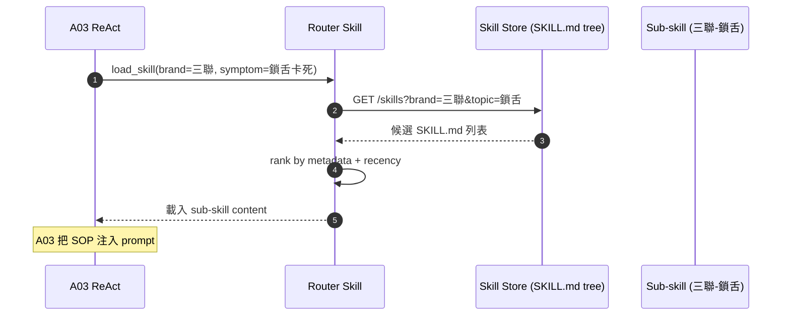
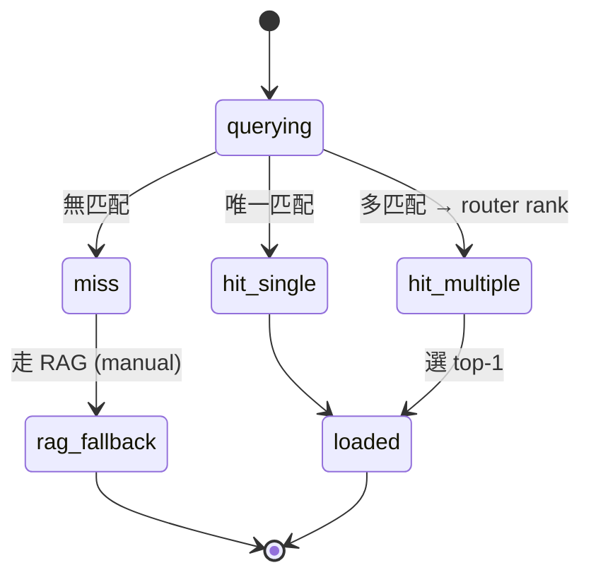

# A04 SKILL.md 知識庫 — router skill + sub-skill

> **30 秒摘要**：SKILL.md 路徑 metadata 控制品牌/型號，router skill 引導 A03 載入正確的 sub-skill SOP；A10 SOP 螺旋產出的 draft approved 後入此庫。

## Sequence Diagram

## State Machine — skill lookup

## UI State Coverage

| Step | Happy | Empty | Loading | Error | Offline | annotation |
|:---|:---|:---|:---|:---|:---|:---|
| skill query | ✓ 命中載入 | miss → RAG fallback | < 200ms | store down → DLQ + handoff | offline 不允許 | skill: querying → loaded |
| router rank | ✓ 多匹配選 top-1 | 全部低分 → RAG | n/a | rank fail → 隨機選 + log | n/a | hit_multiple → loaded |

## a11y notes（後台 Knowledge Owner 維護 UI — WCAG 2.2 AA 繼承自主檔）

- **後台 Admin (Knowledge owner 維護)** 走 WCAG 2.2 AA；skill 本身不直接面客
- **Keyboard navigation (2.1.1 / 2.1.2)**：SKILL.md / RAG corpus 編輯介面全鍵盤可達；無 keyboard trap；Escape 可離開 modal
- **Focus indicator (2.4.7)**：corpus 編輯欄位 focus ring 明顯（≥ 2px / ≥ 3:1 contrast）；diff view 中當前選取段落焦點清楚
- **Screen reader (4.1.2)**：metadata 結構（brand / model / category）用 semantic HTML + ARIA roles；NVDA / VoiceOver 可朗讀
- **Color contrast (1.4.3)**：corpus 編輯 / diff view ≥ 4.5:1；version 標記不單靠顏色 — 加文字 "v1.2" 與版本徽章
- **Target size (2.5.8)**：corpus 編輯按鈕（save / publish / archive）≥ 24×24 CSS px

## FR 反向指
| Step | FR | AC |
|:---|:---|:---|
| skill load | FR-0029 | AC-01 router 引導 / AC-02 metadata 控制 brand/model |

## 相關
- 主檔：[`../user-flow-smart-lock-saas.md#flow-s1`](../user-flow-smart-lock-saas.md)
- A10 SOP spiral：[`./A10-sop-spiral-flow.md`](./A10-sop-spiral-flow.md)
- Source：[`../../_source/02-ai-chatbot-sync.md#a-m04-skill知識庫`](../../_source/02-ai-chatbot-sync.md)
