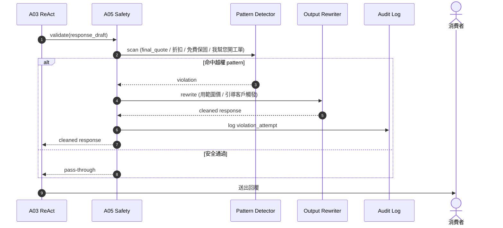
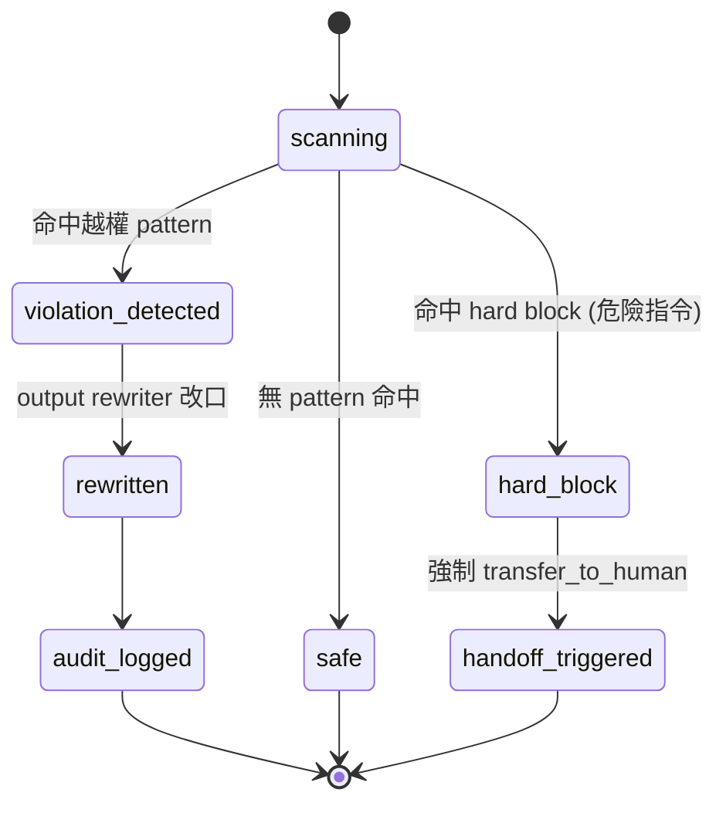

# A05 安全驗證 — safety + output validator + 越權邊界

> **30 秒摘要**：A05 是 chatbot 的 guardrail — 偵測危險字、內部話術、AI 越權嘗試（如承諾 final quote / 折扣 / 免費保固 / 自行建單）；失敗就改口給範圍價 或 觸發 transfer_to_human。**P0 critical**：BR-AI-越權邊界全靠這層。

## Sequence Diagram

## State Machine — safety check session

## 越權 pattern decision matrix

| Pattern 範例 | 觸發行為 | annotation |
|:------------|:---------|:-----------|
| 「總額 NT$3500」(具體金額) | rewrite → 「範圍 NT$2000-5000，最終以客服報價為準」 | violation_detected → rewritten |
| 「我幫您開工單」 | rewrite → 「您可以點下方按鈕觸發派工」 | violation_detected → rewritten |
| 「免費保固」 | rewrite → 「保固以您購買時的條款為準」 | violation_detected → rewritten |
| 「打 80 折」 | rewrite → block + 引導客服 | violation_detected → handoff_triggered |
| 危險字 / 暴力 / hate speech | hard block + handoff | hard_block |

## UI State Coverage

| Step | Happy | Empty | Loading | Error | Offline | annotation |
|:---|:---|:---|:---|:---|:---|:---|
| safety scan | ✓ pass-through | n/a | < 50ms | detector down → fail-closed (block) | n/a | scanning → safe/violation |
| rewrite | ✓ 改口輸出 | n/a | < 200ms | rewriter fail → fallback handoff | n/a | violation_detected → rewritten |
| 客戶端看到 | ✓ 看不到原始越權內容 | n/a | n/a | n/a | n/a | n/a |
| audit log | ✓ violation_attempt 記錄 | n/a | async | log fail → DLQ | n/a | audit_logged |

## a11y notes
- 客戶端只看到改寫後的訊息（不知道有 guardrail），UX 透明處理
- 改寫後訊息語意完整、可被 screen reader 順讀

## FR 反向指
| Step | FR | AC |
|:---|:---|:---|
| 越權 pattern 偵測 | FR-TBD-A05-001 | AC-01 final quote 攔截 / AC-02 自行建單 攔截 / AC-03 免費保固 攔截 |
| 越權嘗試 audit | FR-TBD-A05-002 | AC-01 log + alert |
| hard block 觸發 handoff | FR-TBD-A05-003 | AC-01 危險字命中 → 強制 transfer_to_human |

## 相關
- 主檔 Flow S1：[`../user-flow-smart-lock-saas.md#flow-s1`](../user-flow-smart-lock-saas.md)
- S-M04 越權邊界第二道：[`./S-M04-convert-to-wo-flow.md`](./S-M04-convert-to-wo-flow.md)
- Source：[`../../_source/02-ai-chatbot-sync.md#a-m05-安全驗證`](../../_source/02-ai-chatbot-sync.md)
