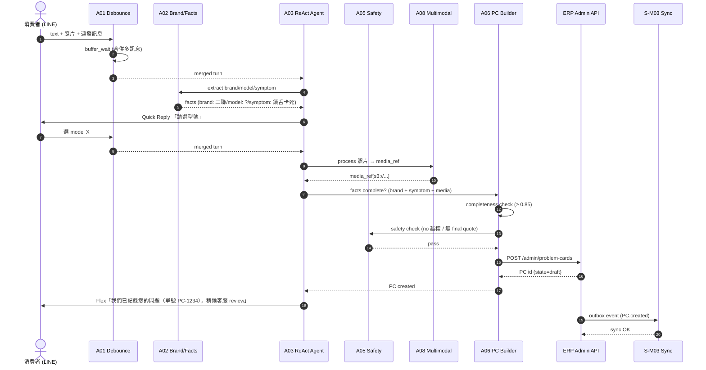
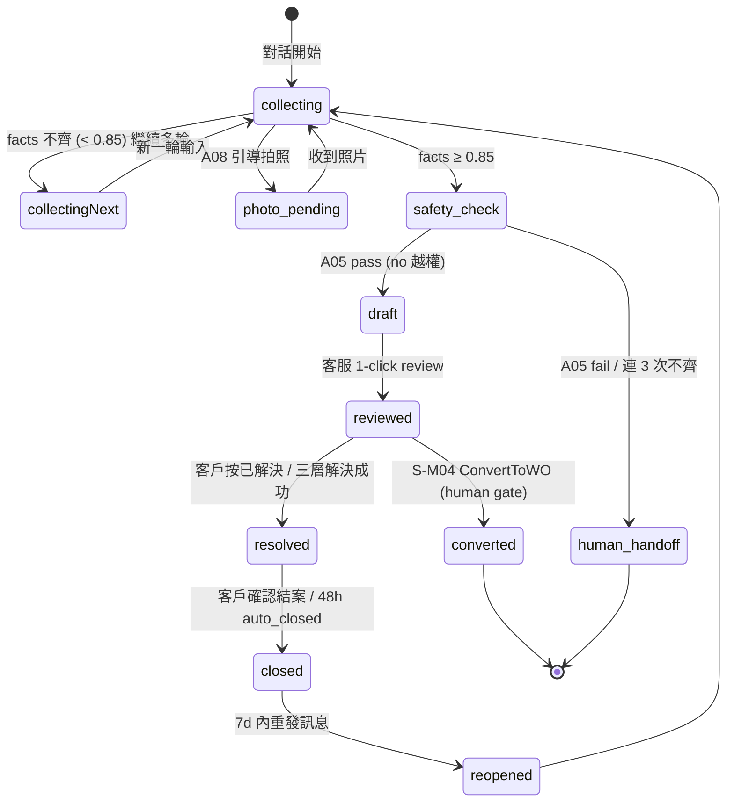
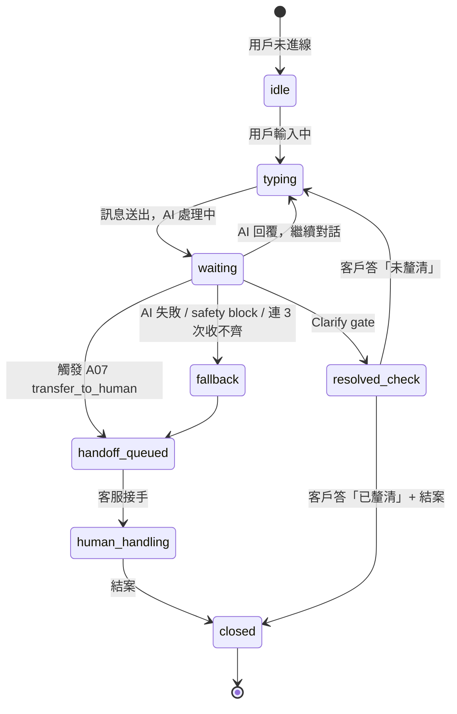

# A06 ProblemCard 自動建卡 — chatbot 對話流

> **30 秒摘要**：A06 在 LINE 對話中當 facts 收齊（brand + 症狀夠用）→ 呼叫 Admin API create ProblemCard。本檔涵蓋：A06 與 A01 (debounce) / A02 (brand facts) / A03 (ReAct agent) / A05 (safety) / A08 (multimodal) 的握手 sequence 與 ProblemCard lifecycle state machine。**Phase I 核心**：A06 是 chatbot → ERP 的第一個資料化節點，沒這個就無法走 S-M03 / S-M04 同步。

---

## Sequence Diagram — facts 收齊 → PC 建卡

---

## State Machine — ProblemCard lifecycle

---

## Session state（對話 state machine — chatbot 特有）

---

## UI State Coverage（業主 Q-OF1=B: UI-only + annotation）

| Step | Happy | Empty | Loading | Error | Offline | domain state annotation |
|:-----|:------|:------|:--------|:------|:--------|:------------------------|
| **A01 debounce buffer** | ✓ 合併 turn 後給 A03 | 無 media → 跳過 A08 | buffer_wait timer (2s) | media 下載失敗 → 提示重傳 | LINE webhook retry | session: typing → waiting |
| **A02 quick reply brand/model** | ✓ Quick Reply 顯示品牌列表 | 品牌不在清單 → 「其他」進 free text | typing indicator | Quick Reply render fail → fallback 純文字 | LINE 暫存後重發 | facts: collecting |
| **A08 photo guide** | ✓ Flex「請拍鎖舌正面」+ 範例圖 | 客戶說無相機 → 改文字描述 | upload progress bar | 照片 > 10MB → 壓縮失敗，提示重拍 | local 暫存 + 上線重送 | PC entry=photo_pending / exit=collecting |
| **A06 PC create** | ✓ Flex「已記錄問題（PC-1234）」 | n/a (facts 齊才觸發) | API 200ms p95 | ERP 500 → DLQ + 客服 alert | LINE banner + 後台 outbox 補送 | PC entry=null / exit=draft |
| **Clarify gate** | ✓ AI 主動問 | n/a (resolved 一定觸發) | 30s 等回應 | 30s 未回再問 1 次 | banner 重發機制 | PC entry=draft / exit=resolved |

---

## a11y notes — WCAG 2.2 AA

繼承主檔 §a11y，**A06 / chatbot 特有**：
- **LINE 端**：Quick Reply 按鈕走 LINE 原生 a11y；TalkBack 朗讀 Quick Reply label 順序
- **multimodal (A08)**：照片必附 alt-text（人工填，合約禁 AI 影像辨識）；影片附字幕
- **Screen reader (NVDA/VoiceOver)**：Flex Message bubble 朗讀順序 = 標題 → 內文 → button label
- **Keyboard-only**：LIFF onboarding 全可 Tab 完成；無 keyboard trap
- **3.3.7 Redundant entry (WCAG 2.2 新)**：facts 已給過的資訊不重複問（A02 brand 已收，A06 不再問）

---

## FR 反向指

| Step | FR 反向指 | AC |
|:-----|:----------|:---|
| A01 訊息合併 | FR-0026 | AC-01 buffer_wait 合併 / AC-02 media pending 補齊 |
| A02 brand/model facts | FR-0027 | AC-01 brand quick reply / AC-02 model fallback free text |
| A03 ReAct agent | FR-0028 | AC-01 load_skill / AC-02 update_user_info / AC-03 transfer_to_human |
| A05 safety guardrail | FR-0030 | AC-01 越權字串攔截 / AC-02 final quote 改口 |
| A06 PC create | FR-0031 | AC-01 completeness ≥ 0.85 / AC-02 PC.draft → 客服 review |
| A08 multimodal | FR-0025 | AC-01 photo guide / AC-02 alt-text 必填 |
| Clarify gate | FR-0005 | AC-02 客戶答「已釐清」才 resolved |

---

## 引用 KB

- [KB-07 §chatbot multimodal + 多輪異步 diagram picker] — sequence + state 雙圖混合（A6_addition 待補）

---

## 相關文件

- 主檔 Flow S1：[`../user-flow-smart-lock-saas.md#flow-s1`](../user-flow-smart-lock-saas.md)
- Source spec：[`../../_source/02-ai-chatbot-sync.md#a-m06-problemcard`](../../_source/02-ai-chatbot-sync.md)
- 同步藍圖：[`./S-M03-problemcard-convert-flow.md`](./S-M03-problemcard-convert-flow.md)
