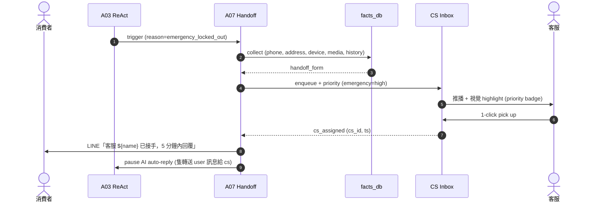
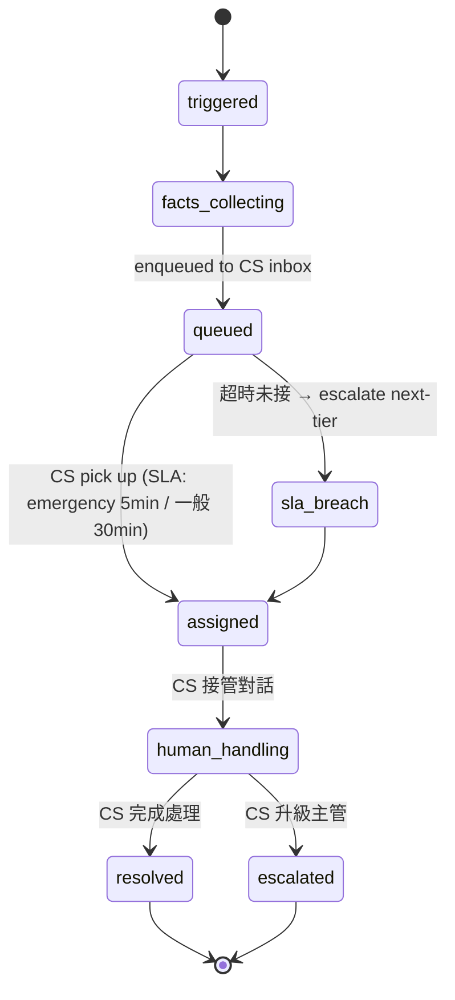

# A07 真人轉接 — transfer_to_human

> **30 秒摘要**：A07 是 AI → 人 的橋。觸發來源：(1) 急件 4 類偵測 (Flow S1)；(2) A05 hard block；(3) 連 3 輪未收斂；(4) 客戶主動要求。轉接時自動帶 facts（電話/地址/設備/照片/conversation history），客服在 inbox 接手。

## Sequence Diagram

## State Machine — handoff lifecycle

## Handoff trigger matrix

| 觸發來源 | priority | SLA | annotation |
|:---------|:---------|:----|:-----------|
| 急件 4 類（鎖外 / 內困 / 安全 / 怒客） | emergency | 5 min 內接 | priority=emergency |
| A05 hard block | high | 10 min | priority=high |
| 連 3 輪未收斂 | normal | 30 min | priority=normal |
| 客戶主動「我要找客服」 | high | 10 min | priority=high |
| Eval score drop alert | normal | next day batch review | priority=low |

## UI State Coverage

| Step | Happy | Empty | Loading | Error | Offline | annotation |
|:---|:---|:---|:---|:---|:---|:---|
| facts 帶過 | ✓ handoff_form 完整 | 部分 facts 缺 → 標 missing | < 500ms | facts_db down → fallback 客服收極簡 form | n/a | facts_collecting |
| inbox 推播 | ✓ CS 收到 + 視覺 highlight | 全 CS busy → escalate 主管 | < 1s | push fail → SMS fallback | n/a | queued |
| CS pick up | ✓ 1-click | empty queue 顯示 | < 200ms | 多 CS 同搶 → first-wins lock | banner 無法 pick | assigned |
| 客戶收到通知 | ✓ LINE「${cs_name} 接手」 | n/a | < 1s | LINE 送達 fail → SMS fallback | LINE cached | n/a |
| SLA breach | escalate 顯示給 next-tier | n/a | 自動 timer | n/a | n/a | sla_breach → assigned |

## a11y notes
- 客戶端 LINE 通知文字清楚標 ${cs_name}（避免「我們」這種模糊指代）
- CS 後台 inbox 走 WCAG 2.2 AA — 鍵盤導覽 + priority badge 含文字（不僅 color）
- 急件 priority badge 走 ARIA `aria-label="緊急優先 - 鎖在門外"` 不只是 icon

## FR 反向指
| Step | FR | AC |
|:---|:---|:---|
| handoff trigger | FR-TBD-A07-001 | AC-01 急件 / AC-02 hard block / AC-03 連 3 輪 / AC-04 客戶主動 |
| facts 帶過 | FR-TBD-A07-002 | AC-01 phone/address/device/media/history 完整 |
| SLA enforcement | FR-TBD-A07-003 | AC-01 emergency 5min / AC-02 escalate breach |

## 相關
- 主檔 Flow S1：[`../user-flow-smart-lock-saas.md#flow-s1`](../user-flow-smart-lock-saas.md)
- A05 trigger source：[`./A05-safety-flow.md`](./A05-safety-flow.md)
- Source：[`../../_source/02-ai-chatbot-sync.md#a-m07-真人轉接`](../../_source/02-ai-chatbot-sync.md)
