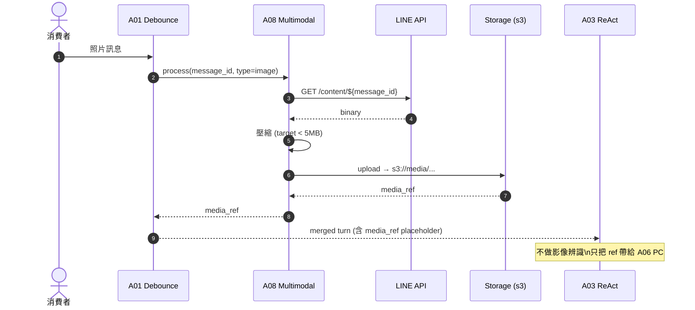
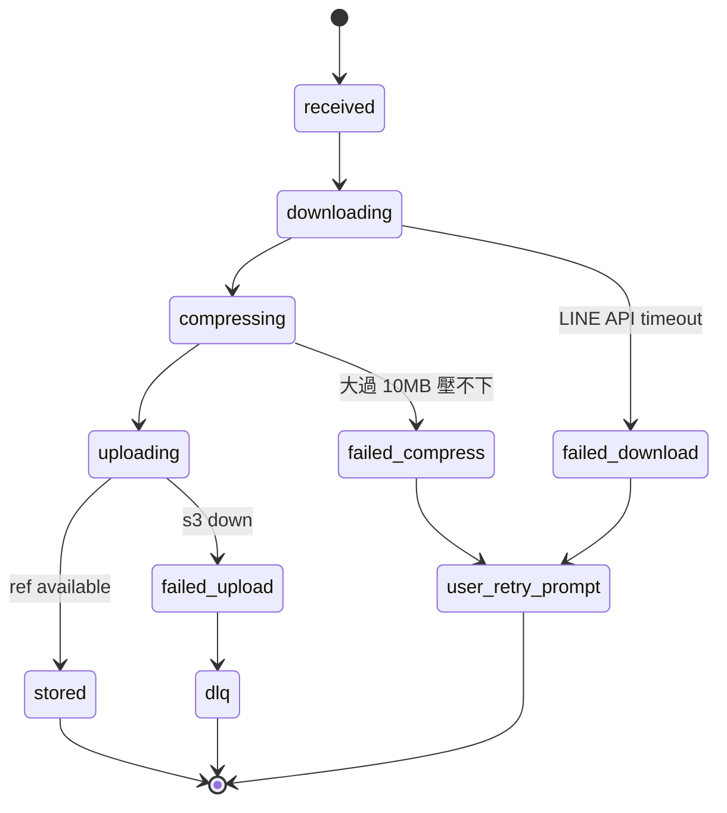

# A08 多模態 — 圖片影音處理

> **30 秒摘要**：A08 下載 LINE 媒體、儲存到 storage、替換 placeholder 給 A03、checkpoint cleanup。**合約禁 AI 影像辨識**（不可自動辨識照片內容），照片只用作品質佐證 / 給師傅看 / alt-text 由人工填。

## Sequence Diagram

## State Machine — media lifecycle

## UI State Coverage

| Step | Happy | Empty | Loading | Error | Offline | annotation |
|:---|:---|:---|:---|:---|:---|:---|
| 客戶上傳照片 | ✓ LINE 上傳 progress | 客戶無相機 → 改文字描述 | LINE 原生 | 上傳 timeout → 提示重傳 | LINE 本地暫存 + 上線重送 | media: received |
| A08 download | ✓ < 3s | n/a | progress | LINE API timeout → retry 3 次 | n/a | downloading |
| 壓縮 | ✓ < 5MB | n/a | < 1s | > 10MB 失敗 → 提示客戶重拍小尺寸 | n/a | compressing → user_retry_prompt |
| s3 upload | ✓ stored | n/a | < 2s | s3 down → DLQ + alert | n/a | uploading → stored / dlq |
| placeholder 替換給 A03 | ✓ media_ref 注入 | n/a | < 100ms | ref 為空 → A03 skip 照片 reasoning | n/a | stored |

## a11y notes
- 客戶端「請拍照」prompt 給範例圖（用 Flex Message + alt-text）
- 上傳照片**必附 alt-text**（人工填，合約禁 AI 影像辨識）— 客服在 review 時補
- 影片附字幕（後台 transcoding pipeline）
- WCAG 1.1.1 (Non-text Content) — 所有 media 必有文字替代

## FR 反向指
| Step | FR | AC |
|:---|:---|:---|
| 下載 + 儲存 | FR-0025 | AC-01 LINE API → s3 / AC-02 壓縮 < 5MB |
| placeholder 替換 | FR-0025 | AC-01 media_ref 注入 A03 turn |
| alt-text 必填 | FR-0025 | AC-01 客服 review 時補 / AC-02 不允許空白 |
| checkpoint cleanup | FR-0025 | AC-01 90 天後清理 |

## 相關
- 主檔 Flow S1：[`../user-flow-smart-lock-saas.md#flow-s1`](../user-flow-smart-lock-saas.md)
- Source：[`../../_source/02-ai-chatbot-sync.md#a-m08-多模態`](../../_source/02-ai-chatbot-sync.md)
