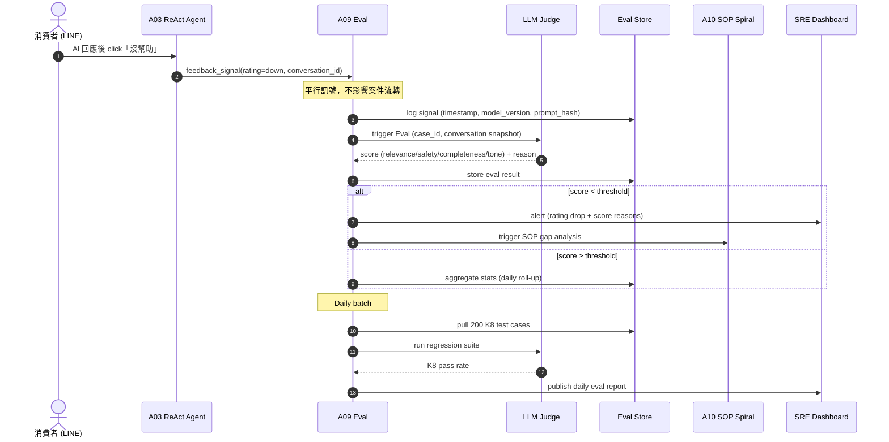
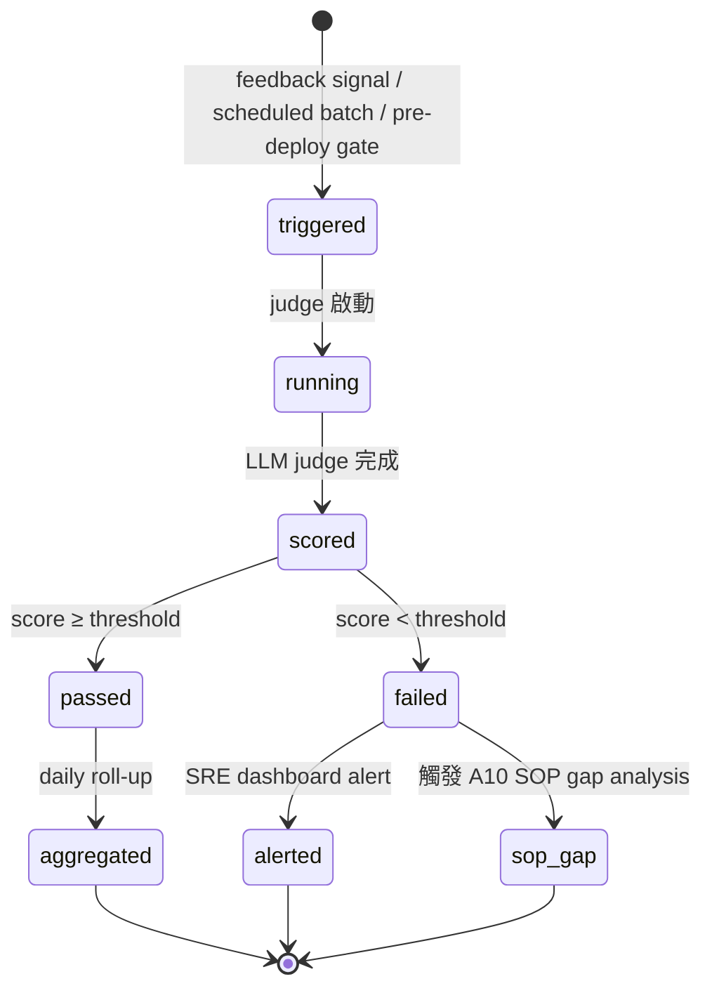
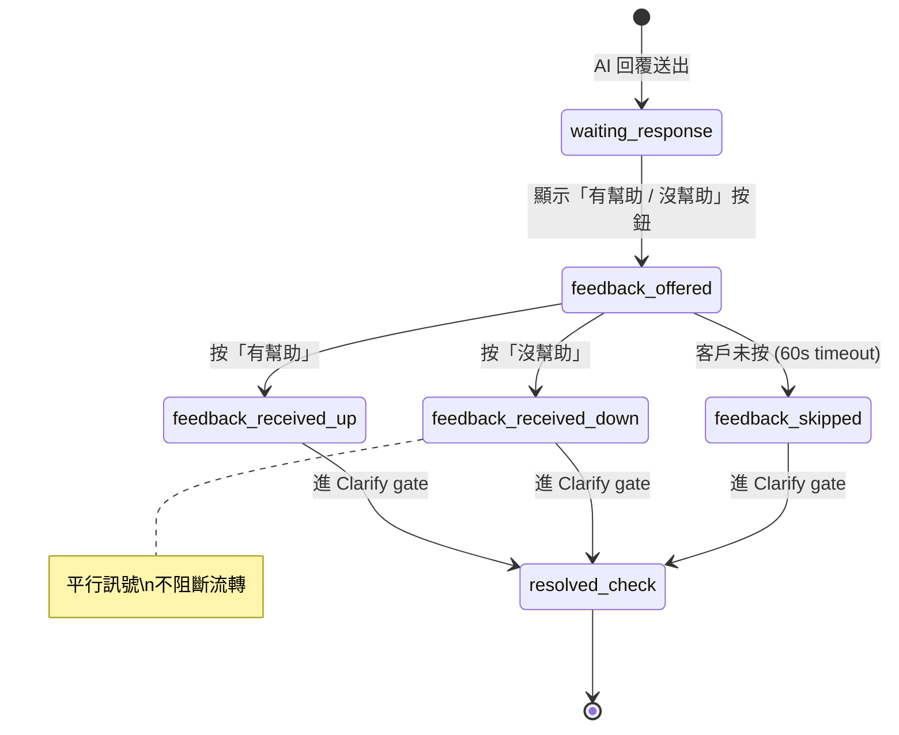

# A09 Eval & 觀測 — chatbot 對話流

> **30 秒摘要**：A09 跑 67+ test cases + LLM judge + token/cost 觀測 + K8 Eval 200 題回歸；當「有幫助 / 沒幫助」訊號進來（**平行品質訊號，不影響案件流轉**）併入 K8 Eval。本檔涵蓋 Eval 的觸發 sequence + Eval session lifecycle state machine。**Phase I 核心**：A09 是 chatbot 上線 / continuous deploy / SOP 入庫前的 quality gate。

---

## Sequence Diagram — 「有幫助 / 沒幫助」訊號 → K8 Eval 觸發

---

## State Machine — Eval session lifecycle

---

## Session state（chatbot 對話 state — feedback 互動）

---

## UI State Coverage（業主 Q-OF1=B: UI-only + annotation）

| Step | Happy | Empty | Loading | Error | Offline | domain state annotation |
|:-----|:------|:------|:--------|:------|:--------|:------------------------|
| **feedback 按鈕呈現** | ✓ Flex 末尾「有幫助 / 沒幫助」+ 60s timeout | n/a | 同 AI 回覆顯示 | Flex render fail → 退純文字 quick reply | LINE cached | session: waiting_response → feedback_offered |
| **feedback 提交** | ✓ button toggle + 「謝謝您的回饋」 | n/a | 200ms callback | 502 retry | offline 暫存 + 上線重送（dedup by conv_id+model_ver） | feedback_offered → feedback_received |
| **Eval daily batch** | ✓ SRE dashboard 顯示 K8 pass rate | n/a (一定有 cases) | 跑 200 題 < 10min | judge timeout → retry / DLQ | n/a (server-side) | eval entry=triggered / exit=aggregated |
| **Eval alert** | ✓ SRE 收到 alert + 自動建 issue | n/a | n/a | alert delivery fail → fallback email | n/a | eval entry=failed / exit=alerted |
| **SOP gap analysis trigger** | ✓ A10 接到事件 → 排 SOP draft | n/a | A10 async 處理 | A10 down → DLQ | n/a | eval entry=failed / exit=sop_gap |

---

## a11y notes — WCAG 2.2 AA

繼承主檔 §a11y，**A09 / chatbot feedback 特有**：
- **feedback 按鈕** 必須有清楚 label（「這個回答有幫助 / 沒幫助」非單純「👍/👎」icon）
- **Screen reader** 朗讀按鈕 label + 當前 toggle 狀態
- **Target size**：feedback 按鈕 ≥ 44×44 CSS px（WCAG 2.5.5 enhanced）
- **3.2.4 Consistent identification**：feedback 按鈕全 app 一致設計
- **Admin Eval dashboard (SRE 端)** 走 WCAG 2.2 AA — 全鍵盤導覽 + ARIA roles for chart

---

## FR 反向指

| Step | FR 反向指 | AC |
|:-----|:----------|:---|
| feedback signal 收集 | FR-0032 | AC-01 「有幫助 / 沒幫助」按鈕 / AC-02 平行訊號不阻斷流轉 |
| LLM judge 評分 | FR-0032 | AC-01 relevance/safety/completeness/tone 四維 |
| K8 200 題 daily 回歸 | FR-0032 | AC-01 pass rate ≥ 設定 threshold / AC-02 fail 觸發 alert |
| SOP gap analysis trigger | FR-0032 | AC-01 fail score 觸發 A10 |
| pre-deploy eval gate | FR-0032 | AC-01 deploy 前 K8 pass rate ≥ threshold 才放行 |
| 急件 200 題列入 K8 | 主檔 acceptance | 急件 4 類偵測準確率 ≥ K8 設定值 |

---

## 引用 KB

- [KB-07 §chatbot multimodal + 多輪異步 diagram picker]
- [KB-09 §observability_catalog] — burn rate alert / SLI/SLO baseline

---

## 相關文件

- 主檔 Flow S1（feedback 段）：[`../user-flow-smart-lock-saas.md#flow-s1`](../user-flow-smart-lock-saas.md)
- Source spec：[`../../_source/02-ai-chatbot-sync.md#a-m09-eval`](../../_source/02-ai-chatbot-sync.md)
- A10 SOP spiral：[`./A10-sop-spiral-flow.md`](./A10-sop-spiral-flow.md)
