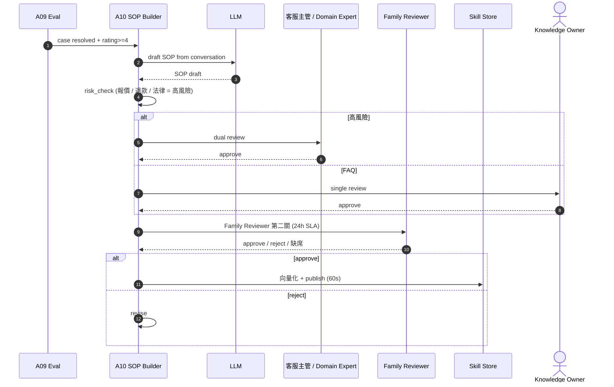
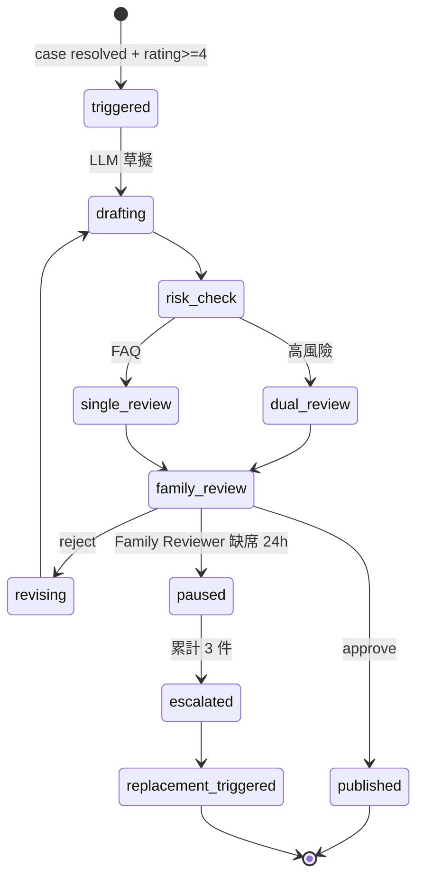

# A10 SOP 螺旋 — 成功案例 → SOP

> **30 秒摘要**：resolved + rating ≥ 4 案例觸發 LLM 草擬 SOP draft → 雙審（高風險）或單審（FAQ）→ Family Reviewer 第二關 → 60s 內向量化發布。Phase I 不上 auto draft，Family Reviewer 仍可手動入庫。詳見主檔 Flow S3。

## Sequence Diagram

## State Machine — SOP draft lifecycle

## UI State Coverage

| Step | Happy | Empty | Loading | Error | Offline | annotation |
|:---|:---|:---|:---|:---|:---|:---|
| trigger draft | ✓ LLM draft 完成 | rating < 4 不觸發 | < 30s | LLM down → 退手動 | n/a | triggered → drafting |
| dual review inbox | ✓ 兩名審核 | empty queue | spinner | timeout 24h → escalate | banner 無法 review | dual_review |
| Family Reviewer inbox | ✓ 1 名審核 | 缺席 → escalate 甲方 | spinner | timeout 24h → pause | banner | family_review |
| 向量化 publish | ✓ 60s 內入庫 | n/a | < 60s | vector store fail → retry | n/a | published |

## a11y notes
- Reviewer 後台 UI 走 WCAG 2.2 AA — 全鍵盤 + diff view (semantic HTML)
- SOP draft 內文預覽走 semantic markdown (h1-h6 結構)
- 「approve / reject」按鈕 ≥ 44×44，focus indicator 明顯

## FR 反向指
| Step | FR | AC |
|:---|:---|:---|
| auto draft trigger | FR-0017 (Phase II) | AC-01 rating>=4 / AC-02 LLM 草擬 |
| dual / single review | FR-0017 | AC-01 高風險 dual / AC-02 FAQ single |
| Family Reviewer 24h SLA | FR-0017 | AC-01 SLA enforcement / AC-02 缺席 escalate |
| 替補機制 | FR-0017 | AC-01 累計 3 件 → ChangeRequest |

## 相關
- 主檔 Flow S3：[`../user-flow-smart-lock-saas.md#flow-s3`](../user-flow-smart-lock-saas.md)
- A09 trigger source：[`./A09-eval-flow.md`](./A09-eval-flow.md)
- Source：[`../../_source/02-ai-chatbot-sync.md#a-m10-sop螺旋`](../../_source/02-ai-chatbot-sync.md)
