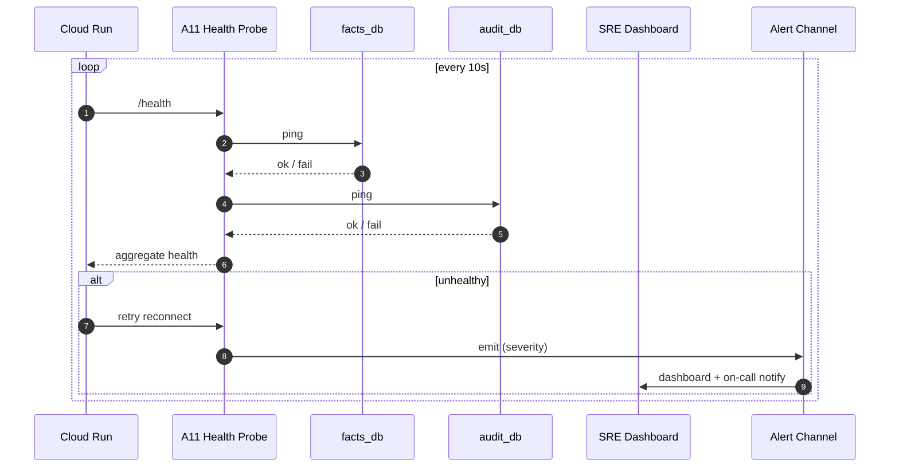
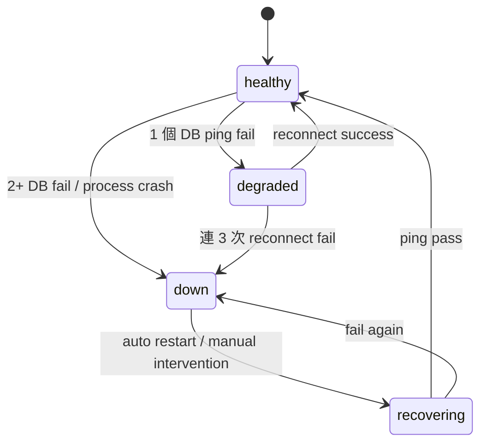

# A11 部署健康 — Cloud Run / health

> **30 秒摘要**：A11 監看 facts_db + audit_db health；DB reconnect；deploy 前 health gate 過了才放行。沒有客戶端 UI（純 SRE / DevOps 後台），但 chatbot health 影響整個 Flow S1 的可用性。

## Sequence Diagram — health probe loop

## State Machine — service health

## UI State Coverage（SRE Dashboard）

| Step | Happy | Empty | Loading | Error | Offline | annotation |
|:---|:---|:---|:---|:---|:---|:---|
| health dashboard | ✓ 綠燈 + uptime | empty (剛啟動) | refresh < 5s | metrics fetch fail → stale data badge | banner 不能更新 | service: healthy |
| degraded alert | ✓ 黃燈 + 詳細 reason | n/a | n/a | alert 送達 fail → SMS fallback | n/a | degraded |
| down incident | ✓ 紅燈 + auto runbook link | n/a | n/a | on-call paging fail → escalate | n/a | down |

## a11y notes
- SRE dashboard 走 WCAG 2.2 AA
- 紅 / 黃 / 綠燈狀態**不僅靠顏色** — 加 ARIA label + 文字標示「健康 / 降級 / 故障」
- ARIA `role="alert"` 用於 down incident

## FR 反向指
| Step | FR | AC |
|:---|:---|:---|
| health probe | FR-0033 | AC-01 facts_db ping / AC-02 audit_db ping |
| DB reconnect | FR-0033 | AC-01 連 3 次 retry / AC-02 fail 後 alert |
| deploy gate | FR-0033 | AC-01 health pass 才放行 |

## 相關
- 主檔：[`../user-flow-smart-lock-saas.md`](../user-flow-smart-lock-saas.md)
- KB-09 observability catalog（burn rate alert / SLO baseline）
- Source：[`../../_source/02-ai-chatbot-sync.md#a-m11-部署健康`](../../_source/02-ai-chatbot-sync.md)
