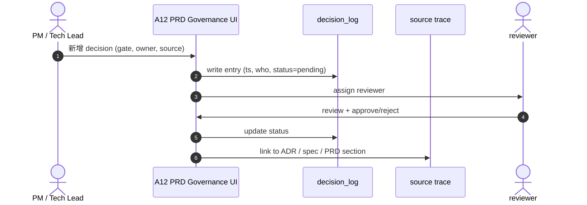
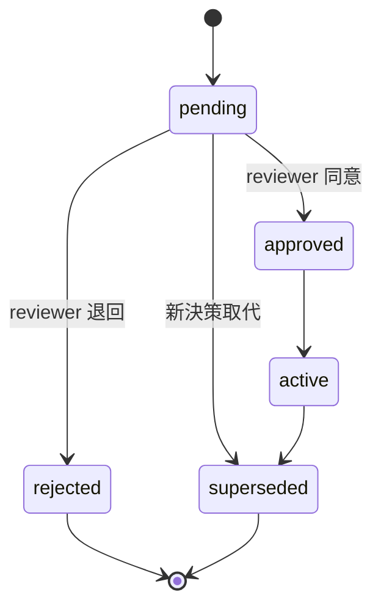

# A12 PRD 治理 — 決策與 source trace（Phase II 延後）

> **30 秒摘要**：A12 給 PM / Tech Lead 用，把每個 gate / 決策對應 owner / 狀態 / source。Phase II 才啟動（業主裁決 Q2=C — A12 延 Phase II）；Phase I 暫用 ad-hoc decision_log。

## Sequence Diagram — decision log workflow

## State Machine — decision lifecycle

## UI State Coverage

| Step | Happy | Empty | Loading | Error | Offline | annotation |
|:---|:---|:---|:---|:---|:---|:---|
| decision log 列表 | ✓ 列表 + filter | empty 「無決策」 | < 1s | 403 顯示「無權限」 | banner | decision: any |
| 新增 decision | ✓ form 提交 | required 欄空白 → block | spinner | validation fail inline | local cache | pending |
| reviewer 審核 | ✓ approve / reject | empty queue | spinner | conflict 兩人同改 → optimistic lock | banner 無法 review | pending → approved/rejected |

## a11y notes（後台 PRD governance UI — WCAG 2.2 AA 繼承自主檔）

- **後台 PRD governance UI** 走 WCAG 2.2 AA
- **Decision diff view** 走 semantic HTML（`<ins>` / `<del>` + ARIA roles），不單靠顏色高亮（1.4.1 Use of Color）
- **Approve / reject 按鈕 ≥ 44×44**（2.5.5 Target size enhanced）；icon 按鈕也 ≥ 24×24（2.5.8）
- **Keyboard navigation (2.1.1)**：decision_log 列表 / form / approve 流程全鍵盤可達；無 keyboard trap
- **Focus indicator (2.4.7)**：列表 row focus ring 明顯；form field focus 清楚
- **Error identification (3.3.1 / 3.3.3)**：form validation 走 `aria-describedby` + `aria-live="polite"`；具體修正建議（不單純「錯誤」）
- **3.3.4 Error prevention**：approve / reject 動作為 governance 決策 → 雙重確認對話框 + reason 必填

## FR 反向指
| Step | FR | AC |
|:---|:---|:---|
| decision_log | FR-0050 (Phase II) | AC-01 ts/who/status/source 完整 |
| source trace | FR-0050 (Phase II) | AC-01 link to ADR/spec/PRD |
| reviewer workflow | FR-0050 (Phase II) | AC-01 assign + approve/reject |

## 相關
- 主檔：[`../user-flow-smart-lock-saas.md`](../user-flow-smart-lock-saas.md)
- M18 admin UI：[`./M18-system-setup-flow.md`](./M18-system-setup-flow.md)
- Source：[`../../_source/02-ai-chatbot-sync.md#a-m12-prd治理`](../../_source/02-ai-chatbot-sync.md)
