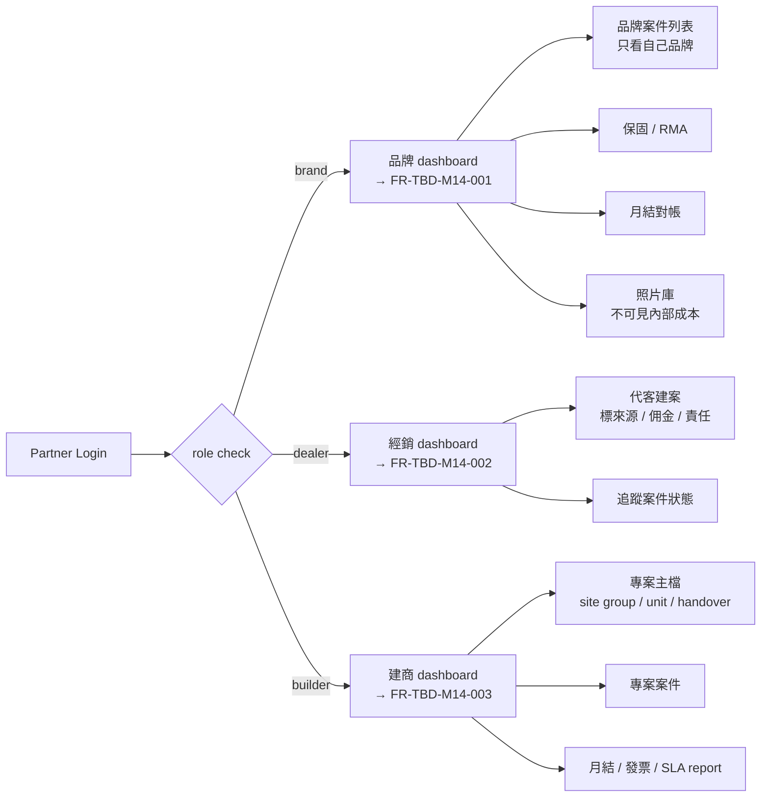
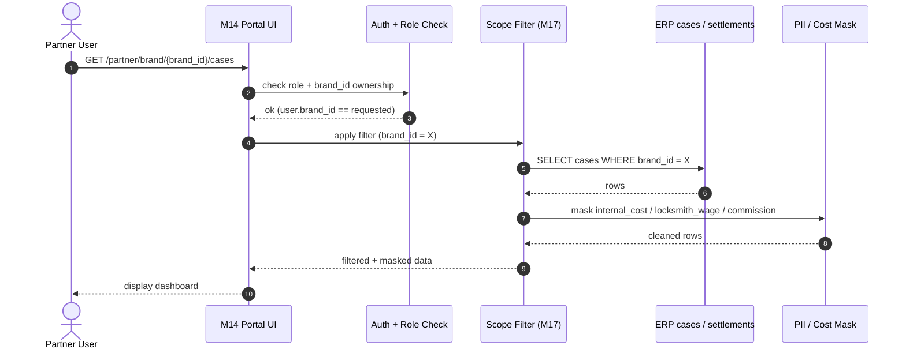
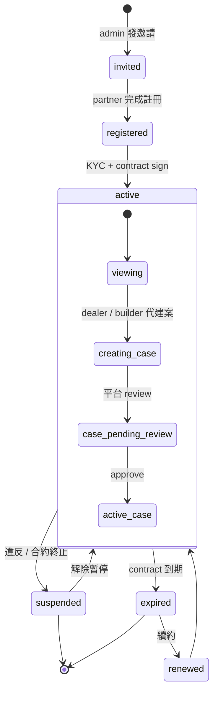

# M14 Partner Portal — 品牌 / 經銷 / 建商 三角色入口

> **30 秒摘要**：M14 提供三種 partner 角色獨立 portal（品牌商 / 經銷商 / 建商），各自有不同 dashboard 與 permission scope。**核心邊界 (P0)**：品牌商只看自己品牌案件 / 不看內部成本 / 不看其他品牌（M17 G007）；經銷商可代客建案但要標來源 / 佣金 / 責任（M17 G008）；建商有專案合約主檔（site group / unit list / handover / warranty / contract price / SLA / invoice）（BR-M14-02）。

---

## 三角色 entry path

---

## Role-specific dashboard 對照

| 角色 | 入口 path | 可見內容 (P0) | 不可見內容 (P0) | annotation |
|:-----|:---------|:--------------|:----------------|:-----------|
| **brand** | `/partner/brand/{brand_id}` | 自家品牌案件 / 保固 / 照片 / RMA / 月結 (B2B price) | **其他品牌 / 內部工資 / 平台毛利 / 客戶實收 detail** | scope: brand_id 隔離 |
| **dealer** | `/partner/dealer/{dealer_id}` | 自己 referrer 案件 / 佣金 / 追蹤 | 其他經銷案件 / 平台內部 | scope: referrer_dealer_id 隔離 |
| **builder** | `/partner/builder/{project_id}` | 自家專案 (case / SLA / invoice / warranty) | 其他建商專案 / 品牌內部 | scope: project_id 隔離 |

---

## Sequence Diagram — partner 查看案件（permission scope check）

---

## State Machine — partner account / project lifecycle

---

## UI State Coverage（業主 Q-OF1=B）

| Step | Happy | Empty | Loading | Error | Offline | annotation |
|:---|:---|:---|:---|:---|:---|:---|
| **partner login** | ✓ MFA + role check | 第一次登入 onboarding | spinner | 401/403 友善 + reason | banner | account: registered → active |
| **brand dashboard 案件列表** | ✓ filter 顯示自家品牌 | empty「目前無案件」 | < 1s | 403 顯示「無權限」mask | cached | scope: brand_only |
| **建商專案主檔編輯** | ✓ form + site group / unit list | empty 顯示 template | save spinner | validation fail inline | local cache | project: setup |
| **月結對帳查看** | ✓ 列表 + download (audited) | empty 月份 | < 2s | 403 + 下載 audit log | cached | settlement: viewing |
| **代客建案 (dealer)** | ✓ form + 標 referrer | empty referrer 自動填登入者 | save | dup case check | local cache | case: creating |
| **partner 試圖看其他品牌案件** | n/a | n/a | n/a | 403 + alert SRE | n/a | scope violation logged |

---

## Edge case 與 P0 規則對應

| 情況 | 怎麼處理 | P0 / M17 對應 |
|:---|:---|:---|
| 品牌商試圖看其他品牌 | 403 + log scope violation + alert SRE | **M17 G007 (P0)** |
| 品牌商試圖看內部成本 | mask layer 過濾 (locksmith cost / commission) | **M17 Q077 Q111 (P0)** |
| 經銷商代建案無標 referrer | 系統 block + 強制標 dealer_id | **M17 G008 (P0)** |
| 建商專案缺 contract / SLA | block project active + 提示補件 | **BR-M14-02** |
| 月結報表下載 | audit log (who/when/scope)；師傅只看自己月結；品牌看品牌；會計看全部 | **M19 G017 (P0)** |
| IT support 臨時看 partner data | time-limited + reason-coded + audit | **M17 BR-M17-03** |

---

## a11y notes — WCAG 2.2 AA

繼承主檔 §a11y，**M14 partner portal 特有**：
- 三角色 dashboard 各自獨立 IA — 共用 design system，但避免使用「品牌 / 經銷 / 建商」混用 button label
- 月結報表表格 走 `<table role="table">` + caption + scope
- **3.3.7 Redundant entry (WCAG 2.2 新)**：建商專案 site group 已填過，子 unit 不再要求重複地址資訊
- **3.2.6 Consistent help**：三角色 portal 統一 help 入口位置

---

## FR 反向指

| Step | FR | AC |
|:---|:---|:---|
| brand portal | FR-TBD-M14-001 | AC-01 brand scope filter / AC-02 mask internal cost |
| dealer portal | FR-TBD-M14-002 | AC-01 referrer 標示 / AC-02 case 追蹤 |
| builder portal | FR-TBD-M14-003 | AC-01 project setup / AC-02 SLA + invoice |
| 月結 audit download | FR-TBD-M14-004 | AC-01 audit log / AC-02 role-based scope |
| partner account lifecycle | FR-TBD-M14-005 | AC-01 invite / KYC / contract / suspend / renew |

---

## 引用 KB
- [KB-07 §diagram_picker] — sequence + state machine 混合（partner account + case lifecycle 並存）

## 相關文件
- 主檔：[`../user-flow-smart-lock-saas.md`](../user-flow-smart-lock-saas.md)
- M17 permission matrix：依 source spec `01-workorder-erp.md M17`
- Source spec：[`../../_source/01-workorder-erp.md#m14-partner-portal`](../../_source/01-workorder-erp.md)
