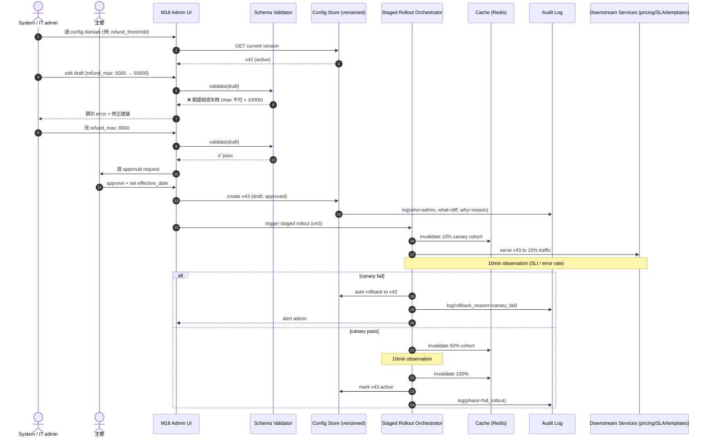
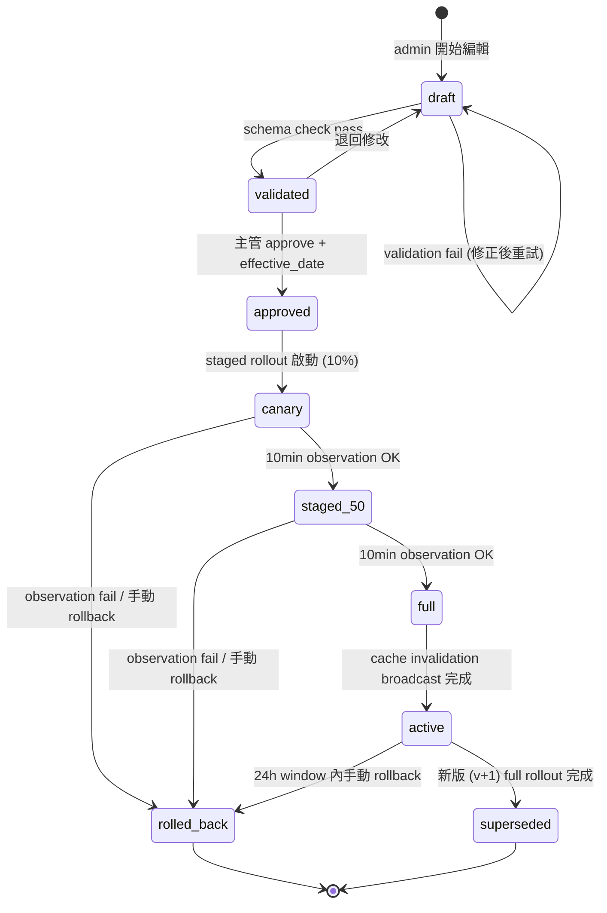

# M18 System Setup — config 自助維護 user flow

> **30 秒摘要**：M18 把過去 hard-coded 的金額、SLA、template、reason code、role permission 全部下放成 runtime config，業主自助維護。本檔補主檔 Flow S5 沒涵蓋的細節：config schema editor / template management / reason code maintenance / role permission matrix 編輯。**核心要求**：schema validation 前置 + 主管 approve + staged rollout + audit + rollback ≤ 24h window（依 ADR-0067）。

---

## Sequence Diagram — config edit → staged rollout 完整握手



---

## State Machine — config lifecycle



---

## UI State Coverage（業主 Q-OF1=B: UI-only + annotation）

| Step | Happy | Empty | Loading | Error | Offline | domain state annotation |
|:-----|:------|:------|:--------|:------|:--------|:------------------------|
| **選 config domain** | ✓ 樹狀清單（pricing / SLA / template / reason_code / role） | 沒權限 domain 隱藏 | 載入清單 spinner | 403 顯示「無權限」+ contact admin | banner 不允許改 | n/a |
| **編輯 draft (schema editor)** | ✓ form + diff preview | empty domain → template 預設 | 載入 schema | inline validation error (with hint) | local cache 暫存 draft | entry: draft / exit: validated |
| **送 approval** | ✓ 主管收到 inbox | 主管不在 → escalate next-in-line | 提交中 | approval timeout (≥ 24h) → escalate | banner 提交失敗 → retry | exit: approved |
| **staged rollout 監看** | ✓ progress bar + observation timer + SLI dashboard | n/a | 10min timer 跑中 | canary fail → 自動 rollback + alert | banner，rollout 持續但 admin 看不到 update | phase: canary → staged_50 → full |
| **audit view** | ✓ 列表 + diff + filter | empty「無變更」+ filter 提示 | 載入 < 3s | 403 reason masked + log audit_view_attempt | cached 上次 view | n/a (read-only) |
| **rollback** | ✓ confirm dialog + reason 必填 + diff preview | — | rollback staged 進行中 | 超過 24h window → block + 改走 CR | banner，無法觸發 rollback | rollback entry: triggered / exit: completed |

---

## Reason code lookup table maintenance（B-S4 cascade）

> Flow S4 cancellation reason / refund reason / dispatch reject reason 全部來自 M18 lookup table，客服 / 派工主管在 UI 提 ChangeRequest 補項。

| 維護步驟 | UI | annotation |
|:--------|:---|:-----------|
| 1. 客服發現新場景無對應 reason code | M18 admin UI → reason_code domain | n/a |
| 2. 客服提 ChangeRequest（含 reason / scenario 例） | UI 走 standard config change flow | entry: ChangeRequest.created |
| 3. 主管 / Knowledge owner approve | inbox | exit: approved |
| 4. 走 staged rollout（10% → 50% → 100%） | rollout monitor | phase: canary → full |
| 5. 客服立即可在 cancel / refund / dispatch flow 選用 | 自動可見 | n/a (active) |

---

## Role permission matrix 編輯（M17 cascade）

> 修改任何角色的 can-view / can-edit / can-approve 都走 M18 config flow + SoD 雙簽。

```mermaid
flowchart TD
    Edit[admin 編輯 role permission matrix] --> Validate{validation:<br/>不可給品牌商 看內部成本<br/>不可給師傅 看其他案件}
    Validate -->|fail| EditErr[擋住 + 顯示 M17 BR-rule]
    Validate -->|pass| DualApprove{高權限變更?<br/>(approve / refund / role grant)}
    DualApprove -->|是| TwoSign[要兩名主管雙簽 - SoD]
    DualApprove -->|否| OneSign[單主管 approve]
    TwoSign --> StagedRollout
    OneSign --> StagedRollout[走 staged rollout]
```

---

## a11y notes — WCAG 2.2 AA + admin UI 加強

繼承主檔 §a11y，**加強 admin UI 特有**：
- **3.3.4 Error prevention (legal / financial / data)** — 改價格表 / 退款上限 / 角色權限時 → 雙重確認對話框 + diff preview
- **2.4.11 Focus not obscured (minimum)** — staged rollout progress modal 不可遮 main focus；observation timer 用 toast 非 blocking
- **3.2.6 Consistent help (WCAG 2.2 新)** — admin UI 全頁面 help 入口位置一致（右上角 ?）
- **3.3.8 Accessible authentication (WCAG 2.2 新)** — admin MFA 不可純依賴 CAPTCHA 識讀

---

## FR 反向指

| Step | FR 反向指 | AC |
|:-----|:----------|:---|
| edit config draft | FR-TBD-M18-001 | AC-01 admin 編輯 draft + autosave |
| schema validation 前置 | FR-TBD-M18-002 | AC-01 validation pass / AC-02 validation fail message |
| 主管 approve + effective_date | FR-TBD-M18-003 | AC-01 single approve / AC-02 dual sign for high-risk |
| staged rollout 10% → 50% → 100% | FR-TBD-M18-004 | AC-01 canary pass / AC-02 canary fail auto rollback / AC-03 full rollout cache invalidation |
| cache invalidation broadcast | FR-TBD-M18-005 | AC-01 sub-second propagation |
| audit view | FR-TBD-M18-006 | AC-01 filter by domain/actor/date / AC-02 diff view / AC-03 retention ≥ 7y |
| rollback ≤ 24h window | FR-TBD-M18-007 | AC-01 within window staged rollback / AC-02 beyond window block |
| reason code 維護 | FR-TBD-M18-008 | AC-01 ChangeRequest / AC-02 staged rollout |
| role permission matrix | FR-TBD-M18-009 | AC-01 SoD 雙簽 high-risk / AC-02 validation 擋越權設定 |

---

## 引用 KB

- [KB-07 §diagram_picker] — sequence + state machine 雙圖混合（admin 操作 + 系統 lifecycle 並存場景）
- [KB-13 §拆檔判準] — M18 admin 獨立子檔（與主檔 Flow S5 互補不重複）

---

## 相關文件

- 主檔 Flow S5：[`../user-flow-smart-lock-saas.md#flow-s5`](../user-flow-smart-lock-saas.md)
- ADR-0067：[`../../architecture/adr/ADR-0067-m18-runtime-config-governance.md`](../../architecture/adr/ADR-0067-m18-runtime-config-governance.md)
- Source spec：[`../../_source/01-workorder-erp.md#m18-system-admin`](../../_source/01-workorder-erp.md)
