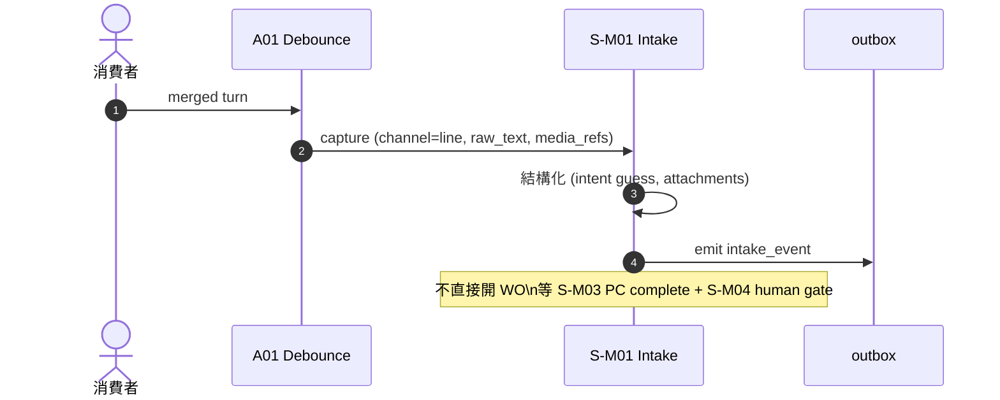
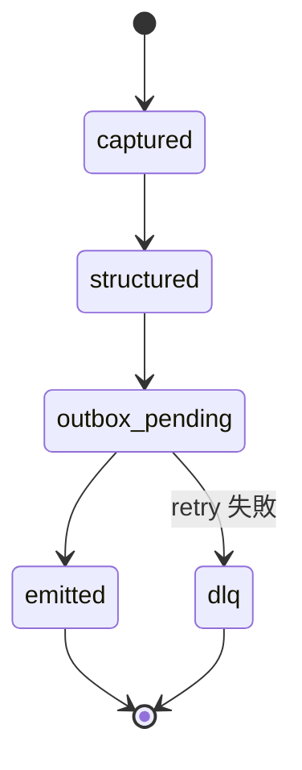

# S-M01 Intake 資料捕捉

> **30 秒摘要**：從 LINE / user turn 萃取可結構化資訊（channel、raw_text、media_ref、reply context）；**不要直接開 WO**（強制走 S-M03 → S-M04 human gate）。

## Sequence Diagram

## State Machine — intake event

## UI State Coverage

| Step | Happy | Empty | Loading | Error | Offline | annotation |
|:---|:---|:---|:---|:---|:---|:---|
| 捕捉 | ✓ 結構化完成 | empty turn 跳過 | < 50ms | 結構化 fail → keep raw + log | n/a | captured → structured |
| outbox emit | ✓ async emit | n/a | n/a | DLQ + alert | n/a | emitted / dlq |

## a11y notes（下游 admin 監看 UI — WCAG 2.2 AA 繼承自主檔）

- **純後台 service**，無客戶端 UI；下游 admin 監看 / DLQ 介面走 WCAG 2.2 AA
- **Keyboard navigation (2.1.1)**：DLQ 列表 / re-emit 操作 / raw_text 檢視全鍵盤可達；無 keyboard trap
- **Focus indicator (2.4.7)**：DLQ row focus ring 明顯（≥ 2px / ≥ 3:1 contrast）
- **Screen reader (4.1.2)**：intake event metadata（channel / timestamp / status）用 semantic HTML + ARIA roles
- **Color contrast (1.4.3)**：DLQ 狀態標記 ≥ 4.5:1；error / DLQ badge 不單靠顏色 — 加 icon + 文字「DLQ」「Error」
- **3.3.7 Redundant entry**：re-emit 時自動帶入原 payload，admin 不需重輸 channel / customer_id

## FR 反向指
| Step | FR | AC |
|:---|:---|:---|
| intake capture | FR-0035 | AC-01 channel/raw_text/media_ref / AC-02 不直接開 WO |

## 相關
- 主檔：[`../user-flow-smart-lock-saas.md#flow-s1`](../user-flow-smart-lock-saas.md)
- Source：[`../../_source/02-ai-chatbot-sync.md#s-m01-intake資料捕捉`](../../_source/02-ai-chatbot-sync.md)
