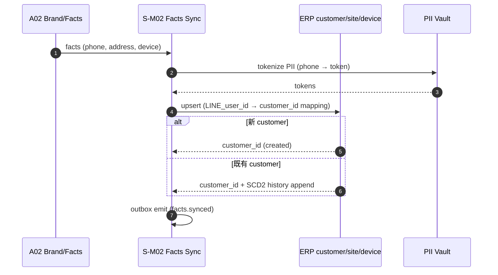
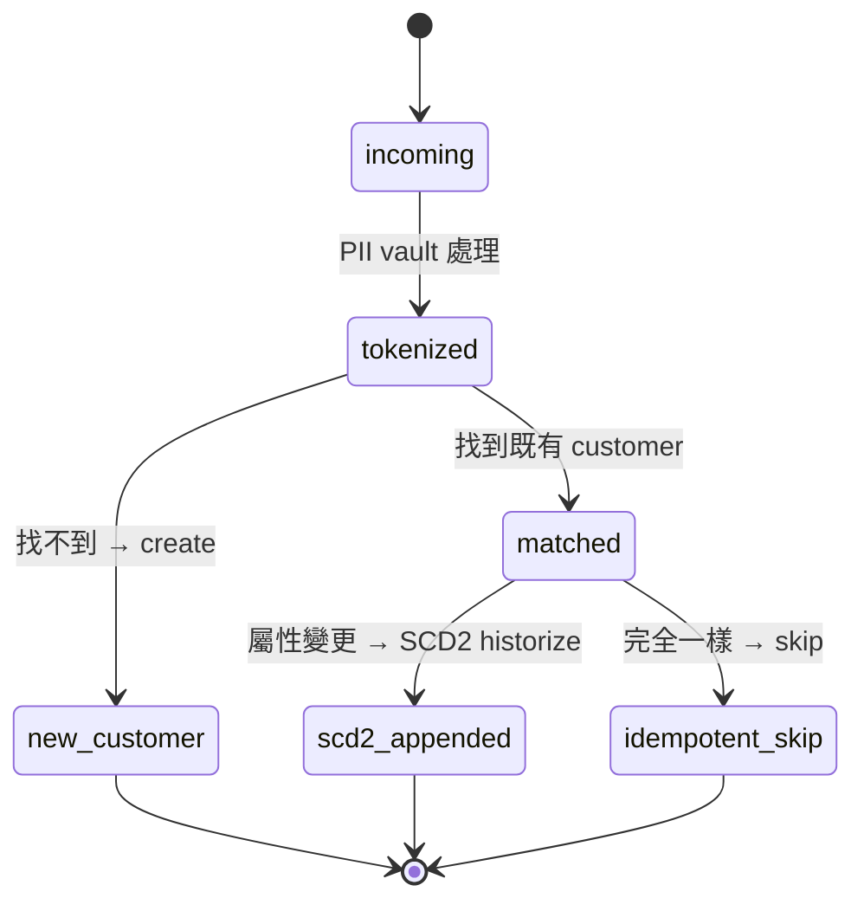

# S-M02 Facts 主檔同步

> **30 秒摘要**：phone / address / device facts 與 ERP customer / site / device 對齊；PII 處理 + SCD2（slowly changing dimension 第二型，保留歷史）；對接 ERP `users` / `user_facts` table。

## Sequence Diagram

## State Machine — facts entity

## UI State Coverage

| Step | Happy | Empty | Loading | Error | Offline | annotation |
|:---|:---|:---|:---|:---|:---|:---|
| PII tokenize | ✓ 200ms | n/a | < 200ms | vault down → fail-closed | n/a | incoming → tokenized |
| upsert ERP | ✓ idempotent | n/a | < 500ms | conflict → SCD2 / DLQ | n/a | matched / new_customer |
| outbox emit | ✓ async | n/a | n/a | DLQ + alert | n/a | scd2_appended |

## a11y notes（後台 admin 查 facts 歷史 / diff view UI — WCAG 2.2 AA 繼承自主檔）

- **純後台同步**，無客戶端 UI；後台 admin 查 facts 歷史走 WCAG 2.2 AA（diff view）
- **PII 顯示需 mask**（除 audited admin 外）；mask 不可單靠顏色 — 加 `*` 字元 + aria-label "masked"
- **Keyboard navigation (2.1.1)**：facts 歷史列表 / diff view / SCD2 版本切換全鍵盤可達；無 keyboard trap
- **Focus indicator (2.4.7)**：diff view 中當前選取段落 focus ring ≥ 2px / ≥ 3:1 contrast
- **Screen reader (4.1.2)**：SCD2 版本 metadata（valid_from / valid_to / actor）用 semantic HTML + ARIA roles；diff `<ins>` / `<del>` 可朗讀
- **Color contrast (1.4.3)**：diff highlight ≥ 4.5:1；不單靠紅綠（色盲 fallback：`+` / `-` prefix）

## FR 反向指
| Step | FR | AC |
|:---|:---|:---|
| PII tokenize | FR-0036 | AC-01 vault 前置 |
| SCD2 historize | FR-0036 | AC-01 變更保留歷史 / AC-02 idempotent skip |

## 相關
- 主檔：[`../user-flow-smart-lock-saas.md`](../user-flow-smart-lock-saas.md)
- Source：[`../../_source/02-ai-chatbot-sync.md#s-m02-facts主檔同步`](../../_source/02-ai-chatbot-sync.md)
