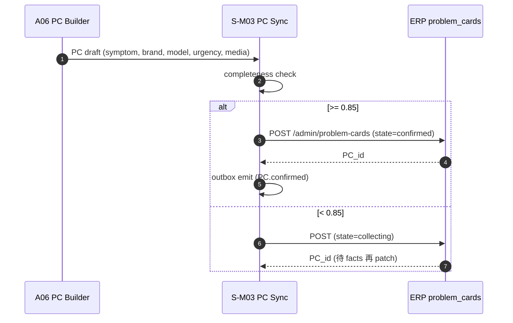
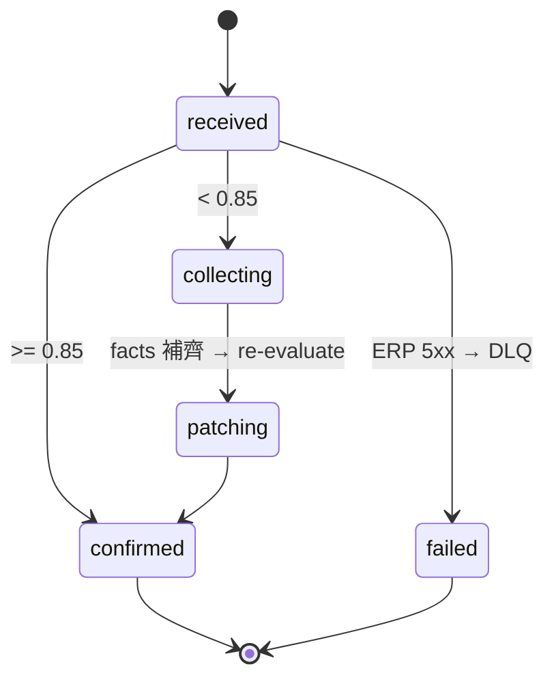

# S-M03 ProblemCard 轉換同步

> **30 秒摘要**：A06 完成的 PC（symptom / brand / model / category / urgency / media_urls）寫入 ERP `problem_cards` table；走 completeness gate（≥ 0.85 才視為 confirmed），讓 S-M04 可以拿去開 WO。

## Sequence Diagram

## State Machine — PC sync entity

## UI State Coverage

| Step | Happy | Empty | Loading | Error | Offline | annotation |
|:---|:---|:---|:---|:---|:---|:---|
| completeness check | ✓ score 計算 | n/a | < 50ms | weights missing → conservative fail | n/a | received → collecting/confirmed |
| ERP create | ✓ 200 | n/a | < 300ms | 5xx → DLQ + alert | n/a | confirmed / failed |
| patch facts 後 re-eval | ✓ confirmed | n/a | < 300ms | conflict (PC 已 converted) → reject | n/a | patching → confirmed |

## a11y notes
- 純後台 service，無客戶端 UI；下游客服 review queue 走 WCAG 2.2 AA（見 S-M04）

## FR 反向指
| Step | FR | AC |
|:---|:---|:---|
| completeness gate | FR-0037 | AC-01 score ≥ 0.85 → confirmed |
| ERP sync | FR-0037 | AC-01 idempotent / AC-02 DLQ fallback |

## 相關
- 主檔 Flow S1：[`../user-flow-smart-lock-saas.md#flow-s1`](../user-flow-smart-lock-saas.md)
- A06：[`./A06-problemcard-flow.md`](./A06-problemcard-flow.md)
- S-M04：[`./S-M04-convert-to-wo-flow.md`](./S-M04-convert-to-wo-flow.md)
- Source：[`../../_source/02-ai-chatbot-sync.md#s-m03-problemcard轉換`](../../_source/02-ai-chatbot-sync.md)
