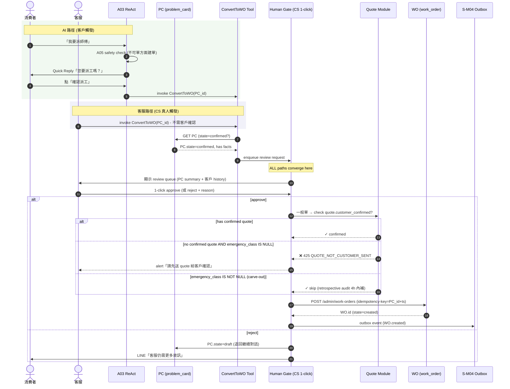
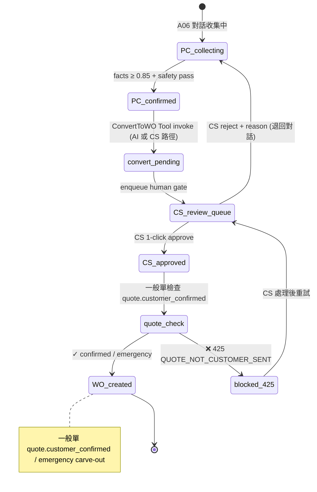

# S-M04 ConvertToWO — confirmed PC → created WO（強制 human gate）

> **30 秒摘要**：S-M04 把 confirmed ProblemCard 轉成 created WorkOrder。**Phase I 核心 UX 節點 — 強制 human gate**：不論 AI 路徑（客戶觸發 ConvertToWO Tool）或客服路徑（客服真人接手），最終都需 **客服 1-click 審核**才能進 `WO.created`。AI 不可繞過客戶自行建單，BR-AI-越權邊界鎖死。**P0 規則對應**：Quote-WO 硬綁定 (Q1=A) — `WO.created` 必有 `quote.customer_confirmed`（或 emergency carve-out）；idempotency + address 補齊。

---

## Sequence Diagram — AI 路徑 vs 客服路徑（同一個 ConvertToWO Tool）

---

## State Machine — PC → WO 轉換 lifecycle

---

## Human gate decision matrix（強制 — Phase I 重要 UX 節點）

| 觸發路徑 | 是否需要 CS 1-click | 是否需要客戶確認 quote | 是否可 bypass |
|:--------|:------------------|:----------------------|:--------------|
| **AI 路徑（客戶觸發 Tool）** | ✅ 強制 | ✅ 一般單必要 / emergency carve-out 跳過 | ❌ AI 不可繞過 (A05 + S-M04 攔截) |
| **客服路徑（CS 真人）** | ✅ 強制（CS 自己 click） | ✅ 一般單必要 / emergency carve-out 跳過 | ❌ |
| **AI 自行嘗試建單** | n/a | n/a | ❌ A05 攔截 → log + alert |

> **設計 anti-pattern**：AI 不可有「直接建單」的 Tool 暴露；ConvertToWO Tool 必經 human gate。Q1=A 硬綁定 + BR-AI-越權邊界 雙保險。

---

## UI State Coverage（業主 Q-OF1=B: UI-only + annotation）

| Step | Happy | Empty | Loading | Error | Offline | domain state annotation |
|:-----|:------|:------|:--------|:------|:--------|:------------------------|
| **客戶觸發 ConvertToWO** | ✓ LINE Quick Reply「確認派工」 | 無資格（PC 未 confirmed） → 「我們還需要更多資訊」 | A03 200ms callback | 客戶連點 → idempotency-key 擋重複 | LINE offline 暫存意圖 | PC entry=confirmed / exit=convert_pending |
| **CS review queue** | ✓ 列表顯示待 review PC + 摘要 | empty queue 顯示「沒有待處理工單」 | spinner < 1s | 403（非客服角色）→ block | banner，無法 review | CS_review_queue entry |
| **CS 1-click approve** | ✓ 一秒內 WO 建立 + 跳轉派工頁 | n/a | spinner + button disabled | 425 顯示「請先送 quote」/ 409 idempotency 重複阻擋 | banner 無法 approve | CS_approved / WO_created |
| **CS reject** | ✓ reason 必填 + PC 退回 collecting + 客戶 LINE 通知 | n/a | spinner | reason 為空 → block | banner 暫存意圖 | PC_collecting (退回) |
| **AI 試圖繞過 (越權偵測)** | n/a (理想不發生) | n/a | n/a | A05 攔截 → log alert + 客服收 incident | n/a | n/a |

---

## Edge case 與 P0 規則對應

| 情況 | 怎麼處理 | P0 / ADR 對應 |
|:---|:---|:---|
| AI 想繞過客戶自行建單 | A05 safety + S-M04 gate 雙攔截 + audit log alert | **A05 + S-M04 (P0 越權邊界)** |
| 一般單 quote 未 customer_confirmed | 425 `QUOTE_NOT_CUSTOMER_SENT`，CS 收 alert，先補 quote | **Q1=A 硬綁定 / ADR-0066** |
| 急件 4 類 carve-out | bypass quote 直接 WO.created；retrospective audit quote 4h 內補 | **Q3=A / ADR-0066** |
| 重複 ConvertToWO（客戶連點 / CS 重複 click） | Idempotency-Key (PC_id + timestamp) 擋；409 顯示「工單已建立」 | idempotency 機制 |
| CS reject 後客戶 LINE 通知 | A07 handoff 流量 + CS 真人接手繼續對話 | A07 handoff |
| 地址不齊 | WO.created 後仍可派工（地址 3 段補：對話/後台/派工不擋/結案硬擋） | M02 + S2 主檔 |
| Outbox 失敗 | DLQ + 客服 alert + 後台手動補送 | M11 部署健康 |

---

## a11y notes — WCAG 2.2 AA

繼承主檔 §a11y，**S-M04 / CS 後台 review 特有**：
- **CS review queue UI** 全鍵盤導覽（Tab 切 row，Enter 進詳細）
- **1-click approve button** ≥ 44×44 CSS px，focus indicator 明顯
- **reject reason 必填**：`aria-required="true"` + `aria-describedby` 標示「請說明 reject 原因」
- **idempotency error 訊息** 走 `aria-live="polite"`，不打斷 main task
- **3.3.4 Error prevention**：approve 涉及建單 + 後續派工成本，顯示確認對話框「您即將建立 WO，是否繼續？」

---

## FR 反向指

| Step | FR 反向指 | AC |
|:-----|:----------|:---|
| 客戶觸發 ConvertToWO | FR-0038 | AC-01 LINE Quick Reply / AC-02 A05 攔截 AI 越權 |
| CS review queue | FR-0038 | AC-01 queue 顯示 + filter / AC-02 1-click approve |
| Quote-WO 硬綁定檢查 | FR-0010 | AC-01 425 QUOTE_NOT_CUSTOMER_SENT / AC-02 emergency carve-out 跳過 |
| Idempotency | FR-0038 | AC-01 Idempotency-Key 擋重複 / AC-02 409 顯示已建單 |
| CS reject + 退回 | FR-0038 | AC-01 reason 必填 / AC-02 PC 退回 collecting + 客戶通知 |
| Outbox sync | FR-0038 | AC-01 outbox event / AC-02 DLQ + retry |
| 越權偵測 audit | FR-0030 | AC-01 AI 嘗試繞過 → log + alert |

---

## 引用 KB

- [KB-07 §sequence + state 雙圖混合場景]

---

## 相關文件

- 主檔 Flow S1 / S2 交界：[`../user-flow-smart-lock-saas.md`](../user-flow-smart-lock-saas.md)
- A06 PC builder：[`./A06-problemcard-flow.md`](./A06-problemcard-flow.md)
- A07 handoff：[`./A07-handoff-flow.md`](./A07-handoff-flow.md)
- S-M03 PC sync：[`./S-M03-problemcard-sync-flow.md`](./S-M03-problemcard-sync-flow.md)
- ADR-0066 Quote-WO Lifecycle 硬綁定
- Source spec：[`../../_source/02-ai-chatbot-sync.md#s-m04-converttowo`](../../_source/02-ai-chatbot-sync.md)
