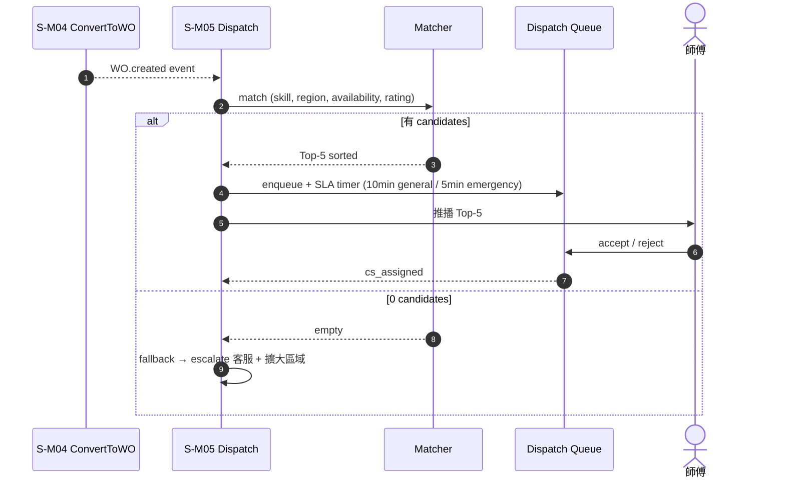
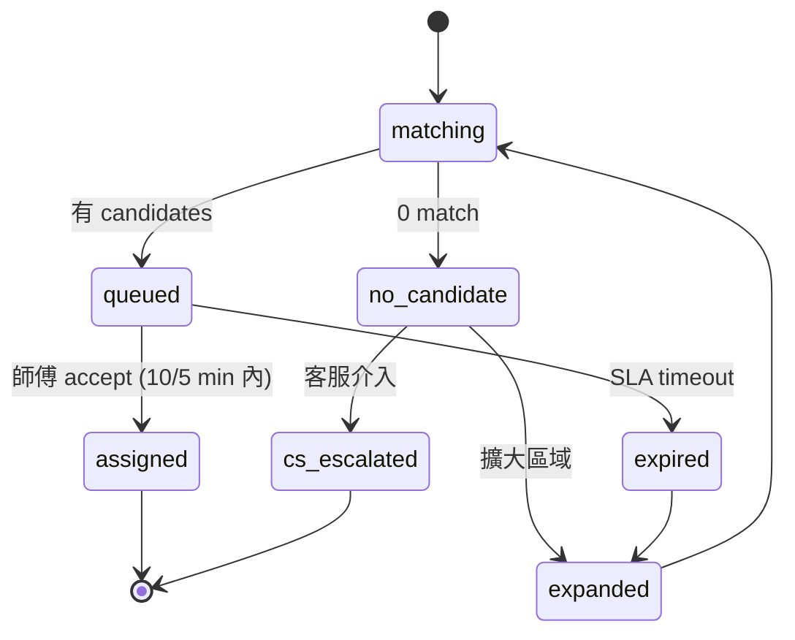

# S-M05 Dispatch 同步

> **30 秒摘要**：WO.created 後 enqueue 派工 queue → 智慧匹配候選技師 → Top-5 推播 → SLA tracking。**有 candidates fallback 機制**（無候選師傅時 escalate 客服）。

## Sequence Diagram

## State Machine — dispatch entity

## UI State Coverage

| Step | Happy | Empty | Loading | Error | Offline | annotation |
|:---|:---|:---|:---|:---|:---|:---|
| 智慧匹配 | ✓ Top-5 | 0 candidates → fallback | < 500ms | matcher down → fallback random | n/a | matching → queued/no_candidate |
| 師傅推播 | ✓ Web Push | 師傅 offline → push fallback SMS | < 1s | push delivery fail → retry | banner 推播延遲提示 | queued |
| 師傅接單 | ✓ accept | empty (no one accept) → expand | < 200ms | 多人同搶 → first-wins lock | banner | queued → assigned |
| SLA breach | ✓ expand + alert | n/a | timer 跑 | n/a | n/a | queued → expired |

## a11y notes
- 師傅 Web App 走 WCAG 2.2 AA — 大按鈕（accept/reject），focus indicator 明顯，dark mode 支援
- Web Push notification 用 system native（OS 控 a11y）
- SLA badge 不僅靠顏色 — 加文字「剩餘 3 分鐘」

## FR 反向指
| Step | FR | AC |
|:---|:---|:---|
| 匹配 | FR-TBD-S-M05-001 | AC-01 Top-5 / AC-02 skill+region+rating |
| 推播 | FR-TBD-S-M05-002 | AC-01 Web Push / AC-02 SMS fallback |
| SLA | FR-TBD-S-M05-003 | AC-01 general 10min / AC-02 emergency 5min / AC-03 breach escalate |
| no candidate fallback | FR-TBD-S-M05-004 | AC-01 擴大區域 / AC-02 客服 escalate |

## 相關
- 主檔 Flow S2：[`../user-flow-smart-lock-saas.md#flow-s2`](../user-flow-smart-lock-saas.md)
- Source：[`../../_source/02-ai-chatbot-sync.md#s-m05-dispatch同步`](../../_source/02-ai-chatbot-sync.md)
