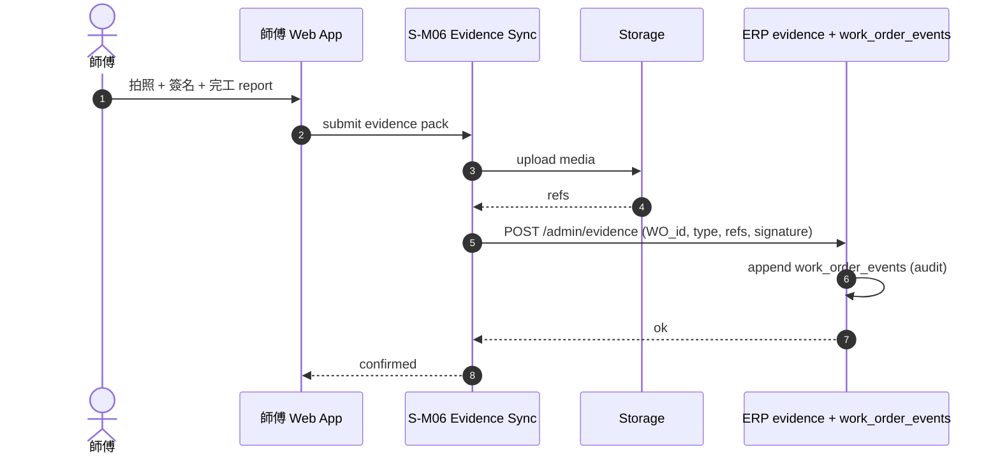
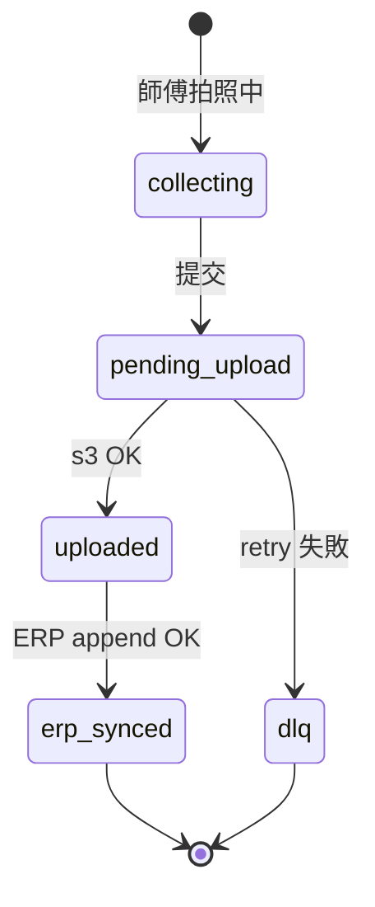

# S-M06 Evidence 回寫

> **30 秒摘要**：師傅現場拍照 / 客戶簽名 / 完工報告 / 付款證明回寫 ERP `evidence` + `work_order_events` table；後續 RMA / 爭議 解決依此 evidence chain。

## Sequence Diagram

## State Machine — evidence pack

## UI State Coverage

| Step | Happy | Empty | Loading | Error | Offline | annotation |
|:---|:---|:---|:---|:---|:---|:---|
| 拍照 | ✓ camera 開啟 | empty required → 提醒 | compress < 5MB | > 10MB 壓不下 → 重拍 | local 暫存 | collecting |
| 簽名 | ✓ canvas | empty → block 完工 | n/a | render fail → 紙本 fallback | local cache | collecting |
| upload | ✓ < 2s | n/a | progress bar | s3 fail → DLQ + 後台補送 | offline 暫存 + 上線重送 | uploaded |
| ERP append | ✓ ok | n/a | < 300ms | 5xx → DLQ | n/a | erp_synced |

## a11y notes
- 師傅 Web App 走 WCAG 2.2 AA
- 拍照 / 簽名按鈕大尺寸（≥ 44×44 enhanced）+ haptic feedback
- 簽名 canvas 提供「重簽」（不可只靠 gesture）
- 完工報告 textarea 支援語音輸入

## FR 反向指
| Step | FR | AC |
|:---|:---|:---|
| 拍照 / 簽名 / 報告 | FR-TBD-S-M06-001 | AC-01 multimodal capture / AC-02 必填項 |
| upload + ERP append | FR-TBD-S-M06-002 | AC-01 idempotent / AC-02 DLQ |
| RMA / 爭議 reference | FR-TBD-S-M06-003 | AC-01 evidence chain 可追溯 |

## 相關
- 主檔 Flow S2：[`../user-flow-smart-lock-saas.md#flow-s2`](../user-flow-smart-lock-saas.md)
- Source：[`../../_source/02-ai-chatbot-sync.md#s-m06-evidence回寫`](../../_source/02-ai-chatbot-sync.md)
