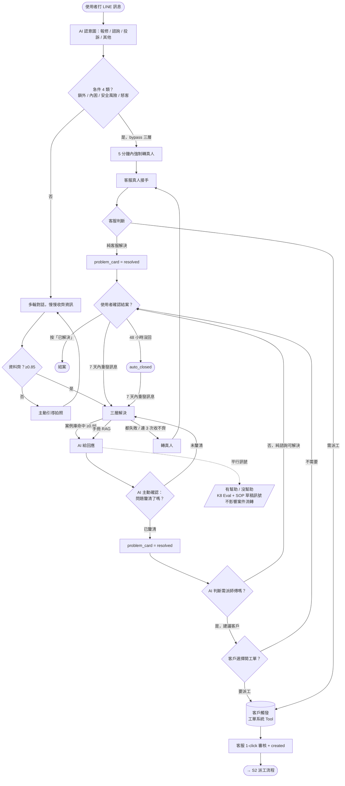
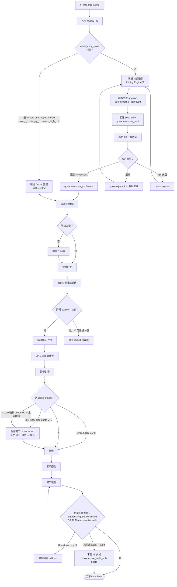
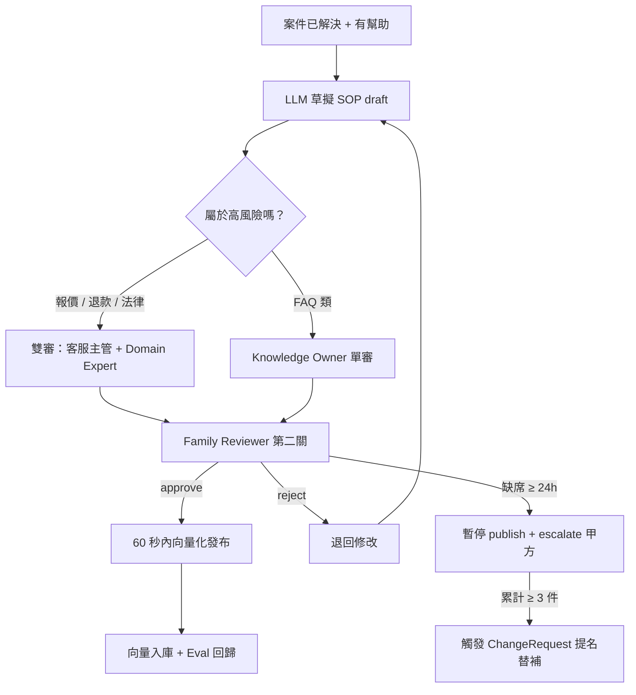
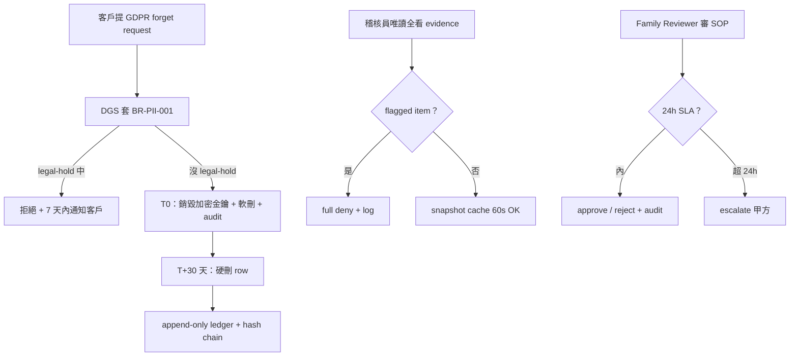

# User Flow — 智慧鎖 SaaS 平台

> **狀態**：v1 draft（Gate 2 ready）— Forum 2026-05-26-Q01 cascade 更新（Flow S2 quote-pricing-engine）
> **更新**：2026-05-26
> **負責人**：UX
> **關聯**：[PRD v2.1](../prd/smart-lock-saas.md) · ADR-0028 / 0031 / 0032 / 0034 / 0036 / 0037 / 0042 / 0045 / 0048 / 0049 / 0050 / **0062 (Pricing Engine V2 bounded context)** / **0063 (AI Quote-related Utterance Boundary)** / **0064 (Pricing Rule Snapshot immutable + independent hash chain)** / **0065 (ChangeRequest.type lookup table migration)** / **0066 (Quote-WO Lifecycle 硬綁定 + Emergency carve-out)**
> **業主裁決**：Q1=A 硬綁定 / Q2=A 重構句型 / Q3=A 急件跳 quote / Q4=A Lookup table

---

## 📋 30 秒摘要

平台有四種使用者、四條主要 flow：**消費者報修自助**、**師傅到場修**、**客服審 SOP**、**稽核員看 audit**。每條 flow 都涵蓋 happy / empty / loading / error / offline 五個狀態，加上 12 個 edge case（急件、地址沒填齊、AI 越權、重開、放棄等）。a11y 走 WCAG 2.2 AA。

---

## 🎯 設計目標

我們希望使用者完成「報修 → 解決」這件事的時候：

- **消費者**用 LINE 就能搞定，5 秒內看到 AI 回應，不會在地址、品牌、型號的問題裡打轉
- **師傅**手機接單一鍵搞定，現場拍照、回報、月結對帳都不用記在腦袋裡
- **客服**只在 AI 處理不了的時候才介入，不用每筆都接
- **家族覆核員**24 小時內審完 SOP，缺席有替補機制

成功狀態（success state）長這樣：

- 消費者按下「已解決」或對話 48 小時自動結案
- 師傅交完工報告、客戶簽名、月結對得起來
- 客服佇列空了
- 家族覆核員的覆核率 100% 不掉

---

## 🗺 Journey Map（高層）

```
[消費者]  發現問題 → LINE 報修 → AI 認意圖
                                       ↓
                            急件 4 類？─是→ 5 分鐘內強制轉真人（bypass 三層）
                                       ↓ 否
                            多輪對話 → 三層解決 → AI 回應 → 問題釐清確認 → resolved
                                                              ↓
                                                    需派工？→ 客戶觸發開工單
                                                              ↓
                                                    確認結案

[客服]                              審 PC → 內部報價（急件跳過）→ 主管 approve → send LIFF
                                                                            ↓
[客戶]                                                    LIFF 看明細 → 勾 checkbox → 確認
                                                                            ↓
                                                                    quote.customer_confirmed → WO.created

[師傅]                              收到推播 → 看案件 → 接單 → ETA → 到場 → 完工 → 月結

[客服]                              監看異常 → 處理 Exception → 客訴 → 審 SOP

[家族覆核員]                                                  審 SOP 第二關（24h）
```

---

## 🚶 Flow S1：消費者 LINE 報修 → AI 自助解決（V1 主流程）

> **使用者想做的事**：「我家鎖壞了」→ 講出問題 → 聽 AI 講方法 → 自己修好。



**逐步說明**：

1. **使用者打 LINE 訊息** — 系統 5 秒內回覆。超過 5 秒顯示「正在處理中」避免卡死感
2. **AI 認意圖** — 分四類（報修 / 諮詢 / 投訴 / 其他）。認不出來時不報錯，給引導訊息
3. **急件偵測（Intent 後立即判定）** — 被鎖在門外 / 門內受困 / 安全風險 / 怒客四類任一命中，**bypass 三層解決**直接 5 分鐘內轉真人。怒客判定走 sentiment + 關鍵字雙保險（不能接受、要投訴、太離譜）
4. **多輪對話收齊資訊** — 一輪一輪問品牌、型號、症狀，允許使用者改口
5. **資料齊不齊** — 不齊就主動引導拍照（鎖舌、把手、錯誤代碼）；齊了（≥0.85）走三層解決
6. **三層解決** — 先查案例庫（< 3 秒）→ 再查手冊 RAG（< 8 秒）→ 都不行或連 3 次資料收不齊就轉真人
7. **AI 回應 → 問題釐清確認**（**新增決策節點**）— AI 給回應後，由 AI 主動詢問「這樣的處理方式有沒有解決你遇到的問題？」客戶答「已釐清」才標 `problem_card.state = resolved`；答「沒釐清」就回 Triage 重試。**這個 gate 是案件流轉依據**
8. **「有幫助 / 沒幫助」是平行品質訊號** — 用於 K8 Eval / SOP 草稿觸發 / AI 改進統計，**不影響案件流轉**。即使按「沒幫助」，問題仍可被釐清；即使按「有幫助」，仍需另外確認問題是否真的釐清
9. **Resolved 後判斷是否需派工** — AI 判斷有「實地處理」需要時，**只能建議客戶**，由**客戶觸發呼叫工單系統 Tool**；若客戶不需派工或純諮詢，直接走 CustAck 確認結案
10. **工單系統作為共用 Tool** — 不論 AI 路徑（客戶觸發）或客服真人路徑（客服觸發），最終都呼叫同一個工單建立 Tool，CS 1-click 審核後進入 S2。AI 不可繞過客戶自行建單，客服不需走客戶確認
11. **結案** — 使用者按「已解決」或 48 小時沒回應 auto_closed；7 天內重發訊息 reopen 回 Triage

**Edge case 一覽**：

| 情況 | 怎麼處理 |
|:---|:---|
| 急件 4 類觸發（含怒客） | Intent 後立即 bypass 三層，5 分鐘內轉真人 |
| AI 回應後客戶按「有幫助」但仍說沒釐清 | 不結案，回 Triage；feedback 進 K8 Eval 不影響案件流轉 |
| AI 回應後客戶按「沒幫助」但已自己想通 | Clarify gate 答「已釐清」即標 resolved；feedback 仍進 K8 Eval |
| AI 建議派工但客戶拒絕 | 不建工單，走 CustAck 結案；保留紀錄供 K2 / 後續客服判斷 |
| AI 想繞過客戶自行建工單 | 系統攔截（同 final quote 攔截機制），由 BR-AI-越權邊界拘束 |
| 客服真人接手後判斷需派工 | 客服直接呼叫工單 Tool，不需走客戶確認 |
| 資料連 3 次收不齊 | 自動轉真人接手（CSHandle） |
| AI 想說 final quote / 折扣 / 免費保固 | 系統攔截 + 改口給範圍價 |
| 同一對話多個問題 | 同 active issue 只開一張卡，新症狀 / 新設備可另開 |
| 客戶重開 7 天前的案件 | 進 K2 統計分子 -1 |

---

## 🛠 Flow S2：AI → 客服 → 報價 → 客戶確認 → 派工 → 師傅到場（V2 主流程）

> **使用者想做的事**：師傅版 = 「我要接案、開車過去、修完、領錢」。客戶版 = 「我要先看到報價金額再答應、再看師傅到了沒」。
>
> **Forum Q01 cascade 重點**：業主原話「客服報價 → 客人確認 → 才立工單」採 Q1=A 硬綁定字面詮釋 — `quote.customer_confirmed` 為 `WO.created` 前置（非 `WO.completed` 前置）。急件 4 類 (Q3=A) carve-out 跳過 quote。AI 不複誦金額 (Q2=A)，僅 announce existence。



**Flow S2 逐步說明**（Forum Q01 cascade rewrite）：

1. **AI 收齊 PC 後客服 review**（**不再** 「AI 1-click 直接立工單」）— 問題卡完整度 ≥ 0.85 後，客服進場 review，不允許 AI 單向繞過客服建單
2. **急件 4 類 carve-out**（Q3=A）— `emergency_class IN (locked_out, trapped_inside, safety_risk, angry_customer_high_risk)` 任一命中 → **跳過 Quote 直接 `WO.created`**，事後客服 4h 內補 `retrospective_audit_only` quote（不影響案件流轉，只補 audit 鏈）；急件 audit 未補完，`WO.completed` 結案前置會 alert，客服必須回頭補齊
3. **一般單**：Pricing Engine（`api/pricing/` sub-module）依 contract_template 算金額（客服可手動 override + audit 入 override SLI）→ **客服主管 approve** (`quote.internal_approved`) → 客服 send LIFF (`quote.customer_sent`)
4. **客戶 LIFF 看明細 + checkbox + 確認**（D5-B'）— LINE Flex Message 推一張卡點開 LIFF，progressive disclosure 條款（摘要 3 點 + 完整條款展開）；**AI 不複誦金額**（Q2=A）— LINE 訊息只說「客服已準備好您的報價，請點選下方按鈕查看詳細金額與條款。系統報價編號 Q-XXXXX」，數字一律存 LIFF
5. **客戶拒絕** → `quote.rejected`，回客服重議（新 quote 帶 `supersedes_quote_id` self-FK 串歷史）；**48h 未回** → `quote.expired`，客服可重議
6. **`quote.customer_confirmed` → `WO.created`**（Q1=A 硬綁定）— `WorkOrderCreate.quote_id` required，後端 425 `QUOTE_NOT_CUSTOMER_SENT` / 409 `QUOTE_STATE_INVALID` 雙閘
7. **派工後流程**不變：地址 3 段補（對話 → 後台 → 派工不擋，結案硬擋）→ 智慧匹配 Top-5 → 師傅接單（一般 10 分鐘 / 急件 5 分鐘）→ ETA → LINE 通知消費者 → 師傅到場
8. **Onsite scope_change tier**：
   - **≤500 元**：不觸發 quote v+1，師傅自確走 ADR-0049 三件套（簽名 + 照片 + audit）
   - **501-2000 元**：**暫停施工** → 觸發 quote v+1 → 客戶 LIFF 確認 → 續工
   - **>2000 元**：**強制** quote v+1 + 主管覆核（三方在線）→ 客戶 LIFF 確認 → 續工
9. **結案 hard gate**：`address + quote.customer_confirmed`（或 emergency carve-out 路徑下 `retrospective_audit_only` quote 已補），任一缺 → 422 + 強制回填

**Edge case**：
- **地址 3 段補**：對話追問 → 後台補 → 仍無時派工**不擋** + 師傅可 skip + **結案時硬擋**（業主特別交代）
- **Scope change ADR-0049 三件套**：客戶簽名 + 證據照片 + audit log 三個缺一不可（≤500 元用，501+ 升級走 quote v+1 LIFF 確認）
- **取消費 5 階段**：報價未確認 0 / 派工未出發 0 / 出發後 車馬費 / 到場後 車馬+檢測 / 已施工 按比例（**新增 reason code**：`customer_rejected_post_dispatch_completed` 僅在 Q1=B 軟綁定時觸發；Q1=A 硬綁定下不會發生派工後客戶拒絕，因為 confirmed 已在派工前）
- **材料歸屬**：platform / brand / locksmith 三選一，月結自動分流
- **零件序號**：主鎖 + >1000 高價零件強制填，低價選填
- **Quote 48h 過期計時器 ↔ conversation auto_closed 48h**：採單一 source of truth — conversation auto_closed 時 quote 同步 `expired_by_conversation_close` reason
- **Onsite quote v+1 LIFF 失敗**：客戶手機 LIFF 優先 → QR code 跨師傅平板 → 紙本簽 audit log（BR-Onsite-004）
- **Quote re-version**：舊版 quote button auto-disable + redirect to v2（避免客戶按到失效版本）

---

### Flow S2 — LIFF 二段確認 state coverage（D5-B' 補完）

> 5 step × 5 state 全填，給 UI 設計 + QA test plan 用。

| Step | Happy | Empty | Loading | Error | Offline |
|:-----|:------|:------|:--------|:------|:--------|
| **LINE Flex 送達** | ✓ 客戶 LINE 收到一張 Flex card「客服已準備好您的報價」+ 按鈕 | 客戶 blocked bot → SMS fallback + 客服 call | 客服 push 中（後台 spinner） | Flex render 失敗（舊版 LINE）→ 退純文字 + LIFF link | LINE 訊息收到無網 → 顯示 cached 通知，連線後重新打開 |
| **點查看開 LIFF** | ✓ LIFF 5s 內開啟 + 顯示明細頁 | 第一次用 LIFF 走 onboarding（一頁 a11y / 條款導讀） | LIFF 載入 p95 ≤ 2s / >5s 顯示 progress bar + 「正在載入您的報價...」 | 授權失敗（LIFF auth）→ fallback Flex one-tap 簡化版（不展開明細，純 yes/no） | 顯示 cached 過去成功打開過的 quote 摘要 + retry |
| **看明細 + 條款** | ✓ 明細 line item / 小計 / 條款摘要 + 完整條款 progressive disclosure | 0 元 line item 隱藏 + 標「平台出」（避免客戶誤認免費項目）；contract_template 沒費用條款時 fallback 預設條款 | spinner（PRICING engine 推算可能 250ms 內） | `quote.expired` → 顯示「報價已失效，請聯繫客服重新報價」+ 客服 1-tap 觸發按鈕 | offline 不允許 confirm（顯示 banner「需連線才能確認報價」）|
| **勾 checkbox + 確認** | ✓ checkbox 勾選 → 確認按鈕變綠 → 點擊 → 200 + 跳「已確認」頁 | checkbox unchecked 時 confirm button **disabled**（避免「概括同意」爭議，符合 Legal sign-off） | spinner + button disabled（避免重複送出） | 502 retry + Idempotency-Key 重送（同一 token 不會建兩張 confirm）；409 `QUOTE_STATE_INVALID` 顯示「報價已被重新議價，請查看新版」 | offline banner，confirm button 鎖死 |
| **拒絕路徑** | ✓ LIFF 顯示「客服將與您聯繫」 + LINE 回訊「我們收到您的回應，客服將儘速與您聯繫」 | — | spinner | re-version 顯示 v2 取代 v1（v1 button auto-disable + redirect to v2） | offline 暫存拒絕意圖 + 上線重送（Idempotency-Key 防重複）|

---

### Flow S2 — LIFF a11y WCAG 2.2 AA checklist（D5-B' 補完）

> 13 條 criterion + reduced-motion，給 UI 實作 + QA AT 測試用。

| WCAG SC | 項目 | 規格 |
|:--------|:-----|:-----|
| **1.4.3** | 文字對比（最低）| normal text ≥ 4.5:1；**金額 large text 升 7:1**（高齡客戶 + 法律金額雙重保險）|
| **1.4.10** | Reflow | 320px 寬不橫向滾動（明細 table 改 stack layout）|
| **1.4.12** | 文字間距 | line-height ≥ 1.5；paragraph spacing ≥ 2x；letter-spacing ≥ 0.12em |
| **2.4.4** | Link purpose（in context）| 條款連結文字明示「報價條款（含車馬費 / 保固 / 爭議處理）」，不可只寫「點此」|
| **2.4.6** | Headings / Labels | LIFF 結構式 h1-h3 + form label 關聯（checkbox 有對應 label）|
| **2.4.7** | Focus indicator visible | 看得到的 focus ring（≥ 2px 寬，≥ 3:1 contrast，非僅 color change）|
| **2.5.5** | Target size (enhanced)| 「確認」「取消」「拒絕」≥ 44×44 CSS px |
| **2.5.8** | Target size (minimum)| 所有可互動元件 ≥ 24×24 CSS px（**新 WCAG 2.2 SC**，條款展開 icon 也算）|
| **3.2.4** | Consistent identification | 按鈕 / icon meaning 全 app 一致（確認 = 綠 / 拒絕 = 紅 / 取消 = 灰）|
| **3.3.1** | Error identification | checkbox 沒勾按確認 → 錯誤訊息走 `aria-describedby` + `aria-live="polite"`（不打斷 screen reader 主流程）|
| **3.3.3** | Error suggestion | 錯誤訊息給具體修正建議（「請先勾選同意條款後再確認」非單純「錯誤」）|
| **4.1.2** | Name / Role / Value | 金額 `aria-label` 含幣別 + 整字「NTD 兩千八百元整」（不可只給數字字串，AT 會讀錯）|
| **(extra)** | prefers-reduced-motion | transition / animation respect `@media (prefers-reduced-motion: reduce)`；長 fade-in 改 instant |

**Acceptance（給 QA）**：「QA 用 NVDA（Windows）/ VoiceOver（iOS）跑一輪 LIFF 確認流程，AT user task success rate ≥ 90%」（任務 = 開 LIFF → 看明細 → 勾 checkbox → 確認，不需視覺輔助）

---

### Flow S2 — Open Questions（cascade 後續）

> 給下游 driver skill / Legal / DPO sign-off 收尾用。UX 不單方面決定。

| OQ ID | 議題 | 暫定處置 | Owner |
|:------|:-----|:---------|:------|
| **OQ-UX-S2-01** | BR-Conv-001 conversation `auto_closed` 48h 與 `quote.expired` 48h 兩個計時器並存 | 採「conversation auto_closed 時 quote 同步 `expired_by_conversation_close` reason」單一 source of truth；不雙計時器 | analyst（寫入 BR-Quote-003 補強）|
| **OQ-UX-S2-02** | Onsite scope_change quote v+1 LIFF 失敗的 fallback 鏈 | 客戶手機 LIFF 優先 → QR code 跨師傅平板 → 紙本簽 + audit log（BR-Onsite-004 落地）；師傅平板不主推 LIFF 避免簽名爭議 | analyst（BR-Onsite-004）+ design（OpenAPI 補 fallback 路徑）|
| **OQ-UX-S2-03** | LIFF checkbox 條款內文版本 + progressive disclosure 設計 | Legal sign-off（cascade 前置）— 摘要 3 點（車馬費 / 保固 / 爭議處理）+ 完整條款可展開；條款版本號帶 `contract_template_id` snapshot | Legal + UI |
| **OQ-UX-S2-04** | 0 元 line item「平台出」標示文案 | 候選：「免費（平台補貼）」/「平台出」/「不收費」— 業主 + 客服主管簽核 | PM + 客服主管 |
| **OQ-UX-S2-05** | Emergency carve-out 客戶體驗安撫文案 | locked_out / trapped_inside 急件當下不被金額卡住；師傅到場前不顯示金額；事後 4h 內 LIFF 補 retrospective audit quote，文案需安撫「您剛才的服務已完成，現在請確認費用明細」 | UX 草擬 + 客服主管確認 |

---

## 📚 Flow S3：SOP 螺旋（每個成功案例變公司資產，V1.5）

> **使用者想做的事**：客服主管 = 「把師傅的 know-how 留下來」。Family Reviewer = 「我要把關 SOP 品質」。



**Edge case**：
- **Family Reviewer 缺席 24 小時**：暫停 SOP publish + 通知甲方；累計 3 件未審觸發替補
- **V1 不上 Epic 4 自動生成**：但 SOP 仍可由 Family Reviewer 手動入庫，自動草擬延 V1.5

---

## 🔒 Flow S4：合規稽核 / GDPR forget / Family Reviewer

> **使用者想做的事**：DPO / 法務 = 「我要刪客戶資料但要留 audit」。稽核員 = 「我要看歷史但不能看到 PII 全文」。



**Edge case**：
- **GDPR forget × legal-hold 衝突**：拒絕刪除但 7 天內通知客戶 + 預計解除時間
- **Read 路徑**：flagged item 直接拒；unflagged item 用 60 秒 cache + 標記 stale header

---

## 🎨 State Coverage（每個畫面每個狀態都要設計）

> 設計師要交付每個 step 的五個狀態 mockup。

| Step | Happy | Empty | Loading | Error | Offline | a11y |
|:---|:---|:---|:---|:---|:---|:---|
| LINE 報修入口 | ✓ | onboarding 引導 | 1 秒內 spinner | 友善提示 + retry | LINE 內 banner | LINE 原生 |
| 多輪對話 | ✓ | Quick Reply 引導 | typing 中 | webhook 重試 | 暫存後重發 | TTS / 大字 |
| 問題卡確認 | Flex Message ✓ | 不會空 | 1 秒內 render | fallback 文字 | cached 顯示 | a11y label |
| 三層解決 | ✓ | 沒命中 → RAG | 「搜尋中...」< 3 秒 | DLQ + 轉真人 | banner | screen reader |
| 問題釐清確認 | AI 主動問 | n/a（一定觸發） | 等客戶回應 | 30s 未回再問 1 次 | 重發機制 | Quick Reply 大按鈕 |
| 工單建立確認（AI 路徑）| 客戶觸發 | n/a | 1 秒內 callback | 失敗 retry + 客服 fallback | LINE banner | Flex Message |
| 工單接單（V2）| ✓ | 案件池空 | Web Push refresh | 30 秒 retry | 推播延遲提示 | WCAG 2.2 AA |
| 現場拍照 | ✓ | 必填提醒 | 壓縮 < 5MB | retry | 暫存到本地 | 大按鈕 |
| Admin Panel | ✓ | 空狀態圖 | skeleton screen | 401/403/422 友善 | offline banner | WCAG 2.2 AA |
| SOP 雙審 | ✓ | reviewer queue 空 | spinner | escalate | n/a | reviewer 鍵盤導覽 |

---

## ♿ a11y 規範

- **LINE 端**：文字大小 LINE 原生支援；圖片附 alt-text（人工填，因為合約禁 AI 影像辨識）
- **Admin Panel + 師傅 Web App**：WCAG **2.2 AA**
  - 全鍵盤導覽
  - ARIA roles / labels（screen reader）
  - 對比 ≥ 4.5:1
  - Focus indicator 看得到
  - 表單 label + error message 關聯

---

## 📐 Acceptance Criteria（給 QA 寫 test plan）

每條 flow 都要過：

- LINE 訊息進 → 5 秒內回（p95）
- 問題卡 ≥ 0.85 才自動派工
- 急件 4 類 → **Intent 後立即偵測**，5 分鐘內強制轉真人 bypass 三層；列入 K8 200 題 Eval
- **Clarify gate 必過**：AI 回應後一定要客戶確認「問題釐清」才能標 resolved（feedback 是平行品質訊號，不可作為結案依據）
- **工單建立路徑分離**：AI 路徑由客戶觸發 → 工單 Tool；客服路徑由客服觸發 → 同一個工單 Tool；兩條都需 CS 1-click
- **Quote-WO 硬綁定**（Q1=A）：`WO.created` 必有 `quote.customer_confirmed`（或 `emergency_class IS NOT NULL` carve-out）；API 425/409 雙閘
- **AI 不複誦金額**（Q2=A）：LINE 訊息僅 announce existence + Q-XXXXX 編號，數字一律存 LIFF（charter ADR-0028/0035/0054 零破壞）
- **急件 carve-out**（Q3=A）：4 類急件跳過 quote 直接 `WO.created`；客服 4h 內補 `retrospective_audit_only` quote；audit 未補完 `WO.completed` 結案前置 alert
- **LIFF a11y**：NVDA / VoiceOver AT user task success rate ≥ 90%；WCAG 2.2 AA 13 條 criterion 全過
- **LIFF NFR**：confirm p95 ≤ 2s；abandon rate 24h 監控；load failure rate alert；quote_confirm_to_wo_created_lag p95 監控
- 結案時地址必填，硬擋
- 雙審 SOP 100% 覆核率；24 小時內審完；缺席演練過 1 次

---

## 🔗 相關文件

- PRD：[`../prd/smart-lock-saas.md`](../prd/smart-lock-saas.md)
- Stakeholder 地圖：[`../governance/stakeholders.md`](../governance/stakeholders.md)
- 既有 V1 user journey：[`../../archive/prd-baseline/PRD-0001-2026-q1-v1-launch.md#appendix--user-journey-map-merged-from-former-e1x--user-journey-mapmd`](../../archive/prd-baseline/PRD-0001-2026-q1-v1-launch.md)
- Forum F-02 K2 acceptance table → K2 量測依據
- Forum F-04 BR-PII-001 → GDPR forget flow 依據
- **Forum 2026-05-26-Q01 final report**：[`../../.claude/context/devteam/forum/2026-05-26-2241-Q01-quote-pricing-engine/final-report.md`](../../.claude/context/devteam/forum/2026-05-26-2241-Q01-quote-pricing-engine/final-report.md) → Flow S2 cascade 依據（Q1/Q2/Q3/Q4 業主裁決）

---

**Gate 2 UX Flow Freeze** — ✅ ready
