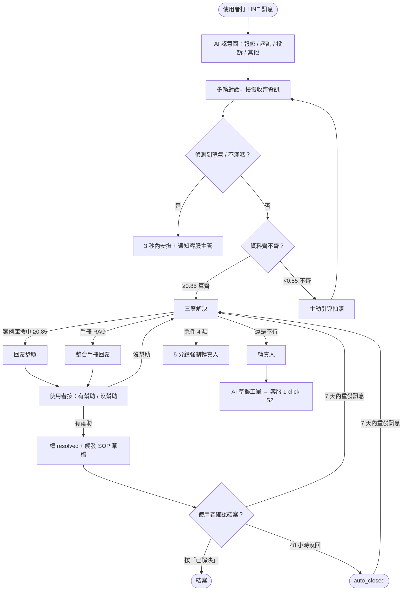
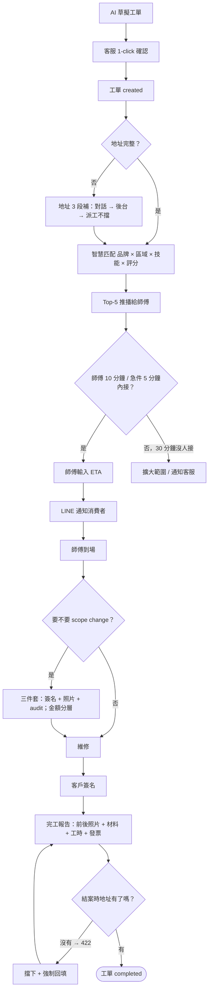
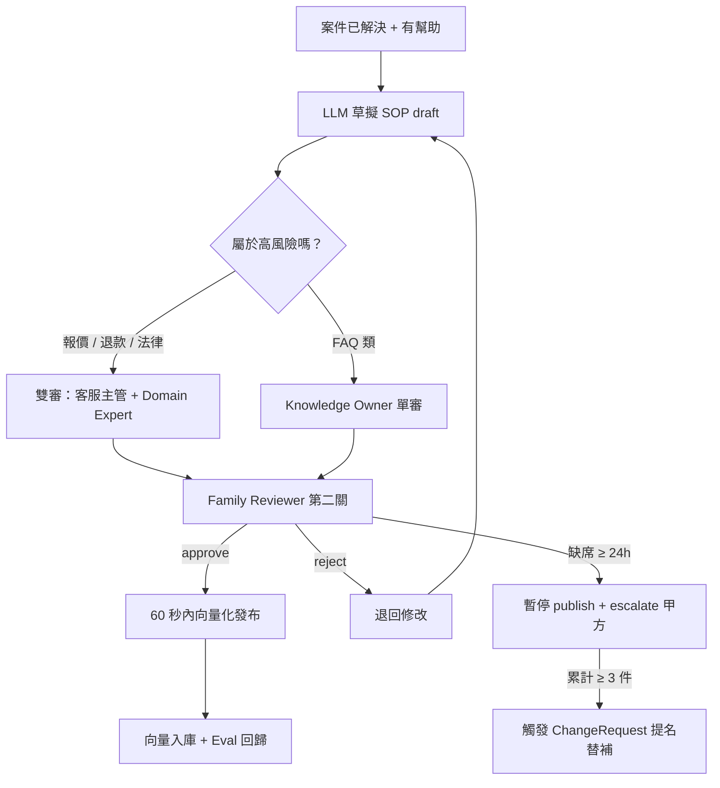
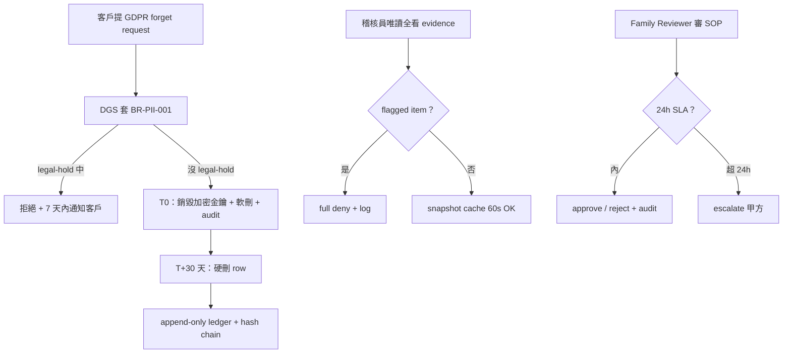

# User Flow — 智慧鎖 SaaS 平台

> **狀態**：v1 draft（Gate 2 ready）
> **更新**：2026-05-23
> **負責人**：UX
> **關聯**：[PRD v2.1](../prd/smart-lock-saas.md) · ADR-0028 / 0031 / 0032 / 0034 / 0036 / 0037 / 0042 / 0045 / 0048 / 0049 / 0050

---

## 📋 30 秒摘要

平台有四種使用者、四條主要 flow：**消費者報修自助**、**師傅到場修**、**客服審 SOP**、**稽核員看 audit**。每條 flow 都涵蓋 happy / empty / loading / error / offline 五個狀態，加上 12 個 edge case（急件、地址沒填齊、AI 越權、重開、放棄等）。a11y 走 WCAG 2.2 AA。

---

## 🎯 設計目標

我們希望使用者完成「報修 → 解決」這件事的時候：

- **消費者**用 LINE 就能搞定，5 秒內看到 AI 回應，不會在地址、品牌、型號的問題裡打轉
- **師傅**手機接單一鍵搞定，現場拍照、回報、月結對帳都不用記在腦袋裡
- **客服**只在 AI 處理不了的時候才介入，不用每筆都接
- **家族覆核員**24 小時內審完 SOP，缺席有替補機制

成功狀態（success state）長這樣：

- 消費者按下「已解決」或對話 48 小時自動結案
- 師傅交完工報告、客戶簽名、月結對得起來
- 客服佇列空了
- 家族覆核員的覆核率 100% 不掉

---

## 🗺 Journey Map（高層）

```
[消費者]  發現問題 → LINE 報修 → 跟 AI 對話 → 確認問題卡 → 解決或派工 → 確認結案
                                            ↓
                                    急件 → 5 分鐘強制轉真人

[師傅]                              收到推播 → 看案件 → 接單 → ETA → 到場 → 完工 → 月結

[客服]                              監看異常 → 處理 Exception → 客訴 → 審 SOP

[家族覆核員]                                                  審 SOP 第二關（24h）
```

---

## 🚶 Flow S1：消費者 LINE 報修 → AI 自助解決（V1 主流程）

> **使用者想做的事**：「我家鎖壞了」→ 講出問題 → 聽 AI 講方法 → 自己修好。



**逐步說明**：

1. **使用者打 LINE 訊息** — 系統 5 秒內回覆。要是超過 5 秒，要顯示「正在處理中」避免使用者覺得卡死
2. **AI 認意圖** — 分四類（報修 / 諮詢 / 投訴 / 其他）。認不出來時不報錯，給引導訊息
3. **多輪對話收齊資訊** — 一輪一輪問品牌、型號、症狀。允許使用者改口
4. **偵測情緒** — 識別到怒氣關鍵詞（不能接受、要投訴、太離譜）就 3 秒內優先回應，同步通知客服主管
5. **資料齊不齊** — 不齊就主動引導拍照（拍鎖舌、把手、錯誤代碼）；齊了走三層解決
6. **三層解決** — 先查案例庫（< 3 秒）→ 再查手冊（< 8 秒）→ 都不行轉真人
7. **急件直接轉真人** — 被鎖在門外 / 門內受困 / 安全風險 / 怒客四類，不走三層、直接 5 分鐘內轉真人
8. **結案** — 使用者按「已解決」或 48 小時沒回應自動結案；7 天內重發訊息會 reopen

**Edge case 一覽**：

| 情況 | 怎麼處理 |
|:---|:---|
| 急件 4 類觸發 | 強制 5 分鐘轉真人，跳過三層 |
| 資料一直收不齊（連 3 次） | 自動轉真人 |
| AI 想說 final quote / 折扣 / 免費保固 | 系統攔截 + 改口給範圍價 |
| 同一對話多個問題 | 同 active issue 只開一張卡，新症狀 / 新設備可另開 |
| 客戶重開 7 天前的案件 | 進 K2 統計分子 -1 |

---

## 🛠 Flow S2：AI → 客服 → 派工 → 師傅到場（V2 主流程）

> **使用者想做的事**：師傅版 = 「我要接案、開車過去、修完、領錢」。客戶版 = 「我要看師傅到了沒、要付多少」。



**Edge case**：
- **地址 3 段補**：對話追問 → 後台補 → 仍無時派工**不擋** + 師傅可 skip + **結案時硬擋**（這條業主特別交代）
- **Scope change 三件套**：客戶簽名 + 證據照片 + audit log 三個缺一不可。金額 ≤500 師傅自確 / 501-2000 客服 LINE 確認 / >2000 主管+三方在線
- **取消費 5 階段**：報價未確認 0 / 派工未出發 0 / 出發後 車馬費 / 到場後 車馬+檢測 / 已施工 按比例。全部系統自判 + 客服可全階段覆寫
- **材料歸屬**：platform / brand / locksmith 三選一，月結自動分流
- **零件序號**：主鎖 + >1000 高價零件強制填，低價選填

---

## 📚 Flow S3：SOP 螺旋（每個成功案例變公司資產，V1.5）

> **使用者想做的事**：客服主管 = 「把師傅的 know-how 留下來」。Family Reviewer = 「我要把關 SOP 品質」。



**Edge case**：
- **Family Reviewer 缺席 24 小時**：暫停 SOP publish + 通知甲方；累計 3 件未審觸發替補
- **V1 不上 Epic 4 自動生成**：但 SOP 仍可由 Family Reviewer 手動入庫，自動草擬延 V1.5

---

## 🔒 Flow S4：合規稽核 / GDPR forget / Family Reviewer

> **使用者想做的事**：DPO / 法務 = 「我要刪客戶資料但要留 audit」。稽核員 = 「我要看歷史但不能看到 PII 全文」。



**Edge case**：
- **GDPR forget × legal-hold 衝突**：拒絕刪除但 7 天內通知客戶 + 預計解除時間
- **Read 路徑**：flagged item 直接拒；unflagged item 用 60 秒 cache + 標記 stale header

---

## 🎨 State Coverage（每個畫面每個狀態都要設計）

> 設計師要交付每個 step 的五個狀態 mockup。

| Step | Happy | Empty | Loading | Error | Offline | a11y |
|:---|:---|:---|:---|:---|:---|:---|
| LINE 報修入口 | ✓ | onboarding 引導 | 1 秒內 spinner | 友善提示 + retry | LINE 內 banner | LINE 原生 |
| 多輪對話 | ✓ | Quick Reply 引導 | typing 中 | webhook 重試 | 暫存後重發 | TTS / 大字 |
| 問題卡確認 | Flex Message ✓ | 不會空 | 1 秒內 render | fallback 文字 | cached 顯示 | a11y label |
| 三層解決 | ✓ | 沒命中 → RAG | 「搜尋中...」< 3 秒 | DLQ + 轉真人 | banner | screen reader |
| 工單接單（V2）| ✓ | 案件池空 | Web Push refresh | 30 秒 retry | 推播延遲提示 | WCAG 2.2 AA |
| 現場拍照 | ✓ | 必填提醒 | 壓縮 < 5MB | retry | 暫存到本地 | 大按鈕 |
| Admin Panel | ✓ | 空狀態圖 | skeleton screen | 401/403/422 友善 | offline banner | WCAG 2.2 AA |
| SOP 雙審 | ✓ | reviewer queue 空 | spinner | escalate | n/a | reviewer 鍵盤導覽 |

---

## ♿ a11y 規範

- **LINE 端**：文字大小 LINE 原生支援；圖片附 alt-text（人工填，因為合約禁 AI 影像辨識）
- **Admin Panel + 師傅 Web App**：WCAG **2.2 AA**
  - 全鍵盤導覽
  - ARIA roles / labels（screen reader）
  - 對比 ≥ 4.5:1
  - Focus indicator 看得到
  - 表單 label + error message 關聯

---

## 📐 Acceptance Criteria（給 QA 寫 test plan）

每條 flow 都要過：

- LINE 訊息進 → 5 秒內回（p95）
- 問題卡 ≥ 0.85 才自動派工
- 急件 4 類 → 5 分鐘強制轉真人，列入 K8 200 題 Eval
- 結案時地址必填，硬擋
- 雙審 SOP 100% 覆核率；24 小時內審完；缺席演練過 1 次

---

## 🔗 相關文件

- PRD：[`../prd/smart-lock-saas.md`](../prd/smart-lock-saas.md)
- Stakeholder 地圖：[`../governance/stakeholders.md`](../governance/stakeholders.md)
- 既有 V1 user journey：[`../../archive/prd-baseline/PRD-0001-2026-q1-v1-launch.md#appendix--user-journey-map-merged-from-former-e1x--user-journey-mapmd`](../../archive/prd-baseline/PRD-0001-2026-q1-v1-launch.md)
- Forum F-02 K2 acceptance table → K2 量測依據
- Forum F-04 BR-PII-001 → GDPR forget flow 依據

---

**Gate 2 UX Flow Freeze** — ✅ ready
