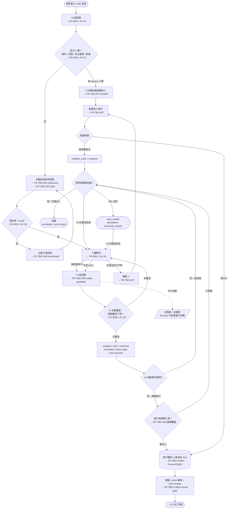
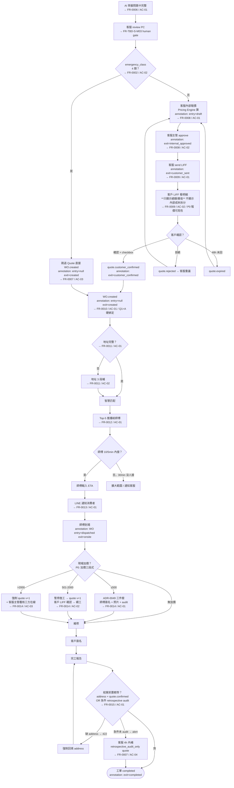
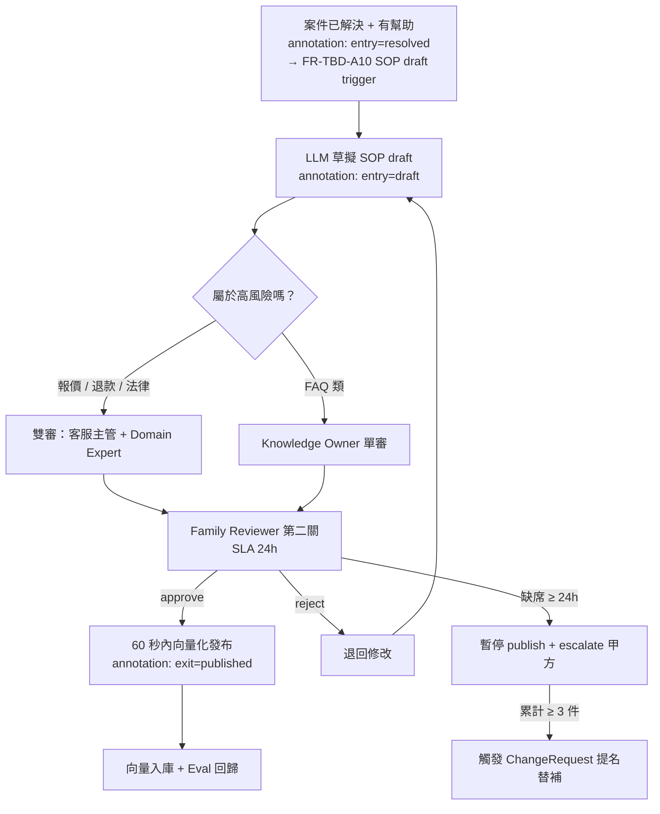
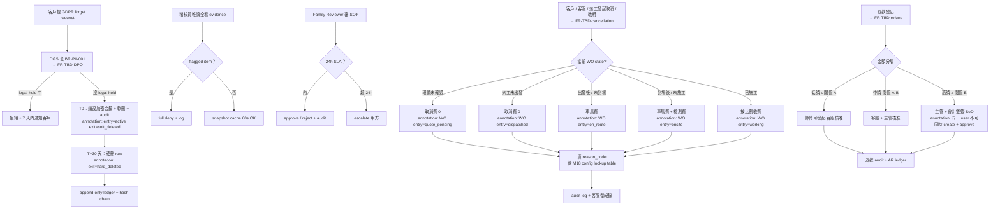
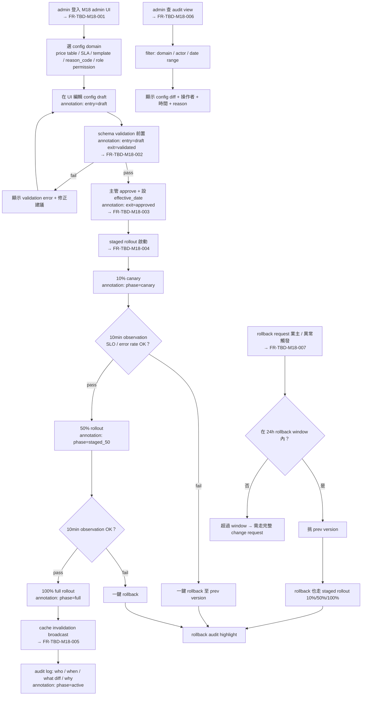

# User Flow — 智慧鎖 SaaS 平台

> **狀態**：v2 draft (Gate 2 ready_to_review 候選)
> **更新**：2026-05-28 — Roundtable B (2026-05-28-1200 user-flow-IA-strategy) cascade
> **更新摘要 v1 → v2**：
> - **State matrix 改寫**：只列 UI state (happy / empty / loading / error / offline)，domain state 改走 entry/exit annotation (業主裁決 Q-OF1=B)
> - **a11y 段明文 commit WCAG 2.2 AA**（業主裁決 Q-OF2=A），by-module 子檔強制繼承
> - **新增 Flow S5 — M18 admin journey**（config 自助維護 + staged rollout + audit view + rollback；依 ADR-0067）
> - **既有 4 條 flow（S1-S4）套 P0 規則** — AI 越權 guardrail / 報價可見性 / 加價三段式 / 取消費分層 / 退款核准分層
> - 引入 `docs/ux/by-module/` 子檔目錄（A01-A12 / S-M01-M06 / M14 / M18 各別 module flow）
> - 引入 `docs/ux/wireframes/` 子目錄（placeholder 階段）
> - 每個 step 標 `→ FR-NNNN / AC-NN` 反向指；不重寫 atomic main flow（粒度切分原則 D3）

---

## 📋 30 秒摘要

平台有四種使用者、五條主要 flow：**消費者報修自助 (S1)**、**師傅到場修 (S2)**、**客服審 SOP (S3)**、**稽核員看 audit (S4)**、**M18 admin 自助維護 (S5)**。每條 flow 都涵蓋 happy / empty / loading / error / offline 五個 **UI state**（domain state 走 entry/exit annotation），加上 12 個 edge case（急件、地址沒填齊、AI 越權、重開、放棄、config staged rollout 異常等）。a11y 走 **WCAG 2.2 AA**（所有 by-module 子檔強制繼承）。

---

## 🎯 設計目標

我們希望使用者完成「報修 → 解決」「config 改動 → 安全生效」這件事的時候：

- **消費者**用 LINE 就能搞定，5 秒內看到 AI 回應，不會在地址、品牌、型號的問題裡打轉
- **師傅**手機接單一鍵搞定，現場拍照、回報、月結對帳都不用記在腦袋裡
- **客服**只在 AI 處理不了的時候才介入，不用每筆都接
- **家族覆核員**24 小時內審完 SOP，缺席有替補機制
- **System / IT admin**改 config 不用工程師 deploy，validation 擋 mis-config，staged rollout 限制 blast radius，rollback ≤ 1 分鐘

成功狀態（success state）：
- 消費者按下「已解決」或對話 48 小時自動結案
- 師傅交完工報告、客戶簽名、月結對得起來
- 客服佇列空了
- 家族覆核員的覆核率 100% 不掉
- M18 config 變更 100% 有 audit trail；mis-config 限制在 10% canary 範圍內

---

## 🗺 Journey Map（高層）

```
[消費者]   發現問題 → LINE 報修 → AI 認意圖 → 急件 4 類？→ bypass 三層轉真人
                                              ↓ 否
                                  多輪對話 → 三層解決 → 釐清確認 → resolved
                                                                ↓
                                                       需派工？→ 客戶觸發開工單

[客服]                          審 PC → 內部報價 → 主管 approve → send LIFF
                                                                  ↓
[客戶]                                                  LIFF 看明細 → checkbox 勾選 → 確認
                                                                  ↓
                                                          quote.customer_confirmed → WO.created

[師傅]                          收到推播 → 看案件 → 接單 → ETA → 到場 → 加價三段式 → 完工 → 月結

[客服]                          監看異常 → 處理 Exception → 取消費分層 → 退款核准分層 → 審 SOP

[家族覆核員]                                              審 SOP 第二關（24h）

[System / IT admin]            改 config → schema validate → 主管 approve → staged rollout
                              (10% canary → 50% → 100%) → audit view → rollback (≤ 24h)
```

---

## 🚶 Flow S1：消費者 LINE 報修 → AI 自助解決（Phase I MVP）

> **使用者想做的事**：「我家鎖壞了」→ 講出問題 → 聽 AI 講方法 → 自己修好（或被引導報修派工）。
>
> **P0 規則套用**：AI 越權邊界 (BR-AI-越權) / 急件 carve-out / AI 不複誦金額 (Q2=A) / 工單建立路徑分離。
>
> **By-module 細節 (Roundtable B D1)**：A01 進線 debounce / A02 brand 品牌型號 / A03 ReAct / A04 SKILL.md / A05 safety / A06 PC 自動建卡 / A07 真人轉接 / A08 多模態 / A09 Eval — 詳見 `by-module/A??-flow.md`。



**S1 journey 重點（不重寫 atomic step — 看 FR 殼）**：

1. AI 認意圖（分四類：報修 / 諮詢 / 投訴 / 其他）→ FR-0001
2. **急件 4 類偵測**：被鎖在門外 / 門內受困 / 安全風險 / 怒客任一命中，bypass 三層直接轉真人 → FR-0002 + A05 guardrail
3. 多輪對話收齊 facts，資料齊 ≥0.85 走三層解決 → FR-0003 / FR-0004
4. **AI 越權攔截 (A05 guardrail)**：AI 不可繞過客戶自行建單 / 不可說 final quote / 不可承諾免費保固 — 系統攔截 + 改口給範圍價 → A05 safety
5. **Clarify gate (Q-OF1 annotation example)**：AI 回應後主動問「問題釐清了嗎？」客戶答「已釐清」才標 `problem_card.state = resolved`（entry=open / exit=resolved）→ FR-0005
6. **「有幫助 / 沒幫助」是平行品質訊號**，進 K8 Eval / SOP 草稿觸發，**不影響案件流轉**
7. **Resolved 後判斷是否需派工** — AI 建議客戶觸發 ConvertToWO；S-M04 強制 human gate
8. 結案：按「已解決」or 48h auto_closed；7d 內重發訊息 reopen

**Edge case 與 P0 規則對應**：

| 情況 | 怎麼處理 | P0 / BR 對應 |
|:---|:---|:---|
| 急件 4 類觸發（含怒客） | Intent 後立即 bypass 三層，5 分鐘內轉真人 | A05 emergency carve-out / A07 handoff SLA |
| AI 想說 final quote / 折扣 / 免費保固 | 系統攔截 + 改口給範圍價 | **A05 guardrail (P0 — AI 越權邊界)** |
| AI 想繞過客戶自行建工單 | 系統攔截 — 由 BR-AI-越權邊界拘束 | **A05 + S-M04 human gate (P0)** |
| 資料連 3 次收不齊 | 自動轉真人 | A07 handoff |
| 同一對話多個問題 | 同 active issue 只開一張卡，新症狀 / 新設備可另開 | A06 ProblemCard |

---

## 🛠 Flow S2：AI → 客服 → 報價 → 客戶確認 → 派工 → 師傅到場（Phase I MVP）

> **使用者想做的事**：師傅版 = 「我要接案、開車過去、修完、領錢」。客戶版 = 「我要先看到報價金額再答應、再看師傅到了沒」。
>
> **P0 規則套用（v2 新增）**：
> - **報價可見性分層 (P0)**：客戶只看總額 / 實收（external price），內部成本拆分 (B2B brand price / locksmith cost / commission) 對客戶不可見 — 來源 `docs/_source/01-workorder-erp.md Q-M16 Q076 / Q037` + `M17 Q077 Q110-Q113`
> - **加價三段式 (P0)**：師傅提出 → 客戶簽名同意 → 客服留紀錄；師傅不可單獨決定最終收款 — 來源 `M15 Q069 / Q070`
> - **取消費分層 (P0)**：未確認 0 / 派工未出發 0 / 出發後 車馬費 / 到場後 車馬+檢測 / 已施工 按比例 — 來源 `M15 Q047 Q071`
> - **退款核准分層 (P0)**：低額師傅 / 中額客服 / 高額主管+會計雙簽 — 來源 `M17 G013 SoD`
> - **Quote-WO 硬綁定 (Q1=A)**：`quote.customer_confirmed` 為 `WO.created` 前置；急件 4 類 carve-out — 來源 ADR-0066
> - **AI 不複誦金額 (Q2=A)**：LINE 訊息僅 announce existence + Q-XXXXX 編號，數字一律存 LIFF — 來源 ADR-0063



**S2 journey 重點（不重寫 atomic step — 看 FR 殼）**：

1. AI PC 完整度 ≥ 0.85 後**客服 review**（不允許 AI 單向繞過建單）→ S-M03 / S-M04 human gate
2. **急件 4 類 carve-out**：bypass quote 直接 WO.created；客服 4h 內補 retrospective_audit_only quote → ADR-0066
3. **一般單報價**：Pricing Engine 算內部金額 → 主管 approve → send LIFF
4. **客戶 LIFF 只看總額 / 實收（P0 報價可見性）**：內部成本拆分 (brand B2B / locksmith cost / commission) 對客戶不可見
5. **AI 不複誦金額 (Q2=A)**：LINE 訊息僅說「客服已準備好您的報價」+ Q-XXXXX 編號；數字一律存 LIFF
6. **quote.customer_confirmed → WO.created (Q1=A 硬綁定)**：WorkOrderCreate.quote_id required，後端 425/409 雙閘
7. **加價三段式 (P0)**：≤500 ADR-0049 三件套 / 501-2000 quote v+1 客戶 LIFF 確認 / >2000 強制主管覆核
8. **結案 hard gate**：address + quote.customer_confirmed（or emergency retrospective audit），任一缺 → 422 + 強制回填

**Edge case 與 P0 規則對應**：

| 情況 | 怎麼處理 | P0 / BR 對應 |
|:---|:---|:---|
| 地址 3 段補 | 對話追問 → 後台補 → 派工不擋 → 結案時硬擋 | M02 |
| 取消費（**P0 取消費分層**）| 報價未確認 0 / 派工未出發 0 / 出發後 車馬費 / 到場後 車馬+檢測 / 已施工 按比例 | **M15 Q047 Q071 (P0)** |
| 加價三段式違反 | 師傅單獨決定最終收款 → 系統攔截；必須客戶簽名 + 客服留紀錄 | **M15 Q069 Q070 (P0)** |
| 退款（**P0 退款核准分層**）| 低額：師傅可發起；中額：客服核准；高額：主管 + 會計雙簽 (SoD) | **M17 G013 (P0)** |
| 材料歸屬 | platform / brand / locksmith 三選一，月結自動分流 | M11 |
| 零件序號 | 主鎖 + >1000 高價零件強制填，低價選填 | M10 |
| Quote 48h 過期 ↔ conversation auto_closed 48h | conversation auto_closed 時 quote 同步 `expired_by_conversation_close` | OQ-UX-S2-01 已決 |
| Onsite quote v+1 LIFF 失敗 | 客戶手機 LIFF 優先 → QR code 跨師傅平板 → 紙本簽 audit log | BR-Onsite-004 |
| Quote re-version | 舊版 button auto-disable + redirect to v2 | BR-Quote |

---

### Flow S2 — LIFF 二段確認 UI state coverage（業主 Q-OF1=B: UI-only + annotation）

> 5 step × 5 **UI state**（happy / empty / loading / error / offline）。Domain state（quote.draft / customer_sent / customer_confirmed / expired / rejected）走 entry/exit annotation。給 UI 設計 + QA test plan 用。

| Step | Happy | Empty | Loading | Error | Offline | domain state annotation |
|:-----|:------|:------|:--------|:------|:--------|:------------------------|
| **LINE Flex 送達** | ✓ Flex card「客服已準備好您的報價」+ 按鈕 | bot blocked → SMS fallback + 客服 call | 客服 push 中（後台 spinner） | Flex render 失敗（舊版 LINE）→ 退純文字 + LIFF link | LINE 無網 → cached 通知 + 連線後重打開 | entry: quote.customer_sent / exit: 同 |
| **點查看開 LIFF** | ✓ LIFF 5s 內開啟 + 顯示明細頁 | 第一次用 LIFF 走 onboarding（a11y / 條款導讀） | LIFF p95 ≤ 2s / >5s 顯示 progress bar | 授權失敗 (LIFF auth) → fallback Flex one-tap 簡化版（純 yes/no） | 顯示 cached quote 摘要 + retry | entry: 同 / exit: 同 |
| **看明細 + 條款** | ✓ 明細 line item（**僅總額 / 實收**）+ 條款摘要 + 完整條款 progressive disclosure | 0 元 item 標「平台出」；contract_template 沒費用條款 fallback 預設 | spinner (pricing 250ms) | `quote.expired` → 顯示「報價已失效，請聯繫客服重新報價」+ 客服 1-tap 觸發 | offline 不允許 confirm（顯示 banner「需連線」） | entry: 同 / exit: 同 |
| **勾 checkbox + 確認** | ✓ checkbox 勾 → 按鈕變綠 → 點擊 200 + 跳「已確認」頁 | checkbox unchecked 時 confirm **disabled**（避免「概括同意」爭議，Legal sign-off） | spinner + button disabled（避免重複送出） | 502 retry + Idempotency-Key 重送；409 `QUOTE_STATE_INVALID` 顯示「報價已被重新議價」 | offline banner，confirm button 鎖死 | entry: customer_sent / exit: customer_confirmed |
| **拒絕路徑** | ✓ LIFF 顯示「客服將與您聯繫」+ LINE 回訊「我們收到您的回應」 | — | spinner | re-version 顯示 v2 取代 v1（v1 auto-disable + redirect） | offline 暫存拒絕意圖 + 上線重送（Idempotency-Key） | entry: customer_sent / exit: rejected |

---

### Flow S2 — LIFF a11y WCAG 2.2 AA checklist（業主 Q-OF2=A）

> 13 條 criterion + reduced-motion，給 UI 實作 + QA AT 測試用。

| WCAG SC | 項目 | 規格 |
|:--------|:-----|:-----|
| **1.4.3** | 文字對比（最低）| normal text ≥ 4.5:1；**金額 large text 升 7:1**（高齡客戶 + 法律金額雙重保險）|
| **1.4.10** | Reflow | 320px 寬不橫向滾動（明細 table 改 stack layout）|
| **1.4.12** | 文字間距 | line-height ≥ 1.5；paragraph spacing ≥ 2x；letter-spacing ≥ 0.12em |
| **2.4.4** | Link purpose (in context) | 條款連結文字明示「報價條款（含車馬費 / 保固 / 爭議處理）」，不可只寫「點此」|
| **2.4.6** | Headings / Labels | LIFF 結構式 h1-h3 + form label 關聯（checkbox 有對應 label）|
| **2.4.7** | Focus indicator visible | 看得到的 focus ring（≥ 2px 寬，≥ 3:1 contrast，非僅 color change）|
| **2.5.5** | Target size (enhanced) | 「確認」「取消」「拒絕」≥ 44×44 CSS px |
| **2.5.8** | Target size (minimum) | 所有可互動元件 ≥ 24×24 CSS px（**新 WCAG 2.2 SC**，條款展開 icon 也算）|
| **3.2.4** | Consistent identification | 按鈕 / icon meaning 全 app 一致（確認 = 綠 / 拒絕 = 紅 / 取消 = 灰）|
| **3.3.1** | Error identification | checkbox 沒勾按確認 → 錯誤訊息走 `aria-describedby` + `aria-live="polite"` |
| **3.3.3** | Error suggestion | 錯誤訊息給具體修正建議（「請先勾選同意條款後再確認」非單純「錯誤」）|
| **4.1.2** | Name / Role / Value | 金額 `aria-label` 含幣別 + 整字「NTD 兩千八百元整」 |
| **(extra)** | prefers-reduced-motion | transition / animation respect `@media (prefers-reduced-motion: reduce)` |

**Acceptance（給 QA）**：「QA 用 NVDA (Windows) / VoiceOver (iOS) 跑一輪 LIFF 確認流程，AT user task success rate ≥ 90%」（任務 = 開 LIFF → 看明細 → 勾 checkbox → 確認）

---

## 📚 Flow S3：SOP 螺旋（每個成功案例變公司資產，Phase I）

> **使用者想做的事**：客服主管 = 「把師傅的 know-how 留下來」。Family Reviewer = 「我要把關 SOP 品質」。
>
> **P0 規則套用**：本 flow 無 P0 衝擊（保留 v1 內容）。



**Edge case**：
- Family Reviewer 缺席 24h：暫停 SOP publish + 通知甲方；累計 3 件未審觸發替補
- Phase I 不上自動生成：SOP 仍可由 Family Reviewer 手動入庫，自動草擬延 Phase II

---

## 🔒 Flow S4：合規稽核 / GDPR forget / 退款核准分層 / 取消費分層（Phase I+II）

> **使用者想做的事**：DPO / 法務 = 「我要刪客戶資料但要留 audit」。稽核員 = 「我要看歷史但不能看到 PII 全文」。
>
> **P0 規則套用（v2 新增）**：
> - **取消費分層 (P0)** — 來源 `M15 Q047 Q071`
> - **退款核准分層 (P0 — SoD)** — 來源 `M17 G013` segregation of duties
> - **取消 / 改期 reason code** — 客服維護的 reason_code lookup table (M18 config 管轄；ADR-0065)



**Edge case 與 P0 規則對應**：

| 情況 | 怎麼處理 | P0 / BR 對應 |
|:---|:---|:---|
| GDPR forget × legal-hold 衝突 | 拒絕刪除但 7d 內通知客戶 + 預計解除時間 | BR-PII-001 |
| 取消費分層違反 | 派工後客戶拒絕 → 不能 0 元取消 | **M15 (P0)** |
| 退款核准分層違反 | 同一 user 同時 create + approve refund → 系統攔截 | **M17 G013 SoD (P0)** |
| reason_code 缺項 | 客服在 M18 admin UI 提 ChangeRequest 補；走 Flow S5 | M18 config 管轄 |
| Read 路徑 | flagged item 直接拒；unflagged 用 60s cache + stale header | audit policy |

---

## ⚙️ Flow S5：M18 admin journey — config 自助維護 + staged rollout + audit view + rollback（Phase 0 critical path，v2 新增）

> **使用者想做的事**：System / IT admin = 「我要改價格表 / SLA / template / reason code，但不能改錯就炸 prod；萬一改錯能 1 分鐘內回退」。
>
> **依據**：[ADR-0067 §Decision](../architecture/adr/ADR-0067-m18-runtime-config-governance.md) — Phase 0 critical path blocker
>
> **By-module 細節**：詳見 `by-module/M18-system-setup-flow.md`（config schema editor / template management / reason code maintenance）



**S5 journey 重點**：

1. **edit config**：admin 在 M18 UI 編輯 draft（不直接寫 prod）
2. **schema validation**：前置擋 mis-config（如把退款上限打 1000 倍）→ FR-TBD-M18-002
3. **approve + effective_date**：主管 approve 並設定生效日 → FR-TBD-M18-003
4. **staged rollout**：自動 canary 10% → 10min observation → 50% → 10min observation → 100% → cache invalidation broadcast
5. **audit view**：所有 config change 留 who / when / what diff / why（retention ≥ 7 yr，依 NFR）→ FR-TBD-M18-006
6. **rollback**：≤ 24h window 內一鍵回退；rollback 也走 staged rollout 機制 → FR-TBD-M18-007
7. **escape hatch**：「強制全量」需 IT-admin 雙簽 + audit log highlight（不主推）

**Edge case 與 P0 / ADR 對應**：

| 情況 | 怎麼處理 | ADR / NFR 對應 |
|:---|:---|:---|
| mis-config（價格 1000 倍） | schema validation 擋；不允許進 staged rollout | ADR-0067 §validation |
| canary 10% 異常 | 一鍵 rollback；不影響 90% 用戶 | ADR-0067 §staged rollout |
| 超過 24h rollback window | 改走完整 ChangeRequest 流程 | ADR-0067 §rollback window |
| cache split-brain | invalidation broadcast 維持一致 | ADR-0067 §cache TTL |
| Reason code lookup 缺項（B-S4 cascade）| 客服在 M18 UI 提 ChangeRequest 補 reason_code | ADR-0065 |
| IT support 臨時權限 | time-limited + reason-coded + audit logged | M17 BR-M17-03 |

---

### Flow S5 — admin UI state coverage（業主 Q-OF1=B: UI-only + annotation）

| Step | Happy | Empty | Loading | Error | Offline | domain state annotation |
|:-----|:------|:------|:--------|:------|:--------|:-----------------------|
| **登入 admin UI** | ✓ MFA + role check | 第一次登入 onboarding | spinner < 2s | 401 / 403 友善訊息 + reason | banner 不允許改 config | session entry=auth / exit=authorized |
| **編輯 config draft** | ✓ schema editor + diff preview | draft 為空時顯示 template 選項 | 載入中 | validation error inline 標示 | banner，draft 自動 local cache | config entry=draft / exit=validated |
| **staged rollout 進行中** | ✓ progress bar 10% → 50% → 100% + observe timer | — | 10min observation timer + SLI dashboard | canary fail → 自動 rollback + alert | banner，無法觸發新 rollout | phase entry=canary / exit=full |
| **audit view** | ✓ 列表 + diff + filter | empty state「無變更紀錄」+ filter 提示 | 載入 < 3s | 403 reason masked | banner，cached 上次 view | n/a (read-only) |
| **rollback** | ✓ confirm dialog + reason 必填 | — | rollback staged 進行中 | 超過 24h window → block + 改走 CR | banner，無法觸發 rollback | rollback entry=triggered / exit=completed |

---

### Flow S5 — admin UI a11y WCAG 2.2 AA

繼承 §Flow S2 LIFF a11y 同樣 13 條 criterion，**加強重點**：
- **3.3.4 Error prevention (legal / financial / data)**：價格表 / 退款上限改動 → 顯示「您即將改動的設定可能影響財務數字，請再次確認」+ 雙重確認對話框
- **2.4.11 Focus not obscured (minimum, new in WCAG 2.2)**：staged rollout progress bar / observation timer 不可被 modal 遮住 focus

---

## 🎨 State Coverage 主檔總表（UI state only — Q-OF1=B）

> 每個 step 五個 UI state mockup 由 UI 設計交付；domain state 走 entry/exit annotation 個別表填。

| Step | Happy | Empty | Loading | Error | Offline | domain state annotation |
|:---|:---|:---|:---|:---|:---|:---|
| LINE 報修入口 | ✓ | onboarding 引導 | 1s spinner | 友善提示 + retry | LINE 內 banner | conversation entry=open |
| 多輪對話 | ✓ | Quick Reply 引導 | typing 中 | webhook 重試 | 暫存後重發 | facts entry=collecting / exit=complete |
| 問題卡確認 | Flex Message ✓ | n/a | 1s render | fallback 文字 | cached 顯示 | PC entry=draft / exit=complete |
| 三層解決 | ✓ | 沒命中 → RAG | 「搜尋中...」< 3s | DLQ + 轉真人 | banner | n/a |
| 問題釐清確認 | AI 主動問 | n/a（一定觸發） | 等客戶回應 | 30s 未回再問 1 次 | 重發機制 | PC entry=open / exit=resolved |
| 工單建立確認 (AI 路徑) | 客戶觸發 | n/a | 1s callback | 失敗 retry + 客服 fallback | LINE banner | WO entry=null / exit=created |
| 工單接單 | ✓ | 案件池空 | Web Push refresh | 30s retry | 推播延遲提示 | WO entry=created / exit=dispatched |
| 現場拍照 | ✓ | 必填提醒 | 壓縮 < 5MB | retry | 暫存到本地 | evidence entry=pending / exit=submitted |
| Admin Panel (M18 config) | ✓ | 空狀態圖 | skeleton screen | 401/403/422 友善 | offline banner | config entry=draft / exit=validated/approved/active |
| SOP 雙審 | ✓ | reviewer queue 空 | spinner | escalate | n/a | SOP entry=draft / exit=published |
| M18 staged rollout | ✓ progress | n/a | observation timer | canary fail → rollback | banner | phase entry=canary / exit=full or rolled_back |

---

## ♿ a11y 規範 — **WCAG 2.2 AA**（業主 Q-OF2=A）

> **commitment**：所有面向使用者的介面（LIFF / LINE Flex / Admin Panel / 師傅 Web App）必須 commit **WCAG 2.2 AA**；by-module 子檔強制繼承 (`wcag_level: AA` frontmatter)。

### Channel-specific a11y inheritance 規則

| Channel | Baseline | by-module 子檔繼承規則 |
|:--------|:---------|:------------------------|
| **LINE 端**（含 LIFF / Flex Message） | WCAG 2.2 AA | 子檔 frontmatter `wcag_level: AA`，不可降級；LINE 原生限制（字體大小由 LINE app 控）走 fallback 文字策略 |
| **Admin Panel + 師傅 Web App** | WCAG 2.2 AA | 全鍵盤導覽 / ARIA roles+labels / 對比 ≥ 4.5:1 / focus indicator 看得到 / 表單 label + error 關聯 |
| **多模態 (A08)** | WCAG 2.2 AA + 替代文字 | 圖片附 alt-text（人工填，合約禁 AI 影像辨識；圖片用作品質佐證）；影音附字幕 |
| **Keyboard-only** | WCAG 2.2 SC 2.1.1+2.1.2 | 所有互動可純鍵盤完成；無 keyboard trap |
| **Screen reader** | WCAG 2.2 SC 4.1.2 | NVDA (Windows) / VoiceOver (iOS) / TalkBack (Android) AT user task success ≥ 90% |

### WCAG 2.2 新增 SC（v2 special attention）

WCAG 2.2 比 2.1 新增 9 條 SC，本 doc 重點 commit：
- **2.4.11 Focus not obscured (minimum)** — staged rollout progress bar / modal 不可遮 focus
- **2.4.12 Focus not obscured (enhanced, AAA)** — best effort
- **2.5.7 Dragging movements** — 所有拖曳動作（如 staged rollout 滑桿）必有點擊替代
- **2.5.8 Target size (minimum)** — 24×24 CSS px（所有 LIFF 互動元件）
- **3.2.6 Consistent help** — admin UI 全頁面 help 入口位置一致
- **3.3.7 Redundant entry** — 不要求重複輸入已提供資訊（如 LIFF 不需要客戶重輸地址）
- **3.3.8 Accessible authentication (minimum)** — 認證不單純倚賴 cognitive function test（無圖像識讀）
- **3.3.9 Accessible authentication (enhanced, AAA)** — best effort

---

## 📐 Acceptance Criteria（給 QA 寫 test plan）

每條 flow 都要過：

- LINE 訊息進 → 5 秒內回（p95）
- 問題卡 ≥ 0.85 才自動派工
- 急件 4 類 → Intent 後立即偵測，5 分鐘內強制轉真人 bypass 三層；列入 K8 200 題 Eval
- **Clarify gate 必過**：AI 回應後一定要客戶確認「問題釐清」才能標 resolved（feedback 是平行品質訊號）
- **工單建立路徑分離**：AI 路徑由客戶觸發 → 工單 Tool；客服路徑由客服觸發 → 同一個工單 Tool；兩條都需 CS 1-click（S-M04 human gate）
- **Quote-WO 硬綁定**（Q1=A）：`WO.created` 必有 `quote.customer_confirmed`（或 `emergency_class IS NOT NULL` carve-out）；API 425/409 雙閘
- **AI 不複誦金額**（Q2=A）：LINE 訊息僅 announce existence + Q-XXXXX 編號，數字一律存 LIFF
- **報價可見性分層 (P0)**：客戶 LIFF 只看總額/實收；內部成本拆分 (B2B brand / locksmith cost / commission) 對客戶不可見
- **加價三段式 (P0)**：師傅單獨決定收款 → 系統攔截；必須客戶簽名 + 客服留紀錄
- **取消費分層 (P0)**：5 階段（未確認 0 / 派工未出發 0 / 出發後 車馬費 / 到場後 車馬+檢測 / 已施工 按比例）
- **退款核准分層 (P0 — SoD)**：同一 user create + approve refund → 系統攔截
- **急件 carve-out**（Q3=A）：4 類急件跳過 quote 直接 `WO.created`；客服 4h 內補 `retrospective_audit_only` quote
- **LIFF a11y**：NVDA / VoiceOver AT user task success rate ≥ 90%；WCAG 2.2 AA 13 條 criterion 全過
- **LIFF NFR**：confirm p95 ≤ 2s；abandon rate 24h 監控；load failure rate alert；quote_confirm_to_wo_created_lag p95 監控
- 結案時地址必填，硬擋
- **M18 admin journey (Flow S5)**：
  - config read path p99 ≤ 50ms (NFR)
  - every change → who/when/what diff/why (retention ≥ 7 yr)
  - rollback ≤ 1 min；staged rollout 每段 ≥ 10min observation
  - canary 10% 失敗自動 rollback
- 雙審 SOP 100% 覆核率；24 小時內審完；缺席演練過 1 次

---

## 🔗 相關文件

### Layer 主索引
- PRD：[`../prd/smart-lock-saas.md`](../prd/smart-lock-saas.md)
- System Spec：[`../analysis/system-spec-smart-lock-saas.md`](../analysis/system-spec-smart-lock-saas.md)
- NFR Matrix：[`../architecture/nfr-matrix-smart-lock-saas.md`](../architecture/nfr-matrix-smart-lock-saas.md)
- Stakeholder 地圖：[`../governance/stakeholders.md`](../governance/stakeholders.md)

### By-module 子檔（Roundtable B D1）
- Chatbot 模組：[`by-module/`](by-module/) — A01-A12（12 檔）
- Sync 模組：[`by-module/`](by-module/) — S-M01 ~ S-M06（6 檔）
- Partner Portal：[`by-module/M14-partner-portal-flow.md`](by-module/M14-partner-portal-flow.md)
- M18 System Setup：[`by-module/M18-system-setup-flow.md`](by-module/M18-system-setup-flow.md)

### Wireframes（Roundtable B D5）
- Wireframe 目錄：[`wireframes/index.md`](wireframes/index.md)

### Source spec mirror
- Workorder ERP final spec：[`../_source/01-workorder-erp.md`](../_source/01-workorder-erp.md)
- AI Chatbot + Sync final spec：[`../_source/02-ai-chatbot-sync.md`](../_source/02-ai-chatbot-sync.md)

### ADR / Roundtable cross-ref
- **ADR-0067 (M18 config governance)**：[`../architecture/adr/ADR-0067-m18-runtime-config-governance.md`](../architecture/adr/ADR-0067-m18-runtime-config-governance.md) → Flow S5 依據
- **Roundtable A MoM (2026-05-27)**：[`../../.claude/context/devteam/meetings/2026-05-27-1130-final-spec-migration-strategy/MoM.md`](../../.claude/context/devteam/meetings/2026-05-27-1130-final-spec-migration-strategy/MoM.md)
- **Roundtable B MoM (2026-05-28)**：[`../../.claude/context/devteam/meetings/2026-05-28-1200-user-flow-IA-strategy/MoM.md`](../../.claude/context/devteam/meetings/2026-05-28-1200-user-flow-IA-strategy/MoM.md) → 本 v2 改寫依據
- Forum 2026-05-26-Q01 (quote-pricing-engine)：Flow S2 cascade 依據
- Forum F-02 K2 acceptance / F-04 BR-PII-001 → Flow S4 依據

---

**Gate 2 UX Flow Freeze** — ✅ ready_to_review 候選（待 by-module 子檔最低門檻完成）
